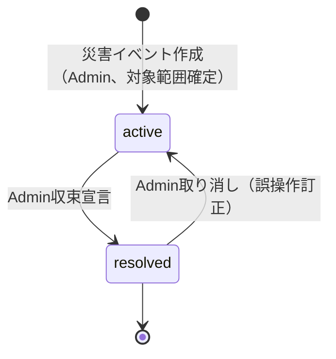
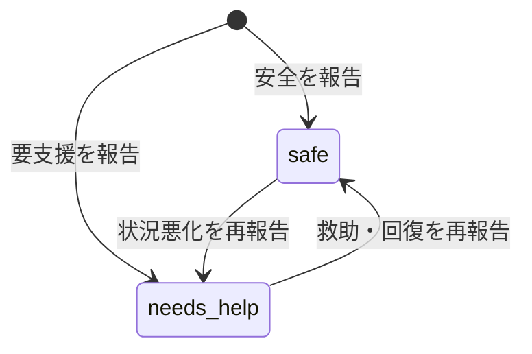
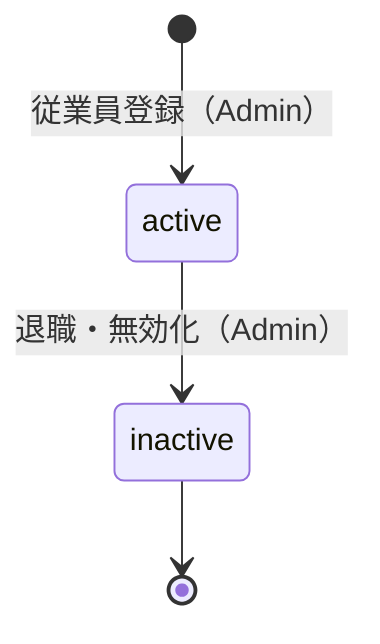

# 要件定義書

Disaster Safety Report System（防災安全報告システム）

---

# 文書管理情報

| 項目 | 内容 |
| --- | --- |
| システム名 | Disaster Safety Report System |
| 文書名 | 要件定義書 |
| 文書番号 | DSR-02 |
| 作成者 | Nguyen Minh Tri |
| 作成日 | 2026/07/22 |
| バージョン | 1.1 |
| ステータス | Draft |

---

# 改訂履歴

| Version | 日付 | 作成者 | 内容 |
| --- | --- | --- | --- |
| 0.0 | 2026/07/22 | Nguyen Minh Tri | スケルトン作成 |
| 1.0 | 2026/07/22 | Nguyen Minh Tri | 初版作成。9章の業務ルール（BR-PRM/ORG/DIS/RPT/NTF）と8章の権限マトリクスを確定。00_開発計画書が08_ER図へ先送りしていた論点のうち「安全報告の選択肢」「再報告の可否」「位置情報の持ち方」を本書で確定（BR-RPT-001/002/003）。 |
| 1.1 | 2026/07/22 | Nguyen Minh Tri | 05_画面遷移図作成時の整合性監査で発見: 8章の権限マトリクスは部門管理者の安全報告（自分の分）を〇としているのに、REQ-009/010・6章Given・13章SCR-002/003が「一般社員」のみ記載で自己矛盾していた。マトリクスを正とし、部門管理者も一従業員として報告する旨に統一（03/04/07も連動修正）。 |

---

# 目次

1. 要件定義の目的
2. システム概要
3. 対象ユーザー
4. 業務範囲
5. 機能要件
6. 要件別受入条件
7. 非機能要件
8. 権限要件（権限マトリクス）
9. 業務ルール
10. 状態遷移
11. データ要件
12. データバリデーションルール
13. 画面要件
14. 外部インターフェース要件
15. セキュリティ要件
16. エラー要件
17. 運用・保守要件
18. 開発対象外
19. 受入条件
20. 用語定義
21. まとめ

---

# 1. 要件定義の目的

本書は、Disaster Safety Report System が「何を実現しなければならないか（WHAT）」を明確化し、以降の基本設計・詳細設計・API設計・テスト仕様の唯一の判断根拠とする。本プロジェクトの学習目的（GIS統合・大量同報通知・リアルタイム集計）のうち、特に**8章（権限マトリクス）と9章（業務ルール）は全設計・全実装・全試験が参照する背骨**であり、実装時に最も参照頻度の高いセクションとなる。

---

# 2. システム概要

企業内の防災・安否確認システム。Admin（BCP担当）が災害イベントを作成すると、対象従業員へ通知が一斉配信される。従業員は自分の安否状況を報告し、部門管理者・Adminはそれぞれの範囲でリアルタイムに近い集計状況を確認できる。位置情報を伴う報告は地図上に可視化される。フロントエンドはVue 3 SPA、バックエンドはLaravel API（00_開発計画書 4章/6章）。単一企業内システムであり、マルチテナントSaaSではない（00_開発計画書 3章・9章で確定済み）。

---

# 3. 対象ユーザー

| ユーザー種別 | 層 | 説明 |
|---|---|---|
| Admin | 全社（`employees.role=admin`） | BCP担当・危機管理部門。災害イベントの作成・管理、全社ダッシュボード閲覧、組織マスタ（部署・従業員）管理を行う |
| 部門管理者 | 部署単位（`employees.role=manager`） | 各部署の管理職。自部署の安否報告状況をリアルタイムに把握する |
| 一般社員 | 個人（`employees.role=staff`） | 災害通知を受け取り、自分の安否状況を報告する |

3層とも`employees`テーブルの`role`列（フラットなENUM）で表現する。Project 03（PMS）のような「グローバルロール×リソース単位ロール」の2層モデルは採用しない — 本システムは単一企業内であり、部門管理者の権限範囲は「自分が所属する部署」という単純な1対1の帰属関係で決まるため（4章参照）。

---

# 4. 業務範囲

## 4.1 対象業務

- ログイン・ログアウト（Sanctumトークン認証）
- 組織マスタ管理（Admin）: 部署・従業員のCRUD
- 災害管理（Admin）: 災害イベントの作成・対象範囲設定・進行中/収束の切替
- 安全報告（一般社員）: 進行中の災害への安否報告・状況変化時の再報告
- 通知（同報配信）: 災害発生時の一斉通知、未報告者への催促
- ダッシュボード: 部署別（部門管理者）・全社（Admin）の報告状況集計
- 地図表示: 従業員の勤務地・報告位置の可視化

## 4.2 対象外業務

00_開発計画書 2.2節と同一（マルチテナント・外部災害検知サービス連携・双方向チャット・オフライン対応（Bonus）・ネイティブアプリ・多言語UI）。

---

# 5. 機能要件

## 5.1 機能要件一覧

| 要件ID | 機能名 | 対象ユーザー | 優先度 | 内容 |
| --- | --- | --- | --- | --- |
| REQ-001 | ログイン | 全ユーザー | Must | メールアドレスとパスワードでログインし、トークンを取得できる。 |
| REQ-002 | ログアウト | 認証済みユーザー | Must | トークンを失効できる。 |
| REQ-003 | 権限制御（3層） | System | Must | Admin / 部門管理者 / 一般社員のロールで全操作を制御する（8章）。 |
| REQ-004 | 部署管理 | Admin | Must | 部署の作成・編集・無効化ができる。 |
| REQ-005 | 従業員管理 | Admin | Must | 従業員の作成・編集・無効化、所属部署・ロールの設定ができる。 |
| REQ-006 | 災害イベント作成 | Admin | Must | 種別・発生日時・対象部署範囲（全社または特定部署）を指定して災害イベントを作成できる。作成と同時にREQ-011の同報通知が発火する。 |
| REQ-007 | 災害イベント編集・収束切替 | Admin | Must | 災害の詳細編集、進行中→収束の切替、誤操作時の再進行中化ができる。 |
| REQ-008 | 災害一覧・詳細閲覧 | 全ユーザー | Must | 進行中・過去の災害一覧と詳細を閲覧できる。 |
| REQ-009 | 安全報告の提出 | 一般社員 / 部門管理者 | Must | 進行中の災害に対し、自分の安否状況（安全/要支援）を報告できる。コメント・位置情報は任意。部門管理者も一従業員として自分の分を報告する（8章）。 |
| REQ-010 | 安全報告の再報告 | 一般社員 / 部門管理者 | Must | 既に報告済みの災害について、状況変化時に報告内容を更新できる（新しい行を作らず上書き）。 |
| REQ-011 | 同報通知の配信 | System | Must | 災害作成時、対象範囲の従業員へ`disaster_alert`通知を一斉作成する。 |
| REQ-012 | 未報告者への催促通知 | System | Must | 進行中の災害について、未報告の従業員へ`report_reminder`通知を定期的に作成する（一定間隔でのみ再送、BR-NTF-004）。 |
| REQ-013 | 通知一覧・既読化 | 認証済みユーザー | Must | 自分宛の通知一覧・未読件数の取得、個別/一括既読化ができる。 |
| REQ-014 | 部署別ダッシュボード | 部門管理者 | Must | 自部署の報告状況（報告済み/要支援/未確認の人数）をリアルタイムに近い形で閲覧できる。 |
| REQ-015 | 全社ダッシュボード | Admin | Must | 全社・部署別の報告状況集計を閲覧できる。 |
| REQ-016 | 地図表示 | 部門管理者 / Admin | Must | 従業員の勤務地または安全報告時の位置情報を地図上にピン表示し、ステータスで色分けする。 |
| REQ-017 | パスワード変更 | 認証済みユーザー | Should | 現在のパスワード確認のうえ変更できる。 |
| REQ-018 | 操作ログ記録 | System | Should | 災害作成・編集、組織マスタ変更をアプリケーションログに記録する。 |

## 5.2 優先度定義

| 優先度 | 意味 |
| --- | --- |
| Must | 初期リリースに必須の要件 |
| Should | 初期リリースで実装したい要件 |
| Could | 余裕があれば実装する要件（bonus） |
| Won't | 初期リリースでは実装しない要件 |

---

# 6. 要件別受入条件

| 要件ID | Given | When | Then |
| --- | --- | --- | --- |
| REQ-001 | 登録済みかつ`status=active` | 正しい資格情報でログインする | トークン（有効期限8時間）が発行される。不一致・inactiveはE001 |
| REQ-002 | ログイン中 | ログアウトする | トークンが失効し、以後のアクセスはE010 |
| REQ-003 | 一般社員としてログイン中 | Admin専用操作（災害作成等）を試みる | E002で拒否される |
| REQ-004 | Adminである | 部署を作成・編集する | `departments`が作成/更新される。一般社員・部門管理者の実行はE002 |
| REQ-005 | Adminである | 従業員を作成・編集する | `employees`が作成/更新される。一般社員・部門管理者の実行はE002 |
| REQ-006 | Adminである | 対象部署範囲を指定して災害を作成する | `disasters`が`status=active`で作成され、同一トランザクションで対象範囲の従業員へ`disaster_alert`通知が作成される（BR-NTF-001） |
| REQ-007 | Adminであり、対象の災害が存在する | 収束へ切り替える | `status=resolved`になる。以後の安全報告新規提出はE006（BR-DIS-002）。再度進行中へ戻すこともできる |
| REQ-008 | 災害が1件以上存在する | 災害一覧を開く | 進行中・過去の災害が一覧表示される。詳細は報告集計サマリを含む |
| REQ-009 | 進行中の災害が対象範囲に含まれる従業員（一般社員または部門管理者）である | 安否状況を報告する | `safety_reports`に`(disaster_id, employee_id)`一意で行が作成される。収束済み・対象外の災害への報告はE006/E007 |
| REQ-010 | 既に当該災害へ報告済みである | 状況を更新して再報告する | 既存の`safety_reports`行が更新される（新規行は作られない、BR-RPT-002）。`reported_at`は最新報告時刻に更新される |
| REQ-011 | 災害が作成される | - | 対象範囲の全従業員へ`disaster_alert`通知が作成される（BR-NTF-001）。件数が多い場合の性能はNFR-001参照 |
| REQ-012 | 進行中の災害に未報告者が存在する | 催促バッチが実行される | 未報告者へ`report_reminder`が作成される。直近の間隔内（BR-NTF-004）に送信済みの場合はスキップされる |
| REQ-013 | 自分宛の通知がある | 通知一覧を開く | 自分宛のみ新しい順で返り、未読件数が取得できる。既読化で`is_read=true`になる |
| REQ-014 | 自部署に対象従業員がいる進行中の災害がある | 部署ダッシュボードを開く | 自部署の報告済み/要支援/未確認の人数が表示される。他部署の詳細は見えない |
| REQ-015 | 進行中の災害がある | 全社ダッシュボードを開く | 全社・部署別の集計が表示される |
| REQ-016 | 位置情報を含む報告が存在する | 地図を開く | 該当する位置がピン表示され、ステータスで色分けされる。ジオコーディング失敗の報告は位置情報なしとして扱われる（地図には表示しないが報告自体は有効） |
| REQ-017 | 現在のパスワードを知っている | 新パスワードへ変更する | `password_hash`が更新される。現在のパスワード不一致はE003 |
| REQ-018 | 災害作成・編集または組織マスタ変更が実行される | 操作が完了する | 実行者・対象・日時がアプリケーションログに記録される |

---

# 7. 非機能要件

## 7.1 Performance

| 要件ID | 項目 | 要件 |
| --- | --- | --- |
| NFR-001 | 同報通知の配信性能 | 対象従業員1,000人規模への`disaster_alert`一斉作成が60秒以内に完了する。同期ループで達成できない場合はQueue化する（12_詳細設計書で判断） |
| NFR-002 | ダッシュボード応答 | 部署別・全社ダッシュボードの集計表示は3秒以内 |
| NFR-003 | Concurrent Users | 初期リリースでは同時接続100ユーザー程度（災害発生直後の一斉アクセスを想定） |

## 7.2 Availability

| 要件ID | 項目 | 要件 |
| --- | --- | --- |
| NFR-004 | Uptime | 学習用途のためSLA保証は対象外。開発・デモ時間帯の安定稼働を目標 |
| NFR-005 | RTO | 障害発生時24時間以内の復旧を目標 |
| NFR-006 | RPO | DB日次バックアップ（最大1日の損失許容） |
| NFR-007 | 外部API障害時の継続 | Google Maps API（ジオコーディング）が障害・タイムアウトした場合も、安全報告の受理自体は失敗させない（位置情報なしで受理、BR-RPT-003） |

## 7.3 Scalability

| 要件ID | 項目 | 要件 |
| --- | --- | --- |
| NFR-008 | Horizontal | APIはステートレス（トークン認証）とし、将来の複数台構成に対応できる設計とする |
| NFR-009 | 同報通知の非同期化余地 | NFR-001の性能を満たせない規模に達した場合、Queueへ切り替えられるようService層をInfrastructure詳細（Queue実装）から独立させる |

## 7.4 Security

| 要件ID | 項目 | 要件 |
| --- | --- | --- |
| NFR-010 | Authentication | Sanctumトークン認証（有効期限8時間）。パスワードはハッシュ保存 |
| NFR-011 | Authorization | 3層ロール（8章）を全APIに適用 |
| NFR-012 | 部署間IDOR防止 | 部門管理者は自部署以外のダッシュボード・報告詳細へアクセスできない（E002/E007） |
| NFR-013 | CORS | APIはSPAの配信オリジンのみ許可する |
| NFR-014 | 外部APIキー保護 | Google Maps APIキーはHTTPリファラ制限をかけ、`.env`経由で注入する（14_セキュリティ設計で確定） |
| NFR-015 | Audit | 災害作成・編集、組織マスタ変更を操作ログとして記録（REQ-018） |
| NFR-016 | Encryption | 通信は全面HTTPS化 |

## 7.5 Maintainability

| 要件ID | 項目 | 要件 |
| --- | --- | --- |
| NFR-017 | Logging | エラーログ・操作ログ・バッチ実行ログを確認できる |
| NFR-018 | CI/CD | GitHub Actionsでバックエンドテスト + フロントエンドビルド/型チェックを自動実行 |
| NFR-019 | 型安全 | フロントエンドはTypeScript strictモードでエラー0を維持 |

## 7.6 Usability

| 要件ID | 項目 | 要件 |
| --- | --- | --- |
| NFR-020 | Mobile First | 安全報告は緊急時に社員個人のスマートフォンから行われることを想定し、モバイル画面を最優先で最適化する（Project 02のMobile First方針を踏襲、Project 03のPC Firstとは異なる） |
| NFR-021 | 低操作コスト | 安全報告フォームは最小限の必須項目（ステータス選択のみ）で送信完了できる。コメント・位置情報は任意 |
| NFR-022 | Multi Language | 日本語UIのみ |

---

# 8. 権限要件（権限マトリクス）

**本プロジェクトの背骨。** 10_API設計の全API・15_単体試験仕様書の権限試験は本表を正とする。

凡例: 〇=可 / ×=不可（E002） / −=対象外 / 秘=存在秘匿（E007）

| 操作 | Admin | 部門管理者 | 一般社員 |
| --- | --- | --- | --- |
| 部署管理（作成・編集・無効化） | 〇 | × | × |
| 従業員管理（作成・編集・無効化） | 〇 | × | × |
| 災害イベント作成・編集・収束切替 | 〇 | × | × |
| 災害一覧・詳細閲覧 | 〇 | 〇 | 〇 |
| 安全報告の提出・再報告（自分の分） | −（Adminは対象外、BR-PRM-003） | 〇 | 〇 |
| 他人の安全報告詳細閲覧 | 〇（全社） | 〇（自部署のみ、他部署は秘） | ×（自分の分のみ閲覧可） |
| 部署ダッシュボード閲覧 | 〇（全部署） | 〇（自部署のみ、他部署は秘） | × |
| 全社ダッシュボード閲覧 | 〇 | × | × |
| 地図表示 | 〇（全社） | 〇（自部署のみ） | × |
| 通知一覧・既読化（自分宛のみ） | 〇 | 〇 | 〇 |
| パスワード変更（自分の分） | 〇 | 〇 | 〇 |

**Adminの原則（BR-PRM-003）**: AdminはBCP運用の統括者であり、自身の安否報告対象ではない想定とする（BCP担当は原則として被災時の対応要員であり、一般社員としての安否報告フローの対象外）。この扱いに違和感がある場合は、Adminにも一般社員としての安全報告機能を追加で持たせる拡張を将来検討する（20章参照）。

---

# 9. 業務ルール

## 9.1 権限（BR-PRM）

| ルールID | ルール | 内容 |
| --- | --- | --- |
| BR-PRM-001 | フラットな3層ロール | 権限は`employees.role`（admin/manager/staff）の単一列で判定する。Project 03のような「グローバル×リソース単位」の2層モデルは採用しない（3章参照）。 |
| BR-PRM-002 | 部門管理者の範囲は自部署のみ | 部門管理者（`role=manager`）が閲覧できる安全報告・ダッシュボード・地図は、自分の`department_id`と一致する従業員の分に限定する。 |
| BR-PRM-003 | Adminは報告対象外 | Adminは安全報告の提出者ではない（8章参照）。全社の閲覧・管理権限を持つが、自分自身の安否を報告する機能は本スコープに含めない。 |
| BR-PRM-004 | 一般社員は自分の分のみ | 一般社員は自分の安全報告の提出・閲覧・更新のみ行える。他人の報告やダッシュボードは閲覧できない。 |

## 9.2 組織（BR-ORG）

| ルールID | ルール | 内容 |
| --- | --- | --- |
| BR-ORG-001 | 単一企業モデル | `companies`は1行のみのプロフィール情報（会社名・本社住所）として扱う。マルチテナント境界としては使わない（00_開発計画書 9章で確定済み）。 |
| BR-ORG-002 | 従業員は必ず1部署に所属 | `employees.department_id`は必須（NULL不可）。部署のない従業員（未配属）は許容しない — 安否報告の部署別集計が成立しなくなるため。 |
| BR-ORG-003 | 無効化は論理削除 | 退職者等は`employees.status=inactive`とし、物理削除しない（過去の安全報告・監査ログの参照整合性を保つため）。inactiveな従業員はログイン不可、通知対象からも除外する。 |

## 9.3 災害管理（BR-DIS）

| ルールID | ルール | 内容 |
| --- | --- | --- |
| BR-DIS-001 | 対象範囲の指定 | 災害作成時、対象範囲を「全社」または「特定部署の集合」から選択する。局所的な災害（一部拠点の浸水等）が全社員に無関係な通知を送らないようにするため。 |
| BR-DIS-002 | 収束後は新規報告不可 | `disasters.status=resolved`の災害には新規の安全報告（REQ-009）を提出できない（E006）。既存報告の閲覧は引き続き可能。収束はAdminが取り消せる（誤操作時の再進行中化、REQ-007）。 |
| BR-DIS-003 | 複数Admin許可 | 災害イベントの作成・管理権限を持つAdminは複数名登録できる（1人のAdminが不在でも対応可能にするため、00_開発計画書 11章リスク対策）。 |

## 9.4 安全報告（BR-RPT）

| ルールID | ルール | 内容 |
| --- | --- | --- |
| BR-RPT-001 | 報告ステータスの選択肢 | `safety_reports.status`は`safe`（安全）/ `needs_help`（要支援）の2値とする。「未確認」は選択肢ではなく、`(disaster_id, employee_id)`の組み合わせで報告行が存在しないことをダッシュボード側が導出して表示する派生状態である（DBに保存する実データではない）。 |
| BR-RPT-002 | 再報告はUPDATE（1災害1従業員1行） | `safety_reports`は`UNIQUE(disaster_id, employee_id)`とし、既に報告済みの災害への再報告は既存行のUPDATEとする（新規INSERTしない）。理由: 状況変化（要支援→安全等）を正しく反映するには最新状態のみを保持すれば十分であり、履歴を残す会計証憑的な要求はない（Project 02の`payments`とは性質が異なる、この対比が学習ポイント）。 |
| BR-RPT-003 | 位置情報は報告時点のスナップショット | 安全報告の位置情報（緯度経度）は、`locations`マスタ（従業員の通常の勤務地）を参照するのではなく、報告時にジオコーディングまたはGPSで取得した値を`safety_reports`自体に保存する。理由: 災害時の実際の居場所は勤務地と異なることが多く（帰宅中、出張中等）、マスタ参照では実態と乖離するため。ジオコーディング失敗時は位置情報なし（NULL）で報告を受理する（NFR-007）。物理設計は08_ER図/09_テーブル定義で確定する。 |
| BR-RPT-004 | 収束済み・対象外の災害への報告拒否 | `disasters.status=resolved`（E006）、または自分の部署が対象範囲に含まれない災害（E007、存在は秘匿しない — 災害情報自体は全社員に公開のため、対象外である旨をE006相当で明示してよい）への報告は拒否する。 |

## 9.5 通知（BR-NTF）

| ルールID | ルール | 内容 |
| --- | --- | --- |
| BR-NTF-001 | disaster_alert（同報配信） | 災害作成時（対象範囲確定と同一トランザクション）、対象範囲の全従業員へ`disaster_alert`通知を作成する。件数が多いため性能はNFR-001で規定し、実装方式（同期/Queue）は12_詳細設計書で確定する。 |
| BR-NTF-002 | report_reminder（未報告者への催促） | 進行中の災害について、対象範囲の従業員のうち`safety_reports`に該当行がまだ存在しない者へ`report_reminder`を作成するバッチ。抽出条件自体が「未報告」という現在の状態を直接参照するため、Project 03の`is_due_soon_notified`のような専用フラグは不要— 従業員が報告すればその時点で`safety_reports`行ができ、次回バッチの対象から自然に外れる。 |
| BR-NTF-003 | 本人除外は対象外 | 本人の操作によって本人に通知が飛ぶケースが存在しないため（`disaster_alert`はAdmin操作→従業員への通知、`report_reminder`はSystem発火）、Project 03のBR-NTF-001のような「本人除外の原則」は本プロジェクトでは適用対象がない。 |
| BR-NTF-004 | 催促の再送間隔（重複スパム防止） | BR-NTF-002のバッチは、同一従業員・同一災害に対し直近N時間以内（値は12_詳細設計書で確定、目安3〜6時間）に`report_reminder`を送信済みの場合はスキップする。判定は`notifications`テーブルの直近作成日時を都度参照する時間窓方式とし、Project 03の`is_due_soon_notified`のような永続フラグは使わない — 理由: 「未報告」という条件自体が時間とともに変化しない限り真であり続けるため、真偽フラグで「送信済み」を記録すると再送が永久に止まってしまう（Project 03で発見した設計ミスと同じ構造の罠）。時間窓方式なら一定間隔で自然に再送される。 |
| BR-NTF-005 | 既読管理 | 通知は受信者本人のみ閲覧・既読化できる。個別既読と一括既読を提供する。 |
| BR-NTF-006 | 通知は削除しない | ユーザーによる通知削除機能は設けない（既読管理のみ）。 |

---

# 10. 状態遷移

## 10.1 disasters 状態遷移

| 状態 | 説明 | 変更可能者 |
| --- | --- | --- |
| active | 進行中。安全報告を新規受理する | Admin |
| resolved | 収束。新規報告不可（BR-DIS-002）、既存報告の閲覧は可能 | Admin（取り消し可） |

## 10.2 safety_reports 状態遷移

行自体は`UNIQUE(disaster_id, employee_id)`でUPDATEにより遷移する（BR-RPT-002）。「未報告」は行が存在しない状態であり、この状態遷移図には現れない（ダッシュボード表示上の派生値）。

## 10.3 employees 状態遷移

---

# 11. データ要件

## 11.1 管理対象データ

| データ | 説明 | 主な項目 |
| --- | --- | --- |
| companies | 自社プロフィール（1行のみ） | 会社名、本社住所 |
| departments | 部署 | 部署名、状態 |
| employees | 従業員 | 氏名、メール、パスワード、ロール（admin/manager/staff）、所属部署、状態 |
| disasters | 災害イベント | 種別、発生日時、対象範囲、状態（active/resolved） |
| safety_reports | 安全報告 | 災害、従業員、ステータス（safe/needs_help）、コメント、位置情報（緯度経度、任意）、報告日時 |
| locations | 拠点マスタ（従業員の通常の勤務地） | 拠点名、住所、緯度経度 |
| notifications | 通知 | 受信者、種別（2種）、参照先災害、既読フラグ |

## 11.2 データ保持

| データ | 保持方針 |
| --- | --- |
| 部署・従業員 | 無効化（論理削除）のみ。物理削除しない（BR-ORG-003） |
| 災害イベント | 収束後も保持（過去の対応記録として参照する） |
| 安全報告 | UPDATE方式（BR-RPT-002）。物理削除しない |
| 通知 | 削除機能なし（BR-NTF-006） |

---

# 12. データバリデーションルール

| 対象 | 項目 | ルール |
| --- | --- | --- |
| employees | email | Required / Email形式 / Max 255 / Unique |
| employees | password | Required / 8〜20文字 / ハッシュ保存 |
| employees | name | Required / Max 100 |
| employees | role | Required / `admin, manager, staff` のいずれか |
| employees | department_id | Required / 存在する部署であること（BR-ORG-002） |
| departments | name | Required / Max 100 |
| disasters | type | Required / Max 50 |
| disasters | occurred_at | Required / 日時形式 |
| disasters | target_scope | Required / `all`または部署ID配列 |
| safety_reports | status | Required / `safe, needs_help` のいずれか（BR-RPT-001） |
| safety_reports | comment | Optional / Max 500 |
| safety_reports | 位置情報 | Optional / 緯度経度形式、または住所文字列（ジオコーディング対象、Max 200） |
| notifications | - | ユーザー入力なし（System生成のみ） |

---

# 13. 画面要件

SPA（Vue 3）の全11画面。モバイル最優先（NFR-020）。

| 画面ID | 画面名 | 対象ユーザー | 形態 |
| --- | --- | --- | --- |
| SCR-001 | ログイン画面 | 全ユーザー | ページ |
| SCR-002 | ホーム（進行中の災害・自分の報告状況） | 一般社員 / 部門管理者 | ページ |
| SCR-003 | 安全報告フォーム | 一般社員 / 部門管理者 | ページ/モーダル |
| SCR-004 | 部署ダッシュボード（地図含む） | 部門管理者 | ページ |
| SCR-005 | 全社ダッシュボード（地図含む） | Admin | ページ |
| SCR-006 | 災害管理一覧・作成・編集 | Admin | ページ |
| SCR-007 | 部署管理 | Admin | ページ |
| SCR-008 | 従業員管理 | Admin | ページ |
| SCR-009 | 通知一覧 | 認証済みユーザー | ドロップダウン+ページ |
| SCR-010 | マイページ（パスワード変更） | 認証済みユーザー | ページ |
| SCR-011 | 災害詳細（報告一覧・集計サマリ） | 全ユーザー（表示範囲は8章に従う） | ページ |

地図（REQ-016）はSCR-004/005に統合パネルとして組み込む（独立画面にはしない）。画面遷移は05_画面遷移図、レイアウト・状態バリエーションは06_画面設計で定義する。

---

# 14. 外部インターフェース要件

| 外部サービス | 用途 | 連携方式 |
| --- | --- | --- |
| Google Maps JavaScript API | 地図表示（SCR-004/005/011） | フロントエンドから直接呼び出し。APIキーはリファラ制限（NFR-014） |
| Google Geocoding API | 住所→緯度経度変換（安全報告の位置情報入力） | フロントエンドから直接呼び出し。失敗時は位置情報なしで報告を許容（NFR-007、BR-RPT-003） |

決済・メール・ファイルストレージ（今後の拡張）等の外部連携は初期リリースでは対象外。

---

# 15. セキュリティ要件

7.4節（NFR-010〜016）を参照。詳細は14_セキュリティ設計に記載する。特に以下は本プロジェクト固有:

- Google Maps APIキーのリファラ制限・利用量アラート
- 部門管理者の部署スコープ判定（NFR-012、全APIでの一元的な適用方針）
- 位置情報という個人のプライバシーに関わるデータの取扱い方針（アクセスできる者の範囲、保持期間）

---

# 16. エラー要件

| エラーコード | 内容 | HTTPステータス |
| --- | --- | --- |
| E001 | ログイン失敗 | 401 |
| E002 | 権限エラー | 403 |
| E003 | バリデーションエラー | 422 |
| E006 | 状態不整合（収束済み災害への報告、対象範囲外の災害への報告） | 409 |
| E007 | 対象データ未検出 | 404 |
| E010 | 未認証 | 401 |

エラーコードの意味はProject 01〜03と統一する（E001/E002/E003/E006/E007/E010は全プロジェクト共通の語彙）。Project 02固有のE004/E005/E008/E009（在庫・クーポン・決済・Webhook）、Project 03固有のE011（重複操作）は本プロジェクトでは使用しない — 招待・重複投稿のような「既に存在するものへの重複操作」のユースケースが本システムにはないため。

---

# 17. 運用・保守要件

- 未報告者への催促バッチ（BR-NTF-004、実行間隔は12_詳細設計書で確定）
- DB日次バックアップ（RDS自動バックアップ、保持7日）
- Google Maps API利用量の監視（無料枠超過の早期検知、00_開発計画書 11章リスク対策）
- 災害作成・編集ログの参照手順（20_運用保守手順書）
- 大量通知配信時のパフォーマンス監視（NFR-001の実測、必要に応じたQueue化判断）

---

# 18. 開発対象外

- マルチテナント／複数企業対応
- 外部災害検知サービス（気象庁API等）との自動連携
- 従業員↔Admin間の双方向チャット
- オフライン地図キャッシュ・バックグラウンド位置同期（Bonus、`README.md`確定済み）
- ネイティブモバイルアプリ・多言語UI（日本語のみ、内部文書はベトナム語併記）
- Adminによる自身の安全報告（BR-PRM-003、20章で将来拡張検討）
- 安全報告の履歴管理（BR-RPT-002、最新状態のみ保持）

00_開発計画書 2.2節、01_企画書 9.2節と同一（Admin報告対象外・報告履歴非保持は本書で追加確定）。

---

# 19. 受入条件

- 6章の受入条件（REQ-001〜018）をすべて満たす
- 8章の権限マトリクスの全セル（ロール×操作）が単体試験で網羅され、全件Passする（01_企画書 11章KPIと連動）
- 9章の業務ルールに反する状態がDBに存在しないことをテストで保証する
- NFR-001（大量同報通知の性能）が負荷試験で満たされる
- 部門管理者による自部署以外へのアクセスが全経路でE002/E007で拒否される（NFR-012）

---

# 20. 用語定義

| 用語 | 説明 |
| --- | --- |
| 安否確認 / 安全報告 | 従業員が自分の被災状況（安全/要支援）をシステムへ報告する行為 |
| BCP | Business Continuity Plan（事業継続計画）。災害等の緊急時にも事業を継続するための計画・体制 |
| 同報配信 / Broadcast | 1つのイベント（災害作成）から、対象範囲の全従業員へ一斉に通知を作成する処理 |
| 対象範囲（target_scope） | 災害イベントが影響する部署の集合。「全社」または特定部署のリストで表現する |
| 未確認 | ある災害について、まだ安全報告を提出していない従業員の状態。DBに保存される値ではなく、報告の不在から導出される表示上の状態 |
| ジオコーディング | 住所文字列を緯度経度座標に変換する処理（Google Geocoding API） |
| IDOR | Insecure Direct Object Reference。IDを差し替えて他人の資源にアクセスする攻撃。本書では部署スコープ（BR-PRM-002）で防御 |
| 今後の拡張候補（将来検討） | Admin自身の安全報告機能。BCP担当者も被災者になり得るため、実運用移行時には再検討の余地がある（8章参照） |

---

# 21. まとめ

本要件定義書は、Disaster Safety Report Systemの機能要件18件に加え、本プロジェクトの核心である**権限マトリクス（8章）**と**業務ルール5分類（9章: BR-PRM/ORG/DIS/RPT/NTF）**を明文化した。Project 03（PMS）が「通知の重複防止フラグ設計」で発見した罠（識別子ベース永続フラグの誤用）を教訓に、本書のBR-NTF-004では意図的に時間窓方式を採用し、同じ罠を再現しないことを明記した。以降の08_ER図 09_テーブル定義 10_API設計 12_詳細設計書は、すべて本章のルールID（BR-ID）を根拠として設計する。

---
