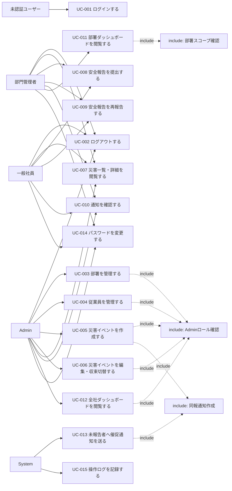

# ユースケース

Disaster Safety Report System（防災安全報告システム）

---

# 文書管理情報

| 項目 | 内容 |
| --- | --- |
| システム名 | Disaster Safety Report System |
| 文書名 | ユースケース |
| 文書番号 | DSR-03 |
| 作成者 | Nguyen Minh Tri |
| 作成日 | 2026/07/22 |
| バージョン | 1.1 |
| ステータス | Draft |

---

# 改訂履歴

| Version | 日付 | 作成者 | 内容 |
| --- | --- | --- | --- |
| 0.0 | 2026/07/22 | Nguyen Minh Tri | スケルトン作成 |
| 1.0 | 2026/07/22 | Nguyen Minh Tri | 初版作成（全15ユースケース、02_要件定義書 v1.0の権限マトリクス・BR-IDと整合） |
| 1.1 | 2026/07/22 | Nguyen Minh Tri | 整合性監査（02 v1.1と連動）: UC-008/009のアクターに部門管理者を追加（権限マトリクスでは当初から〇だったが本書が一般社員のみ記載で不整合だった）。ユースケース図にManager→UC-008/009の線を追加。 |

---

# 目次

1. 本書の目的
2. アクター定義
3. ユースケース一覧
4. ユースケース図
5. Include / Extend 関係
6. 共通事前条件・事後条件
7. ユースケース詳細
8. ユースケースと要件の対応
9. 例外・共通ルール
10. まとめ

---

# 1. 本書の目的

本書は、Disaster Safety Report Systemにおいて「誰が（WHO）」「何を行うか（WHAT）」をユースケースとして定義する。02_要件定義書の機能要件（REQ-001〜018）を利用者視点の振る舞いに変換し、04_業務フロー 05_画面遷移図 07_機能一覧の基準とする。

本システムのユースケースの特徴は、**部門管理者の権限範囲が「自分の所属部署」という固定の帰属関係で決まる**ことである（Project 03の「プロジェクトごとに変わるOwner/Member」という文脈依存とは異なり、1人の部門管理者は常に同じ部署のみを見る）。この境界判定はINC-003（部署スコープ確認）として全ダッシュボード系ユースケースに織り込む。

---

# 2. アクター定義

| アクター | 説明 | 対応ロール |
| --- | --- | --- |
| 未認証ユーザー | ログイン前の利用者 | - |
| 一般社員 | 安全報告を行う従業員 | `employees.role=staff` |
| 部門管理者 | 自部署の状況を把握する管理職 | `employees.role=manager` |
| Admin | BCP担当・危機管理部門。組織マスタ・災害イベントを管理する | `employees.role=admin` |
| System | 同報通知の作成・未報告者への催促バッチ・ログ記録の実行主体 | - |

**注意**: 3層は`employees.role`のフラットな属性であり、Project 03のような「リソースごとに変わる」文脈依存の関係ではない（02_要件定義書 3章）。

---

# 3. ユースケース一覧

| UC-ID | ユースケース名 | 主アクター | 関連REQ | 関連SCR | 優先度 |
| --- | --- | --- | --- | --- | --- |
| UC-001 | ログインする | 全ユーザー | REQ-001 | SCR-001 | Must |
| UC-002 | ログアウトする | 認証済みユーザー | REQ-002 | - | Must |
| UC-003 | 部署を管理する | Admin | REQ-004 | SCR-007 | Must |
| UC-004 | 従業員を管理する | Admin | REQ-005 | SCR-008 | Must |
| UC-005 | 災害イベントを作成する | Admin | REQ-006 / 011 | SCR-006 | Must |
| UC-006 | 災害イベントを編集・収束切替する | Admin | REQ-007 | SCR-006 | Must |
| UC-007 | 災害一覧・詳細を閲覧する | 全ユーザー | REQ-008 | SCR-011 | Must |
| UC-008 | 安全報告を提出する | 一般社員 / 部門管理者 | REQ-009 | SCR-003 | Must |
| UC-009 | 安全報告を再報告する | 一般社員 / 部門管理者 | REQ-010 | SCR-003 | Must |
| UC-010 | 通知を確認する | 認証済みユーザー | REQ-013 | SCR-009 | Must |
| UC-011 | 部署ダッシュボードを閲覧する（地図含む） | 部門管理者 | REQ-014 / 016 | SCR-004 | Must |
| UC-012 | 全社ダッシュボードを閲覧する（地図含む） | Admin | REQ-015 / 016 | SCR-005 | Must |
| UC-013 | 未報告者へ催促通知を送る | System | REQ-012 | - | Must |
| UC-014 | パスワードを変更する | 認証済みユーザー | REQ-017 | SCR-010 | Should |
| UC-015 | 操作ログを記録する | System | REQ-018 | - | Should |

REQ-003（権限制御）は特定のユースケースに紐づかない横断的要件であり、INC-001〜003（5章）として全ユースケースに織り込まれる（07_機能一覧で横断的機能として採番する）。

---

# 4. ユースケース図

---

# 5. Include / Extend 関係

## 5.1 Include

| Include ID | 共通処理 | 対象ユースケース | 内容 |
| --- | --- | --- | --- |
| INC-001 | ログイン済み確認 | UC-002〜UC-015（認証必須の全UC） | Sanctumトークンを検証する。無効ならE010。 |
| INC-002 | Adminロール確認 | UC-003 / UC-004 / UC-005 / UC-006 / UC-012 | `employees.role=admin`を確認する（BR-PRM-003）。一般社員・部門管理者が実行するとE002。 |
| INC-003 | 部署スコープ確認 | UC-011（部署ダッシュボード） | 対象部署が自分の`department_id`と一致することを確認する（BR-PRM-002）。**本システムで最も重要な共通処理**。他部署の指定はE007とする（他部署自体は存在が公知のため実質的にはE002でもよいが、02_要件定義書 8章の凡例「秘=存在秘匿（E007）」の表記に合わせ、本書でも一貫してE007とする）。 |
| INC-004 | 入力チェック | 入力を伴う全UC | 必須・形式・桁数を確認する（12章）。違反はE003。 |
| INC-005 | 同報通知作成 | UC-005（作成時）/ UC-013（バッチ） | BR-NTF-001/002の条件を判定し、対象範囲の従業員へ`notifications`を作成する。 |
| INC-006 | 操作ログ記録 | UC-003 / UC-004 / UC-005 / UC-006 | 組織マスタ・災害の変更をアプリケーションログに記録する（REQ-018 → UC-015）。 |

## 5.2 Extend

| Extend ID | 拡張処理 | 発生条件 | 対象ユースケース |
| --- | --- | --- | --- |
| EXT-001 | セッションタイムアウト | 未認証・トークン期限切れ（8時間） | 認証必須の全UC |
| EXT-002 | 権限エラー（E002） | Admin専用操作を一般社員/部門管理者が実行 | UC-003 / UC-004 / UC-005 / UC-006 / UC-012 |
| EXT-003 | 部署外アクセス拒否（E007） | 部門管理者が自部署以外を指定 | UC-011 |
| EXT-004 | 状態不整合（E006） | 収束済み災害への新規報告、対象外の災害への報告 | UC-008 |
| EXT-005 | バリデーションエラー（E003） | 入力値不正 | 入力を伴う全UC |
| EXT-006 | 外部API障害への耐性 | Google Geocoding APIのタイムアウト・エラー | UC-008 / UC-009（位置情報なしで受理を継続） |

---

# 6. 共通事前条件・事後条件

## 6.1 共通事前条件

| 条件ID | 内容 |
| --- | --- |
| PRE-001 | 従業員がシステムに登録されていること。 |
| PRE-002 | 従業員が有効状態（`employees.status=active`）であること。 |
| PRE-003 | 認証必須のUCでは、ログイン済み（有効なトークン保持）であること。 |
| PRE-004 | Admin専用UC（UC-003〜006/012）では、`role=admin`であること（INC-002）。 |
| PRE-005 | 部署ダッシュボード（UC-011）では、対象部署が自分の所属部署であること（INC-003）。 |

## 6.2 共通事後条件

| 条件ID | 内容 |
| --- | --- |
| POST-001 | 状態を変更する操作は、対応するテーブルに変更内容が保存される。 |
| POST-002 | 複数テーブル・大量件数にまたがる操作（災害作成+同報通知）は、対象範囲の確定と通知作成が同一トランザクションで完結する。 |
| POST-003 | 通知条件（BR-NTF-001/002）に合致する操作は、`notifications`が作成される。 |
| POST-004 | 組織マスタ・災害の変更操作は操作ログに記録される（INC-006）。 |

---

# 7. ユースケース詳細

## 7.1 UC-001 ログインする

**アクター**: 全ユーザー
**事前条件**: PRE-001, PRE-002
**事後条件**: トークン発行（有効期限8時間）

### 基本フロー
1. ログイン画面（SCR-001）でメールアドレスとパスワードを入力する
2. Systemが認証情報を検証する
3. トークンを発行し、ロールに応じたホーム画面（一般社員: SCR-002、部門管理者: SCR-004、Admin: SCR-005）へ遷移する

### 代替・例外フロー
- 2-a. 認証情報不一致・`status=inactive` → いずれも同一のE001（アカウント有無を推測させない）

---

## 7.2 UC-002 ログアウトする

**アクター**: 認証済みユーザー
**事前条件**: PRE-003
**事後条件**: トークン無効化

### 基本フロー
1. ヘッダーの「ログアウト」を押す
2. Systemが現在のトークンを無効化し、ログイン画面へ遷移する

### 代替・例外フロー
- なし

---

## 7.3 UC-003 部署を管理する

**アクター**: Admin
**事前条件**: PRE-001〜004、INC-002
**事後条件**: POST-001, POST-004

### 基本フロー
1. 部署管理画面（SCR-007）を開く
2. 部署を作成・編集・無効化する
3. Systemが`departments`を更新し、操作をログに記録する（INC-006）

### 代替・例外フロー
- 1-a. 一般社員・部門管理者が実行 → E002（INC-002）
- 2-a. 名称未入力・桁数超過 → E003

---

## 7.4 UC-004 従業員を管理する

**アクター**: Admin
**事前条件**: PRE-001〜004、INC-002
**事後条件**: POST-001, POST-004

### 基本フロー
1. 従業員管理画面（SCR-008）を開く
2. 従業員を作成・編集・無効化し、所属部署・ロールを設定する
3. Systemが`employees`を更新し、操作をログに記録する（INC-006）

### 代替・例外フロー
- 1-a. 一般社員・部門管理者が実行 → E002
- 2-a. 所属部署が存在しない、メール重複 → E003（BR-ORG-002）
- 2-b. 無効化された従業員は以後ログイン不可（E001）。過去の安全報告・監査ログは保持する（BR-ORG-003）

---

## 7.5 UC-005 災害イベントを作成する

**アクター**: Admin
**事前条件**: PRE-001〜004、INC-002
**事後条件**: POST-001, POST-002, POST-003, POST-004（`disasters`作成 + 対象範囲の従業員への`disaster_alert`同報通知、BR-NTF-001）

本システムの実装核心。同報通知の件数が多くなり得るため性能はNFR-001で規定する。

### 基本フロー
1. 災害管理画面（SCR-006）で「新規作成」を押す
2. 種別・発生日時・対象範囲（全社または特定部署の集合、BR-DIS-001）を入力する
3. SystemがINC-004を実行し、`disasters`を`status=active`で作成する
4. 同一トランザクションで対象範囲の従業員を抽出し、`disaster_alert`通知を一括作成する（INC-005）
5. 操作をログに記録する（INC-006）

### 代替・例外フロー
- 2-a. 対象範囲未指定・発生日時不正 → E003
- 4-a. 対象人数が多い場合の性能はNFR-001（1,000人・60秒以内）を満たす。実装方式（同期/Queue）は12_詳細設計書で確定する

---

## 7.6 UC-006 災害イベントを編集・収束切替する

**アクター**: Admin
**事前条件**: PRE-001〜004、INC-002
**事後条件**: POST-001, POST-004

### 基本フロー
1. 災害管理画面（SCR-006）で対象災害の詳細を開く
2. 詳細を編集する、または「収束」を押して`status=resolved`にする（BR-DIS-002）
3. 誤操作の場合、「進行中に戻す」で`active`へ再度切り替える
4. Systemが`disasters`を更新し、操作をログに記録する（INC-006）

### 代替・例外フロー
- 1-a. 一般社員・部門管理者が実行 → E002

---

## 7.7 UC-007 災害一覧・詳細を閲覧する

**アクター**: 全ユーザー
**事前条件**: PRE-001〜003
**事後条件**: なし（閲覧のみ）

### 基本フロー
1. 災害一覧画面（SCR-011）を開く
2. Systemが進行中・過去の災害を一覧表示する
3. 対象を選択すると、報告集計サマリを含む詳細を表示する

### 代替・例外フロー
- なし（全従業員に公開、BR-DIS-001の対象範囲は通知の宛先を絞るものであり、災害情報自体の閲覧は制限しない）

---

## 7.8 UC-008 安全報告を提出する

**アクター**: 一般社員 / 部門管理者（部門管理者も一従業員として自分の分を報告する、02_要件定義書 8章）
**事前条件**: PRE-001〜003、対象の災害が`status=active`かつ自分の部署が対象範囲に含まれること
**事後条件**: POST-001（`safety_reports`に`(disaster_id, employee_id)`一意で行を作成）

本システムのもう一つの実装核心。BR-RPT-001〜004に厳密に従う。

### 基本フロー
1. ホーム画面（SCR-002）またはUC-010の通知から安全報告フォーム（SCR-003）を開く
2. 安否状況（`safe`/`needs_help`）を選択する。コメント・位置情報は任意
3. 位置情報を入力する場合、住所を入力するかGPS取得を選択する。Systemがジオコーディングを試みる（BR-RPT-003）
4. SystemがINC-004を実行し、`safety_reports`を作成する

### 代替・例外フロー
- 1-a. 収束済みの災害 → E006（BR-DIS-002）
- 1-b. 自分の部署が対象範囲に含まれない災害 → E006（BR-RPT-004）
- 3-a. ジオコーディング失敗・タイムアウト → 位置情報なしで報告を受理する（NFR-007、EXT-006）
- 4-a. 既に報告済み（`(disaster_id, employee_id)`重複） → UC-009（再報告）へ誘導する

---

## 7.9 UC-009 安全報告を再報告する

**アクター**: 一般社員 / 部門管理者
**事前条件**: PRE-001〜003、当該災害へ既に報告済みであること
**事後条件**: POST-001（既存`safety_reports`行のUPDATE、BR-RPT-002）

### 基本フロー
1. 安全報告フォーム（SCR-003）を再度開く。Systemは前回の報告内容を初期値として表示する
2. 状況を更新する（例: `needs_help`→`safe`）
3. Systemが既存行をUPDATEする（新規行は作らない）。`reported_at`が最新報告時刻に更新される

### 代替・例外フロー
- 1-a. 対象災害が収束済み → E006（既存報告の閲覧は可能、更新は不可）

---

## 7.10 UC-010 通知を確認する

**アクター**: 認証済みユーザー
**事前条件**: PRE-001〜003
**事後条件**: POST-001（既読化時）

### 基本フロー
1. ヘッダーの通知アイコン（未読件数バッジ）から通知一覧（SCR-009）を開く
2. Systemが自分宛の通知（`disaster_alert`/`report_reminder`）を新しい順で表示する
3. 通知を選択すると対象災害の詳細（UC-007）またはUC-008（`disaster_alert`から未報告の場合）へ遷移し、当該通知が既読になる
4. 「すべて既読にする」で一括既読化できる（BR-NTF-005）

### 代替・例外フロー
- 3-a. 他人の通知IDを直接指定した既読化 → E007

---

## 7.11 UC-011 部署ダッシュボードを閲覧する（地図含む）

**アクター**: 部門管理者
**事前条件**: PRE-001〜003、INC-003（自部署であること）
**事後条件**: なし（閲覧のみ）

### 基本フロー
1. 部署ダッシュボード（SCR-004）を開く
2. Systemが自部署の進行中の災害に対する報告状況（報告済み/要支援/未確認の人数）を集計表示する（応答NFR-002）
3. 位置情報を伴う報告がある場合、統合された地図パネルにピン表示する（ステータスで色分け、REQ-016）

### 代替・例外フロー
- 1-a. 他部署のダッシュボードを直接指定 → E007（INC-003、EXT-003）
- 3-a. Google Maps API障害時、地図パネルはエラー状態を表示するが、集計数値（2.の部分）は表示を継続する

---

## 7.12 UC-012 全社ダッシュボードを閲覧する（地図含む）

**アクター**: Admin
**事前条件**: PRE-001〜004、INC-002
**事後条件**: なし（閲覧のみ）

### 基本フロー
1. 全社ダッシュボード（SCR-005）を開く
2. Systemが全社・部署別の報告状況を集計表示する
3. 全社の位置情報を地図パネルに統合表示する

### 代替・例外フロー
- 1-a. 一般社員・部門管理者が実行 → E002

---

## 7.13 UC-013 未報告者へ催促通知を送る

**アクター**: System（定期バッチ）
**事前条件**: なし
**事後条件**: POST-003

### 基本フロー
1. Systemが進行中の災害それぞれについて、対象範囲の従業員のうち`safety_reports`に該当行がまだ存在しない者を抽出する（BR-NTF-002）
2. 各対象者について、直近N時間以内に`report_reminder`を送信済みでないことを確認する（BR-NTF-004、時間窓方式）
3. `report_reminder`通知を作成する（INC-005）

### 代替・例外フロー
- 2-a. 直近N時間以内に送信済み → スキップ（永続フラグではなく時間窓判定のため、条件が解消しない限り一定間隔で自然に再送される）
- 処理は失敗対象者を飛ばして継続する（1件の失敗が他に波及しない）

---

## 7.14 UC-014 パスワードを変更する

**アクター**: 認証済みユーザー
**事前条件**: PRE-001〜003、現在のパスワードを知っていること
**事後条件**: POST-001（`password_hash`更新）

### 基本フロー
1. マイページ（SCR-010）で現在のパスワードと新パスワードを入力する
2. Systemが現在のパスワードを検証し、新パスワードをハッシュ化して保存する

### 代替・例外フロー
- 2-a. 現在のパスワード不一致 → E003

---

## 7.15 UC-015 操作ログを記録する

**アクター**: System
**事前条件**: なし（他UCからincludeされる）
**事後条件**: POST-004

### 基本フロー
1. 組織マスタ・災害の変更操作（UC-003/004/005/006）の完了時に呼び出される
2. 実行者・対象・操作内容・日時をアプリケーションログに記録する

### 代替・例外フロー
- ログ記録の失敗は業務操作自体を失敗させない（ログはベストエフォート、エラーログに残す）

---

# 8. ユースケースと要件の対応

| UC-ID | 関連REQ | UC-ID | 関連REQ |
| --- | --- | --- | --- |
| UC-001 | REQ-001 | UC-009 | REQ-010 |
| UC-002 | REQ-002 | UC-010 | REQ-013 |
| UC-003 | REQ-004 | UC-011 | REQ-014 / 016 |
| UC-004 | REQ-005 | UC-012 | REQ-015 / 016 |
| UC-005 | REQ-006 / 011 | UC-013 | REQ-012 |
| UC-006 | REQ-007 | UC-014 | REQ-017 |
| UC-007 | REQ-008 | UC-015 | REQ-018 |
| UC-008 | REQ-009 | （INC-001〜003） | REQ-003 |

---

# 9. 例外・共通ルール

- 認証必須のUCで未認証・トークン失効の場合、常にE010を返しログイン画面へ誘導する（EXT-001）
- Admin専用操作を一般社員・部門管理者が実行した場合、常にE002を返す（BR-PRM-003/004、INC-002）
- 部門管理者が自部署以外へアクセスした場合、常にE007を返す（BR-PRM-002、INC-003）
- 収束済み・対象範囲外の災害への新規安全報告は常にE006を返す（BR-DIS-002、BR-RPT-004）
- Google Maps API（ジオコーディング）の障害は、安全報告の受理自体を妨げない（NFR-007、EXT-006）
- エラーコードの意味は02_要件定義書 16章の定義に従う

---

# 10. まとめ

全15ユースケースを定義した。本書の核心はUC-005（災害イベントを作成する、INC-005で同報通知を内包）とUC-008/009（安全報告の提出・再報告）であり、この2つが02_要件定義書のBR-DIS/BR-RPT/BR-NTFのほぼ全てを実行時に横断する。またUC-011（部署ダッシュボード）のINC-003（部署スコープ確認）は、Project 03のINC-002（メンバーシップ確認）に相当する本システム最重要の共通処理であり、12_詳細設計書でのPolicy一元化の根拠となる。

---
