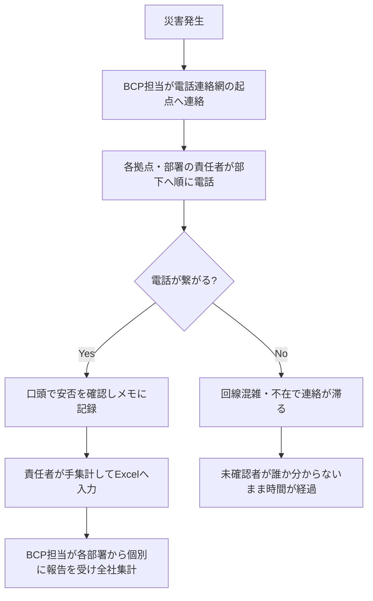
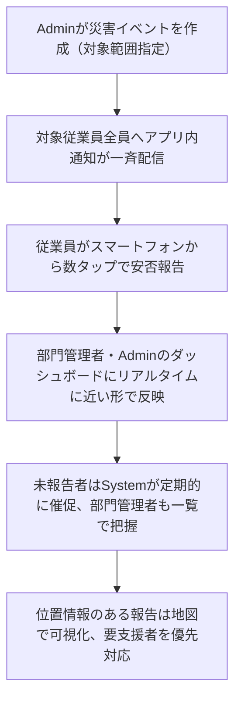
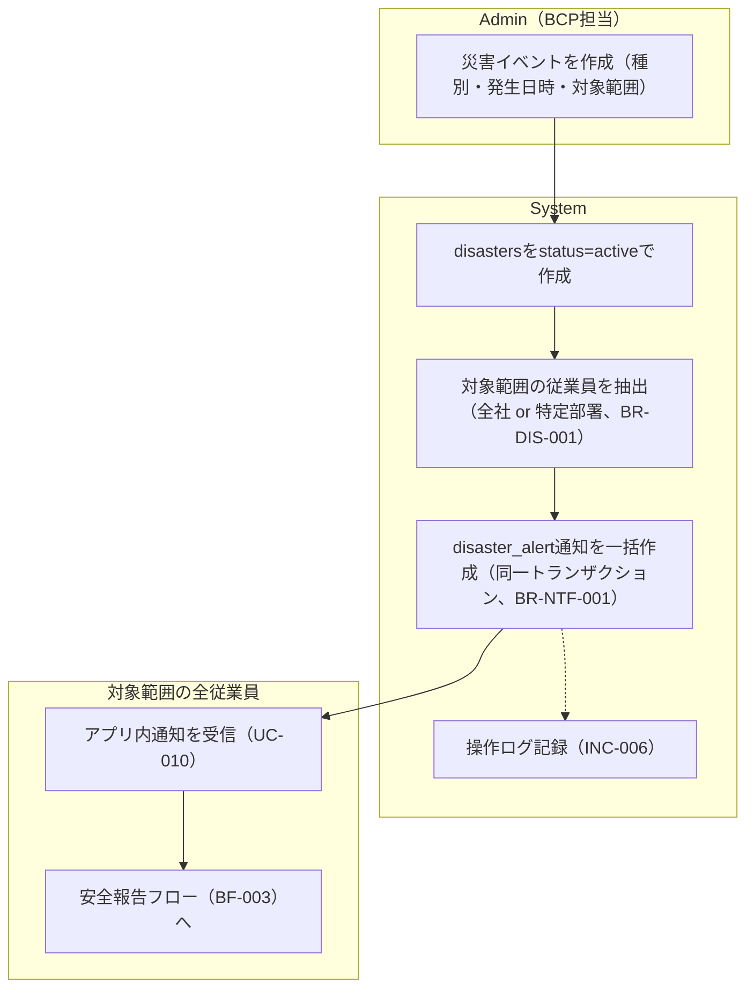
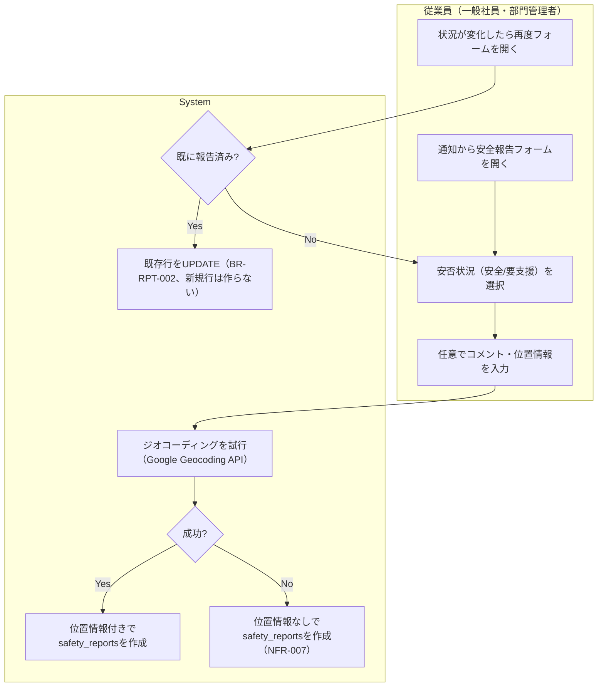
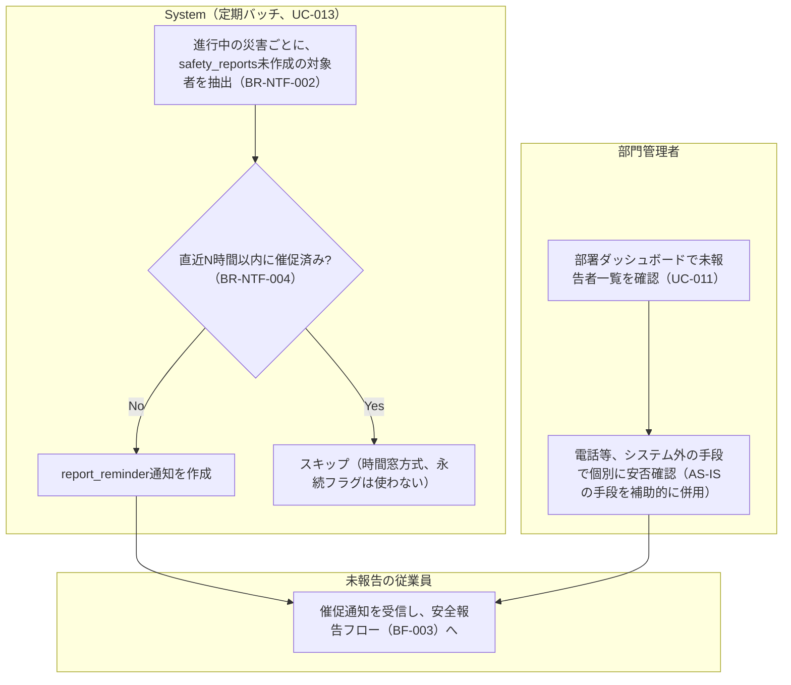
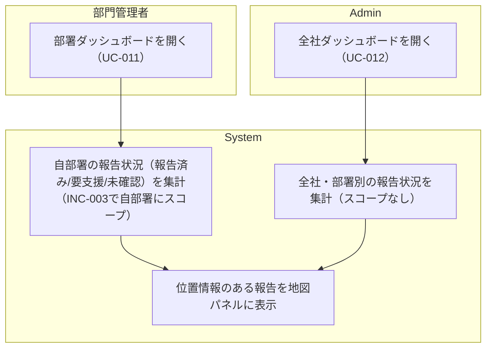
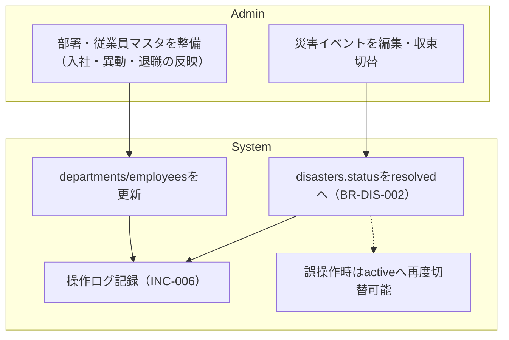

# 業務フロー

Disaster Safety Report System（防災安全報告システム）

---

# 文書管理情報

| 項目 | 内容 |
| --- | --- |
| システム名 | Disaster Safety Report System |
| 文書名 | 業務フロー |
| 文書番号 | DSR-04 |
| 作成者 | Nguyen Minh Tri |
| 作成日 | 2026/07/22 |
| バージョン | 1.1 |
| ステータス | Draft |

---

# 改訂履歴

| Version | 日付 | 作成者 | 内容 |
| --- | --- | --- | --- |
| 0.0 | 2026/07/22 | Nguyen Minh Tri | スケルトン作成 |
| 1.0 | 2026/07/22 | Nguyen Minh Tri | 初版作成（BF-001〜006、03_ユースケース v1.0のUC-IDと整合） |
| 1.1 | 2026/07/22 | Nguyen Minh Tri | 整合性監査（02 v1.1と連動）: BF-003のスイムレーンアクターを「従業員（一般社員・部門管理者）」に修正（部門管理者も自分の分を報告するため）。 |

---

# 目次

1. 本書の目的
2. 業務概要と業務フロー一覧
3. AS-IS 業務フロー（想定：システム化以前）
4. TO-BE 業務フロー（本システム導入後）
5. 災害発生・同報通知フロー（BF-002）
6. 安全報告フロー（BF-003）
7. 未報告者フォローフロー（BF-004）
8. ダッシュボード監視フロー（BF-005）
9. 組織・災害運用フロー（BF-006）
10. 例外フロー
11. 業務ルール対応
12. ユースケース対応
13. まとめ

---

# 1. 本書の目的

本書は、Disaster Safety Report Systemが支える業務の流れを、アクター（スイムレーン）ごとの時系列で定義する。02_要件定義書の業務ルール（BR-ID）と03_ユースケースのUC-IDを業務の文脈に配置し、05_画面遷移図以降の設計の基準とする。

本システムの業務フローの特徴は、**1件の災害イベントが大量の従業員への同報通知として一気に波及する**（BF-002）ことと、**「未報告」という状態がシステムとマネージャーの双方から継続的に監視される**（BF-004/005）ことである。

---

# 2. 業務概要と業務フロー一覧

想定利用者は従業員数百〜千名規模の企業。従来は電話連絡網やExcelの手作業集計に頼っていた安否確認を、本システムに集約し「誰が・いつ・どんな状況か」をリアルタイムに可視化する。

| BF-ID | 業務フロー | 主なアクター | 関連UC | 記載章 |
| --- | --- | --- | --- | --- |
| BF-001 | 認証フロー | 全ユーザー | UC-001 / 002 | （単純なため図は省略。UC-001/002の基本フローを参照） |
| BF-002 | 災害発生・同報通知フロー | Admin / System / 全従業員 | UC-005 | 5章 |
| BF-003 | 安全報告フロー | 従業員（一般社員・部門管理者） / System | UC-008 / 009 / 010 | 6章 |
| BF-004 | 未報告者フォローフロー | System / 部門管理者 | UC-013 / 011 | 7章 |
| BF-005 | ダッシュボード監視フロー | 部門管理者 / Admin | UC-011 / 012 | 8章 |
| BF-006 | 組織・災害運用フロー | Admin | UC-003 / 004 / 006 | 9章 |

---

# 3. AS-IS 業務フロー（想定：システム化以前）

## 3.1 AS-IS 課題

- 災害直後は電話回線が混雑・輻輳し、連絡網が機能しないことが多い
- 手作業の電話リレーは伝達漏れ・誤伝達が起きやすく、誰まで伝わったか把握できない
- 安否状況の集計がExcelの手作業で、全社集計までに数時間かかることがある
- 「まだ誰が未確認か」がリアルタイムに分からず、フォローの優先順位をつけられない
- 位置情報を伴わないため、要支援者がどこにいるかの初動把握に時間がかかる

---

# 4. TO-BE 業務フロー（本システム導入後）

## 4.1 TO-BE 改善点

| 項目 | AS-IS | TO-BE |
| --- | --- | --- |
| 伝達手段 | 電話連絡網（回線混雑に弱い） | アプリ内通知の同報配信（BR-NTF-001）。回線混雑の影響を受けにくい |
| 報告の記録 | 口頭 → 手書き/Excel転記 | `safety_reports`に直接記録、二重入力なし |
| 集計 | 各部署からの個別報告をBCP担当が手集計 | ダッシュボードが自動集計、リアルタイムに近い形で閲覧可能（NFR-002） |
| 未確認者の把握 | 分からない、または人力で洗い出す | Systemが継続的に抽出し催促、部門管理者もダッシュボードで即座に把握 |
| 要支援者の位置 | 把握手段なし | 地図上にピン表示（REQ-016） |

---

# 5. 災害発生・同報通知フロー（BF-002）

**業務上のポイント**: 対象範囲を「全社」または「特定部署」から選べるのは、局所的な災害（一部拠点の浸水等）で無関係な従業員に通知を送らないため（BR-DIS-001）。同報通知の件数が多い場合の性能はNFR-001（1,000人・60秒以内）で規定し、実装方式（同期/Queue）は12_詳細設計書の判断に委ねる。

---

# 6. 安全報告フロー（BF-003）

**業務上のポイント**: ジオコーディングの成否は報告の受理可否に一切影響しない（NFR-007）— 外部APIの障害が本質機能（安否報告）を止めてはならないという設計方針の業務上の現れ。再報告は新しい行を作らず上書きするため（BR-RPT-002）、ダッシュボードは常に「最新の状況」のみを見る。

---

# 7. 未報告者フォローフロー（BF-004）

**業務上のポイント**: BR-NTF-004はProject 03の`is_due_soon_notified`（永続フラグ）とは異なり時間窓方式を採用する。「未報告」という条件は従業員が報告すれば自然に解消するため、フラグをリセットする仕組みを別途用意する必要がない（02_要件定義書 BR-NTF-004参照）。部門管理者による電話等の手動フォロー（AS-ISの手段）は本システムの範囲外だが、ダッシュボードの未報告者一覧（UC-011）がその判断材料を提供する。

---

# 8. ダッシュボード監視フロー（BF-005）

**業務上のポイント**: 部門管理者は自部署のみ（INC-003、BR-PRM-002）、Adminは全社を見られる（8章の権限マトリクス）。同じ集計ロジックをスコープの有無だけで使い回す設計とすることで、12_詳細設計書のクエリ実装を一元化できる。

---

# 9. 組織・災害運用フロー（BF-006）

**業務上のポイント**: 従業員の退職は無効化（論理削除）のみとし、過去の安全報告・監査ログとの参照整合性を保つ（BR-ORG-003）。災害の収束は取り消し可能とし、Admin が状況を見誤って早期に収束させても訂正できる運用とする（REQ-007）。

---

# 10. 例外フロー

| 例外 | 発生フロー | システムの挙動 | 業務上の対応 |
| --- | --- | --- | --- |
| Admin専用操作を一般社員・部門管理者が実行 | BF-002 / 006 | E002（INC-002） | Adminに依頼する |
| 部門管理者が他部署のダッシュボードへアクセス | BF-005 | E007（INC-003） | 自部署のダッシュボードのみ利用する |
| 収束済み・対象外の災害への新規安全報告 | BF-003 | E006（BR-DIS-002 / BR-RPT-004） | 既存報告の閲覧のみ可能。新しい災害の通知を待つ |
| Google Maps / Geocoding API障害 | BF-003 / 005 | 安全報告は位置情報なしで受理を継続（NFR-007）。ダッシュボードの地図パネルのみエラー表示、集計数値は継続表示 | 復旧後は新しい報告から位置情報が反映される |
| 大量同報通知の性能未達 | BF-002 | NFR-001の負荷試験で検出し、12_詳細設計書でQueue化を判断 | 運用開始前に性能試験で確認（17_システム試験仕様書） |

---

# 11. 業務ルール対応

| BF-ID | 主要な適用ルール |
| --- | --- |
| BF-002 | BR-DIS-001（対象範囲）/ BR-NTF-001（同報通知） |
| BF-003 | BR-RPT-001（ステータス2値）/ BR-RPT-002（再報告UPDATE）/ BR-RPT-003（位置情報スナップショット）/ BR-RPT-004（拒否条件） |
| BF-004 | BR-NTF-002（催促の抽出条件）/ BR-NTF-004（時間窓による再送制御） |
| BF-005 | BR-PRM-002（部門管理者の部署スコープ） |
| BF-006 | BR-ORG-002 / BR-ORG-003（部署必須・論理削除）/ BR-DIS-002（収束後の新規報告不可） |

---

# 12. ユースケース対応

2章の一覧表を参照（BF-ID ⇔ UC-IDの対応を記載済み）。逆引き: UC-010（通知確認）はBF-002/003/004に横断的に登場する。UC-015（操作ログ）はBF-006の各操作に付随する。

---

# 13. まとめ

本業務フローの核心は、AS-ISの「電話連絡網という輻輳に弱い伝達手段」を**アプリ内通知の同報配信（BF-002）**に、「手作業の全社集計」を**ダッシュボードのリアルタイム集計（BF-005）**に置き換えることである。さらに「未報告者の継続的なフォロー」（BF-004）は、Project 03で得た通知設計の教訓（識別子ベースの永続フラグが状態変化を追従できない罠）を踏まえ、時間窓方式という異なる設計を意図的に選んでいる。次工程の05_画面遷移図 06_画面設計は、緊急時にも迷わず数タップで安全報告が完了できることを最優先の基準として設計する（NFR-020/021）。

---
