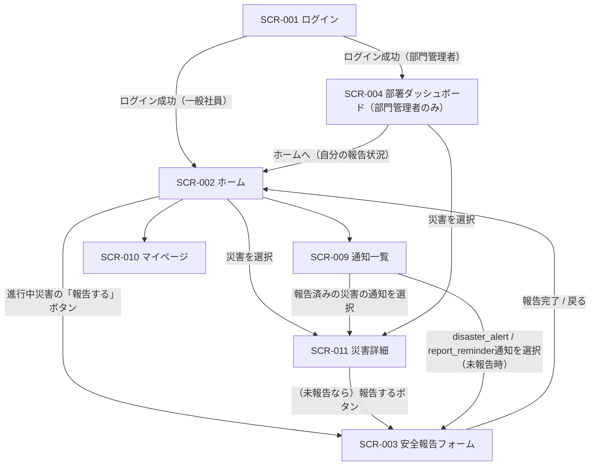
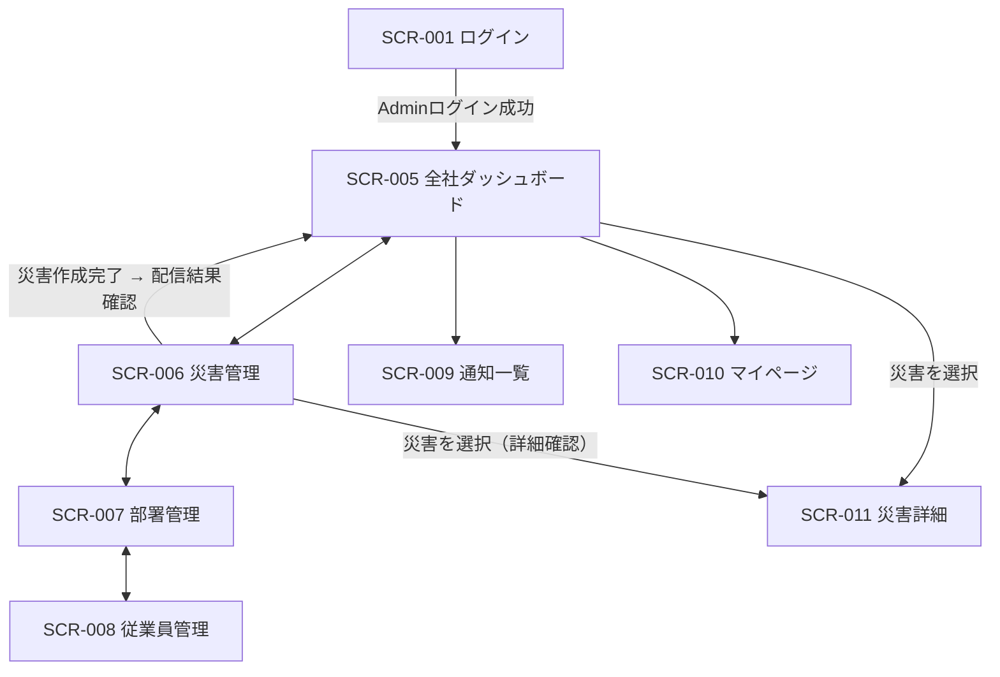

# 画面遷移図

Disaster Safety Report System（防災安全報告システム）

---

# 文書管理情報

| 項目 | 内容 |
| --- | --- |
| システム名 | Disaster Safety Report System |
| 文書名 | 画面遷移図 |
| 文書番号 | DSR-05 |
| 作成者 | Nguyen Minh Tri |
| 作成日 | 2026/07/22 |
| バージョン | 1.0 |
| ステータス | Draft |

---

# 改訂履歴

| Version | 日付 | 作成者 | 内容 |
| --- | --- | --- | --- |
| 0.0 | 2026/07/22 | Nguyen Minh Tri | スケルトン作成 |
| 1.0 | 2026/07/22 | Nguyen Minh Tri | 初版作成（SPA前提のルートパス列を追加。SCR-003のURL直リンク化 — disaster_alert通知の遷移先要件 — を確定。ロール別ランディング3分岐を確定） |

---

# 目次

1. 本書の目的
2. 画面ID一覧（ルートパス付き）
3. 一般社員・部門管理者向け画面遷移図
4. Admin向け画面遷移図
5. Role別ナビゲーション
6. 条件付き遷移（ナビゲーションガード）
7. まとめ

---

# 1. 本書の目的

Disaster Safety Report Systemの全11画面について、画面ID・SPAルートパス・遷移条件を定義する。本システムはVue 3 SPAのため、「画面遷移」はVue Routerのルート遷移として実装される。ページ・モーダルの別と、ナビゲーションガード（6章）の適用条件を本書で確定する。

本システムの遷移設計の最優先事項は、**災害通知の受信から安全報告の完了までを最短経路（通知タップ→報告フォーム→送信の実質2画面）で結ぶ**ことである（NFR-021: 低操作コスト）。

---

# 2. 画面ID一覧（ルートパス付き）

| 画面ID | 画面名 | 対象ユーザー | 形態 | ルートパス |
| --- | --- | --- | --- | --- |
| SCR-001 | ログイン画面 | 全ユーザー | ページ | `/login` |
| SCR-002 | ホーム（進行中の災害・自分の報告状況） | 一般社員 / 部門管理者 | ページ | `/` |
| SCR-003 | 安全報告フォーム | 一般社員 / 部門管理者 | ページ（**URL直リンク可**） | `/disasters/:disasterId/report` |
| SCR-004 | 部署ダッシュボード（地図含む） | 部門管理者 | ページ | `/dashboard/department` |
| SCR-005 | 全社ダッシュボード（地図含む） | Admin | ページ | `/dashboard/company` |
| SCR-006 | 災害管理一覧・作成・編集 | Admin | ページ | `/admin/disasters` |
| SCR-007 | 部署管理 | Admin | ページ | `/admin/departments` |
| SCR-008 | 従業員管理 | Admin | ページ | `/admin/employees` |
| SCR-009 | 通知一覧 | 認証済みユーザー | ドロップダウン + ページ | `/notifications` |
| SCR-010 | マイページ（パスワード変更） | 認証済みユーザー | ページ | `/mypage` |
| SCR-011 | 災害詳細（報告一覧・集計サマリ） | 全ユーザー（表示範囲は02_要件定義書 8章に従う） | ページ | `/disasters/:disasterId` |

**設計判断（SCR-003のURL直リンク化）**: 安全報告フォームは**独自のルートパスを持つ**。理由: `disaster_alert`通知（UC-010）の遷移先として「特定災害の報告フォームへ直接飛べるURL」が必須であり、緊急時に通知タップ1回でフォームに到達できることがNFR-021の実現手段そのものであるため（Project 03のSCR-005 URL直リンク化と同じ判断構造 — 通知の遷移先はURLを持たなければならない）。

**設計判断（ロール別ランディング3分岐）**: ログイン成功後の遷移先はロールで分岐する（03_ユースケース UC-001）— 一般社員は`/`（SCR-002）、部門管理者は`/dashboard/department`（SCR-004）、Adminは`/dashboard/company`（SCR-005）。緊急時に各ロールが最初に必要とする情報（自分の報告状況 / 自部署の状況 / 全社の状況）へ最短で到達させるため。

---

# 3. 一般社員・部門管理者向け画面遷移図

ヘッダー（共通レイアウト、06_画面設計 3章）の通知アイコン・ユーザーメニューは全認証済み画面からSCR-009/SCR-010へ遷移できる（図では代表としてSCR-002からの線のみ記載）。部門管理者はSCR-004を起点としつつ、自分自身の安全報告（UC-008/009、02_要件定義書 8章）のためにSCR-002/003へも遷移できる。

---

# 4. Admin向け画面遷移図

Adminは安全報告フォーム（SCR-003）のナビゲーションを持たない（BR-PRM-003: Adminは報告対象外。URL直撃はE002 — 6章 G-05）。SCR-005〜008間はAdminサイドバー（06_画面設計 3.3節）で相互に遷移できる（図では隣接ペアのみ記載）。

---

# 5. Role別ナビゲーション

| メニュー | 未認証 | 一般社員 | 部門管理者 | Admin |
| --- | --- | --- | --- | --- |
| ログイン | 〇 | -（ログアウト後に表示） | - | - |
| ホーム（自分の報告状況） | × | 〇（ランディング） | 〇 | × |
| 安全報告フォーム | × | 〇 | 〇 | ×（BR-PRM-003） |
| 部署ダッシュボード | × | × | 〇（ランディング、自部署のみ） | ×（全社ダッシュボードの部署別内訳で代替） |
| 全社ダッシュボード | × | × | × | 〇（ランディング） |
| 災害管理 / 部署管理 / 従業員管理 | × | × | × | 〇 |
| 災害一覧・詳細 | × | 〇 | 〇 | 〇 |
| 通知 / マイページ | × | 〇 | 〇 | 〇 |

**注1**: 「Adminの部署ダッシュボード」は独立ルートを設けない — 02_要件定義書 8章でAdminは部署ダッシュボード〇（全部署）だが、この要件はSCR-005（全社ダッシュボード）内の部署別内訳ビューで満たす（画面数を増やさず、Adminの動線を1画面に集約する）。

**注2**: メニューの出し分けはUI上の配慮であり、権限の実体はAPI側の判定（06_画面設計 UI-004）。URLを直接叩いた場合のガードは6章に従う。

---

# 6. 条件付き遷移（ナビゲーションガード）

SPAのため、遷移条件はVue Routerのナビゲーションガード + API応答エラーの2段階で守る。ガードIDは12_詳細設計書（フロントエンド設計）で実装と対応付ける。

| ガードID | 対象ルート | 条件 | 不成立時の挙動 |
| --- | --- | --- | --- |
| G-01 | `/login`以外の全ルート | 認証済み（トークン保持）であること | `/login`へリダイレクト。ログイン成功後、元のURLへ復帰（クエリ`redirect`。通知経由のSCR-003直リンクがログイン切れでも報告に到達できるようにする — NFR-021） |
| G-02 | `/login` | 未認証であること | 認証済みならロール別ランディング（一般社員`/`・部門管理者`/dashboard/department`・Admin`/dashboard/company`）へリダイレクト |
| G-03 | `/admin/*`・`/dashboard/company` | `employees.role=admin`であること（INC-002） | E002。一般社員・部門管理者には管理メニュー自体を表示しない |
| G-04 | `/dashboard/department` | `employees.role=manager`であること（INC-003: 表示対象は常に自分の`department_id`） | 一般社員・AdminはE002（Adminの部署別把握はSCR-005内で行う — 5章 注1）。他部署IDを指定するAPI呼び出しはE007（BR-PRM-002） |
| G-05 | `/disasters/:disasterId/report`（+ 送信操作） | ①`role=staff`または`manager`であること（AdminはE002、BR-PRM-003）②対象災害が`status=active`かつ自分の部署が対象範囲に含まれること | ②不成立はE006を受け、「この災害への報告はできません」を表示しSCR-011へ誘導（BR-DIS-002 / BR-RPT-004） |
| G-06 | `/disasters/:disasterId`（+配下） | 災害が存在すること | E007を受け、災害一覧側へ戻し「対象のデータが見つかりません」を表示 |
| G-07 | 位置情報入力（遷移ではなく操作ガード） | Google Geocoding APIが応答すること | 失敗・タイムアウト時も報告フォームの送信は妨げない — 位置情報なしで送信を継続できる（NFR-007。ジオコーディング失敗はエラー扱いにしない） |

---

# 7. まとめ

全11画面のうち、一般社員・部門管理者の動線は「通知 → SCR-003（安全報告フォーム）」への最短経路を軸に設計し、SCR-003のURL直リンク化とG-01のredirect復帰により、ログイン切れ状態からでも「通知タップ→ログイン→フォーム復帰」で報告に到達できる（NFR-021の遷移設計上の実現）。Admin動線はSCR-005（全社ダッシュボード）を起点に管理3画面へ放射状に配置した。SPA特有の設計判断として、①ロール別ランディング3分岐、②Adminの部署別把握をSCR-005内の内訳ビューへ集約（独立ルートを増やさない）、③ガードを「フロントのルートガード + APIの判定」の二重防御とし権限の実体は常にAPI側に置くこと、の3点を確定した。

---
