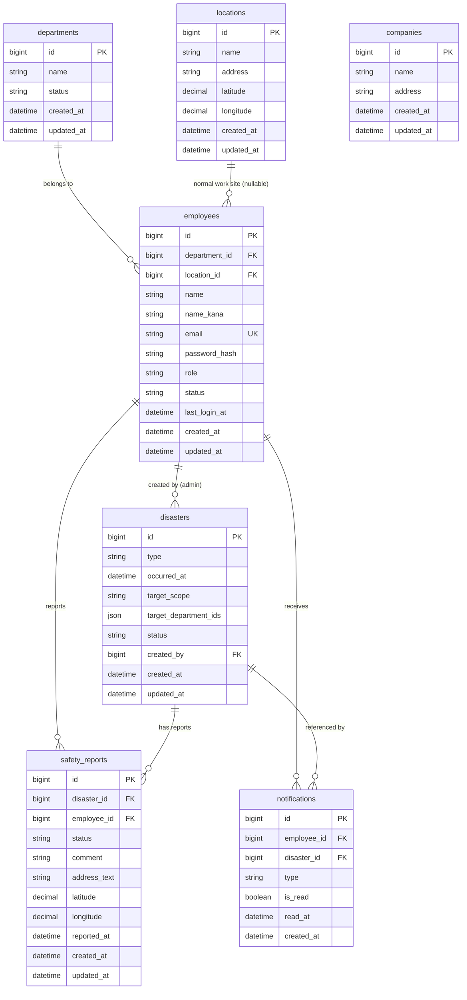

# ER図

Disaster Safety Report System（防災安全報告システム）

---

# 文書管理情報

| 項目 | 内容 |
| --- | --- |
| システム名 | Disaster Safety Report System |
| 文書名 | ER図 |
| 文書番号 | DSR-08 |
| 作成者 | Nguyen Minh Tri |
| 作成日 | 2026/07/23 |
| バージョン | 1.0 |
| ステータス | Draft |

---

# 改訂履歴

| Version | 日付 | 作成者 | 内容 |
| --- | --- | --- | --- |
| 0.0 | 2026/07/22 | Nguyen Minh Tri | スケルトン作成 |
| 1.0 | 2026/07/23 | Nguyen Minh Tri | 初版作成。7テーブル・7リレーションを確定。00_開発計画書 9章が残していた論点（`target_scope`の部署指定方法）をJSON列方式で確定し、junction table追加によるテーブル数増加を回避した。 |

---

# 目次

1. 本書の目的
2. ER設計方針
3. エンティティ一覧
4. ER図
5. リレーション定義
6. エンティティ詳細（業務上の要点）
7. 主キー・外部キー一覧
8. インデックス方針
9. データ削除・保持方針
10. 正規化方針とあえて非正規化した点
11. drawio図面ファイル
12. トレーサビリティ
13. まとめ

---

# 1. 本書の目的

本書は、Disaster Safety Report Systemで利用するデータの論理構造とエンティティ間の関係を定義する。本書のエンティティ・リレーション・キー設計は、次工程の09_テーブル定義（物理設計）、10_API設計、実装、テスト仕様書の基準とする。

---

# 2. ER設計方針

| 方針ID | 方針 | 内容 |
| --- | --- | --- |
| ER-001 | Logical First | 本書では論理ERを定義し、物理カラム型・詳細制約は09_テーブル定義で定義する。 |
| ER-002 | Traceability | エンティティは要件（REQ）、機能（FUNC）、業務ルール（BR）と対応させる。 |
| ER-003 | 単一企業モデルの徹底 | `companies`は1行のみのプロフィール情報として扱い、他の全テーブルとFK関係を持たせない。`company_id`によるテナントスコープ列はどのテーブルにも追加しない（00_開発計画書 9章、BR-ORG-001）。 |
| ER-004 | マスタとスナップショットの分離 | `locations`（従業員の通常の勤務地マスタ）と`safety_reports`の位置情報（報告時点の実際の居場所）は、同じ「緯度経度」という型を持ちながら意味の異なる別概念として明確に分離する。`safety_reports`は`locations`を参照しない（BR-RPT-003）。 |
| ER-005 | 対象範囲はJSON列で表現 | `disasters`の対象部署範囲は中間テーブル（`disaster_target_departments`等）を追加せず、`target_department_ids`のJSON列で表現する。ロードマップで確定した「7テーブル」構成を維持するための意図的な選択であり、トレードオフは11章で詳述する。 |
| ER-006 | 通知の参照は必須（NULL許容にしない） | `notifications.disaster_id`はNOT NULLとする。Project 03の`notifications.task_id`はタスク削除に伴いSET NULLする設計だったが、本システムの`disasters`は削除機能を持たず収束後も永続保持する（11.2データ保持方針）ため、参照が失われるケースが存在しない。 |
| ER-007 | Normalization | 第3正規形を基本とする。非正規化はJSON列（ER-005）のみで、他に意図的な非正規化は行わない（10章）。 |

---

# 3. エンティティ一覧

テーブルIDは09_テーブル定義および`diagrams/er/dsr_erd.drawio`（11章）のTBL-IDと一致させる。

| テーブルID | エンティティ | 論理名 | 概要 | 主な関連機能 |
| --- | --- | --- | --- | --- |
| TBL-001 | companies | 自社プロフィール | 1行のみ。会社名・本社住所（地図初期表示位置）。他テーブルとFK関係を持たない（ER-003）。 | - |
| TBL-002 | departments | 部署 | 部署マスタ。無効化のみ（物理削除しない）。 | FUNC-004 |
| TBL-003 | employees | 従業員 | 全利用者。3層フラットロール（admin/manager/staff）、所属部署、通常の勤務地を保持。 | FUNC-001〜003 / 005 / 018 |
| TBL-004 | locations | 拠点マスタ | 従業員の通常の勤務地。UIからのCRUD機能を持たない初期シードデータ（6章）。 | FUNC-017 |
| TBL-005 | disasters | 災害イベント | 種別・発生日時・対象範囲・状態（active/resolved）を保持。 | FUNC-006 / 007 / 008 / 013 |
| TBL-006 | safety_reports | 安全報告 | 従業員の安否状況。`UNIQUE(disaster_id, employee_id)`でUPDATE方式（BR-RPT-002）。 | FUNC-009 / 010 |
| TBL-007 | notifications | 通知 | 受信者・種別（2種）・参照災害・既読状態。 | FUNC-011〜014 |

---

# 4. ER図

`companies`はどのエンティティとも線を持たない孤立ノードである（ER-003）。図には掲載しているが、リレーション定義（5章）には現れない。

---

# 5. リレーション定義

| リレーションID | 親エンティティ | 子エンティティ | 多重度 | 内容 |
| --- | --- | --- | --- | --- |
| REL-001 | departments | employees | 1:N | 従業員は必ず1部署に所属する（`department_id`はNOT NULL、BR-ORG-002）。 |
| REL-002 | locations | employees | 1:N（nullable） | 従業員の通常の勤務地。未設定を許容する（6章）。 |
| REL-003 | employees | disasters | 1:N | 災害イベントの作成者（`created_by`）。Adminロールの従業員のみが実際に作成する（アプリ層で制御、BR-DIS-003で複数Admin登録を許可）。 |
| REL-004 | employees | safety_reports | 1:N | 安全報告の報告者。`UNIQUE(disaster_id, employee_id)`により1従業員は1災害につき1行のみ持つ（BR-RPT-002）。 |
| REL-005 | disasters | safety_reports | 1:N | 1つの災害イベントは複数の安全報告を持つ。 |
| REL-006 | employees | notifications | 1:N | 通知の受信者。本人のみ閲覧・既読化できる（BR-NTF-005）。 |
| REL-007 | disasters | notifications | 1:N | 通知が参照する災害イベント。`disaster_alert`・`report_reminder`のいずれも必ず1つの災害に紐づく（ER-006、NULL許容にしない）。 |

`companies`はいずれのリレーションにも登場しない（ER-003）。

---

# 6. エンティティ詳細（業務上の要点）

全カラム定義は09_テーブル定義を参照。本章では業務上の要点のみ補足する。

| エンティティ | 業務上の要点 |
| --- | --- |
| companies | 1行のみのプロフィール。DBのCHECK制約では「行数1件」自体は表現できないため、Seeder投入後は新規作成APIを設けないことで担保する（アプリ層の保証、09_テーブル定義 11章）。 |
| departments | REQ-004の「部署の無効化」要件を満たすため、`employees`向けに定義されたBR-ORG-003（無効化・物理削除しない）のパターンを`departments`にも同様に適用した（02_要件定義書では明示されていない拡張適用、09_テーブル定義 11章で明記）。 |
| employees | `role`列（admin/manager/staff）が全権限判定の唯一の根拠（BR-PRM-001、PMSの2層モデルとの対比が02_要件定義書 3章の学習ポイント）。`department_id`と`location_id`はどちらも従業員の「所属」を表すが意味が異なる — 前者は組織上の所属、後者は物理的な勤務地であり、1対1で対応するとは限らない（同じ部署でも拠点違いの従業員がいる、同じ拠点に複数部署の従業員がいる、を許容する設計）。 |
| locations | 拠点そのものを作成・編集するUI機能を持たない（07_機能一覧にFUNC無し）。初期シードデータとして投入するマスタであり、13章（今後の拡張予定）で拠点管理画面を将来追加する余地として独立テーブルにしている。 |
| disasters | `target_scope`（'all'/'specific'）と`target_department_ids`（JSON、specific時のみ使用）の組で対象範囲を表現する（BR-DIS-001）。DBのFK制約でJSON内の部署IDの実在性は保証できないため、アプリ層のバリデーションで保証する（09_テーブル定義 11章）。 |
| safety_reports | `UNIQUE(disaster_id, employee_id)`が本エンティティの核。再報告は新規行のINSERTではなく既存行のUPDATEであり（BR-RPT-002）、Project 02の`payments`（会計証憑として全件保持）と対照的な設計である。位置情報（`latitude`/`longitude`/`address_text`）は`locations`の複製ではなく、報告時点で個別に取得した値（BR-RPT-003）。 |
| notifications | `disaster_id`は必ず値を持つ（ER-006）。PMSの`notifications.task_id`のようなSET NULL・スナップショット列（`task_title`相当）は不要 — 参照先の`disasters`が削除されない（11.2データ保持方針）ため、参照の生存戦略そのものが不要になる、という設計上の単純化。 |

---

# 7. 主キー・外部キー一覧

| テーブル | PK | 主なFK（ON DELETE） |
| --- | --- | --- |
| companies | id | - |
| departments | id | - |
| employees | id | department_id → departments.id（RESTRICT）、location_id → locations.id（SET NULL） |
| locations | id | - |
| disasters | id | created_by → employees.id（RESTRICT） |
| safety_reports | id | disaster_id → disasters.id（RESTRICT）、employee_id → employees.id（RESTRICT） |
| notifications | id | employee_id → employees.id（RESTRICT）、disaster_id → disasters.id（RESTRICT） |

**方針**: 本システムには物理削除を伴う操作が1つも存在しない（部署・従業員は無効化のみ、災害は収束切替のみ、安全報告はUPDATEのみ、通知は削除機能なし）。そのためON DELETEはいずれも実運用上ほぼ発動しない。にもかかわらず全FKに明示的にRESTRICT（`location_id`のみSET NULL）を指定するのは、将来的に物理削除機能が追加された場合でも安全側のデフォルト（誤って親行を消せない）が効くようにするためである（09_テーブル定義 11章で詳述）。`location_id`だけSET NULLとするのは、拠点情報が組織運営上の必須情報ではなく（6章）、拠点未設定の従業員を許容する設計（REL-002）と整合させるため。

---

# 8. インデックス方針

| 対象 | 種別 | 用途 |
| --- | --- | --- |
| employees.email | UNIQUE | ログイン検索 |
| employees (department_id) | INDEX | 部署別従業員一覧・部署ダッシュボードの母集団抽出（REQ-014） |
| employees (location_id) | INDEX | 地図表示時の勤務地別従業員抽出（REQ-016） |
| employees (role, status) | INDEX | Admin/部門管理者一覧、ログイン可否判定（inactiveの除外） |
| disasters (status) | INDEX | 進行中の災害一覧の抽出（REQ-008、最頻クエリ） |
| safety_reports (disaster_id, employee_id) | UNIQUE | 再報告のUPDATE対象特定 + 重複報告防止（BR-RPT-002）— **本システム最重要インデックス** |
| safety_reports (disaster_id, status) | INDEX | ダッシュボードの状況別集計（安全/要支援の人数、REQ-014/015） |
| notifications (employee_id, is_read, created_at) | INDEX | 通知一覧・未読件数（REQ-013、最頻の読み取りクエリ） |
| notifications (employee_id, disaster_id, type, created_at) | INDEX | `report_reminder`の再送間隔チェック（BR-NTF-004の時間窓方式、直近送信日時の参照） |

---

# 9. データ削除・保持方針

| データ | 方針 |
| --- | --- |
| companies | 削除機能なし（1行のみ運用、ER-003） |
| departments / employees | 物理削除しない。無効化（status=inactive）のみ（BR-ORG-003） |
| locations | UIからの削除機能なし（6章）。運用上はシードデータの入れ替えのみ |
| disasters | 収束後も保持する。物理削除しない（11.2データ保持方針、02_要件定義書） |
| safety_reports | UPDATE方式（BR-RPT-002）。物理削除しない。履歴（過去の報告内容の変遷）も保持しない |
| notifications | 削除機能なし（BR-NTF-006） |

---

# 10. 正規化方針とあえて非正規化した点

| 対象 | 状態 | 理由 |
| --- | --- | --- |
| disasters.target_department_ids | 意図的な非正規化（JSON列） | 「対象部署の集合」という多値属性を、中間テーブル（`disaster_target_departments`）を新設せずJSON列で表現する。00_開発計画書で確定した「7テーブルをそのまま採用する」方針を維持するための選択であり、DBのFK制約による部署IDの実在性保証を放棄する代わりに、アプリ層バリデーションで代替する（09_テーブル定義 11章にトレードオフを詳述）。 |
| safety_reportsの位置情報 | 非正規化ではない（別概念） | `locations`と同じ「緯度経度」型を持つが、`locations`の複製（同じ事実の重複保持）ではなく、報告時点で個別に発生した別のデータである（ER-004、BR-RPT-003）。PMSの`notifications.task_title`（`tasks.title`と同じ事実のスナップショット）とは性質が異なる点に注意 — あちらは「同じ事実」の非正規化コピー、こちらは「そもそも別の事実」である。 |
| それ以外 | 第3正規形 | 関数従属性に基づき正規化する。 |

---

# 11. drawio図面ファイル

`../diagrams/er/dsr_erd.drawio`（**作成済み** — `/drawio-er`スキルの規約でNode.jsスクリプト生成、7テーブル/7リレーション）。規約はEC Site・PMSと同一: swimlane形式、PK行=淡黄/FK行=淡青、FK依存レベル順の列配置、迂回レーン方式の配線。

FK依存レベル: Lv0=companies（孤立）, departments, locations / Lv1=employees / Lv2=disasters / Lv3=safety_reports, notifications。`employees`は`safety_reports`/`notifications`へ2階層(Lv1→Lv3)をまたいでFKを持つため（`disasters`列を飛び越える）、この2本は迂回レーン（bypass lane）で配線した。`employees`自身も`disasters.created_by`・`safety_reports.employee_id`・`notifications.employee_id`の3本のFKの起点となるため、「1」ラベルのオフセットを分散させている（EC Siteで確立した手法の再適用）。

---

# 12. トレーサビリティ

02_要件定義書の業務ルール（BR-ORG/PRM/DIS/RPT/NTF）→ 本書のリレーション定義（5章）→ 09_テーブル定義の物理制約、の順に一意に追跡できる。

---

# 13. まとめ

本ER図の核心は2点である。①`companies`を意図的に孤立ノードとして扱い、他の全テーブルから`company_id`スコープ列を排除したこと（ER-003）— 単一企業モデルという00_開発計画書の確定判断を、DB設計レベルで具体的に裏付けた。②対象範囲（`disasters.target_department_ids`）をJSON列で表現し、junction table追加によるテーブル数増加を避けたこと（ER-005）— 「DBで表現しきれないものは、理由と代替保証をセットで明記する」というPMSで確立した設計哲学（TBL-POL-005）を、本プロジェクトでも一貫して適用した。この2点を09_テーブル定義の物理制約として正確に落とし込むことが次工程の任務となる。

---
