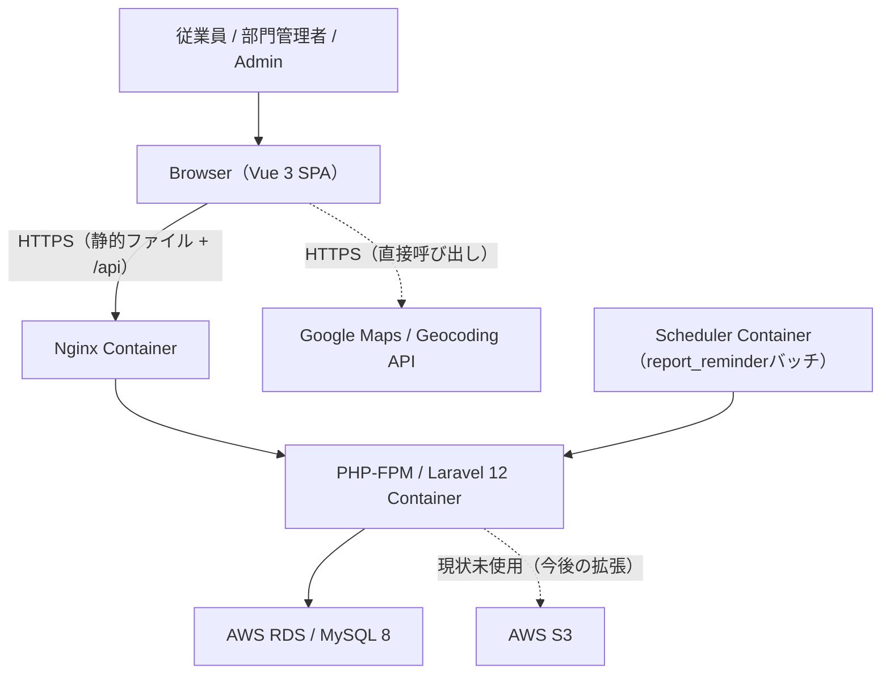
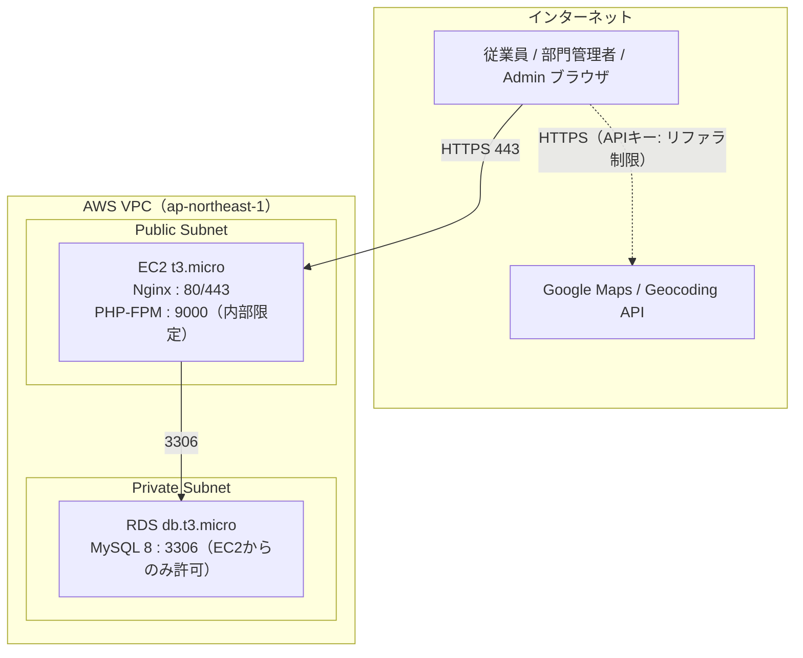

# 基本設計書

Disaster Safety Report System（防災安全報告システム）

---

# 文書管理情報

| 項目 | 内容 |
| --- | --- |
| システム名 | Disaster Safety Report System |
| 文書名 | 基本設計書 |
| 文書番号 | DSR-11 |
| 作成者 | Nguyen Minh Tri |
| 作成日 | 2026/07/23 |
| バージョン | 1.1 |
| ステータス | Draft |

---

# 改訂履歴

| Version | 日付 | 作成者 | 内容 |
| --- | --- | --- | --- |
| 0.0 | 2026/07/22 | Nguyen Minh Tri | スケルトン作成 |
| 1.0 | 2026/07/23 | Nguyen Minh Tri | 初版作成。外部設計の統合。画面×DBマッピングで`companies`が全画面から一度も書込・参照されないこと（ER-003の裏付け）、Policyクラスが2つで足りること（フラット3層ロールの帰結）を確定。 |
| 1.1 | 2026/07/23 | Nguyen Minh Tri | 設計監査（06_画面設計/10_API設計と連動）: 6.2節のSCR-004 WFモックアップが位置情報のない報告を地図にフォールバック表示する誤った例のままだったため、UI-007（位置情報未確定リスト）を反映した図に修正。 |

---

# 目次

1. 本書の目的
2. 設計範囲
3. システム構成
4. アプリケーション構成
5. 業務フロー概要
6. 画面設計概要
7. 機能設計概要
8. API設計概要
9. データ設計概要
10. 外部インターフェース一覧
11. ファイル一覧
12. 帳票レイアウト
13. 認証・認可設計
14. 業務処理設計
15. エラー・例外設計
16. ログ・監査設計
17. まとめ

---

# 1. 本書の目的

本書は、Disaster Safety Report Systemの外部設計（WHAT）を統合する。個別に確定済みの04_業務フロー〜10_API設計を横断的に束ね、それらに現れない統合レベルの設計 — システム構成、画面×DB処理マッピング、トランザクション境界 — を確定する。内部設計（HOW）は12_詳細設計書で定義する。

---

# 2. 設計範囲

## 2.1 In Scope

02_要件定義書 4.1節の対象業務（認証 / 組織マスタ管理 / 災害管理 / 安全報告 / 通知 / ダッシュボード / 地図表示）に対応する全設計。

## 2.2 Out Scope

02_要件定義書 18章と同一（マルチテナント・外部災害検知サービス連携・双方向チャット・オフライン対応（Bonus）・ネイティブアプリ・多言語UI・Adminによる自身の安全報告・安全報告の履歴管理）。

---

# 3. システム構成

## 3.1 全体構成



Google Maps/Geocoding APIは**フロントエンドのBrowserから直接呼び出す**（バックエンドを経由しない）。これは00_開発計画書 4章・10_API設計 6.5節で確定済みの構成であり、本書ではシステム構成図としてPMSのReverb（bonusのWebSocket）に相当する「バックエンドを介さない外部通信」として明示する。S3はコンポーネントとして存在するが、本スコープのFUNC一覧（07_機能一覧）にファイルアップロード機能が1つもないため、実際の読み書きは発生しない（13章「今後の拡張予定」の災害マニュアル添付機能のための予約）。

## 3.2 コンポーネント一覧

| コンポーネント | 役割 |
| --- | --- |
| Nginx | SPAビルド済み静的ファイルの配信 + `/api`のLaravelへのリバースプロキシ |
| Vue 3 SPA | フロントエンド（Vite build）。Google Maps JavaScript API/Geocoding APIをクライアントSDKとして直接呼び出す |
| PHP-FPM / Laravel 12 | REST API本体（Controller→FormRequest→Policy/Middleware→Service→Model） |
| MySQL 8 (RDS) | 永続データストア（7テーブル、09_テーブル定義） |
| S3 | 現状未使用。将来のファイル添付機能拡張用に予約（13章） |
| Scheduler | `report_reminder`バッチの定期実行（BR-NTF-004、間隔は12_詳細設計書で確定） |

## 3.3 ネットワーク構成図



| Security Group | 許可ポート | 許可元 |
| --- | --- | --- |
| Web SG（EC2） | 80, 443 | インターネット全体 |
| DB SG（RDS） | 3306 | Web SGのみ |

PMSと異なりWebSocket（Reverb）用のポートは存在しない（10_API設計 9章でポーリング方式を採用したため）。詳細は13_インフラ設計で定義する。

---

# 4. アプリケーション構成

## 4.1 レイヤー構成

Project 01〜03のController→Service→Model構成を踏襲する。PMSはメンバーシップ判定のためPolicy層を6クラス設けたが、本システムはフラット3層ロール（BR-PRM-001）のため、Policyが必要な箇所はごく限定的である（13章）。

| 層 | 責務 | 本システムでの要点 |
| --- | --- | --- |
| （FE）Views / Components | 画面描画・状態3態の表示 | デザイントークン（06_画面設計 2.1節）のみ使用 |
| （FE）Stores（Pinia） | 認証状態・通知未読数・ダッシュボード集計 | 30秒間隔ポーリング（10_API設計 9章） |
| （FE）API Client | fetchベースの共通クライアント + Google Maps SDK呼び出し | エラーエンベロープの一元ハンドリング、ジオコーディング失敗の握りつぶし（NFR-007） |
| （BE）Controller | 入出力の整形のみ（Thin） | ルートモデルバインディング |
| （BE）FormRequest | 形式バリデーション | `target_department_ids`の部署実在性検証（09_テーブル定義 11章-1） |
| （BE）Middleware | ロール判定（`role:admin`・`role:manager`） | 大半のAdmin専用API・部門管理者専用APIはこれのみで足りる |
| （BE）**Policy** | 対象データとの所有関係が絡む認可判定 | `SafetyReportPolicy`・`NotificationPolicy`の2クラスのみ（13章） |
| （BE）Service | 業務ロジック・トランザクション | 同報通知fan-out、安全報告upsert、催促バッチ抽出（14章） |
| （BE）Model | Eloquent・リレーション・スコープ | `scopeOwnDepartment`等（12_詳細設計書） |

## 4.2 ディレクトリ構成（概要）

```
Disaster_Safety_Report_System/
├── frontend/                 # Vue 3 SPA（Vite + TypeScript + Pinia）
│   └── src/{views, components, stores, composables, api, router}
├── backend/                  # Laravel 12 API
│   └── app/{Http/Controllers, Http/Requests, Policies, Services, Models, Console}
├── docker/                   # nginx / php
├── docker-compose.yml
└── docs/                     # 本設計文書一式
```

詳細ツリーは12_詳細設計書で確定する。

---

# 5. 業務フロー概要

AS-IS（電話連絡網 + Excel手集計）→ TO-BE（アプリ同報配信 + ダッシュボード集計）の全体像と、BF-001〜006の各フローは04_業務フローを正とする。本書では統合上の要点のみ再掲する。

| 観点 | 設計上の含意 |
| --- | --- |
| 1操作→N通知（fan-out） | 災害作成（API-014）が唯一のfan-out起点。1タスク1コメントごとに通知が発生するPMSとは異なり、本システムのfan-outは「災害イベント作成」という単一の管理操作に集約される |
| 安全報告は自己完結 | 提出・再報告（API-020）は他者への通知を一切発生させない（BR-NTF-003）。PMSの`task_assigned`/`task_commented`のような「他者への波及」がない、最も単純な業務処理 |
| ロールごとの視点の違い | 一般社員=自分の報告のみ、部門管理者=自部署の集計、Admin=全社の集計 + 災害管理、という3つの異なる粒度のデータを同じ`safety_reports`から導出する（9章） |

---

# 6. 画面設計概要

## 6.1 画面一覧・遷移

全11画面（SCR-001〜011）・ルートパス・ナビゲーションガード（G-01〜07）は05_画面遷移図、各画面の項目・状態3態は06_画面設計を正とする。

## 6.2 主要画面レイアウト（WF要約）

### SCR-003 安全報告フォーム（TOUI、モバイル最優先）

```
+--------------------------------------------------+
| ← 戻る          地震（2026/07/23 10:00発生）      |
+--------------------------------------------------+
| あなたの安否状況を選択してください                 |
|                                                    |
|   [   ✅ 安全です   ]   [  🆘 支援が必要です  ]    |  ← Report-CTA（大タップ領域）
|                                                    |
| コメント（任意）                                   |
| [                                              ]   |
|                                                    |
| 現在地（任意。取得できない場合も送信できます）      |
| [ 住所を入力 or 現在地を取得 ]  ⚠ 地図取得失敗時も送信可 |
|                                                    |
|              [        送信する        ]           |
+--------------------------------------------------+
```

### SCR-004 部署ダッシュボード（地図含む、OOUI寄り）

```
+--------------------------------------------------+
| Global Header: ロゴ | 通知(2) | ユーザーメニュー   |
+--------------------------------------------------+
| 営業部 ダッシュボード                              |
+--------------------------------------------------+
| 地震（進行中）  安全:10  要支援:2  未確認:1        |
+----------------------+-----------------------------+
| 要支援者一覧          | 地図（Safety-*トークンで色分け）|
|  🔴 佐藤花子 10:12    |   🔴📍 🟢📍 🟢📍 ⚪📍         |
|     「冠水しています」|   （緯度経度を持つ報告 + 未報告者の勤務地のみ、UI-007）|
|  🔴 田中次郎 10:20    |   （地図API障害時は隔離表示） |
|   位置情報：未確定    |                             |
+----------------------+-----------------------------+
```

田中次郎（位置情報：未確定）は地図にはピン表示しない — ジオコーディング/GPS失敗時に`locations`マスタの勤務地へフォールバック表示すると、実際とは異なる場所で被災しているかのように誤誘導するため（06_画面設計 UI-007、設計監査で発見。10_API設計 6.7節と連動）。両画面とも06_画面設計で確定したデザイントークン（Safety-safe/needs-help/unreported、Report-CTA）のみを使用する。詳細な状態バリエーション（Loading/Empty/Error）は06_画面設計を正とする。

## 6.3 画面×DB処理マッピング

C=作成 / R=参照 / U=更新 / D=削除（本システムに削除操作は存在しない、09_テーブル定義 TBL-POL-003）。

| 画面 | companies | departments | employees | locations | disasters | safety_reports | notifications |
| --- | --- | --- | --- | --- | --- | --- | --- |
| SCR-001 ログイン | - | - | R | - | - | - | - |
| SCR-002 ホーム | - | - | - | - | R | R（自分の分） | - |
| SCR-003 安全報告フォーム | - | - | - | - | R | C/U（upsert） | - |
| SCR-004 部署ダッシュボード | - | R（自部署名） | R | R（地図ピン） | R | R（自部署分） | - |
| SCR-005 全社ダッシュボード | - | R（全部署名） | R | R（地図ピン） | R | R（全社分） | - |
| SCR-006 災害管理 | - | R（対象部署選択） | - | - | C/R/U | - | C（副作用） |
| SCR-007 部署管理 | - | C/R/U | - | - | - | - | - |
| SCR-008 従業員管理 | - | R（部署選択） | C/R/U | R（拠点選択） | - | - | - |
| SCR-009 通知一覧 | - | - | - | - | R（type表示） | - | R/U（既読） |
| SCR-010 マイページ | - | - | R/U（パスワード） | - | - | - | - |
| SCR-011 災害詳細 | - | R | R（氏名） | - | R | R（スコープ別） | - |

**表から読み取れる設計上の含意**: ①`companies`はどの画面からも一度もC/R/U/Dされない — 08_ER図 ER-003（単一企業モデル、他テーブルとFK関係を持たない孤立ノード）が画面設計レベルでも裏付けられている。②`locations`は全画面を通じてRのみであり、C/U/Dする画面が1つも存在しない（08_ER図・09_テーブル定義の「UIからのCRUD機能を持たない」という判断の裏付け）。③`notifications`への書込（C）はSCR-006（災害作成）の副作用としてのみ発生し、ユーザーが直接作成する画面は存在しない（PMSと同型の構造だが、本システムはfan-out元がSCR-006の1箇所のみでPMSより単純）。

---

# 7. 機能設計概要

全19機能（FUNC-001〜019）・7分類は07_機能一覧を正とする。統合上の要点: System実行系2機能（FUNC-013 同報通知作成、FUNC-014 催促バッチ）は画面を持たないため、試験仕様書ではAPIの副作用・バッチの単位で検証する。FUNC-018（権限制御）・FUNC-019（操作ログ記録）は横断機能であり、13章・16章で設計を確定する。

---

# 8. API設計概要

REST 26本（API-001〜026）は10_API設計を正とする。統合上の要点:

| 方針 | 内容 |
| --- | --- |
| スコープ暗黙化 | 部署ダッシュボードは部署IDをURLに持たせない（API-POL-004） |
| 認可2段判定 | 認証→ロール（API-POL-005、13章） |
| 安全報告upsert | 提出・再報告を1本のPUTに統合、クライアントは初回/再報告を判定しない（API-POL-009） |
| リアルタイム | RESTのポーリングのみ。WebSocketは採用しない（10_API設計 9章） |

---

# 9. データ設計概要

## 9.1 テーブル概要

7テーブル（TBL-001〜007）・7リレーション。論理設計は08_ER図、物理設計（型・制約・インデックス・設計判断）は09_テーブル定義を正とする。

## 9.2 コード一覧（ENUM値）

全文書・実装・試験で以下の値に統一する（09_テーブル定義 7章と同一）:

| コード | 値 | 使用箇所 |
| --- | --- | --- |
| departments.status | active / inactive | 部署の無効化状態 |
| employees.role | admin / manager / staff | 3層フラットロール |
| employees.status | active / inactive | 従業員の無効化状態 |
| disasters.target_scope | all / specific | 対象範囲区分 |
| disasters.status | active / resolved | 災害の進行状態 |
| safety_reports.status | safe / needs_help | 安否ステータス（「未確認」はENUM値ではない） |
| notifications.type | disaster_alert / report_reminder | 通知2種 |

---

# 10. 外部インターフェース一覧

| IF | 方向 | プロトコル | 内容 |
| --- | --- | --- | --- |
| Google Maps JavaScript API | Browser → Google（バックエンド非経由） | HTTPS | 地図表示（SCR-004/005/011） |
| Google Geocoding API | Browser → Google（バックエンド非経由） | HTTPS | 住所→緯度経度変換（SCR-003、失敗時は位置情報なしで受理） |

PMSのS3・EC_SiteのStripeと異なり、本システムのバックエンド（Laravel）は一切の外部APIを呼び出さない。外部通信はすべてブラウザ（フロントエンド）からGoogle側への直接呼び出しであり、インバウンド連携（Webhook等）も存在しない。攻撃面はバックエンドの認証済みユーザーによる越権に集中するため、セキュリティ設計（14_セキュリティ設計）は部署スコープの防御（NFR-012）を中心に据える。

---

# 11. ファイル一覧

| 分類 | ファイル | 保存先 |
| --- | --- | --- |
| SPAビルド成果物 | `frontend/dist/*` | EC2（Nginx配信） |
| アプリケーションログ | laravel.log（操作ログ含む） | EC2（20_運用保守手順書でローテーション方針） |

添付ファイル・帳票出力・CSVエクスポート等のファイル生成機能は存在しない（07_機能一覧に該当FUNCなし）。S3は3.1節のとおり将来拡張用に予約されているのみで、現時点で本システムが生成・参照するファイルは上記2種のみである。

---

# 12. 帳票レイアウト

対象外（本システムに帳票はない）。

---

# 13. 認証・認可設計

## 13.1 認証

Sanctumトークン認証（有効期限8時間）。SPA側のトークン保管方式は14_セキュリティ設計で確定する。

## 13.2 認可（本システムの背骨）

判定の正は02_要件定義書 8章の権限マトリクス。大半の操作はロールのみで判定でき（Middleware `role:admin` / `role:manager`）、対象データとの所有関係まで見る必要がある箇所だけPolicyクラスを設ける。

| 判定方式 | 対象 | 内容 |
| --- | --- | --- |
| Middleware（`role:admin`） | 部署管理・従業員管理・災害管理（作成/編集/収束切替）・全社ダッシュボード | ロールのみで判定可能（PMSのforceArchiveと同じ「Policyを介さずMiddlewareのみで十分」なケース、11_基本設計書 13.2節の先例を踏襲） |
| Middleware（`role:manager`） | 部署ダッシュボード | ロールのみで判定可能。対象部署はトークンから導出するため所有関係チェックが不要（API-POL-004） |
| **SafetyReportPolicy** | safety_reports | `viewOwn`/`upsertOwn`=一般社員・部門管理者（Adminは不可、BR-PRM-003）、`viewList`は部門管理者なら自部署の従業員の行のみ・Adminなら全件（BR-PRM-002） |
| **NotificationPolicy** | notifications | `view`・`read`=受信者本人のみ（BR-NTF-005） |

PMSは6つのPolicyクラス（メンバーシップという中間層の判定が必要だったため）を要したが、本システムはPolicyが2クラスのみで足りる。これはBR-PRM-001（フラット3層ロール）が認可設計そのものを単純化することの直接的な証拠であり、02_要件定義書 3章の学習ポイントが本書で具体的な実装構造として裏付けられた形である。

非該当ロールへの応答はE002（8章権限マトリクスの「×」）、他人の通知IDのような所有権外アクセスはE007（4.3節、10_API設計）。実装位置は12_詳細設計書で確定する。

---

# 14. 業務処理設計

## 14.1 主要業務処理一覧

| 処理 | 内容 | 通知副作用 |
| --- | --- | --- |
| 災害イベント作成 | disasters作成 + 対象範囲確定 | `disaster_alert`を対象範囲の全従業員へfan-out（BR-NTF-001） |
| 災害収束切替 | disasters.status更新 | なし |
| 安全報告の提出・再報告 | safety_reportsのupsert（BR-RPT-002） | なし（BR-NTF-003） |
| 部署・従業員管理 | departments/employees書込 | なし |
| 通知既読化 | notifications.is_read/read_at更新 | なし |
| 未報告者への催促バッチ | 対象範囲の従業員のうち`safety_reports`未存在の者を抽出 | `report_reminder`（時間窓方式で重複防止、BR-NTF-004） |

## 14.2 トランザクション境界

| 処理 | トランザクション範囲 | 備考 |
| --- | --- | --- |
| 災害イベント作成 | disasters + notifications（fan-out全件） | 「作成されたのに通知が1件も飛ばない」を防ぐ。件数が多い場合の性能はNFR-001、Queue化の要否は12_詳細設計書で判断 |
| 安全報告のupsert | safety_reports単体 | 対象は常に1行（`UNIQUE(disaster_id, employee_id)`）のため複数行にまたがるロック戦略（PMSのAggregate Root Locking相当）は不要 — 本システムには兄弟レコード群を巻き込む並行処理上の懸念が構造的に存在しない |
| 催促バッチ | 1従業員=1通知作成トランザクション | 1件の失敗を波及させない（PMSのバッチと同一方針） |

**安全報告に並行処理上の複雑さがない理由（学習ポイント）**: PMS（カンバンのposition採番）やEC_Site（在庫ロック）は「兄弟レコード群」を対象とするため、空集合ロック時のギャップロックデッドロックやAggregate Root Lockingが必要だった。本システムの`safety_reports`は常に単一行（自分の分）へのUPSERTであり、他の従業員の行と競合する余地がない設計（BR-RPT-002）であるため、この種の並行処理設計が最初から不要になっている。12_詳細設計書ではこの点を明記し、不要な複雑さを持ち込まない。

---

# 15. エラー・例外設計

共通エンベロープ（10_API設計 3.3節）とエラーコード6種（E001/E002/E003/E006/E007/E010 — 02_要件定義書 16章）を全APIで統一する。例外クラスの設計（コードとの対応・render実装）は12_詳細設計書で定義する。

---

# 16. ログ・監査設計

| ログ | 内容 | 出力先 |
| --- | --- | --- |
| 操作ログ（監査） | 災害の作成・編集・収束切替、組織マスタ（部署・従業員）の変更操作の実行者・対象・日時（REQ-018） | アプリケーションログ（FUNC-019） |
| バッチ実行ログ | 催促バッチの処理件数・対象従業員数 | アプリケーションログ |
| エラーログ | 例外・バリデーション失敗 | アプリケーションログ |

専用の監査テーブルは設けない（PMSと同じ判断 — 将来対応候補、13章）。ローテーション・参照手順は20_運用保守手順書。

---

# 17. まとめ

外部設計を統合し、個別文書に現れなかった3つの統合判断を確定した: ①画面×DBマッピングにより`companies`が全画面から一度も操作されないこと・`locations`が常にR専用であることを可視化し、08_ER図/09_テーブル定義の設計判断を画面レベルで裏付けた。②認可設計がMiddleware中心（Policyは2クラスのみ）で完結すること — フラット3層ロール（BR-PRM-001）という業務構造の単純さが、実装アーキテクチャの単純さに直結する好例である。③安全報告のトランザクションには「兄弟レコード群」が存在せず、PMS/EC_Siteで必要だった並行処理対策（Aggregate Root Locking等）がそもそも不要であること。次工程の12_詳細設計書は、13章のPolicy 2クラスと14章の処理一覧を疑似コードレベルへ分解する。

---
