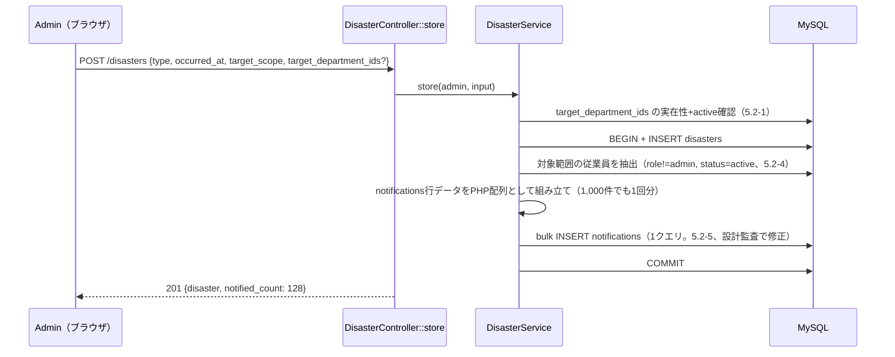
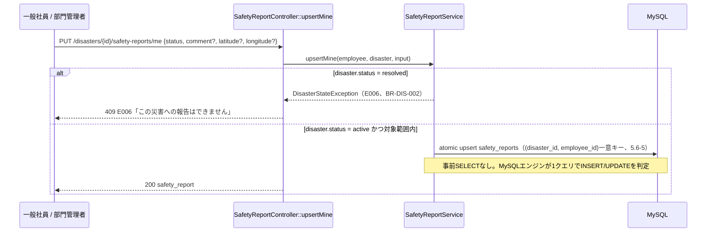

# 詳細設計書

Disaster Safety Report System（防災安全報告システム）

---

# 文書管理情報

| 項目 | 内容 |
| --- | --- |
| システム名 | Disaster Safety Report System |
| 文書名 | 詳細設計書 |
| 文書番号 | DSR-12 |
| 作成者 | Nguyen Minh Tri |
| 作成日 | 2026/07/23 |
| バージョン | 1.1 |
| ステータス | Draft |

---

# 改訂履歴

| Version | 日付 | 作成者 | 内容 |
| --- | --- | --- | --- |
| 0.0 | 2026/07/22 | Nguyen Minh Tri | スケルトン作成 |
| 1.0 | 2026/07/23 | Nguyen Minh Tri | 初版作成。Service疑似コード9本を確定。安全報告のupsertはUNIQUE違反フォールバック方式とし、PMS/EC_Siteのような悲観的ロック（Aggregate Root Locking）が不要であることを明記。 |
| 1.1 | 2026/07/23 | Nguyen Minh Tri | 設計監査で発見した3件の性能課題と1件の重大な業務リスクを修正。①5.2節-5（DisasterService::store）: 対象従業員へのnotifications作成がN件の逐次INSERTになっていたため、1,000人規模でNFR-001（60秒以内）を超えるリスクがあった — bulk insert（1クエリ）に変更。②5.4節-4（DashboardService）: 位置情報を持たない安否報告を`locations`マスタ（通常勤務地）へフォールバック表示していたため、`needs_help`報告がジオコーディング失敗時に実際とは異なる場所（オフィス）で被災しているかのように地図上に誤表示される欠陥があった — map_pins（緯度経度を持つ報告＋未報告者の勤務地のみ）とunlocated_reports（位置情報を持たない報告済みリスト）を分離（06_画面設計 v1.1 UI-007、10_API設計 v1.1と連動）。③5.6節-5（SafetyReportService::upsertMine）: 事前SELECT＋PHP側UNIQUE違反キャッチという実装だったが、Eloquentのatomic `upsert()`（`INSERT ... ON DUPLICATE KEY UPDATE`）に置き換え、DB往復とPHP例外処理のオーバーヘッドを削減。④5.9節-2-c（SendReportReminders）: 未報告者N人ごとに`SELECT EXISTS`を発行していたN+1クエリを、直近4時間分の通知済みIDを1回のクエリで取得しPHP側でメモリ照合する方式に変更。02_要件定義書・07_機能一覧・08/09/10/11は本修正による影響を受けない（Service層の実装詳細のみの変更）。 |

---

# 目次

1. 本書の目的
2. 詳細設計方針
3. ディレクトリ構成
4. Controller詳細設計
5. Service詳細設計（主要処理ロジック）
6. Model詳細設計
7. FormRequest詳細設計（Validation）
8. Middleware・Policy詳細設計（認可の実装）
9. フロントエンド詳細設計
10. シーケンス図（主要フロー）
11. トランザクション設計
12. 例外処理詳細設計
13. バッチ・スケジューラ方針
14. ログ出力詳細設計
15. トレーサビリティ
16. まとめ

---

# 1. 本書の目的

本書は11_基本設計書の外部設計を、実装可能な単位（Controller/Service/Policy/Model/FormRequest/Exception + フロントエンド構成）まで分解する。特に5章（Service疑似コード）と8章（認可の実装構造）は、コーディング時に最も参照頻度の高いセクションである。

---

# 2. 詳細設計方針

| 方針ID | 方針 | 内容 |
| --- | --- | --- |
| DD-POL-001 | Fat Service, Thin Controller | 業務ロジックはServiceに集約し、Controllerは認可呼び出しと入出力整形のみ行う（Project 01〜03と同一方針）。 |
| DD-POL-002 | 1業務=1トランザクション | 境界は11_基本設計書 14.2節の表を正とする。複数テーブル更新は必ず`DB::transaction()`。 |
| DD-POL-003 | 例外は業務ごとに1クラス | 業務エラーはカスタムExceptionとして定義し、`render()`で共通エンベロープ+HTTPステータスを返す（Project 02の`ApiException`基底パターンを踏襲）。 |
| DD-POL-004 | 認可の2段実装 | ロール（8章の大半）=Middleware`role:xxx`でE002、所有関係が絡む箇所（安全報告・通知）のみPolicyでE002/E006。11_基本設計書 13.2節の判断をそのまま実装に落とす。 |
| DD-POL-005 | 通知は業務と同一トランザクション | 通知レコード作成は呼び出し元トランザクション内（同報通知fan-out・催促バッチとも）。本システムはWebSocket broadcastを持たないため、PMSのafterCommit broadcast相当の考慮は不要（10_API設計 9章）。 |
| DD-POL-006 | 安全報告は悲観的ロック不要 | `safety_reports`は常に単一行（`UNIQUE(disaster_id, employee_id)`）へのUPSERTであり、兄弟レコード群を巻き込まないため、PMS（カンバンposition）・EC_Site（在庫）のようなAggregate Root Lockingは不要。並行書込の競合はUNIQUE制約違反からのフォールバックで吸収する（5.5節）。 |
| DD-POL-007 | FEはポーリングで最新化 | ダッシュボード・未読件数は30秒間隔ポーリング（10_API設計 9章）。WebSocket/楽観的更新のロールバック機構は本システムには不要 — 安全報告フォームの送信はサーバー応答を待って完了表示する単純な同期UIで足りる。 |

---

# 3. ディレクトリ構成

```
Disaster_Safety_Report_System/
├── frontend/                          # Vue 3 SPA
│   └── src/
│       ├── api/                       # fetchベース共通クライアント + リソース別API関数
│       │   ├── client.ts              # エンベロープ解釈・E010→ログイン誘導の一元化
│       │   └── {auth,departments,employees,disasters,safetyReports,notifications,dashboard}.ts
│       ├── stores/                    # Pinia
│       │   ├── auth.ts                # トークン・ロール・G-01/02の状態源
│       │   ├── notifications.ts       # 未読件数・一覧（30秒ポーリング）
│       │   └── dashboard.ts           # 部署/全社集計（30秒ポーリング）
│       ├── composables/
│       │   ├── useGoogleMaps.ts       # Maps/Geocoding APIラッパー（失敗時はnullを返しUIをブロックしない、NFR-007）
│       │   └── useApiError.ts         # E00x→画面表示（06_画面設計 7章の文言）
│       ├── router/
│       │   ├── index.ts               # 11ルート（05_画面遷移図 2章）
│       │   └── guards.ts              # G-01〜G-06（G-07は送信操作のガード）
│       ├── views/                     # SCR-001〜011に1:1対応
│       └── components/
│           ├── report/                # StatusSelectButton, LocationPicker（SCR-003）
│           ├── dashboard/              # SummaryCard, MapPanel（SCR-004/005）
│           └── common/                # AppHeader, NotificationDropdown, 状態3態部品
├── backend/                           # Laravel 12 API
│   ├── app/
│   │   ├── Http/
│   │   │   ├── Controllers/
│   │   │   │   ├── Auth/AuthController.php
│   │   │   │   ├── DepartmentController.php
│   │   │   │   ├── EmployeeController.php
│   │   │   │   ├── DisasterController.php
│   │   │   │   ├── SafetyReportController.php
│   │   │   │   ├── NotificationController.php
│   │   │   │   └── DashboardController.php
│   │   │   ├── Requests/{Auth, Department, Employee, Disaster, SafetyReport}/...
│   │   │   └── Middleware/EnsureRole.php        # role:admin / role:manager（Project 01のEnsureRole流用）
│   │   ├── Policies/
│   │   │   ├── SafetyReportPolicy.php           # viewOwn/upsertOwn/viewList
│   │   │   └── NotificationPolicy.php           # view/read
│   │   ├── Services/
│   │   │   ├── AuthService.php
│   │   │   ├── DepartmentService.php
│   │   │   ├── EmployeeService.php
│   │   │   ├── DisasterService.php              # store（fan-out含む）/ update / updateStatus（5.2〜5.4）
│   │   │   ├── SafetyReportService.php          # listForDisaster / findMine / upsertMine（5.5〜5.7）
│   │   │   ├── NotificationService.php          # fan-out共通（5.8）
│   │   │   └── DashboardService.php             # departmentSummary / companySummary
│   │   ├── Models/{Company, Department, Employee, Location, Disaster, SafetyReport, Notification}.php
│   │   ├── Exceptions/
│   │   │   ├── ApiException.php                 # 基底（code/httpStatus/render）
│   │   │   ├── ResourceNotFoundException.php    # E007
│   │   │   └── DisasterStateException.php       # E006（BR-DIS-002 / BR-RPT-004）
│   │   └── Console/Commands/SendReportReminders.php   # BR-NTF-004バッチ（5.9）
│   ├── routes/{api.php, console.php}
│   └── tests/{Unit, Feature}/
├── docker/{nginx, php}/
├── docker-compose.yml
└── docs/
```

**注**: PMSにあった`Reverb`コンテナ・`channels.php`・楽観的更新の巻き戻しロジックは本システムには存在しない（10_API設計 9章でポーリング方式を採用したため）。S3も現時点でどのServiceからも呼び出されない（11_基本設計書 3.1節）。

---

# 4. Controller詳細設計

| Controller | 主なメソッド | 対応API |
| --- | --- | --- |
| Auth\AuthController | login, logout, me, updatePassword | API-001〜004 |
| DepartmentController | index, store, update, updateStatus | API-005〜008 |
| EmployeeController | index, store, update, updateStatus | API-009〜012 |
| DisasterController | index, store, show, update, updateStatus | API-013〜017 |
| SafetyReportController | index, showMine, upsertMine | API-018〜020 |
| NotificationController | index, unreadCount, markRead, markAllRead | API-021〜024 |
| DashboardController | department, company | API-025〜026 |

Controllerの標準形（DD-POL-001/004）: `authorize()`（Policy対象のみ）→ `Service呼び出し` → `エンベロープ整形`の3行構成を守り、業務分岐を持たない。department/employee/disasterの各Controllerは`authorize()`を呼ばず、ルート自体に`role:admin`Middlewareを適用する（8章）。

---

# 5. Service詳細設計（主要処理ロジック）

## 5.1 DepartmentService::store / update / updateStatus

```text
store 入力: {name}
1. departments を status=active で作成
戻り値: department

update 入力: department, {name}
1. departments を更新
戻り値: department

updateStatus 入力: department, {status}
1. departments.status を更新（無効化された部署は5.2 DisasterService::storeの対象部署選択肢から除外されるが、
   既存employees.department_idの参照自体は維持する — 09_テーブル定義 4.2節）
```

EmployeeServiceも同型（store/update/updateStatus）のためコードは省略する。作成/編集時、`password`はハッシュ化して`password_hash`へ保存する（`role`/`status`/`password_hash`は`$fillable`から除外し、Service層から明示的に代入する — 14_セキュリティ設計で詳述）。

## 5.2 DisasterService::store（BR-DIS-001 / BR-NTF-001、本システムの核心）

```text
入力: admin, {type, occurred_at, target_scope, target_department_ids?}
1. target_scope=specific の場合: target_department_ids の全件が departments に実在し
   status=active であることを確認する → 違反があれば E003（09_テーブル定義 11章-1）
2. トランザクション開始
3. disasters を status=active で作成
4. 対象範囲の従業員を抽出する（5.2-a、DashboardServiceでも同一ロジックを再利用）:
   target_scope=all → employees.status=active AND role IN (staff, manager) の全件
   target_scope=specific → 4に加え department_id IN (target_department_ids)
   ※role=adminの従業員は対象に含めない（BR-PRM-003、Adminは報告対象外）
5. 抽出した従業員全員分の notifications 行データ（employee_id, disaster_id=disaster.id,
   type=disaster_alert, is_read=false, created_at=now）を配列として組み立て、
   1回のbulk insert（Eloquentの`insert()`）でまとめて書き込む。
   ※本人除外の判定は不要（BR-NTF-003 — 本人操作起点の通知が存在しないシステム）
   ※従業員をループして`create()`をN回呼ぶ実装は採用しない — N件のINSERT文を逐次発行すると
   ネットワーク往復とロック保持時間がNに比例して増え、1,000人規模でHTTPタイムアウト
   （NFR-001: 60秒以内）を超えるリスクがある（設計監査で発見）。対象人数が数千人規模に
   達する場合は500〜1,000件単位でchunkし、複数回のbulk insertに分割する
   （1回のクエリに含める行数の上限を超えないため）
6. コミット
戻り値: disaster（4で抽出した件数をnotified_countとして含む、10_API設計 6.4節）
```

件数が多い場合（NFR-001: 1,000人・60秒以内）にステップ5のbulk insertでも性能を満たせない規模に達した場合、同期処理からQueue化するかは実装時に負荷試験（17_システム試験仕様書）で判断する。bulk insert化とQueue化は独立した対策であり、Queue化してもジョブ内で同じbulk insertロジックを呼ぶだけでよい。

## 5.3 DisasterService::update / updateStatus（BR-DIS-002 / 003）

```text
update 入力: disaster, {type, occurred_at, target_scope, target_department_ids?}
1. store と同じ部署実在性検証（5.2-1）
2. disasters を更新（target_scope変更時、追加で対象になった従業員への再通知は行わない —
   本スコープでは「対象範囲の事後変更に伴う追加通知」はOut Scope、13章で将来検討）

updateStatus 入力: disaster, {status}
1. disasters.status を更新（active→resolved、または取り消しでresolved→active、BR-DIS-002）
   ※収束済みへの新規安全報告拒否は5.6（SafetyReportService::upsertMine）側でチェックする
```

## 5.4 DashboardService::departmentSummary / companySummary（FUNC-015〜017）

```text
departmentSummary 入力: manager（トークンから解決。department_idはパラメータで受け取らない — API-POL-004）
1. manager.department_id を対象部署として固定
2. 進行中の災害（status=active）ごとに、5.2-4と同じ抽出ロジックで対象範囲に
   当該部署が含まれるものだけを対象にする
3. 各災害について、対象部署の従業員数・safety_reportsの行数（status別）から
   safe / needs_help / unreported を算出（unreportedは導出値、BR-RPT-001）
4. 地図ピン用データ（map_pins）と位置情報未確定リスト（unlocated_reports）を分けて組み立てる
   （10_API設計 6.7節v1.1、設計監査で修正 — UI-007）:
   a. safety_reports のうち latitude/longitude を持つ行 → map_pins へ
      { employee_id, status（safe/needs_help のまま）, latitude, longitude, source: safety_report }
   b. 未報告（対象範囲の従業員のうち safety_reports 未存在）の者 → その employee.location_id から
      locations を引き、存在すれば map_pins へ { status: unreported, source: location } として追加
      （location_id が null の場合はピンなし。BR-RPT-001の「未確認」導出と整合）
   c. safety_reports は存在するが latitude/longitude を持たない行（ジオコーディング/GPS失敗、
      NFR-007で受理済み） → **map_pinsへは絶対に追加しない**。代わりに unlocated_reports へ
      { employee_id, status, comment, reported_at } として追加する。
      理由: bのフォールバック（locations＝通常勤務地）は「まだ報告していない人が本来いる場所」
      という参考情報として意味を持つが、cは「実際に被災し申告した人」であり、
      勤務地へのフォールバックは実際の被災地と異なる場所を救助対象として示す誤誘導になる
      （設計監査で発見。10_API設計 6.7節に詳細）
戻り値: { department, active_disasters, map_pins, unlocated_reports }

companySummary 入力: admin
1. 進行中の災害ごとに全社の集計（3と同じ算出、対象範囲は全部署）
2. 部署ごとの内訳（by_department）を同じロジックで部署単位に算出
3. map_pins / unlocated_reports は4のa〜cと同一ロジックを全部署分に適用
戻り値: { company_summary, by_department, map_pins, unlocated_reports }
```

departmentSummaryとcompanySummaryは対象範囲（自部署のみ/全部署）が異なるだけで集計ロジックは共通のため、実装では`SafetyReportService::summarize(disaster, departmentScope)`のような共通メソッドに切り出す（12.1節のリファクタリング方針、実装時に確定）。

## 5.5 SafetyReportService::listForDisaster（8章権限マトリクス）

```text
入力: viewer（employee）, disaster
1. viewer.role=admin → 対象範囲の全従業員の報告を返す
2. viewer.role=manager → 対象範囲かつ viewer.department_id と一致する従業員の報告のみ返す
   （BR-PRM-002。部署IDをパラメータで受け取らず、常にviewer自身のdepartment_idで絞る点が
   DashboardServiceと同じ設計思想 — API-POL-004）
3. viewer.role=staff → このメソッドは呼ばれない（自分の分はfindMineを使う、8章「一般社員は自分の分のみ」）
戻り値: { summary: {safe, needs_help, unreported}, reports: [...] }（10_API設計 6.5節と同一形状）
```

## 5.6 SafetyReportService::upsertMine（BR-RPT-002、本システムの実装核心）

```text
入力: employee, disaster, {status, comment?, address_text?, latitude?, longitude?}
1. employee.role=admin なら E002（BR-PRM-003、Adminは報告対象外 — Policyで事前拒否済みだが
   Service側でも二重に確認する）
2. disaster.status=active であることを確認 → 違えば E006（BR-DIS-002）
3. disaster の対象範囲に employee.department_id が含まれることを確認
   （target_scope=allなら常にtrue、specificならtarget_department_idsに含まれるか）→ 違えばE006（BR-RPT-004）
4. latitude/longitudeは両方存在するか両方省略するかを確認 → 片方のみの送信はE003
   （09_テーブル定義 8章のCHECK制約と同じ整合性をアプリ層でも検証する）
5. safety_reports へ (disaster_id, employee_id) を一意キーとする**atomic upsert**を1回発行する
   （Eloquentの`upsert()`メソッド — MySQLの`INSERT ... ON DUPLICATE KEY UPDATE`を利用）:
   upsert対象列: disaster_id, employee_id, status, comment, address_text, latitude, longitude,
   reported_at=now / 重複時の更新列: status, comment, address_text, latitude, longitude,
   reported_at, updated_at
   ※既存行の有無を事前にSELECTで確認する必要がない。2つのリクエストがほぼ同時に初回送信しても、
   MySQLエンジン自身が一意キー競合をロックして直列に処理するため、PHP側でUNIQUE違反を
   キャッチしてリトライするような分岐は不要（設計監査で修正 — v1.0の「SELECT→INSERT/UPDATE
   分岐＋UNIQUE違反キャッチ」は2回のDB往復とPHP例外処理のオーバーヘッドを伴っていた）
戻り値: safety_report（upsert後に (disaster_id, employee_id) で再取得）
```

**並行処理設計上の注記**: PMS（カンバンのposition採番）やEC_Site（在庫の増減）は「兄弟レコード群」を対象とするため、空集合への同時アクセス時のギャップロックデッドロックが起こり得、Aggregate Root Lockingのような悲観的ロックが必要だった（09_テーブル定義 11章-1相当）。本処理は常に単一行（`UNIQUE(disaster_id, employee_id)`で特定される自分の行）が対象であり、他の従業員の行と競合する余地が構造的に存在しない。そのためアプリ層でのロックは元より不要であり、atomic upsertを使えば「INSERTかUPDATEかの判定」自体もDBエンジンに委譲でき、PHP側の分岐・例外処理も一切不要になる — 11_基本設計書 14.2節で述べた設計判断（悲観的ロック不要）を、より単純な実装（1クエリのatomic upsert）でさらに徹底したものである。

## 5.7 SafetyReportService::findMine（FUNC-009/010のフォーム初期表示用）

```text
入力: employee, disaster
1. safety_reports を (disaster_id=disaster.id, employee_id=employee.id) で検索
戻り値: 存在すればその行、なければ null（10_API設計 6.5節: dataがnullで返る）
```

## 5.8 NotificationService::notify（fan-out共通）

```text
入力: type（disaster_alert | report_reminder）, employee, disaster
1. notifications を作成:
   employee_id=employee.id, disaster_id=disaster.id, type, is_read=false
   ※呼び出し元のトランザクション内で実行（DD-POL-005）。本システムに`task_title`
   （PMS）のようなスナップショット列は不要 — disasterは削除されないため、
   表示時に都度JOINで`disasters.type`等を取得すればよい（08_ER図 ER-006）
```

## 5.9 SendReportReminders（バッチ、BR-NTF-004）

```text
（Schedulerから定期実行。間隔は02_要件定義書 9.5節の目安（3〜6時間）を採用し、本書で4時間に確定）
1. 進行中の災害（disasters.status=active）を全件抽出
2. 各災害について:
   a. 5.2-4と同じロジックで対象範囲の従業員を抽出する
   b. そのうち safety_reports に該当行がまだ存在しない者を抽出する
      （BR-NTF-002の「未報告」判定そのもの。「未報告」という条件自体が時間とともに
      自然に変化する — 従業員が報告すればその時点で次回抽出から自動的に外れる）
   c. 当該災害への report_reminder のうち直近4時間以内に作成されたもの**全件**を
      1回のクエリでまとめて取得し、`employee_id`の集合（PHPの配列/セット）としてメモリに保持する
      （時間窓方式、BR-NTF-004）。bで抽出した未報告者をこの集合と照合し（PHP側の`in_array`相当、
      O(1)のハッシュ照合）、含まれる者を対象から除外する。**未報告者N人ごとに`SELECT EXISTS`を
      N回発行する実装は採用しない**— バッチ対象人数が多い場合にクエリ発行数がNに比例して増加し、
      スケジューラの実行時間が線形に悪化する（設計監査で発見）。永続フラグを使わない理由は
      変更なし — 「未報告」自体が時間経過だけでは変わらない条件のため、フラグ方式では
      PMSのtask_due_soonと同じ「リセットトリガーが必要になる」問題を抱え込まずに済む
      （02_要件定義書 9.5節で確定済みの判断をそのまま実装する）
   d. cで残った対象者へ1従業員=1トランザクションで
      NotificationService::notify(report_reminder, employee, disaster)
   e. 失敗はログに記録して次の従業員へ継続（1件の失敗を波及させない、PMSのバッチと同一方針）
```

---

# 6. Model詳細設計

| Model | 主なリレーション | 主なスコープ・アクセサ |
| --- | --- | --- |
| Company | なし（08_ER図 ER-003、孤立エンティティ） | - |
| Department | hasMany(Employee) | scopeActive |
| Employee | belongsTo(Department), belongsTo(Location, nullable), hasMany(SafetyReport), hasMany(Notification), hasMany(Disaster, foreignKey:created_by) | scopeActive, scopeInDepartment(id) |
| Location | hasMany(Employee) | - |
| Disaster | belongsTo(Employee, created_by), hasMany(SafetyReport), hasMany(Notification) | scopeActiveStatus（status=active） |
| SafetyReport | belongsTo(Disaster), belongsTo(Employee) | scopeForDisaster(disaster) |
| Notification | belongsTo(Employee), belongsTo(Disaster) | scopeOwnedBy(employee), scopeUnread |

キャスト方針: enum列はstringのまま、`is_read`はboolean、`target_department_ids`はarray（Laravelの`json` cast）、日時はdatetime。金額列は存在しない（EC_Siteとの差分）。

---

# 7. FormRequest詳細設計（Validation）

| FormRequest | 対象API | 主なルール |
| --- | --- | --- |
| LoginRequest | API-001 | email required/email、password required |
| UpdatePasswordRequest | API-004 | current_password required、new_password required/min:8/max:20 |
| StoreDepartmentRequest / UpdateDepartmentRequest | API-006 / 007 | name required/max:100 |
| UpdateStatusRequest（部署共通） | API-008 | status required/in:active,inactive |
| StoreEmployeeRequest / UpdateEmployeeRequest | API-010 / 011 | department_id required/exists:departments,id、location_id nullable/exists:locations,id、name required/max:100、name_kana nullable/max:100、email required/email/max:255/unique、password required（作成時）/nullable（編集時）/min:8/max:20、role required/in:admin,manager,staff |
| UpdateStatusRequest（従業員共通） | API-012 | status required/in:active,inactive |
| StoreDisasterRequest / UpdateDisasterRequest | API-014 / 016 | type required/max:50、occurred_at required/date、target_scope required/in:all,specific、target_department_ids required_if:target_scope,specific/array/min:1（実在性+active判定は09_テーブル定義 11章-1に従いDisasterServiceで行う、5.2-1） |
| UpdateDisasterStatusRequest | API-017 | status required/in:active,resolved |
| UpsertSafetyReportRequest | API-020 | status required/in:safe,needs_help、comment nullable/max:500、address_text nullable/max:200、latitude/longitude nullable/numeric（両方存在・両方省略の整合性はSafetyReportServiceで判定、5.6-4） |

Project 01〜03の方針を踏襲: 「形式チェック」はFormRequest、「DBの現在値に依存する判定」（部署の実在性+active、災害の状態、対象範囲の判定）はServiceで行う。

---

# 8. Middleware・Policy詳細設計（認可の実装）

**DD-POL-004の実装構造 — 11_基本設計書 13.2節の判定方式をそのまま実装に落とす:**

| 層 | 判定 | 不成立時 | 実装 |
| --- | --- | --- | --- |
| Middleware `auth:sanctum` | 認証 | E010 | 全認証必須ルート |
| Middleware `role:admin` | Admin確認 | E002 | 部署/従業員/災害の作成・編集・状態変更、全社ダッシュボード |
| Middleware `role:manager` | 部門管理者確認 | E002 | 部署ダッシュボード（対象部署はコントローラ内でトークンから解決、パラメータを受け取らない） |
| **SafetyReportPolicy** | 所有関係の判定 | E002 / E006 | 下表 |
| **NotificationPolicy** | 所有関係の判定 | E007 | 下表 |

## Policyメソッド一覧

| Policy | メソッド | 判定（true条件） |
| --- | --- | --- |
| SafetyReportPolicy | viewOwn / upsertOwn | `employee.role != admin`（BR-PRM-003） |
| SafetyReportPolicy | viewList | `employee.role in (admin, manager)`（一般社員はfindMineのみ使用、8章） |
| NotificationPolicy | view / read | `notification.employee_id == employee.id`（BR-NTF-005） |

**存在秘匿の適用範囲について**: PMSはメンバーシップ外への応答をE007（存在秘匿、PMS 02_要件定義書のBR-PRM-006）へ変換する構造を持っていたが、DSRにはこれに相当するルールID（BR-PRM-005/006等）は定義されていない（02_要件定義書 9.1節はBR-PRM-001〜004まで）。本システムでは部署スコープの防御がAPI-POL-004（URLに部署IDを持たせない設計）によって「入力経路自体をなくす」形で実現されているため、Policy拒否をE007へ変換するケースは通知の所有権チェック（BR-NTF-005）のみに限定される（4.3節、10_API設計）。

---

# 9. フロントエンド詳細設計

## 9.1 ルーターガード（G-01〜07の実装位置）

| ガード | 実装 |
| --- | --- |
| G-01（要認証） | `router.beforeEach`: auth store未認証→`/login?redirect=元URL`（SCR-003への通知直リンクもこの経路で復帰） |
| G-02（認証済みの逆流） | `/login`: 認証済みならロール別ランディングへ |
| G-03（Admin） | route metaで`requiresAdmin`、非Adminはホームへ |
| G-04（部門管理者） | route metaで`requiresManager` |
| G-05（安全報告フォーム） | フロントでは表示可否のみ判定（role=admin時は非表示）。対象範囲外・収束済みはAPI応答（E006）起点で誘導 |
| G-06（災害詳細） | 存在しないdisasterIdはAPI応答（E007）起点で一覧へ戻す |
| G-07（位置情報入力） | `useGoogleMaps`がGeocoding失敗時にnullを返し、フォームの送信ボタンは常に活性のまま維持する（NFR-007） |

## 9.2 stores設計

| store | 状態 | 要点 |
| --- | --- | --- |
| auth | token, employee（role/department_id含む） | ロール別ランディングの判定源（05_画面遷移図 2章） |
| notifications | unreadCount, items | 30秒ポーリング（10_API設計 9章）。WebSocket・楽観的更新は存在しない |
| dashboard | summary, mapPins | 部署/全社ダッシュボード表示中のみ30秒ポーリング（非表示画面遷移時は停止） |

## 9.3 API Client

- 全応答をエンベロープ（success/error）で解釈し、`error.code`をそのまま`useApiError`へ渡す
- E010受信時はauth storeをクリアして`/login?redirect=...`へ
- multipartは使用しない（API-POL-002、ファイルアップロード機能なし）

---

# 10. シーケンス図（主要フロー）

## 10.1 災害イベント作成 → 同報通知fan-out（正常系）



## 10.2 安全報告の提出・再報告（正常系 + 異常系: 収束済み災害）



---

# 11. トランザクション設計

11_基本設計書 14.2節の境界表を正とし、本書で具体化する:

| 処理 | トランザクション範囲 | ロック | 備考 |
| --- | --- | --- | --- |
| DisasterService::store | disasters + notifications（fan-out全件） | なし | 「作成されたのに通知が1件も飛ばない」を防ぐ。件数が多い場合のQueue化は実装時判断（5.2） |
| SafetyReportService::upsertMine | safety_reports単体 | なし（UNIQUE制約 + フォールバックで十分、DD-POL-006） | 兄弟レコード群が存在しないため悲観的ロック不要（5.6） |
| SendReportReminders | 1従業員=1トランザクション | なし | 1件の失敗を波及させない（5.9） |
| その他（部署/従業員/災害の書込） | 単一テーブル1行更新 | なし | 複数テーブルにまたがらない単純な書込 |

---

# 12. 例外処理詳細設計

| Exception | エラーコード | HTTPステータス | 発生元 |
| --- | --- | --- | --- |
| ResourceNotFoundException（ModelNotFound変換含む） | E007 | 404 | ルートモデルバインディング、NotificationPolicy拒否の変換 |
| DisasterStateException | E006 | 409 | SafetyReportService（5.6-2/3、BR-DIS-002 / BR-RPT-004） |
| AuthorizationException（Laravel標準→変換） | E002 | 403 | SafetyReportPolicy拒否・`role:admin`/`role:manager`Middleware |
| ValidationException（Laravel標準→変換） | E003 | 422 | FormRequest、DisasterService内の部署実在性検証（5.2-1） |
| AuthenticationException（Laravel標準→変換） | E010 | 401 | auth:sanctum |

フレームワーク標準例外（下3行）は`bootstrap/app.php`の`withExceptions`で共通エンベロープへ変換する（Project 02〜03と同一パターン）。

---

# 13. バッチ・スケジューラ方針

| バッチ | 実行頻度 | 内容 |
| --- | --- | --- |
| SendReportReminders | 4時間ごと（Laravel Scheduler、withoutOverlapping） | BR-NTF-004の未報告者催促（5.9）。間隔は02_要件定義書 9.5節の目安（3〜6時間）から本書で確定 |

Reverb・Queueワーカーは本システムには存在しない（10_API設計 9章）。Schedulerコンテナ1つで足りる（11_基本設計書 3.2節）。

---

# 14. ログ出力詳細設計

| ログ | 内容 | 出力先 |
| --- | --- | --- |
| 操作ログ（監査、FUNC-019） | 災害の作成・編集・収束切替、部署・従業員の変更操作の実行者・対象・日時 | アプリケーションログ（専用チャンネル`audit`） |
| バッチ実行ログ | SendReportRemindersの処理件数・対象従業員数・失敗件数 | アプリケーションログ |
| エラーログ | 例外・バリデーション失敗 | アプリケーションログ |

---

# 15. トレーサビリティ

| Controller | 対応API | 関連FUNC | 関連REQ |
| --- | --- | --- | --- |
| Auth\AuthController | API-001〜004 | FUNC-001〜003 | REQ-001〜003 / 017 |
| DepartmentController | API-005〜008 | FUNC-004 | REQ-004 |
| EmployeeController | API-009〜012 | FUNC-005 | REQ-005 |
| DisasterController | API-013〜017 | FUNC-006〜008 | REQ-006〜008 |
| SafetyReportController | API-018〜020 | FUNC-009 / 010 | REQ-009 / 010 |
| NotificationController | API-021〜024 | FUNC-011 / 012 | REQ-013 |
| DashboardController | API-025 / 026 | FUNC-015〜017 | REQ-014〜016 |
| NotificationService（fan-out副作用） | -（副作用） | FUNC-013 | REQ-011 |
| SendReportReminders（バッチ） | -（Scheduler） | FUNC-014 | REQ-012 |
| Middleware / Policy | -（横断） | FUNC-018 | REQ-003 |
| auditチャンネル | -（横断） | FUNC-019 | REQ-018 |

---

# 16. まとめ

本書の中心は4点である。①**DisasterService::store**（5.2） — 対象範囲確定・通知fan-out・件数返却を1つのトランザクションに統合した、本システムで唯一のfan-out処理。v1.1でN件の逐次INSERTをbulk insert 1回へ改めた（設計監査で発見。NFR-001の60秒制約に対する具体的な実装対策）。②**SafetyReportService::upsertMine**（5.6） — 「兄弟レコード群が存在しない」という本システム固有の構造的特徴により、PMS/EC_Siteで必須だったAggregate Root Lockingが不要であることを示した。v1.1ではさらに、事前SELECT＋PHP側UNIQUE違反キャッチという方式からatomic upsert（1クエリでDBエンジンに判定を委譲）へ改め、ロック不要という設計判断をより単純な実装で徹底した。③**DashboardService::departmentSummary/companySummary**（5.4） — v1.1で発見した重大な業務リスクを修正: 位置情報のない安否報告を通常勤務地へフォールバック表示すると、実際とは異なる場所で被災しているかのように誤誘導する。map_pinsとunlocated_reportsを明確に分離し、「実データがない箇所を推測で補って表示しない」という原則を具体的な疑似コードとして確定した。④**認可がMiddleware中心で完結する構造**（8章） — Policyクラスは2つのみで、11_基本設計書 13.2節の判断がそのまま実装に反映されている。実装時は必ず本書の疑似コードとBR-ID（02_要件定義書 9章）を突き合わせながら進めること。

---
