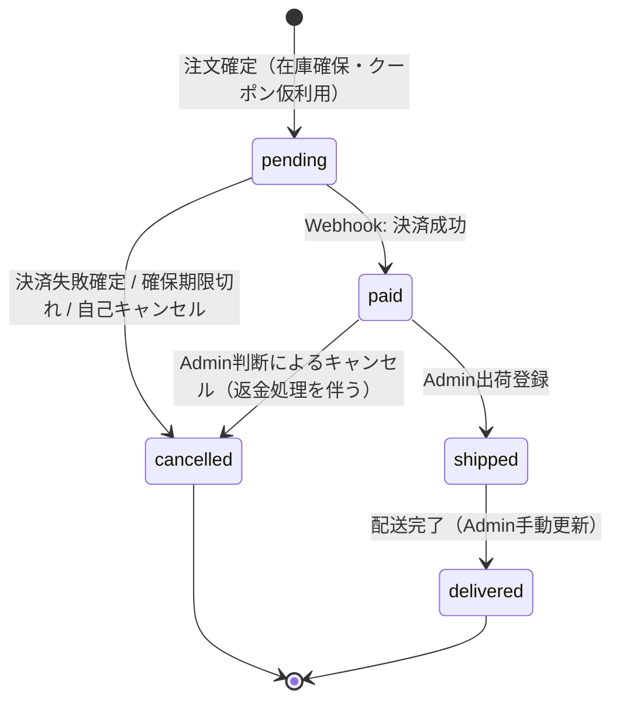
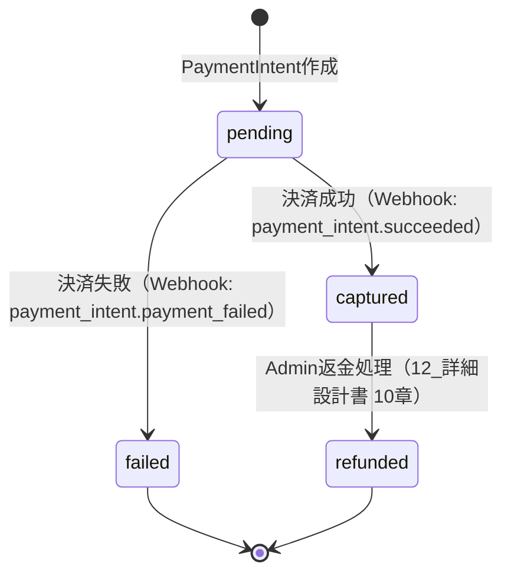
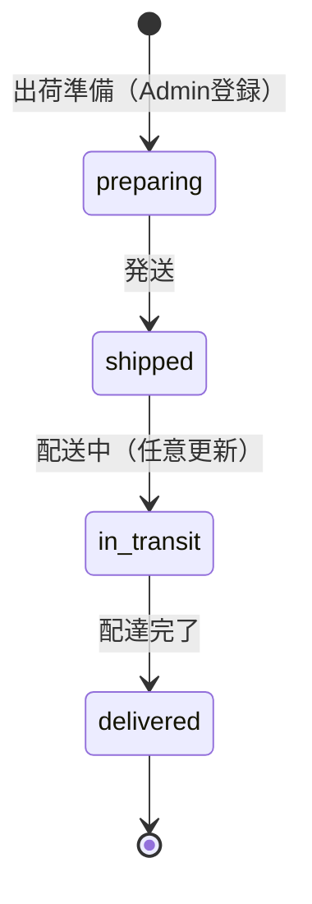

# 要件定義書

EC Site（ECサイト構築プロジェクト）

---

# 文書管理情報

| 項目    | 内容             |
| ----- | -------------- |
| システム名 | EC Site        |
| 文書名   | 要件定義書          |
| 文書番号  | EC-002         |
| 作成者   | Nguyen Minh Tri |
| 作成日   | 2026/07/13     |
| バージョン | 1.5            |
| ステータス | Draft          |

---

# 改訂履歴

| Version | 日付         | 作成者             | 内容   |
| ------- | ---------- | --------------- | ---- |
| 1.0     | 2026/07/13 | Nguyen Minh Tri | 初版作成 |
| 1.1     | 2026/07/14 | Nguyen Minh Tri | 6章の受入条件を8件→全27件（REQ-001〜027）に拡充。コーディング開始前の完成度100%化のため。 |
| 1.2     | 2026/07/16 | Nguyen Minh Tri | 13章（画面要件）が他ドキュメントへの参照1文のみだった箇所に、全20画面の画面一覧表を直接記載。 |
| 1.3     | 2026/07/16 | Nguyen Minh Tri | 18章（開発対象外）が「同一」参照のみだった箇所に、対象外6項目を直接記載。 |
| 1.4     | 2026/07/17 | Nguyen Minh Tri | 16章エラー要件にE011（重複操作エラー）を追加。6章REQ-016および10_API設計7章と整合させるため。 |
| 1.5     | 2026/07/22 | Nguyen Minh Tri | 設計監査で発見: クーポン割引適用時、`tax_total`が割引前`subtotal`に対して計算されていた（消費税法上、割引後の実売上額に対して計算すべき）。BR-TAX-005（割引の行別按分・按分後課税）を追加。あわせてBR-PAY-004（grand_total ¥0/¥50未満時のStripeバイパス、discount_totalの人為的水増しは禁止）を追加。09_テーブル定義（order_items.line_discount, payments.bypass_reason）・12_詳細設計書 5.2と連動。 |

---

# 目次

1. 要件定義の目的
2. システム概要
3. 対象ユーザー
4. 業務範囲
5. 機能要件
6. 要件別受入条件
7. 非機能要件
8. 権限要件
9. 業務ルール
10. 状態遷移
11. データ要件
12. データバリデーションルール
13. 画面要件
14. 外部インターフェース要件
15. セキュリティ要件
16. エラー要件
17. 運用・保守要件
18. 開発対象外
19. 受入条件
20. 用語定義
21. まとめ

---

# 1. 要件定義の目的

本書は、EC Site が「何を実現しなければならないか（WHAT）」を明確化し、以降の基本設計・詳細設計・API設計・テスト仕様の唯一の判断根拠とする。特に本プロジェクトの学習目的である「トランザクション」「決済」「在庫」「複雑なDB設計」に関わる業務ルール（9章）は、実装時に最も参照頻度の高いセクションとなる。

---

# 2. システム概要

単一事業者が運営する B2C 汎用ECサイト。会員登録した消費者（Customer）が商品カタログを閲覧し、カートに追加し、注文・決済（Stripe Sandbox）を行う。管理者（Admin）は商品・在庫・注文・クーポンを一元管理する。マーケットプレイス（複数出品者）ではない。

---

# 3. 対象ユーザー

| ユーザー種別 | 説明 |
|---|---|
| Guest | 未ログイン状態。商品閲覧のみ可能 |
| Customer | 会員登録済みの一般消費者。カート・注文・レビュー投稿が可能 |
| Admin | 事業者側スタッフ。商品/在庫/注文/クーポンを管理 |

---

# 4. 業務範囲

## 4.1 対象業務

- 会員登録・認証
- 商品カタログ管理（カテゴリ、バリエーション、画像）
- カート〜注文〜決済〜出荷までの購買フロー
- 在庫管理（確保・引き当て・解放）
- クーポンによる割引
- レビュー投稿
- 売上・在庫レポート

## 4.2 対象外業務

- 複数出品者が出品するマーケットプレイス運営
- 定期購入（サブスクリプション）課金
- 実配送業者APIとのリアルタイム連携
- ポイント／会員ランク制度
- 多言語対応・多通貨対応

---

# 5. 機能要件

## 5.1 機能要件一覧

| 要件ID | 機能名 | 対象ユーザー | 優先度 | 内容 |
| --- | --- | --- | --- | --- |
| REQ-001 | 会員登録 | Guest | Must | Guestはメールアドレス・パスワード・氏名で会員登録できる。 |
| REQ-002 | ログイン | Customer / Admin | Must | メールアドレスとパスワードでログインできる。 |
| REQ-003 | ログアウト | Customer / Admin | Must | ログイン中のユーザーはログアウトできる。 |
| REQ-004 | 権限制御 | Guest / Customer / Admin | Must | ユーザー種別に応じて利用可能な画面・操作を制御する。 |
| REQ-005 | 商品一覧閲覧 | Guest / Customer | Must | カテゴリ別・キーワードで商品一覧を閲覧できる。 |
| REQ-006 | 商品詳細閲覧 | Guest / Customer | Must | 商品詳細（画像・説明・バリエーション別価格/在庫）を閲覧できる。 |
| REQ-007 | 商品検索・絞込 | Guest / Customer | Should | キーワード・カテゴリ・価格帯で商品を絞り込める。 |
| REQ-008 | カート追加 | Customer | Must | バリエーションと数量を指定してカートに追加できる。 |
| REQ-009 | カート編集 | Customer | Must | カート内商品の数量変更・削除ができる。 |
| REQ-010 | 配送先住所管理 | Customer | Must | 配送先住所を登録・選択できる。 |
| REQ-011 | クーポン適用 | Customer | Should | 注文時にクーポンコードを適用できる。 |
| REQ-012 | 注文確定 | Customer | Must | カート内容を確定し、注文（pending）を作成できる。 |
| REQ-013 | 決済 | Customer | Must | Stripe Sandboxを用いてクレジットカード決済を行える。 |
| REQ-014 | 注文履歴確認 | Customer | Must | 自分の注文履歴を確認できる。 |
| REQ-015 | 注文詳細・配送状況確認 | Customer | Must | 注文詳細と配送ステータスを確認できる。 |
| REQ-016 | レビュー投稿 | Customer | Should | 購入済み商品にレビュー（評価＋コメント）を投稿できる。 |
| REQ-017 | パスワード変更 | Customer / Admin | Should | 自分のパスワードを変更できる。 |
| REQ-018 | 商品管理 | Admin | Must | 商品の登録・編集・無効化ができる。 |
| REQ-019 | カテゴリ管理 | Admin | Must | カテゴリの登録・編集・無効化ができる。 |
| REQ-020 | バリエーション管理 | Admin | Must | 商品バリエーション（SKU・価格）の登録・編集ができる。 |
| REQ-021 | 商品画像管理 | Admin | Should | 商品画像のアップロード（S3）・並び替えができる。 |
| REQ-022 | 在庫調整 | Admin | Must | 在庫数の手動調整（入荷・棚卸補正）ができる。 |
| REQ-023 | 注文管理 | Admin | Must | 注文一覧の確認、ステータス変更ができる。 |
| REQ-024 | 出荷登録 | Admin | Must | 注文の出荷情報（配送業者・追跡番号）を登録できる。 |
| REQ-025 | クーポン管理 | Admin | Should | クーポンの発行・条件設定・無効化ができる。 |
| REQ-026 | 売上・在庫レポート閲覧 | Admin | Should | 月別売上、在庫僅少商品などのレポートを閲覧できる。 |
| REQ-027 | 操作ログ記録 | System | Should | 在庫・注文・クーポンに関わる重要操作のログを記録する。 |

## 5.2 優先度定義

| 優先度 | 意味 |
| --- | --- |
| Must | 初期リリースに必須の要件 |
| Should | 初期リリースで実装したい要件 |
| Could | 余裕があれば実装する要件 |
| Won't | 初期リリースでは実装しない要件 |

---

# 6. 要件別受入条件

全27件のREQ-IDについて受入条件を定義する。優先度Mustの要件を優先して詳細化し、初版（v1.0）では8件のみ記載していたが、コーディング開始前の完成度100%化のため全件を記載する（改訂履歴参照）。

| 要件ID | Given | When | Then |
| --- | --- | --- | --- |
| REQ-001 | Guestが未登録のメールアドレスを持っている | 氏名・メールアドレス・パスワードを入力して会員登録する | usersがrole=customer、status=activeで新規作成され、自動的にログイン状態になる。同一メールアドレスが既に存在する場合はE003 |
| REQ-002 | 登録済みかつstatus=activeの会員である | 正しいメールアドレス・パスワードでログインする | 認証トークンが発行され、以後のAPIリクエストで認証済みユーザーとして扱われる。不一致の場合はE001（BR-USR-001によりstatus=inactiveの会員は成功しない） |
| REQ-003 | ログイン中である | ログアウトする | 認証トークンが無効化され、以後同じトークンでのAPIアクセスは401（E010）になる |
| REQ-004 | Customerとしてログイン中である | Admin専用画面・APIにアクセスを試みる | 403エラー（E002）が返され、操作は拒否される |
| REQ-005 | 商品が複数カテゴリにわたって登録されている | カテゴリを指定して商品一覧を開く | 該当カテゴリのstatus=active商品のみが一覧表示される（inactiveの商品は表示されない） |
| REQ-006 | 商品にバリエーションが複数登録されている | 商品詳細画面を開く | バリエーションごとの価格・在庫状況（inventories.quantity_available）が表示される |
| REQ-007 | 商品カタログに複数の商品が存在する | キーワード・カテゴリ・価格帯を指定して検索する | 条件に一致するstatus=active商品のみ一覧表示される |
| REQ-008 | Customerがログイン済みで対象バリエーションの在庫が1以上ある | カートに追加する | cart_itemsに数量が保存され、在庫はまだ減算されない |
| REQ-009 | カートに商品が入っている | 数量を変更する、または削除する | cart_itemsが更新され、削除した場合は行が消える（在庫はまだ変更されない、BR-INV-002） |
| REQ-010 | ログイン中である | 新しい配送先住所を登録する | addressesに保存され、注文確認画面（SCR-006）で選択できるようになる |
| REQ-011 | 有効なクーポンコードと条件を満たす注文内容がある | クーポンコードを入力し検証する | 割引額が計算され注文確認画面に反映される。条件不成立の場合はE005（BR-CPN-001） |
| REQ-012 | Customerのカートに1件以上商品がある | 注文を確定する | ordersがstatus=pendingで作成され、order_itemsに商品名・単価・税率がスナップショットされ、在庫がquantity_reservedへ振り替わる |
| REQ-013 | 注文がpending状態で決済画面を開いている | Stripeで決済を完了する | Webhook受信後にorders.statusがpaidに更新され、在庫が正式に引き当てられる（inventory_logsに記録） |
| REQ-014 | Customerがログイン済みである | 注文履歴画面を開く | 自分の注文のみ一覧表示される（他会員の注文は表示されない） |
| REQ-015 | 自分の注文が存在する | 注文詳細画面を開く | 注文明細（スナップショット）と配送ステータス（shipments.status）が表示される |
| REQ-016 | Customerが対象商品を含む注文がdelivered状態である | レビューを投稿する | reviewsに保存され、同一order_itemに対する2回目の投稿は拒否される（E011、BR-REV-002） |
| REQ-017 | ログイン中で現在のパスワードを知っている | 現在のパスワードと新しいパスワードを入力して変更する | password_hashが更新され、以後は新しいパスワードでのみログインできる。現在のパスワードが誤っていればE003 |
| REQ-018 | Adminとしてログイン中である | 商品を新規登録する | productsに保存され、Customer向け一覧にはstatus=activeの場合のみ表示される |
| REQ-019 | Adminとしてログイン中である | カテゴリを登録・編集する | categoriesが更新され、商品登録画面のカテゴリ選択肢に反映される |
| REQ-020 | 商品が登録済みである | サイズ・色・SKU・価格を指定してバリエーションを登録する | product_variantsに保存され、同時にinventoriesの初期レコード（quantity_available=0）が自動作成される |
| REQ-021 | 商品が登録済みである | 画像をアップロードする | S3に保存されproduct_imagesにURLが記録され、表示順・主画像フラグを設定できる |
| REQ-022 | Adminがログイン済みである | 在庫数を手動調整する | inventoriesが更新され、inventory_logsにchange_type=adjustmentで記録される |
| REQ-023 | Adminがログイン済みで対象注文がpaid状態である | ステータスをshippedに変更する | orders.statusがshippedに更新され、shipmentsが作成される |
| REQ-024 | 対象注文がpaid状態である | 配送業者・追跡番号を入力し出荷登録する | shipmentsが作成され、orders.statusがshippedに更新される（BR-ORD-001）。paid以外の状態から実行するとE006 |
| REQ-025 | Adminがログイン済みである | クーポンを発行する | couponsにcode・discount_type・有効期間が保存される |
| REQ-026 | Adminとしてログイン中である | 対象月を指定してレポート画面を開く | 月別売上合計・カテゴリ別売上トップ5・在庫僅少商品が集計表示される |
| REQ-027 | 在庫調整・注文ステータス変更・クーポン発行のいずれかが実行される | 当該操作が完了する | inventory_logsまたはアプリケーションログに実行者・操作内容・日時が記録される（14_セキュリティ設計14.1節） |

---

# 7. 非機能要件

## 7.1 Performance

| 要件ID | 項目 | 要件 |
| --- | --- | --- |
| NFR-001 | Response Time | 商品一覧・検索は2秒以内の応答を目標とする。 |
| NFR-002 | Concurrent Users | 初期リリースでは同時接続100ユーザー程度を想定する。 |
| NFR-003 | 決済API応答 | Stripe API呼び出しは5秒以内に完了し、タイムアウト時はエラー表示のうえ再試行可能とする。 |
| NFR-004 | 同時注文の在庫整合性 | 同一バリエーションへの100並列注文でも在庫数がマイナスにならないこと。 |

## 7.2 Availability

| 要件ID | 項目 | 要件 |
| --- | --- | --- |
| NFR-005 | Uptime | 学習用途のため明確なSLA保証は対象外とするが、開発・デモ時間帯は安定稼働を目標とする。 |
| NFR-006 | RTO | 障害発生時は24時間以内の復旧を目標とする。 |
| NFR-007 | RPO（決済・注文データ） | 決済・注文・在庫データは0（トランザクションによりコミット単位でのみ確定、部分更新を許さない）。 |
| NFR-008 | RPO（その他データ） | 商品・レビュー等は最大1日以内のデータ損失を許容する。 |

## 7.3 Scalability

| 要件ID | 項目 | 要件 |
| --- | --- | --- |
| NFR-009 | Horizontal | Webサーバー（PHP-FPM）は将来的に複数台構成へ拡張できる設計とする（セッションレス＝Sanctumトークン方式）。 |
| NFR-010 | Vertical | RDSインスタンスタイプ変更で性能向上できる構成とする。 |
| NFR-011 | Read Scaling | 商品一覧など読み取りが多い処理はRedisキャッシュ（bonus）で負荷分散できる構成とする。 |

## 7.4 Security

| 要件ID | 項目 | 要件 |
| --- | --- | --- |
| NFR-012 | Authentication | 会員登録・ログインを必須とし、パスワードはハッシュ化して保存する。 |
| NFR-013 | Authorization | Guest/Customer/Adminの権限に応じてAPIアクセスを制御する。 |
| NFR-014 | PCI DSS Scope | クレジットカード番号は自社サーバーで保持・通過させず、Stripeの決済フォーム（トークン化）に委譲する（SAQ-A相当のスコープに収める）。 |
| NFR-015 | Encryption | 通信は全面HTTPS化する。 |
| NFR-016 | Audit | 在庫・注文・クーポンの重要操作を操作ログとして記録する。 |
| NFR-017 | Webhook検証 | Stripe Webhookは署名検証（Stripe-Signatureヘッダ）を行い、なりすましリクエストを拒否する。 |

## 7.5 Maintainability

| 要件ID | 項目 | 要件 |
| --- | --- | --- |
| NFR-018 | Logging | エラーログ、決済ログ、在庫変動ログを確認できるようにする。 |
| NFR-019 | Monitoring | CPU/Memory/Disk/DB/決済失敗率の監視を将来対応できる構成とする。 |
| NFR-020 | CI/CD | GitHub Actionsによる自動テスト・デプロイを行う。 |

## 7.6 Usability

| 要件ID | 項目 | 要件 |
| --- | --- | --- |
| NFR-021 | Mobile Support | Tailwind CSSによるレスポンシブ対応を必須とする（実消費者の主要導線がスマートフォンであるため、Project 01と異なりPC限定にしない）。 |
| NFR-022 | Accessibility | 基本的な視認性・操作性（コントラスト、フォームのラベル付け）を確保する。 |
| NFR-023 | Multi Language | 初期リリースでは日本語UIのみとする。 |

---

# 8. 権限要件

| 機能 | Guest | Customer | Admin |
| --- | --- | --- | --- |
| 商品一覧・詳細閲覧 | 〇 | 〇 | 〇 |
| 会員登録 | 〇 | - | - |
| ログイン / ログアウト | - | 〇 | 〇 |
| カート操作 | × | 〇 | × |
| 注文確定・決済 | × | 〇 | × |
| 自分の注文履歴・詳細確認 | × | 〇 | × |
| レビュー投稿 | × | 〇（購入済み商品のみ） | × |
| 商品/カテゴリ/バリエーション管理 | × | × | 〇 |
| 在庫調整 | × | × | 〇 |
| 全注文の確認・ステータス変更・出荷登録 | × | × | 〇 |
| クーポン管理 | × | × | 〇 |
| 売上・在庫レポート閲覧 | × | × | 〇 |

---

# 9. 業務ルール

本プロジェクトの学習目的（トランザクション・決済・在庫・複雑なDB設計）の核心となるセクション。実装時は必ずこの章を参照する。

## 9.1 注文・スナップショット

| ルールID | ルール | 内容 |
| --- | --- | --- |
| BR-ORD-001 | 注文ステータス遷移 | `pending → paid → shipped → delivered` の順、または `pending / paid → cancelled` のみ許可する。それ以外の遷移（例: shipped→pending）はアプリ層で拒否し、DB側もCHECK制約で許容値を限定する。 |
| BR-ORD-002 | 価格スナップショット | 注文確定時、`order_items` に `product_name` `variant_label` `sku` `unit_price` `tax_rate` を確定値としてコピー保存する。以後 `products` / `product_variants` の価格・名称変更は、既存の `order_items` に一切影響しない。 |
| BR-ORD-003 | 住所スナップショット | 注文確定時、選択した配送先住所の内容を `orders` に確定値としてコピー保存する。`addresses` はあくまで会員の「住所帳」であり、後から編集・削除されても過去注文の配送先表示は変わらない。 |

## 9.2 税率

| ルールID | ルール | 内容 |
| --- | --- | --- |
| BR-TAX-001 | 税区分 | 商品は `products.tax_category` で `standard`（標準税率10%）または `reduced`（軽減税率8%、食品等）のいずれかを持つ。 |
| BR-TAX-002 | 税額のスナップショット | 注文確定時点の税率を `order_items.tax_rate` に確定値として記録する（消費税率の将来改定が過去注文に遡及しないため）。 |
| BR-TAX-003 | 金額の型 | JPYは小数を持たない通貨のため、すべての金額列は INTEGER（円単位）で保持する。DECIMALは使用しない。 |
| BR-TAX-004 | 端数処理 | `line_tax = FLOOR(line_subtotal * tax_rate)` とし、円未満は切り捨てる（国税庁の一般的な運用に合わせる）。 |
| BR-TAX-005 | 割引適用時の課税標準 | クーポン割引（BR-CPN-002）は「販売時点の値引き」に当たるため、消費税は割引後の実売上額に対して計算する。注文全体の `discount_total` を各行の `line_subtotal` 比で按分し（`line_discount = FLOOR(discount_total × line_subtotal / subtotal)`、端数は最終行に加算）、`line_tax = FLOOR((line_subtotal - line_discount) × tax_rate)` とする。`line_tax`は`line_subtotal`（割引前）に対してではなく、必ず按分後の`line_subtotal - line_discount`に対して計算する。 |

## 9.3 在庫（2段階制御）

**設計判断**: 在庫を「いつ減らすか」は EC 設計における典型的なトレードオフである。カート追加時点で減らすと機会損失（他人がカートに入れただけの商品を買えない）が起き、注文確定時点で初めて減らすと決済中に売り切れる可能性がある。本システムは実務で広く使われる **「注文時に確保 (reserve)、決済確定で引き当て確定 (commit)」の2段階制御**を採用する。

| ルールID | ルール | 内容 |
| --- | --- | --- |
| BR-INV-001 | 在庫の一元管理 | 在庫は `products` / `product_variants` に持たせず、`inventories(variant_id, quantity_available, quantity_reserved)` で一元管理する。 |
| BR-INV-002 | カート追加時は減算しない | カートへの追加時点では在庫を変更しない（在庫チェックは「表示上の警告」のみ）。 |
| BR-INV-003 | 注文確定時に確保 | 注文確定（`orders.status=pending` 作成）時、`quantity_available -= 数量` / `quantity_reserved += 数量` を同一トランザクションで実行する。在庫不足の場合は注文確定自体を失敗させる。 |
| BR-INV-004 | 決済確定時に引き当て確定 | 決済成功（`orders.status=paid`）時、`quantity_reserved -= 数量` し、`inventory_logs` に `change_type=purchase_deduct` で記録する（`quantity_available` は既にBR-INV-003で減算済みのため再度は変更しない）。 |
| BR-INV-005 | キャンセル・決済失敗時は解放 | 注文キャンセルまたは決済失敗時、`quantity_reserved -= 数量` / `quantity_available += 数量` に戻し、`inventory_logs` に `change_type=release` で記録する。 |
| BR-INV-006 | 確保の有効期限 | 在庫確保（pending状態）の保持期限は30分とする。期限を超えても決済が完了しないpending注文は、スケジューラが自動的に`cancelled`とし在庫・クーポン利用を解放する（詳細は 13_インフラ設計書のバッチ方針を参照）。 |
| BR-INV-007 | 排他制御 | 同時に複数の注文が同一バリエーションの在庫を奪い合う場合に備え、在庫更新は `SELECT ... FOR UPDATE` による悲観的ロックの上でトランザクション実行する。 |
| BR-INV-008 | 在庫調整 | Admin による手動調整（入荷・棚卸補正）は `quantity_available` を直接増減し、`inventory_logs` に `change_type=adjustment` で記録する。 |

## 9.4 クーポン

| ルールID | ルール | 内容 |
| --- | --- | --- |
| BR-CPN-001 | 適用条件 | 有効期間内（`valid_from` 〜 `valid_to`）、`min_purchase_amount` 以上、`used_count < usage_limit` の場合のみ適用可能。 |
| BR-CPN-002 | 割引種別 | `discount_type` は `fixed`（固定額）または `percent`（割合）。割引額は税抜合計（`subtotal`）に対して計算する。 |
| BR-CPN-003 | 利用数のカウント | 在庫と同じ「仮押さえ→確定/解放」パターンを踏襲する。注文確定（pending作成）時に `used_count += 1`、キャンセル・確保期限切れ時に `used_count -= 1` する。 |
| BR-CPN-004 | 1注文1クーポン | 1つの注文に適用できるクーポンは最大1件とする。 |

## 9.5 決済

| ルールID | ルール | 内容 |
| --- | --- | --- |
| BR-PAY-001 | Webhook起点の確定 | `orders.status` および `payments.status` の更新は、フロントエンドの決済成功コールバックではなく、Stripe Webhook の受信をもって行う（フロントの改ざん・通信断に耐性を持たせるため）。 |
| BR-PAY-002 | 決済失敗時の扱い | 決済失敗は「注文キャンセル」と区別する。`payments.status=failed` とし、`orders.status` は `pending` のまま維持して再決済を許可する（在庫確保もBR-INV-006の期限内であれば維持）。 |
| BR-PAY-003 | 冪等性 | Stripe Webhook は同一イベントが複数回配信され得るため、`payments.stripe_payment_intent_id` を一意キーとして二重処理を防止する。 |
| BR-PAY-004 | Stripe決済のバイパス | `grand_total` が¥0、またはStripeのJPY最小課金額（¥50）未満の場合、Stripeを呼び出さず`payments`を`status=captured`・`bypass_reason`（`zero_amount`／`below_minimum`）付きで即時作成する。`discount_total`は実際のクーポン計算値（BR-CPN-002）のまま保持し、¥0に到達させるための人為的な割引額の水増しは行わない（会計データの正確性・クーポン悪用防止のため）。バイパス時も在庫引き当て確定（BR-INV-004相当の処理）は通常の決済成功時と同じロジックを共有する。 |

## 9.6 レビュー・アカウント

| ルールID | ルール | 内容 |
| --- | --- | --- |
| BR-REV-001 | 購入済み限定 | レビューは、対象商品を含む `order_items` が存在し、かつ当該注文が `delivered` 状態の会員のみ投稿できる（Verified Purchase方式）。 |
| BR-REV-002 | 重複投稿防止 | `reviews.order_item_id` にUNIQUE制約を設け、1回の購入（1商品×1注文）につきレビューは1件のみとする。 |
| BR-USR-001 | 無効化会員 | 退会・無効化（`status=inactive`）された会員はログインできない。 |

---

# 10. 状態遷移

## 10.1 orders 状態遷移

| 状態 | 説明 | 変更可能者 |
| --- | --- | --- |
| pending | 注文確定・在庫確保済み、決済待ち | System（決済結果） / Customer（自己キャンセル） |
| paid | 決済確定・在庫引き当て確定 | System（Webhook） |
| shipped | 出荷済み | Admin |
| delivered | 配送完了 | Admin |
| cancelled | キャンセル済み（在庫・クーポン解放済み） | System / Admin |

## 10.2 payments 状態遷移

本システムはStripe PaymentIntentの自動キャプチャモード（`capture_method=automatic`）を採用する（12_詳細設計書5.5節）。そのため与信確保と売上確定はStripe側で1回のAPI往復に統合され、自社DBには`authorized`という中間状態を永続化しない。`authorized`はENUMの値としては残すが、これは将来的に不正利用対策として手動キャプチャ（与信確保後にAdminが確認してから確定）へ切り替える拡張余地として予約する（本スコープでは未使用）。

## 10.3 shipments 状態遷移

---

# 11. データ要件

## 11.1 管理対象データ

| データ | 説明 | 主な項目 |
| --- | --- | --- |
| users | 会員・管理者情報 | 氏名、メール、パスワード、ロール、状態 |
| addresses | 会員の配送先住所帳 | 郵便番号、都道府県、市区町村、番地、電話番号 |
| categories | 商品カテゴリ | カテゴリ名、親カテゴリ |
| products | 商品基本情報 | 商品名、説明、カテゴリ、税区分、状態 |
| product_variants | 商品バリエーション（SKU） | サイズ・色、価格、SKUコード |
| product_images | 商品画像 | 画像URL（S3）、表示順、主画像フラグ |
| inventories | 在庫 | 利用可能数、確保数 |
| inventory_logs | 在庫変動履歴 | 変動種別、変動数、残数、参照元 |
| carts / cart_items | カート | 会員、バリエーション、数量 |
| orders | 注文 | 注文番号、状態、金額内訳、配送先スナップショット |
| order_items | 注文明細（スナップショット） | 商品名、単価、税率、数量、行合計 |
| payments | 決済 | 決済方法、状態、金額、Stripe参照ID |
| shipments | 出荷・配送 | 配送業者、追跡番号、状態 |
| coupons | クーポン | コード、割引種別、有効期間、利用上限 |
| reviews | レビュー | 評価、コメント、購入紐付け |

## 11.2 データ保持

| データ | 保持方針 |
| --- | --- |
| 注文・注文明細・決済 | 会計・監査目的で永続保持する（削除しない）。 |
| 在庫変動履歴 | 棚卸・原因調査のため一定期間保持する。 |
| カート | 未確定カートは一定期間（例: 30日）で `abandoned` に遷移させ、分析用途に保持する。 |
| レビュー | 商品ページ表示のため保持する。不適切投稿はAdminが非表示にできる（削除は行わず論理無効化）。 |

---

# 12. データバリデーションルール

| 対象 | 項目 | ルール |
| --- | --- | --- |
| users | email | Required / Email Format / Max 255 / Unique |
| users | password | Required / 8〜20 chars / Hash保存 |
| users | name | Required / Max 100 |
| addresses | postal_code | Required / Format `NNN-NNNN` |
| addresses | prefecture | Required / 47都道府県のいずれか |
| products | name | Required / Max 200 |
| products | tax_category | Required / `standard`, `reduced` のいずれか |
| product_variants | sku | Required / Unique / Max 50 |
| product_variants | price | Required / Integer / 0以上 |
| inventories | quantity_available | Required / Integer / 0以上 |
| cart_items | quantity | Required / Integer / 1以上 |
| orders | status | Required / `pending,paid,shipped,delivered,cancelled` のいずれか |
| order_items | unit_price / tax_rate | Required（注文確定時にSystemが設定、ユーザー入力不可） |
| payments | payment_method | Required / `credit_card,bank_transfer` のいずれか |
| coupons | code | Required / Unique / Max 30 |
| coupons | discount_type | Required / `fixed,percent` のいずれか |
| reviews | rating | Required / Integer / 1〜5 |
| reviews | comment | Max 1000 |

---

# 13. 画面要件

Guest向け（商品一覧・詳細）、Customer向け（カート・注文・マイページ）、Admin向け（管理画面）の3系統、全20画面。OOUI（対象物＝商品/注文を選んでから操作する方式）を採用する。Customer向け12画面はProgressive Login方式（未ログインでも一覧・詳細閲覧可）、Admin向け8画面は全画面認証必須。

| 画面ID | 画面名 | 対象ユーザー |
| --- | --- | --- |
| SCR-001 | ログイン画面 | Customer / Admin |
| SCR-002 | 会員登録画面 | Guest |
| SCR-003 | 商品一覧画面 | Guest / Customer |
| SCR-004 | 商品詳細画面 | Guest / Customer |
| SCR-005 | カート画面 | Customer |
| SCR-006 | 注文確認画面 | Customer |
| SCR-007 | 決済画面 | Customer |
| SCR-008 | 注文完了画面 | Customer |
| SCR-009 | 注文履歴一覧画面 | Customer |
| SCR-010 | 注文詳細画面 | Customer |
| SCR-011 | レビュー投稿画面 | Customer |
| SCR-012 | マイページ | Customer |
| SCR-013 | 管理者ダッシュボード | Admin |
| SCR-014 | 商品管理画面 | Admin |
| SCR-015 | カテゴリ管理画面 | Admin |
| SCR-016 | バリエーション・画像管理画面 | Admin |
| SCR-017 | 在庫管理画面 | Admin |
| SCR-018 | 注文管理画面 | Admin |
| SCR-019 | クーポン管理画面 | Admin |
| SCR-020 | レポート画面 | Admin |

画面遷移・条件付き遷移は05_画面遷移図、各画面のレイアウト・表示項目は06_画面設計を参照。

---

# 14. 外部インターフェース要件

| 外部サービス | 用途 | 連携方式 |
| --- | --- | --- |
| Stripe Sandbox | クレジットカード決済 | PaymentIntent API + Webhook |
| AWS S3 | 商品画像保存 | Laravel Filesystem（s3ドライバ） |
| Redis（bonus） | 商品一覧キャッシュ | Laravel Cache |

---

# 15. セキュリティ要件

7.4節（非機能要件 Security）を参照。加えて、決済関連の詳細は 14_セキュリティ設計 に記載する。

---

# 16. エラー要件

| エラーコード | 内容 | HTTPステータス |
| --- | --- | --- |
| E001 | ログイン失敗 | 401 |
| E002 | 権限エラー | 403 |
| E003 | バリデーションエラー | 422 |
| E004 | 在庫不足 | 409 |
| E005 | クーポン適用条件不成立 | 409 |
| E006 | 注文ステータス不正遷移 | 409 |
| E007 | 対象データ未検出 | 404 |
| E008 | 決済失敗 | 402 |
| E009 | Webhook署名検証失敗 | 400 |
| E010 | 未認証 | 401 |
| E011 | 重複操作エラー（同一資源への重複投稿・重複登録。REQ-016のレビュー重複投稿など） | 409 |

詳細は 10_API設計 7章を参照。

---

# 17. 運用・保守要件

- 在庫確保期限切れ注文の自動キャンセルバッチ（毎分実行）
- 決済失敗率・在庫僅少商品のアラート通知（将来対応）
- 障害調査のための決済・在庫ログの参照手順（20_運用保守手順書）

---

# 18. 開発対象外

- マーケットプレイス機能（複数出品者・出品者向けダッシュボード）
- 定期購入（サブスクリプション）
- 多通貨対応（JPYのみ）
- 実際の配送業者API連携（配送ステータスは手動更新でシミュレート）
- ポイント／会員ランク制度
- 多言語UI（日本語のみ、コメント・内部文書はベトナム語併記）

00_開発計画書 2.2節、01_企画書 9.2節と同一。

---

# 19. 受入条件

- 6章の受入条件をすべて満たす
- 9章の業務ルールに反する状態がDBに存在しないことをテストで保証する（15章 単体試験仕様書）
- 同時100並列注文でも在庫がマイナスにならない（9.3節 BR-INV-007の検証）

---

# 20. 用語定義

| 用語 | 説明 |
| --- | --- |
| バリエーション（Variant） | 商品のサイズ・色などの組み合わせ。SKU単位で価格・在庫を持つ最小単位 |
| スナップショット | ある時点のデータを別テーブルにコピー保存し、以後の元データ変更の影響を受けないようにする設計手法 |
| 在庫確保（Reserve） | 注文確定時に在庫を「利用可能」から「確保済み」へ振り替え、他の注文から見えなくすること |
| 引き当て確定（Commit） | 決済確定時に確保済み在庫を正式に消費すること |
| SAQ-A | PCI DSSの自己問診票区分の一つ。カード情報を自社サーバーで一切保持・処理しない場合に該当する最も簡易な区分 |

---

# 21. まとめ

本要件定義書は、EC Site の機能要件・非機能要件に加え、本プロジェクトの核心である「スナップショット」「在庫2段階制御」「税率」「クーポン」「決済」の業務ルール（9章）を明文化した。以降の 09_テーブル定義 10_API設計 12_詳細設計書 は、すべて本章のルールIDを根拠として設計する。
