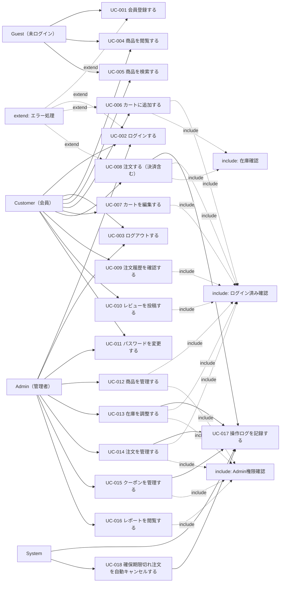

# ユースケース

EC Site（ECサイト構築プロジェクト）

---

# 文書管理情報

| 項目    | 内容             |
| ----- | -------------- |
| システム名 | EC Site        |
| 文書名   | ユースケース         |
| 文書番号  | EC-003         |
| 作成者   | Nguyen Minh Tri |
| 作成日   | 2026/07/13     |
| バージョン | 1.2            |
| ステータス | Draft          |

---

# 改訂履歴

| Version | 日付         | 作成者             | 内容   |
| ------- | ---------- | --------------- | ---- |
| 1.0     | 2026/07/13 | Nguyen Minh Tri | 初版作成 |
| 1.1     | 2026/07/14 | Nguyen Minh Tri | 7章のユースケース詳細を8件→全18件（UC-001〜018）に拡充。コーディング開始前の完成度100%化のため。 |
| 1.2     | 2026/07/21 | Nguyen Minh Tri | 全体整合性監査で発見: `02_要件定義書.md`v1.4で追加されたE011（重複操作エラー）が本書に未反映だった。UC-010 3-aとE章末エラーコード表に追加。 |

---

# 目次

1. 本書の目的
2. アクター定義
3. ユースケース一覧
4. ユースケース図
5. Include / Extend 関係
6. 共通事前条件・事後条件
7. ユースケース詳細
8. ユースケースと要件の対応
9. 例外・共通ルール
10. まとめ

---

# 1. 本書の目的

`02_要件定義書.md` の機能要件（REQ）を、アクターの操作単位に分解し、基本フロー・代替/例外フローを明確化する。特に UC-008（注文する）は在庫確保・クーポン適用・決済の3系統が絡む本プロジェクトで最も複雑なユースケースであり、詳細に記述する。

---

# 2. アクター定義

| アクター | 説明 |
| --- | --- |
| Guest | 未ログインの訪問者。商品閲覧・会員登録のみ行える |
| Customer | 会員登録済みの一般消費者 |
| Admin | 商品・在庫・注文・クーポンを管理する事業者側スタッフ |
| System | ログイン済み確認、在庫確保期限切れの自動キャンセルなど、人手を介さない処理 |

---

# 3. ユースケース一覧

| UC ID | ユースケース名 | 主アクター | 関連REQ | 関連画面 | 優先度 |
| --- | --- | --- | --- | --- | --- |
| UC-001 | 会員登録する | Guest | REQ-001 | SCR-002 | Must |
| UC-002 | ログインする | Customer / Admin | REQ-002 / REQ-003 | SCR-001 | Must |
| UC-003 | ログアウトする | Customer / Admin | REQ-003 | SCR-001 | Must |
| UC-004 | 商品を閲覧する | Guest / Customer | REQ-005 / REQ-006 | SCR-003 / SCR-004 | Must |
| UC-005 | 商品を検索する | Guest / Customer | REQ-007 | SCR-003 | Should |
| UC-006 | カートに追加する | Customer | REQ-008 | SCR-004 / SCR-005 | Must |
| UC-007 | カートを編集する | Customer | REQ-009 | SCR-005 | Must |
| UC-008 | 注文する（決済含む） | Customer | REQ-010〜013 | SCR-006〜008 | Must |
| UC-009 | 注文履歴を確認する | Customer | REQ-014 / REQ-015 | SCR-009 / SCR-010 | Must |
| UC-010 | レビューを投稿する | Customer | REQ-016 | SCR-011 | Should |
| UC-011 | パスワードを変更する | Customer / Admin | REQ-017 | SCR-012 | Should |
| UC-012 | 商品を管理する | Admin | REQ-018〜021 | SCR-014〜016 | Must |
| UC-013 | 在庫を調整する | Admin | REQ-022 | SCR-017 | Must |
| UC-014 | 注文を管理する | Admin | REQ-023 / REQ-024 | SCR-018 | Must |
| UC-015 | クーポンを管理する | Admin | REQ-025 | SCR-019 | Should |
| UC-016 | レポートを閲覧する | Admin | REQ-026 | SCR-020 | Should |
| UC-017 | 操作ログを記録する | System | REQ-027 | - | Should |
| UC-018 | 在庫確保期限切れ注文を自動キャンセルする | System | BR-INV-006 | - | Must |

---

# 4. ユースケース図

---

# 5. Include / Extend 関係

## 5.1 Include

| Include ID | 共通処理 | 対象ユースケース | 内容 |
| --- | --- | --- | --- |
| INC-001 | ログイン済み確認 | UC-006〜UC-014 | 業務機能実行前にSanctumトークンを検証する。 |
| INC-002 | Admin権限確認 | UC-012〜UC-016 | Admin権限を持つか確認する。 |
| INC-003 | 在庫確認 | UC-006 / UC-008 | 対象バリエーションの`quantity_available`を確認する。 |
| INC-004 | 入力チェック | UC-001 / UC-002 / UC-006〜UC-008 / UC-012〜UC-015 | 必須、形式、桁数、範囲を確認する。 |
| INC-005 | 操作ログ記録 | UC-008 / UC-013 / UC-014 / UC-015 / UC-018 | 重要操作をaudit logに記録する。 |

## 5.2 Extend

| Extend ID | 拡張処理 | 発生条件 | 対象ユースケース |
| --- | --- | --- | --- |
| EXT-001 | セッションタイムアウト | 未認証・トークン期限切れ | UC-006〜UC-016 |
| EXT-002 | 権限エラー | Admin以外がAdmin機能へアクセス | UC-012〜UC-016 |
| EXT-003 | 在庫不足エラー | 要求数量が`quantity_available`を超過 | UC-006 / UC-008 |
| EXT-004 | クーポン適用エラー | 有効期間外・上限到達・最低購入額未達 | UC-008 |
| EXT-005 | 決済失敗 | Stripeでカード与信/売上確定に失敗 | UC-008 |
| EXT-006 | バリデーションエラー | 入力値不正 | UC-001 / UC-002 / UC-006〜UC-008 / UC-012〜UC-015 |

---

# 6. 共通事前条件・事後条件

## 6.1 共通事前条件

| 条件ID | 内容 |
| --- | --- |
| PRE-001 | ユーザーがシステムに登録されていること（Customer/Admin機能の場合）。 |
| PRE-002 | ユーザーが有効状態（status=active）であること。 |
| PRE-003 | Customer/Admin機能を利用する場合、ログイン済みであること。 |
| PRE-004 | Admin機能を利用する場合、Admin権限を持つこと。 |

## 6.2 共通事後条件

| 条件ID | 内容 |
| --- | --- |
| POST-001 | 状態を変更する操作は、対応するテーブルに変更内容が保存される。 |
| POST-002 | 在庫・クーポン・決済に関わる操作は、失敗時に全ての変更がロールバックされる（トランザクション整合性）。 |
| POST-003 | 重要操作（注文・在庫・クーポン変更）はaudit logに記録される。 |

---

# 7. ユースケース詳細

全18件のうち、初版（v1.0）ではUC-008を中心に8件のみ詳細化していたが、コーディング開始前の完成度100%化のため残り10件（UC-001, 003, 004, 005, 007, 011, 012, 015, 016, 017）を追加した（改訂履歴参照）。UC-ID順に記載する。

## 7.1 UC-001 会員登録する

**アクター**: Guest
**事前条件**: 対象のメールアドレスが未登録であること
**事後条件**: POST-001（`users`に新規作成、自動的にログイン状態になる）

### 基本フロー
1. Guestが会員登録画面（SCR-002）を開く
2. 氏名・メールアドレス・パスワード・パスワード確認を入力する
3. 「登録する」を押す
4. SystemがINC-004（入力チェック）を実行し、メールアドレスの重複を確認する
5. `users`にrole=customer、status=activeで新規作成し、パスワードをハッシュ化して保存する
6. アクセストークンを発行し、自動的にログイン状態で商品一覧画面（SCR-003）へ遷移する

### 代替・例外フロー
- 4-a. メールアドレスが既に登録済みの場合 → E003（バリデーションエラー）を表示する
- 4-b. パスワードとパスワード確認が不一致、または8〜20文字の範囲外の場合 → E003を表示する

---

## 7.2 UC-002 ログインする

**アクター**: Customer / Admin
**事前条件**: PRE-001, PRE-002
**事後条件**: POST-001（アクセストークン発行）

### 基本フロー
1. Guestがログイン画面を開く
2. メールアドレスとパスワードを入力する
3. Systemが認証情報を検証する
4. 認証成功後、アクセストークンを発行しダッシュボード（Customer: 商品一覧 / Admin: 管理画面）へ遷移する

### 代替・例外フロー
- 3-a. 認証情報が誤っている場合 → E001（ログイン失敗）を表示する
- 3-b. アカウントが無効化されている場合 → E001相当のメッセージで拒否する（BR-USR-001）

---

## 7.3 UC-003 ログアウトする

**アクター**: Customer / Admin
**事前条件**: PRE-003（ログイン済み）
**事後条件**: アクセストークンが無効化される

### 基本フロー
1. Customer/Adminが画面ヘッダーの「ログアウト」を押す
2. Systemが現在のアクセストークンを無効化する（Sanctumトークン削除）
3. ログイン画面（SCR-001）へ遷移する

### 代替・例外フロー
- なし（失敗しうる分岐のない単純操作のため）

---

## 7.4 UC-004 商品を閲覧する

**アクター**: Guest / Customer
**事前条件**: なし
**事後条件**: なし（閲覧のみ、状態変更を伴わない）

### 基本フロー
1. Guest/Customerが商品一覧画面（SCR-003）を開く
2. Systemがstatus=activeの商品を一覧表示する
3. 商品カードを選択すると商品詳細画面（SCR-004）へ遷移する
4. Systemが商品説明・画像・バリエーション別価格/在庫（`inventories.quantity_available`）・レビュー一覧を表示する

### 代替・例外フロー
- 3-a. 指定した商品IDが存在しない、またはstatus=inactiveの場合 → E007（対象データ未検出）を返す

---

## 7.5 UC-005 商品を検索する

**アクター**: Guest / Customer
**事前条件**: なし
**事後条件**: なし

### 基本フロー
1. Guest/Customerが商品一覧画面（SCR-003）でキーワード・カテゴリ・価格帯のいずれかを指定する
2. 「検索」を押す
3. Systemが条件に一致するstatus=active商品のみを絞り込み表示する

### 代替・例外フロー
- 3-a. 一致する商品が0件の場合 → 「該当する商品がありません」と表示する（エラーではなく正常系の空結果）

---

## 7.6 UC-006 カートに追加する

**アクター**: Customer
**事前条件**: PRE-001〜PRE-003
**事後条件**: POST-001（在庫はまだ変更しない、BR-INV-002）

### 基本フロー
1. Customerが商品詳細画面でバリエーション（サイズ・色）と数量を選択する
2. 「カートに追加」を押す
3. Systemが`quantity_available`を確認する（表示上の警告のみ、確保はしない）
4. `cart_items`に追加する（既存行があれば数量を加算）
5. カート追加完了メッセージを表示する

### 代替・例外フロー
- 3-a. 在庫が要求数量に満たない場合 → E004（在庫不足）を表示し、追加可能な最大数量を提示する
- 1-a. active な`carts`が存在しない場合 → Systemが新規作成する

---

## 7.7 UC-007 カートを編集する

**アクター**: Customer
**事前条件**: PRE-001〜PRE-003、カートに商品が入っていること
**事後条件**: POST-001（在庫はまだ変更しない、BR-INV-002）

### 基本フロー
1. Customerがカート画面（SCR-005）を開く
2. 対象行の数量を変更する、または「削除」を押す
3. Systemが`cart_items`を即時更新する（削除の場合は行を削除）

### 代替・例外フロー
- 2-a. 変更後の数量が在庫（`quantity_available`）を超える場合 → E004（在庫不足）を表示し、変更を反映しない（保存前チェックのみ。実際の確保はUC-008で行う）
- 2-b. 数量を0以下に変更しようとした場合 → E003（バリデーションエラー）を表示する

---

## 7.8 UC-008 注文する（決済含む）

**アクター**: Customer
**事前条件**: PRE-001〜PRE-003、カートに1件以上の商品があること
**事後条件**: POST-001〜POST-003

本ユースケースは9章業務ルールのBR-ORD/BR-INV/BR-CPN/BR-PAY系列がすべて関与する、本システムで最も重要なユースケースである。

### 基本フロー
1. Customerがカート画面から「注文手続きへ」を押す
2. 配送先住所を選択（または新規登録）する
3. （任意）クーポンコードを入力する。SystemがBR-CPN-001の条件を検証する
4. 注文内容（商品・数量・小計・税額・送料・割引・合計）を確認し「注文を確定する」を押す
5. Systemがトランザクション内で以下を実行する:
   a. 各カート行について`SELECT ... FOR UPDATE`で在庫行をロックし、`quantity_available`を確認する（BR-INV-007）
   b. `orders`をstatus=pendingで作成し、配送先をスナップショットする（BR-ORD-003）
   c. `order_items`に商品名・単価・税率をスナップショットする（BR-ORD-002, BR-TAX-002）
   d. 在庫を確保する（`quantity_available -= 数量`, `quantity_reserved += 数量`、BR-INV-003）
   e. クーポンを仮利用する（`used_count += 1`、BR-CPN-003）
6. Stripe PaymentIntentを作成し、決済画面へ遷移する
7. Customerがカード情報を入力し決済を実行する
8. Stripeからのカード処理結果に応じて画面上に処理中表示を出す
9. Stripe Webhookが決済成功イベントを送信し、Systemが`orders.status`をpaidに更新、在庫を引き当て確定する（BR-INV-004）
10. 注文完了画面を表示する

### 代替・例外フロー
- 3-a. クーポン条件不成立 → E005を表示し、クーポンなしで続行するか選択させる
- 5a-a. 在庫不足（他の注文と競合） → 注文確定全体をロールバックし、E004を表示する
- 7-a. 決済失敗（与信エラー等） → `payments.status=failed`とし、`orders.status`はpendingを維持、再決済を促す（BR-PAY-002）
- 9-a. 30分以内に決済完了イベントが届かない → UC-018（Systemによる自動キャンセル）が発火し、在庫・クーポンを解放する（BR-INV-006）

---

## 7.9 UC-009 注文履歴を確認する

**アクター**: Customer
**事前条件**: PRE-001〜PRE-003

### 基本フロー
1. Customerが注文履歴画面を開く
2. Systemが自分の`orders`のみを新しい順に一覧表示する
3. 注文を選択すると、明細・配送状況（`shipments`）を表示する

### 代替・例外フロー
- 2-a. 他会員の注文IDを直接指定してアクセスした場合 → E002（権限エラー）を返す

---

## 7.10 UC-010 レビューを投稿する

**アクター**: Customer
**事前条件**: PRE-001〜PRE-003、対象商品を含む注文が`delivered`であること（BR-REV-001）

### 基本フロー
1. Customerが注文履歴から対象商品の「レビューを書く」を押す
2. 評価（1〜5）とコメントを入力し送信する
3. Systemが当該`order_item_id`に対する既存レビューの有無を確認する
4. 存在しなければ`reviews`に保存する

### 代替・例外フロー
- 3-a. 既にレビュー済みの場合 → E011（重複操作エラー）を表示する（BR-REV-002）
- 1-a. 注文が`delivered`でない場合 → レビューボタン自体を非表示にする

---

## 7.11 UC-011 パスワードを変更する

**アクター**: Customer / Admin
**事前条件**: PRE-003
**事後条件**: POST-001（`password_hash`更新）

### 基本フロー
1. Customer/Adminがマイページ（SCR-012）のパスワード変更フォームを開く
2. 現在のパスワード、新しいパスワード、新しいパスワード確認を入力する
3. Systemが現在のパスワードを検証する
4. `password_hash`を新しい値に更新する
5. 完了メッセージを表示する

### 代替・例外フロー
- 3-a. 現在のパスワードが誤っている場合 → E003（バリデーションエラー）を表示する
- 2-a. 新しいパスワードが8〜20文字の範囲外、または確認と不一致の場合 → E003を表示する

---

## 7.12 UC-012 商品を管理する

**アクター**: Admin
**事前条件**: PRE-001, PRE-002, PRE-004
**事後条件**: POST-001, POST-003

### 基本フロー
1. Adminが商品管理画面（SCR-014）で「新規登録」を押す
2. 商品名・説明・カテゴリ・税区分を入力する
3. Systemが`products`に保存する（status=active）
4. 続けてバリエーション・画像管理画面（SCR-016）でサイズ・色・SKU・価格を登録する
5. Systemが`product_variants`に保存し、同時に`inventories`の初期レコード（`quantity_available=0`）を自動作成する
6. 画像をアップロードするとS3に保存され`product_images`に記録される
7. audit logに記録する（POST-003）

### 代替・例外フロー
- 3-a. 商品名が未入力、または税区分が不正な値の場合 → E003を表示する
- 5-a. 同一商品内でサイズ×色の組み合わせが重複する場合 → E003を表示する（`UNIQUE(product_id, size, color)`制約違反）

---

## 7.13 UC-013 在庫を調整する

**アクター**: Admin
**事前条件**: PRE-001, PRE-002, PRE-004

### 基本フロー
1. Adminが在庫管理画面で対象バリエーションを選択する
2. 調整数量と理由を入力する
3. Systemが`inventories.quantity_available`を更新し、`inventory_logs`に`change_type=adjustment`で記録する（BR-INV-008）
4. audit logに記録する

### 代替・例外フロー
- 2-a. 調整後の数量がマイナスになる場合 → E003（バリデーションエラー）を表示する

---

## 7.14 UC-014 注文を管理する

**アクター**: Admin
**事前条件**: PRE-001, PRE-002, PRE-004

### 基本フロー
1. Adminが注文管理画面で対象注文を選択する
2. 注文詳細を確認する
3. ステータスを`paid → shipped`に変更し、配送業者・追跡番号を入力する
4. Systemが`orders.status`を更新し、`shipments`を作成する（BR-ORD-001）
5. audit logに記録する

### 代替・例外フロー
- 3-a. 許可されない遷移（例: pending→shipped）を指定した場合 → E006（注文ステータス不正遷移）を表示する

---

## 7.15 UC-015 クーポンを管理する

**アクター**: Admin
**事前条件**: PRE-001, PRE-002, PRE-004
**事後条件**: POST-001, POST-003

### 基本フロー
1. Adminがクーポン管理画面（SCR-019）で「新規発行」を押す
2. コード・割引種別（fixed/percent）・割引額・最低購入金額・有効期間・利用上限を入力する
3. Systemが`coupons`に保存する（status=active）
4. audit logに記録する

### 代替・例外フロー
- 2-a. コードが既に使用されている場合 → E003（バリデーションエラー）を表示する（UNIQUE制約違反）
- 2-b. 割引種別がpercentで割引額が100を超える場合 → E003を表示する

---

## 7.16 UC-016 レポートを閲覧する

**アクター**: Admin
**事前条件**: PRE-001, PRE-002, PRE-004
**事後条件**: なし（閲覧のみ）

### 基本フロー
1. Adminがレポート画面（SCR-020）を開き、対象月を指定する
2. Systemが月別売上合計・カテゴリ別売上トップ5・在庫僅少商品（`quantity_available < 10`）を集計して表示する
3. （任意）CSV出力を押すとダウンロードされる（bonus機能）

### 代替・例外フロー
- 2-a. 対象月に注文データが存在しない場合 → 各項目を0/空リストとして表示する（エラーではない）

---

## 7.17 UC-017 操作ログを記録する

**アクター**: System
**事前条件**: なし（他のユースケースの完了をトリガーに実行される）
**事後条件**: POST-003

### 基本フロー
1. UC-008（注文する）、UC-013（在庫を調整する）、UC-014（注文を管理する）、UC-015（クーポンを管理する）、UC-018（自動キャンセル）のいずれかが完了する
2. Systemが操作種別に応じて`inventory_logs`（在庫調整）またはアプリケーションログ（注文ステータス変更・クーポン発行編集）に、実行者・操作内容・日時を記録する（`14_セキュリティ設計.md`14.1節）

### 代替・例外フロー
- なし（System内部処理のため利用者操作による分岐はない。ログ記録自体が失敗しても呼び出し元の主処理はロールバックさせない方針）

---

## 7.18 UC-018 在庫確保期限切れ注文を自動キャンセルする

**アクター**: System
**事前条件**: -（スケジューラにより毎分実行）

### 基本フロー
1. Systemが`orders.status=pending`かつ作成から30分経過したレコードを抽出する（BR-INV-006）
2. 対象注文ごとにトランザクションを開始する
3. `orders.status`を`cancelled`に更新する
4. 在庫を解放する（`quantity_reserved -= 数量`, `quantity_available += 数量`、BR-INV-005）
5. クーポンを利用していれば`used_count -= 1`する（BR-CPN-003）
6. `inventory_logs`に`change_type=release`で記録する

### 代替・例外フロー
- なし（System内部処理のため利用者操作による分岐はない）

---

# 8. ユースケースと要件の対応

| UC ID | 対応REQ |
| --- | --- |
| UC-001 | REQ-001 |
| UC-002 | REQ-002 |
| UC-003 | REQ-003 |
| UC-004 | REQ-005 / REQ-006 |
| UC-005 | REQ-007 |
| UC-006 | REQ-008 |
| UC-007 | REQ-009 |
| UC-008 | REQ-010 / REQ-011 / REQ-012 / REQ-013 |
| UC-009 | REQ-014 / REQ-015 |
| UC-010 | REQ-016 |
| UC-011 | REQ-017 |
| UC-012 | REQ-018 / REQ-019 / REQ-020 / REQ-021 |
| UC-013 | REQ-022 |
| UC-014 | REQ-023 / REQ-024 |
| UC-015 | REQ-025 |
| UC-016 | REQ-026 |
| UC-017 | REQ-027 |
| UC-018 | -（BR-INV-006が根拠。System内部処理のためユーザー向けREQは存在しない） |

---

# 9. 例外・共通ルール

| 例外 | 対応エラーコード |
| --- | --- |
| 未認証アクセス | E010 |
| 権限エラー | E002 |
| バリデーションエラー | E003 |
| 在庫不足 | E004 |
| クーポン適用条件不成立 | E005 |
| 注文ステータス不正遷移 | E006 |
| 対象データ未検出 | E007 |
| 決済失敗 | E008 |
| Webhook署名検証失敗 | E009 |
| 重複操作エラー（例: レビュー二重投稿） | E011 |

---

# 10. まとめ

本書は18のユースケースを定義し、特にUC-008（注文する）を中心とした在庫確保・クーポン・決済の連携フローを詳細化した。基本フローと代替/例外フローは、そのまま`10_API設計.md`のエラー仕様、`15_単体試験仕様書.md`の試験ケースの根拠となる。
