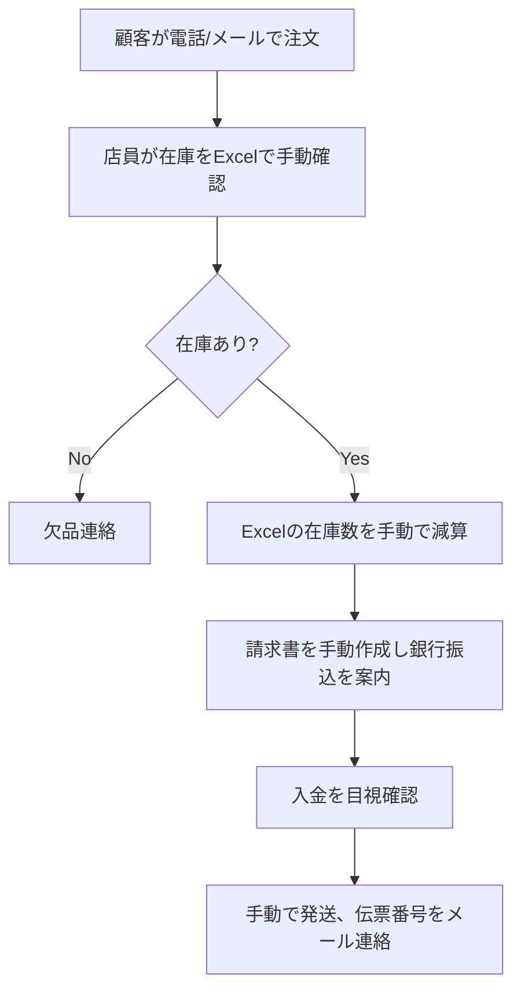
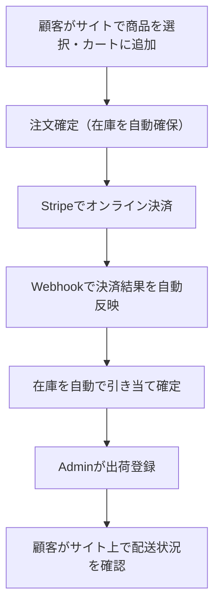
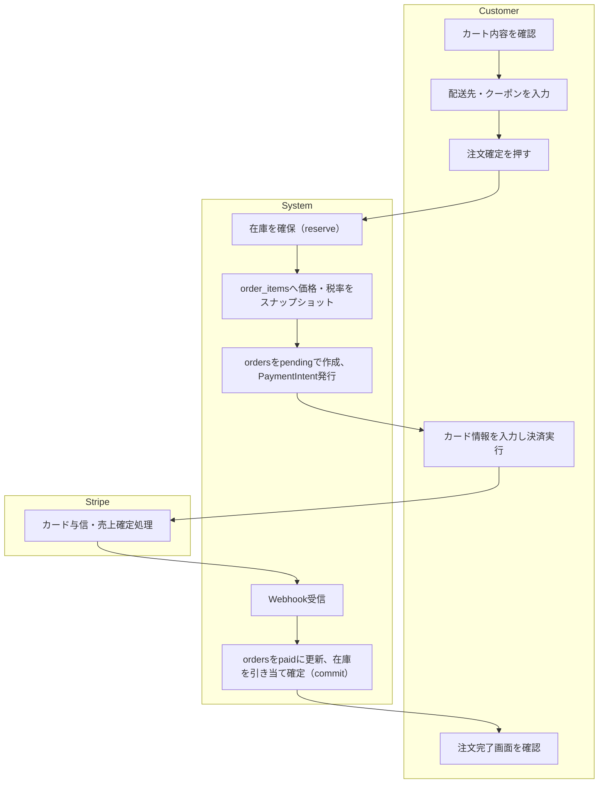
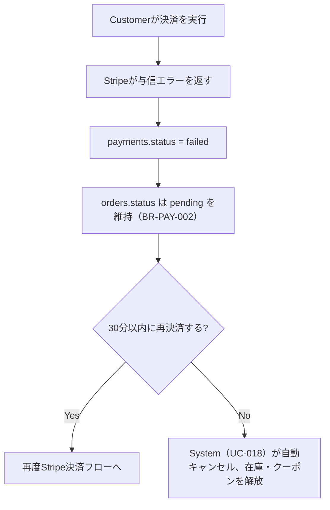
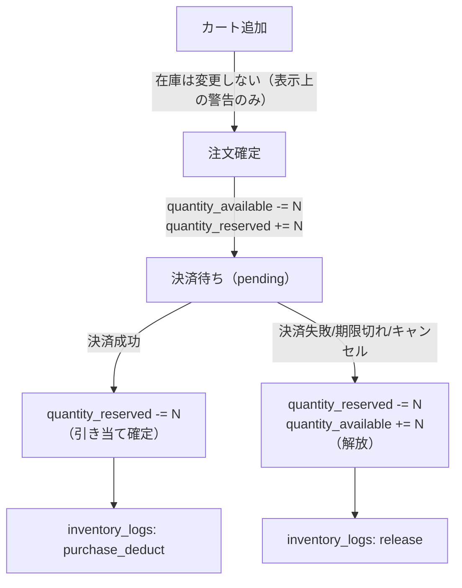
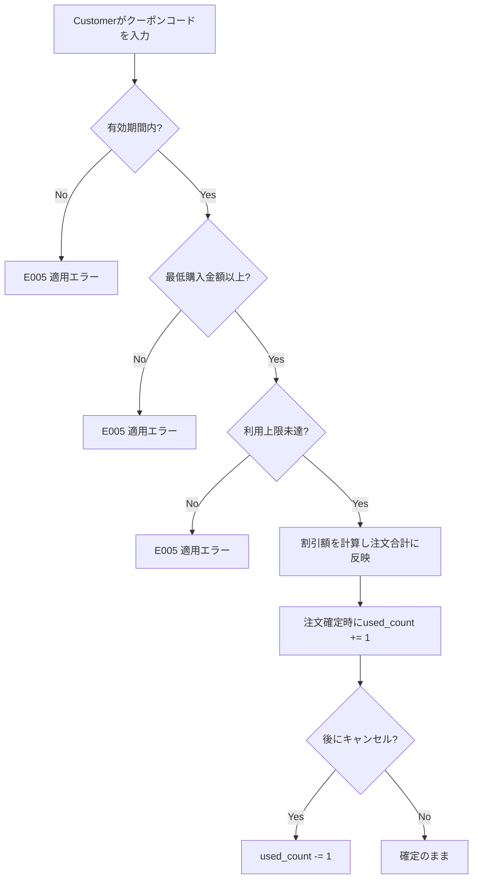
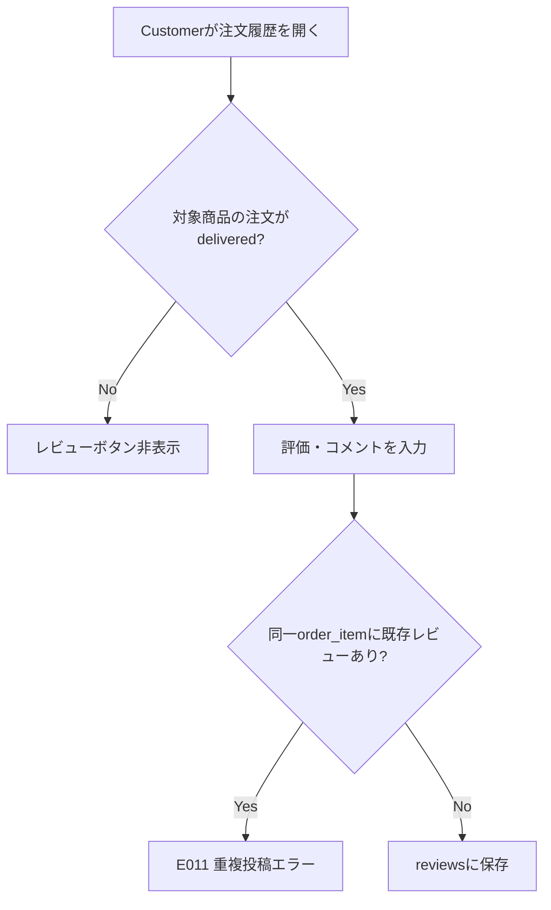
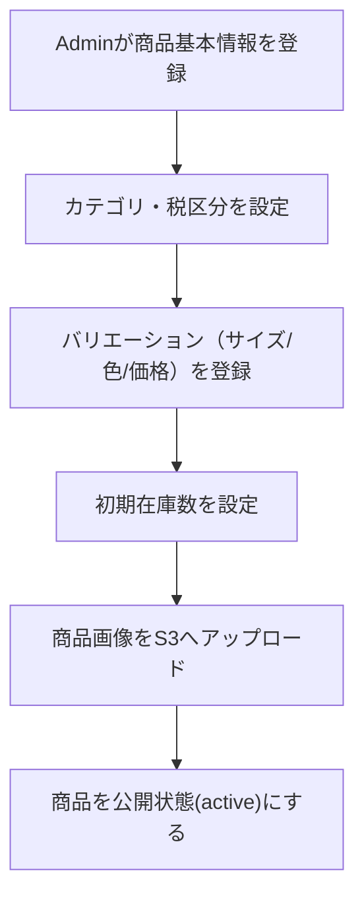
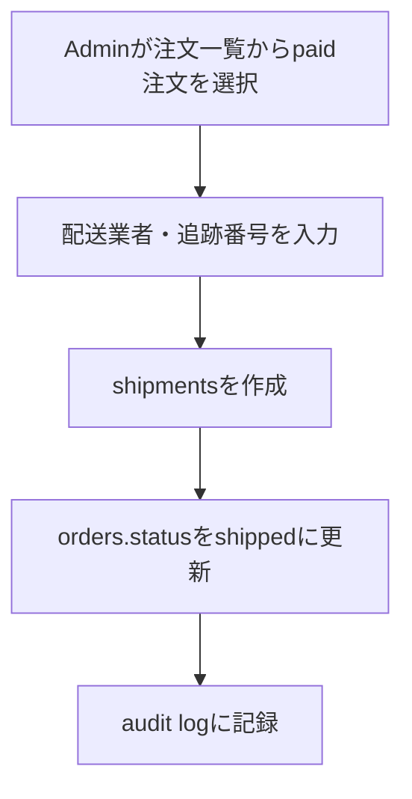

# 業務フロー

EC Site（ECサイト構築プロジェクト）

---

# 文書管理情報

| 項目    | 内容             |
| ----- | -------------- |
| システム名 | EC Site        |
| 文書名   | 業務フロー          |
| 文書番号  | EC-004         |
| 作成者   | Nguyen Minh Tri |
| 作成日   | 2026/07/13     |
| バージョン | 1.1            |
| ステータス | Draft          |

---

# 改訂履歴

| Version | 日付         | 作成者             | 内容   |
| ------- | ---------- | --------------- | ---- |
| 1.0     | 2026/07/13 | Nguyen Minh Tri | 初版作成 |
| 1.1     | 2026/07/21 | Nguyen Minh Tri | 全体整合性監査で発見: `02_要件定義書.md`v1.4で追加されたE011（重複操作エラー）が本書に未反映だった。8章レビュー業務フローと10章例外フロー表に追加。 |

---

# 目次

1. 本書の目的
2. 業務概要
3. AS-IS 業務フロー
4. TO-BE 業務フロー
5. 注文・決済業務フロー
6. 在庫業務フロー
7. クーポン業務フロー
8. レビュー業務フロー
9. マスタ・注文管理業務フロー（Admin）
10. 例外フロー
11. 業務ルール対応
12. ユースケース対応
13. まとめ

---

# 1. 本書の目的

`03_ユースケース.md`で定義した各ユースケースを、アクター間の受け渡し（スイムレーン）と時系列で可視化する。特に UC-008（注文する）は Customer・System・Stripe（外部）の3者が関わるため、本書で最も詳細に記述する。

---

# 2. 業務概要

想定事業者は自社在庫を持つ小規模〜中規模の物販事業者（アパレル・雑貨等、サイズ/色のバリエーションを持つ商品を扱う）。受注から出荷までを本システム一つで完結させ、Excel等の手作業運用から脱却することを目的とする。

---

# 3. AS-IS 業務フロー（想定：システム化以前）

## 3.1 AS-IS 課題

- 在庫確認と減算が手動のため、複数注文が重なると在庫のマイナス（二重販売）が発生しやすい
- 振込確認に時間がかかり、注文から発送までのリードタイムが長い
- 過去の注文時点の価格が記録されず、問い合わせ対応時に「いくらで売ったか」を追跡しづらい

---

# 4. TO-BE 業務フロー（本システム導入後）

## 4.1 TO-BE 改善点

| 項目 | AS-IS | TO-BE |
| --- | --- | --- |
| 在庫確認・減算 | 手動（Excel） | System が注文確定時に自動確保（BR-INV-003） |
| 決済確認 | 目視での振込確認 | Stripe Webhookによる自動反映（BR-PAY-001） |
| 価格の記録 | 請求書控えのみ、検索性が低い | `order_items`にスナップショットとして構造化保存（BR-ORD-002） |
| 二重販売防止 | 手動確認のため防げない場合がある | `SELECT ... FOR UPDATE`による排他制御（BR-INV-007） |

---

# 5. 注文・決済業務フロー

## 5.1 注文確定〜決済完了（正常系）

## 5.2 決済失敗時のフロー

## 5.3 注文・決済業務ルール

| ルール | 内容 |
| --- | --- |
| BR-ORD-001 | 注文ステータスは pending→paid→shipped→delivered、または pending/paid→cancelled のみ。 |
| BR-PAY-001 | ステータス更新はStripe Webhook受信を起点とする。 |
| BR-INV-006 | 在庫確保の有効期限は30分。超過分はSystemが自動解放する。 |

---

# 6. 在庫業務フロー

在庫は `products` / `product_variants` に直接持たせず `inventories` テーブルで一元管理する（BR-INV-001）。この「確保→確定/解放」の2段階制御が、同時アクセス下での二重販売を防ぐ本システムの中核設計である。

---

# 7. クーポン業務フロー

---

# 8. レビュー業務フロー

---

# 9. マスタ・注文管理業務フロー（Admin）

## 9.1 商品登録フロー

## 9.2 出荷登録フロー

## 9.3 マスタ管理方針

商品・カテゴリともに **論理無効化を優先**し、物理削除は行わない（Project 01の ER-003 方針を踏襲）。理由: 過去の`order_items`は商品名等をスナップショットしているため直接の参照制約は生じないが、レポート・レビュー画面での参照整合性を保つため。

---

# 10. 例外フロー

| 例外 | 発生ユースケース | エラーコード |
| --- | --- | --- |
| 未ログインでカート/注文操作 | UC-006, UC-008 | E010 |
| Admin以外が管理画面へアクセス | UC-012〜UC-016 | E002 |
| 入力値不正 | UC-001, UC-002, UC-006〜008, UC-012〜015 | E003 |
| 在庫不足 | UC-006, UC-008 | E004 |
| クーポン条件不成立 | UC-008 | E005 |
| 注文ステータス不正遷移 | UC-014 | E006 |
| 対象データ未検出 | 全体 | E007 |
| 決済失敗 | UC-008 | E008 |
| Webhook署名検証失敗 | System | E009 |
| 重複投稿（レビュー二重投稿） | UC-010 | E011 |

---

# 11. 業務ルール対応

| フロー | 対応ルールID |
| --- | --- |
| 注文確定 | BR-ORD-001〜003, BR-TAX-001〜004 |
| 在庫確保/引き当て/解放 | BR-INV-001〜008 |
| クーポン適用 | BR-CPN-001〜004 |
| 決済 | BR-PAY-001〜003 |
| レビュー | BR-REV-001〜002 |

---

# 12. ユースケース対応

`03_ユースケース.md` 8章と同一。UC-006, UC-008, UC-013, UC-014, UC-018 が本書の主要対象である。

---

# 13. まとめ

本書は「在庫確保→決済確定→引き当て確定」という時間差のある一連の業務を、Customer・System・Stripeの3者スイムレーンで可視化した。この時間差（BR-INV-006の30分猶予）こそが、単純なCRUDでは表現できないEC特有の業務設計であり、詳細設計書（12章）でのトランザクション境界の判断根拠となる。
