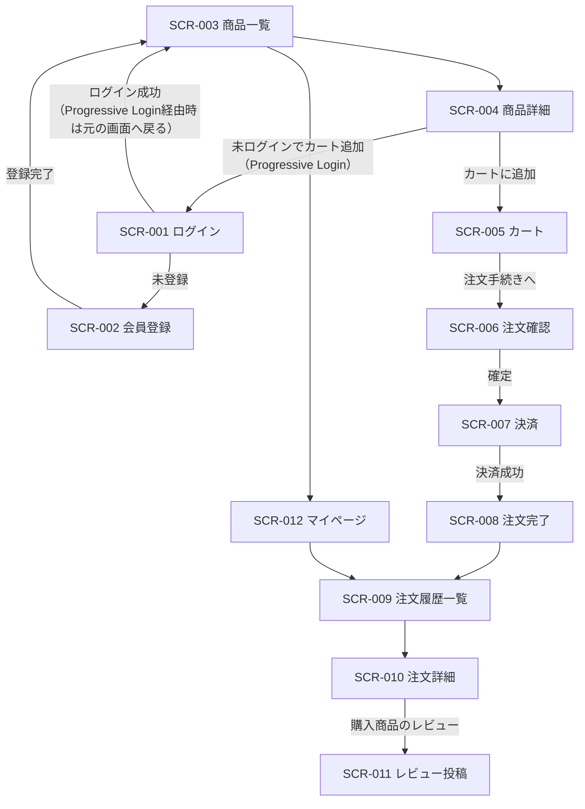
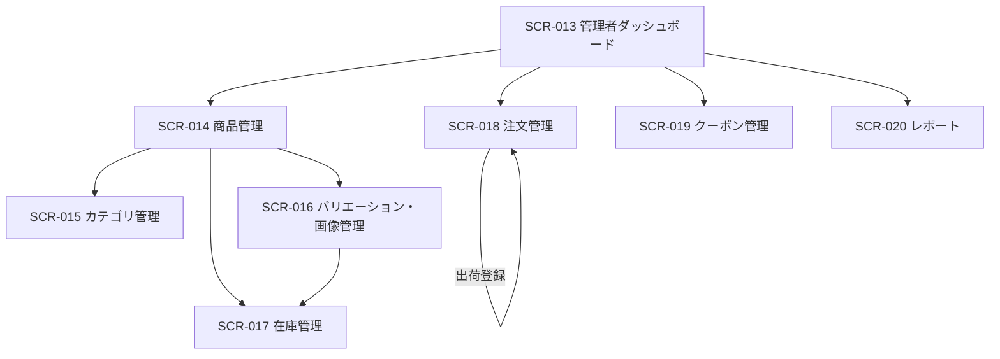

# 画面遷移図

EC Site（ECサイト構築プロジェクト）

---

# 文書管理情報

| 項目    | 内容             |
| ----- | -------------- |
| システム名 | EC Site        |
| 文書名   | 画面遷移図          |
| 文書番号  | EC-005         |
| 作成者   | Nguyen Minh Tri |
| 作成日   | 2026/07/13     |
| バージョン | 1.1            |
| ステータス | Draft          |

---

# 改訂履歴

| Version | 日付         | 作成者             | 内容   |
| ------- | ---------- | --------------- | ---- |
| 1.0     | 2026/07/13 | Nguyen Minh Tri | 初版作成 |
| 1.1     | 2026/07/17 | Nguyen Minh Tri | 3章のProgressive Login遷移の起点をSCR-003→SCR-004に修正（購入操作＝カート追加はSCR-004で発生、06_画面設計 5.1/5.4節と整合）、ログイン成功エッジに「元の画面へ戻る」注記を追加、5章に商品閲覧メニューのAdmin列×の意味に関する注記を追加。 |

---

# 目次

1. 本書の目的
2. 画面ID一覧
3. Customer向け画面遷移図
4. Admin向け画面遷移図
5. Role別ナビゲーション
6. 条件付き遷移
7. まとめ

---

# 1. 本書の目的

EC Siteの全20画面について、画面ID・遷移条件を定義する。Customer向け（購買導線）とAdmin向け（管理導線）は別UIとして分離する。

---

# 2. 画面ID一覧

| 画面ID | 画面名 | 対象ユーザー |
| --- | --- | --- |
| SCR-001 | ログイン画面 | Customer / Admin |
| SCR-002 | 会員登録画面 | Guest |
| SCR-003 | 商品一覧画面 | Guest / Customer |
| SCR-004 | 商品詳細画面 | Guest / Customer |
| SCR-005 | カート画面 | Customer |
| SCR-006 | 注文確認画面（配送先・クーポン） | Customer |
| SCR-007 | 決済画面 | Customer |
| SCR-008 | 注文完了画面 | Customer |
| SCR-009 | 注文履歴一覧画面 | Customer |
| SCR-010 | 注文詳細画面 | Customer |
| SCR-011 | レビュー投稿画面 | Customer |
| SCR-012 | マイページ（会員情報・住所・パスワード） | Customer |
| SCR-013 | 管理者ダッシュボード | Admin |
| SCR-014 | 商品管理画面 | Admin |
| SCR-015 | カテゴリ管理画面 | Admin |
| SCR-016 | バリエーション・画像管理画面 | Admin |
| SCR-017 | 在庫管理画面 | Admin |
| SCR-018 | 注文管理画面 | Admin |
| SCR-019 | クーポン管理画面 | Admin |
| SCR-020 | レポート画面 | Admin |

---

# 3. Customer向け画面遷移図

---

# 4. Admin向け画面遷移図

---

# 5. Role別ナビゲーション

| メニュー | Guest | Customer | Admin |
| --- | --- | --- | --- |
| 商品一覧・詳細 | 〇 | 〇 | × |
| カート・注文 | ×（ログイン要求） | 〇 | × |
| 注文履歴 | × | 〇 | × |
| マイページ | × | 〇 | × |
| 管理者ダッシュボード | × | × | 〇 |
| 商品/カテゴリ/在庫/クーポン管理 | × | × | 〇 |
| 注文管理・レポート | × | × | 〇 |

**注**: 本表はナビゲーションメニューへの表示有無を示す。「商品一覧・詳細」のAdmin列が×なのはAdmin向けUI（`06_画面設計.md`3.3節のSidebar構成）に商品閲覧メニューを置かないという意味であり、公開画面（SCR-003/004）へのアクセス権限自体はAdminにもある（`02_要件定義書.md`8章・`07_機能一覧.md`4章はいずれも〇）。

---

# 6. 条件付き遷移

| 遷移元 | 遷移先 | 条件 |
| --- | --- | --- |
| SCR-005 カート | SCR-006 注文確認 | カートに1件以上の商品がある |
| SCR-006 注文確認 | SCR-007 決済 | 在庫確保・クーポン適用が成功する（E004/E005が発生しない） |
| SCR-007 決済 | SCR-008 注文完了 | Stripe決済成功（Webhook経由でordersがpaidになる） |
| SCR-010 注文詳細 | SCR-011 レビュー投稿 | 注文がdelivered状態であり、対象商品が未レビューである |
| SCR-018 注文管理 | （ステータス変更） | 現在のステータスから許可された遷移のみ（BR-ORD-001） |
| すべてのCustomer画面 | SCR-001 ログイン | 未認証でアクセス（E010） |
| すべてのAdmin画面 | SCR-001 ログイン | 未認証、またはAdmin権限なし（E002） |

---

# 7. まとめ

Customer導線は「閲覧（未ログイン可）→カート/注文（ログイン必須）」という段階的認証を採用し、Guestの離脱コストを下げる設計とした。Admin導線は全画面で認証・権限確認を前提とする。
