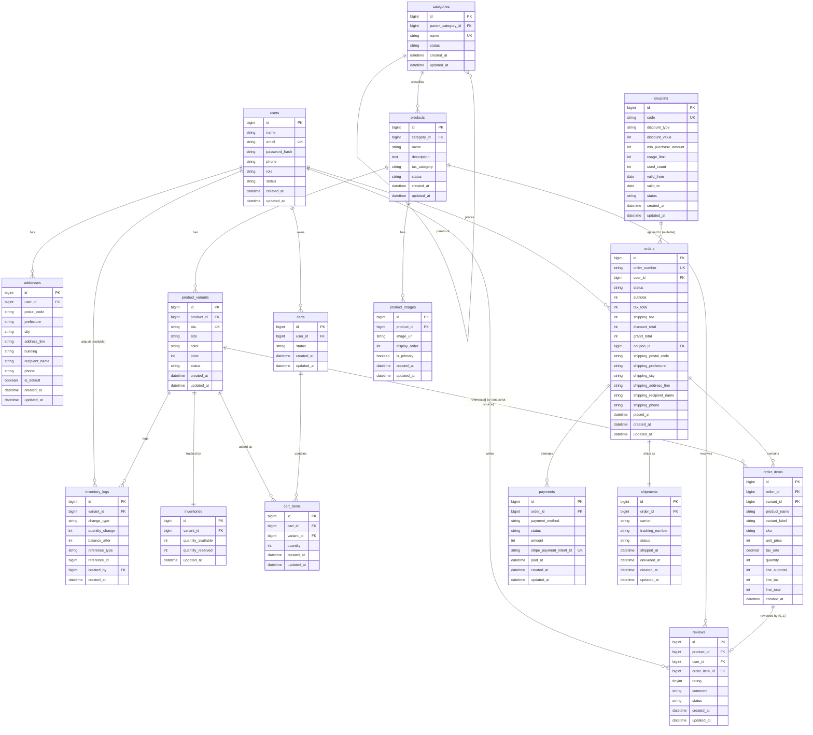

# ER図

EC Site（ECサイト構築プロジェクト）

---

# 文書管理情報

| 項目 | 内容 |
| --- | --- |
| システム名 | EC Site |
| 文書名 | ER図 |
| 文書番号 | EC-008 |
| 作成者 | Nguyen Minh Tri |
| 作成日 | 2026/07/13 |
| バージョン | 1.2 |
| ステータス | Draft |

---

# 改訂履歴

| Version | 日付 | 作成者 | 内容 |
| --- | --- | --- | --- |
| 1.0 | 2026/07/13 | Nguyen Minh Tri | 初版作成 |
| 1.1 | 2026/07/14 | Nguyen Minh Tri | drawioファイルへの相対パス誤りを修正、11章の図面構成説明をswimlane形式1ページ構成に合わせて更新。 |
| 1.2 | 2026/07/15 | Nguyen Minh Tri | drawio図面を全面再設計（v2）。6列レイアウト→FK依存レベル順の5列レイアウトに変更し、長距離リレーションの迂回配線を専用レーン化して線の重なり・テーブル本体との交差を解消。11章の説明を更新。 |

---

# 目次

1. 本書の目的
2. ER設計方針
3. エンティティ一覧
4. ER図
5. リレーション定義
6. エンティティ詳細（主要カラム）
7. 主キー・外部キー一覧
8. インデックス方針
9. データ削除・保持方針
10. 正規化方針とあえて非正規化した点
11. drawio図面ファイル
12. トレーサビリティ
13. まとめ

---

# 1. 本書の目的

本書は、EC Siteで利用するデータの論理構造とエンティティ間の関係を定義する。本書のエンティティ・リレーション・キー設計は、次工程の09_テーブル定義（物理設計）、10_API設計、実装、テスト仕様書の基準とする。

---

# 2. ER設計方針

| 方針ID | 方針 | 内容 |
| --- | --- | --- |
| ER-001 | Logical First | 本書では論理ERを定義し、物理カラム型・詳細制約は09_テーブル定義で定義する。 |
| ER-002 | Traceability | エンティティは要件（REQ）、機能（FUNC）、業務ルール（BR）と対応させる。 |
| ER-003 | Soft Delete Priority | 商品・カテゴリは物理削除より無効化（status）を優先する。過去の注文は`order_items`が独立してスナップショットを持つため、商品削除の影響を受けない。 |
| ER-004 | Snapshot Over Reference | 金額・商品名・税率・配送先など「時間とともに変わりうる値」は、注文確定時点でコピー保存する（BR-ORD-002/003）。 |
| ER-005 | Auditability | 在庫変動・重要操作は`inventory_logs`等に記録する。 |
| ER-006 | Normalization | 初期設計では第3正規形を基本とし、パフォーマンス・履歴要件がある箇所のみ意図的に非正規化する（10章）。 |

---

# 3. エンティティ一覧

テーブルIDは09_テーブル定義および`diagrams/er/ec_site_erd.drawio`のTBL-IDと一致させている。

| テーブルID | エンティティ | 論理名 | 概要 | 主な関連機能 |
| --- | --- | --- | --- | --- |
| TBL-001 | users | 会員・管理者 | ログインユーザー（Customer/Admin）を管理する。 | FUNC-001〜004 |
| TBL-002 | addresses | 配送先住所 | 会員の住所帳。注文時にスナップショットされる元データ。 | FUNC-010 |
| TBL-003 | categories | 商品カテゴリ | 商品の分類。親子構造を持つ。 | FUNC-022 |
| TBL-004 | products | 商品 | 商品の基本情報・税区分を管理する。 | FUNC-021 |
| TBL-005 | product_variants | 商品バリエーション | サイズ・色などSKU単位の価格・状態を管理する。 | FUNC-023 |
| TBL-006 | product_images | 商品画像 | 商品に紐づく画像（S3）を管理する。 | FUNC-024 |
| TBL-007 | inventories | 在庫 | バリエーション単位の利用可能数・確保数を管理する。 | FUNC-016〜019 |
| TBL-008 | inventory_logs | 在庫変動履歴 | 在庫の増減理由と履歴を記録する。 | FUNC-016〜019 |
| TBL-009 | carts | カート | 会員のカート（進行中/確定済み/放棄）を管理する。 | FUNC-008 |
| TBL-010 | cart_items | カート明細 | カート内の商品・数量を管理する。 | FUNC-008 / 009 |
| TBL-011 | orders | 注文 | 注文ヘッダ。ステータス・金額内訳・配送先スナップショットを持つ。 | FUNC-012〜015 |
| TBL-012 | order_items | 注文明細 | 注文時点の商品名・単価・税率のスナップショットを持つ。 | FUNC-012 |
| TBL-013 | payments | 決済 | Stripe決済の状態・金額を管理する（1注文に複数回の試行を許容）。 | FUNC-013 |
| TBL-014 | shipments | 配送 | 出荷情報・配送状況を管理する。 | FUNC-026 |
| TBL-015 | coupons | クーポン | 割引条件・利用状況を管理する。 | FUNC-011 / 027 |
| TBL-016 | reviews | レビュー | 購入済み商品への評価・コメントを管理する。 | FUNC-020 |

---

# 4. ER図

---

# 5. リレーション定義

| リレーションID | 親エンティティ | 子エンティティ | 多重度 | 内容 |
| --- | --- | --- | --- | --- |
| REL-001 | users | addresses | 1:N | 1会員は複数の配送先住所を持つ。 |
| REL-002 | users | carts | 1:N | 1会員は複数のカート（履歴含む）を持つ。 |
| REL-003 | users | orders | 1:N | 1会員は複数の注文を行う。 |
| REL-004 | users | reviews | 1:N | 1会員は複数のレビューを投稿する。 |
| REL-005 | users | inventory_logs | 1:N（nullable） | Adminによる手動在庫調整の実行者を記録する。System起因のログはNULL。 |
| REL-006 | categories | categories | 1:N（自己参照） | カテゴリは親カテゴリを持つことができる（nullable）。 |
| REL-007 | categories | products | 1:N | 1カテゴリは複数の商品を持つ。 |
| REL-008 | products | product_variants | 1:N | 1商品は複数のバリエーション（SKU）を持つ。 |
| REL-009 | products | product_images | 1:N | 1商品は複数の画像を持つ。 |
| REL-010 | products | reviews | 1:N | 1商品は複数のレビューを持つ。 |
| REL-011 | product_variants | inventories | 1:1 | 1バリエーションは1つの在庫レコードを持つ。 |
| REL-012 | product_variants | inventory_logs | 1:N | 1バリエーションは複数の在庫変動履歴を持つ。 |
| REL-013 | product_variants | cart_items | 1:N | 1バリエーションは複数のカート行に含まれうる。 |
| REL-014 | product_variants | order_items | 1:N（参照専用） | 分析目的のFKであり、価格計算には使用しない（BR-ORD-002）。 |
| REL-015 | carts | cart_items | 1:N | 1カートは複数の明細行を持つ。 |
| REL-016 | orders | order_items | 1:N | 1注文は複数の明細行を持つ。 |
| REL-017 | orders | payments | 1:N | 1注文は複数の決済試行を持ちうる（BR-PAY-002の再決済）。 |
| REL-018 | orders | shipments | 1:1 | 1注文につき1配送情報を持つ（本スコープでは分割出荷は対象外）。 |
| REL-019 | coupons | orders | 1:N（nullable） | 1クーポンは複数の注文に適用されうる。未適用の注文は`coupon_id`がNULL。 |
| REL-020 | order_items | reviews | 1:0..1 | 1注文明細に対しレビューは最大1件（BR-REV-002）。 |

---

# 6. エンティティ詳細（主要カラム）

各エンティティの全カラム定義は09_テーブル定義を参照。本章では業務上の要点のみ補足する。

| エンティティ | 業務上の要点 |
| --- | --- |
| orders | `shipping_*`列は`addresses`のスナップショットであり、`addresses`への直接FKは持たない（BR-ORD-003）。 |
| order_items | `unit_price` `tax_rate` `product_name`は`products`/`product_variants`のスナップショットであり、参照先の変更に追従しない（BR-ORD-002, BR-TAX-002）。 |
| inventories | `quantity_available`と`quantity_reserved`を分離して持つことで、BR-INV-001〜007の2段階制御を1テーブルで表現する。 |
| payments | 1注文=1決済ではなく1注文=N決済（試行履歴）とすることで、決済失敗後の再試行を自然に表現する（REL-017）。 |

---

# 7. 主キー・外部キー一覧

| テーブル | PK | 主なFK |
| --- | --- | --- |
| addresses | id | user_id → users.id |
| categories | id | parent_category_id → categories.id (nullable) |
| products | id | category_id → categories.id |
| product_variants | id | product_id → products.id |
| product_images | id | product_id → products.id |
| inventories | id | variant_id → product_variants.id (unique) |
| inventory_logs | id | variant_id → product_variants.id, created_by → users.id (nullable) |
| carts | id | user_id → users.id |
| cart_items | id | cart_id → carts.id, variant_id → product_variants.id |
| orders | id | user_id → users.id, coupon_id → coupons.id (nullable) |
| order_items | id | order_id → orders.id, variant_id → product_variants.id |
| payments | id | order_id → orders.id |
| shipments | id | order_id → orders.id (unique) |
| reviews | id | product_id → products.id, user_id → users.id, order_item_id → order_items.id (unique) |

---

# 8. インデックス方針

| 方針 | 内容 |
| --- | --- |
| FK列 | すべてのFK列にインデックスを付与する（MySQLはFK制約作成時に自動付与）。 |
| 検索頻度の高い列 | `orders.status` `orders.user_id` `orders.created_at`の複合インデックス（注文管理画面の検索用）。 |
| 一意制約 | `users.email` `product_variants.sku` `coupons.code` `payments.stripe_payment_intent_id`（冪等性、BR-PAY-003）。 |
| 排他制御対象 | `inventories.variant_id`（`SELECT ... FOR UPDATE`の対象、BR-INV-007）にUNIQUE制約を付与し行ロックを一意に特定できるようにする。 |

---

# 9. データ削除・保持方針

| データ | 方針 |
| --- | --- |
| products / categories | 論理無効化（status=inactive）を優先し、物理削除しない（ER-003）。 |
| orders / order_items / payments | 永続保持（会計証憑として削除しない）。 |
| carts（abandoned） | 一定期間保持後、分析バッチ対象とし物理削除も許容する（個人情報を含まないカート明細のみのため）。 |
| reviews | 不適切投稿は`status=hidden`で論理無効化する。 |

---

# 10. 正規化方針とあえて非正規化した点

| 対象 | 状態 | 理由 |
| --- | --- | --- |
| order_items の product_name / unit_price / tax_rate | 意図的な非正規化（products/product_variantsと重複） | BR-ORD-002: 履歴の正確性を保つためのスナップショット。正規化の教科書的には冗長だが、EC設計では必須のアンチパターン例外。 |
| orders の shipping_* 列 | 意図的な非正規化（addressesと重複） | BR-ORD-003: 同上。会員が住所を編集・削除しても過去の注文の配送先表示を保持するため。 |
| orders の subtotal / tax_total / grand_total | 意図的な非正規化（order_itemsの合計から算出可能） | 注文一覧画面での集計クエリを避け、確定時点の金額を1回の計算で確定させるため（決済との整合性を保つ目的もある）。 |
| それ以外 | 第3正規形 | 上記以外は関数従属性に基づき正規化する。 |

---

# 11. drawio図面ファイル

物理配置・視覚的なER図は `../diagrams/er/ec_site_erd.drawio`（本書 `docs/08_ER図.md` から見た相対パス。プロジェクトルートからは `diagrams/er/ec_site_erd.drawio`）を参照。1ページ構成、swimlane形式（`drawio-er`スキル仕様準拠）。2026/07/15にレイアウトを全面再設計（v2）。

テーブルはFK依存の深さ（レベル0〜4）順に左から右へ5列で配置し、同一列内のテーブルは縦に並べる。これにより20リレーションのうち14件は隣接列間の直線（forward-edge）となり、逆方向の矢印は`categories`の自己参照1件のみ。

| 列（レベル） | 配置テーブル |
| --- | --- |
| Lv0（左端） | users, categories, coupons |
| Lv1 | addresses, products, carts, orders |
| Lv2 | product_variants, product_images, payments, shipments |
| Lv3 | inventories, inventory_logs, cart_items, order_items |
| Lv4（右端） | reviews |

残り2列以上をまたぐ長距離リレーション5件（`cart_items.cart_id→carts`, `order_items.order_id→orders`, `inventory_logs.created_by→users`, `reviews.product_id→products`, `reviews.user_id→users`）は、全テーブルの上部に確保した迂回レーン（5段、またぐ列数が狭いものほどテーブルに近い段）を個別に通し、他の線・テーブル本体と重ならないようにしている。`categories`の自己参照はテーブル左側の小さなループで表現する。各リレーションは専用のchannelX（垂直経路）を持ち、同じ隙間を通る線同士が重ならないよう20〜35px間隔で振り分けている。

---

# 12. トレーサビリティ

02_要件定義書の業務ルール（BR-ORD/BR-TAX/BR-INV/BR-CPN/BR-PAY/BR-REV）→ 本書のリレーション定義（5章）→ 09_テーブル定義の物理制約、の順に一意に追跡できる。

---

# 13. まとめ

本ER図の設計上の核心は、REL-014（`order_items`から`product_variants`への参照はスナップショット元の追跡専用であり価格計算には使わない）と、REL-011/012（`inventories`と`inventory_logs`による在庫の状態と履歴の分離）の2点である。この2点を正しく理解していれば、09_テーブル定義以降の物理設計・実装は自然に導かれる。
