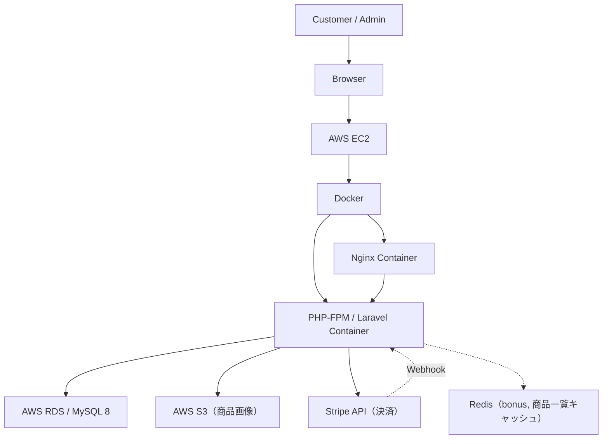
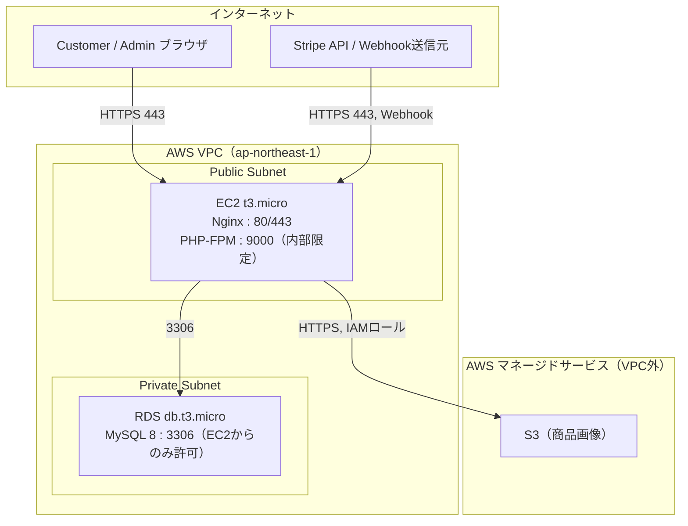
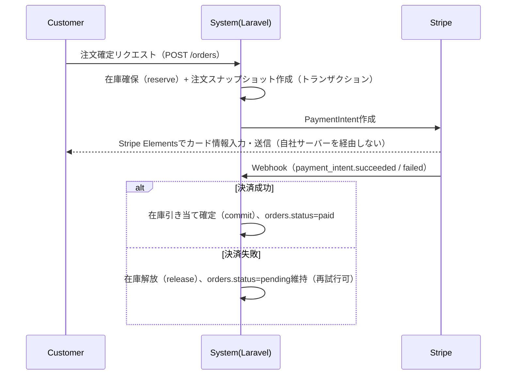
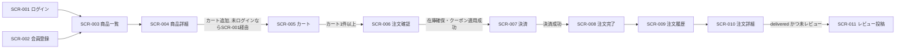

# 基本設計書

EC Site（ECサイト構築プロジェクト）

---

# 文書管理情報

| 項目 | 内容 |
| --- | --- |
| システム名 | EC Site |
| 文書名 | 基本設計書 |
| 文書番号 | EC-011 |
| 作成者 | Nguyen Minh Tri |
| 作成日 | 2026/07/13 |
| バージョン | 1.3 |
| ステータス | Draft |

---

# 改訂履歴

| Version | 日付 | 作成者 | 内容 |
| --- | --- | --- | --- |
| 1.0 | 2026/07/13 | Nguyen Minh Tri | 初版作成 |
| 1.1 | 2026/07/14 | Nguyen Minh Tri | 監査で指摘された未記載9項目（業務フロー・画面一覧・画面遷移図・画面レイアウト・機能一覧表・画面×DB処理マッピング・コード一覧・外部インターフェース一覧・ネットワーク構成図・ファイル一覧・帳票レイアウト）を実体化。他ドキュメントへの1行参照のみだった箇所を統合内容に置き換えた。 |
| 1.2 | 2026/07/16 | Nguyen Minh Tri | 8章（API設計概要）・9.1節（テーブル概要）が参照リンクのみだった箇所に、全33 API一覧表・全16テーブル一覧表を直接記載。 |
| 1.3 | 2026/07/21 | Nguyen Minh Tri | 全体整合性監査で発見: 6.4節 画面×DB処理マッピングがAPI-015（注文確定）の実行タイミングをSCR-007側に誤帰属していた。実際は`06_画面設計.md`5.6節「確定」押下時にSCR-006で実行（3章mermaidの遷移条件と一致）。SCR-006/SCR-007〜008の行を修正。 |

---

# 目次

1. 本書の目的
2. 設計範囲
3. システム構成
4. アプリケーション構成
5. 業務フロー概要
6. 画面設計概要
7. 機能設計概要
8. API設計概要
9. データ設計概要
10. 外部インターフェース一覧
11. ファイル一覧
12. 帳票レイアウト
13. 認証・認可設計
14. 業務処理設計
15. エラー・例外設計
16. ログ・監査設計
17. 非機能設計
18. トレーサビリティ
19. まとめ

---

# 1. 本書の目的

本書はEC Siteの基本設計（外部設計）を定義する。要件定義・ユースケース・業務フロー・画面設計・ER図・テーブル定義・API設計をもとに、システム全体構成、アプリケーション構成、主要処理方式、権限制御、エラー処理、非機能設計を整理する。`12_詳細設計書.md`（内部設計）、実装、各種試験仕様書の基準資料とする。

外部設計の各ドキュメント（04〜10）はそれぞれ単体では担当領域が分断されているため、本書はそれらを**1つの外部設計として統合する**役割を持つ（個別ドキュメントへの単純な参照リンク集ではなく、統合結果そのものを記載する）。

---

# 2. 設計範囲

## 2.1 In Scope

| 区分 | 内容 |
| --- | --- |
| 会員 | 会員登録、ログイン、ログアウト、パスワード変更 |
| 商品 | 商品/カテゴリ/バリエーション/画像の閲覧・検索・管理 |
| カート・注文 | カート操作、注文確定、クーポン適用 |
| 決済 | Stripe Sandbox連携（PaymentIntent、Webhook） |
| 在庫 | 確保・引き当て確定・解放・手動調整・履歴 |
| 配送 | 出荷登録、配送状況管理 |
| レビュー | 購入済み商品への評価投稿 |
| レポート | 売上・在庫の集計表示 |
| 監査 | 在庫・注文・クーポンの重要操作記録 |

## 2.2 Out Scope

| 区分 | 内容 |
| --- | --- |
| マーケットプレイス化 | 複数出品者対応は対象外 |
| 定期購入 | サブスクリプション課金は対象外 |
| 実配送業者API連携 | 配送ステータスは手動更新でシミュレートする |
| ポイント制度 | 会員ランク・ポイント付与は対象外 |
| 多言語・多通貨 | 日本語UI・JPYのみ |

---

# 3. システム構成

## 3.1 全体構成



## 3.2 コンポーネント一覧

| コンポーネント | 役割 |
| --- | --- |
| Nginx | リバースプロキシ、静的ファイル配信、`try_files`によるLaravelへのルーティング |
| PHP-FPM / Laravel 12 | アプリケーション本体（REST API + Blade） |
| MySQL 8 (RDS) | 永続データストア |
| S3 | 商品画像の保存先 |
| Stripe | 決済処理（PCI DSSスコープを自社サーバー外に切り出す） |
| Redis（bonus） | 商品一覧・カテゴリツリーのキャッシュ |

## 3.3 ネットワーク構成図

`13_インフラ設計.md`5章の記述をもとに、本番環境のネットワーク層を図示する（現状2層。VPC/Subnet設計はProject 01と共通のものを再利用）。



| Security Group | 許可ポート | 許可元 |
| --- | --- | --- |
| Web SG（EC2） | 80, 443 | インターネット全体（0.0.0.0/0） |
| DB SG（RDS） | 3306 | Web SGのみ（EC2から） |
| S3 | SG対象外、IAMポリシーで制御 | Laravelアプリケーション用IAMロールのみ書き込み可 |

将来対応: S3へのVPCエンドポイント経由アクセス、RDSのMulti-AZ化（`13_インフラ設計.md`5章・18章）。現状はSLA保証対象外の学習用途のためRTO 24時間・単一AZ構成とする。

---

# 4. アプリケーション構成

## 4.1 レイヤー構成

```
Route → Middleware（auth:sanctum, role:admin） → FormRequest（Validation）
      → Controller（薄い、入出力の整形のみ）
      → Service（業務ロジック本体、トランザクション境界）
      → Model（Eloquent）
      → MySQL
```

Project 01（HR & Attendance System）と同一のレイヤー構成を踏襲する。理由: 既に習熟したアーキテクチャで、本プロジェクトの新規学習対象（在庫・決済・トランザクション）に集中するため。

## 4.2 ディレクトリ構成（概要）

```
backend/
├── app/
│   ├── Http/
│   │   ├── Controllers/         # Customer向け・Admin向けを分離
│   │   │   ├── Admin/
│   │   │   └── ...
│   │   ├── Requests/
│   │   └── Middleware/
│   ├── Services/                # OrderService, InventoryService, CouponService...
│   ├── Models/
│   ├── Exceptions/
│   └── Policies/
├── database/
│   ├── migrations/
│   └── seeders/
├── routes/api.php
└── tests/
```

詳細は`12_詳細設計書.md`3章を参照。

---

# 5. 業務フロー概要

`04_業務フロー.md`の要約。詳細な図（AS-IS/TO-BE含む全8節）は同ドキュメントを参照。

## 5.1 AS-IS → TO-BE

| | AS-IS（システム化前） | TO-BE（本システム） |
| --- | --- | --- |
| 注文管理 | Excelで手動管理、在庫数のリアルタイム把握不可 | DBで一元管理、`inventories`テーブルでリアルタイム把握 |
| 決済確認 | 銀行振込の目視確認、反映まで数日 | Stripe即時決済、Webhookで自動反映 |
| 過去価格 | 追跡不可 | `order_items`スナップショットで永続保持 |

## 5.2 主要業務フロー一覧

| BF-ID | 業務フロー | 概要 | 対応節（04_業務フロー.md） |
| --- | --- | --- | --- |
| BF-001 | 認証 | 会員登録・ログイン・ログアウト | 該当なし（03_ユースケースUC-001〜003） |
| BF-004 | 注文・決済業務フロー | 注文確定→在庫確保→PaymentIntent発行→Webhook受信→引き当て確定 | 5章 |
| BF-005 | 在庫業務フロー | 確保（reserve）→引き当て確定（commit）/解放（release）の2段階制御 | 6章 |
| BF-006 | クーポン業務フロー | クーポン検証→注文への適用 | 7章 |
| BF-009 | レビュー業務フロー | 購入済み商品へのレビュー投稿 | 8章 |
| BF-007/008 | マスタ・注文管理業務フロー（Admin） | 商品登録フロー、出荷登録フロー | 9章 |

## 5.3 注文・決済フロー（最重要、スイムレーン要約）



詳細な業務ルール（BR-ORD/TAX/INV/CPN/PAY）は`02_要件定義書.md`9章、疑似コードは`12_詳細設計書.md`5.2/5.5節を参照。

---

# 6. 画面設計概要

## 6.1 画面一覧

`06_画面設計.md`4章と同一（全20画面、Customer向け12画面はProgressive Login方式、Admin向け8画面は全画面認証必須）。

| 画面ID | 画面名 | 対象ユーザー |
| --- | --- | --- |
| SCR-001 | ログイン画面 | Customer / Admin |
| SCR-002 | 会員登録画面 | Guest |
| SCR-003 | 商品一覧画面 | Guest / Customer |
| SCR-004 | 商品詳細画面 | Guest / Customer |
| SCR-005 | カート画面 | Customer |
| SCR-006 | 注文確認画面 | Customer |
| SCR-007 | 決済画面 | Customer |
| SCR-008 | 注文完了画面 | Customer |
| SCR-009 | 注文履歴一覧画面 | Customer |
| SCR-010 | 注文詳細画面 | Customer |
| SCR-011 | レビュー投稿画面 | Customer |
| SCR-012 | マイページ | Customer |
| SCR-013 | 管理者ダッシュボード | Admin |
| SCR-014 | 商品管理画面 | Admin |
| SCR-015 | カテゴリ管理画面 | Admin |
| SCR-016 | バリエーション・画像管理画面 | Admin |
| SCR-017 | 在庫管理画面 | Admin |
| SCR-018 | 注文管理画面 | Admin |
| SCR-019 | クーポン管理画面 | Admin |
| SCR-020 | レポート画面 | Admin |

## 6.2 画面遷移図（概要）

`05_画面遷移図.md`の要約（Customer側の主要遷移のみ抜粋。全条件付き遷移は同ドキュメント6章参照）。



Admin側は認証必須のフラットな遷移（SCR-013ダッシュボードからSCR-014〜020へサイドバー経由で直接遷移、詳細は`05_画面遷移図.md`4章）。

## 6.3 画面レイアウト（主要画面）

代表としてSCR-004（商品詳細）とSCR-006（注文確認）のレイアウト構成を示す。他画面は`06_画面設計.md`5章の表示項目定義に従い同様の構成とする。

```
SCR-004 商品詳細画面（Mobile First, NFR-021）
┌─────────────────────────┐
│ Header（ロゴ/検索/カート）│
├─────────────────────────┤
│ [商品画像カルーセル]      │
├─────────────────────────┤
│ 商品名                   │
│ ¥2,000〜（バリエーション別）│
│ [サイズ▼] [色▼]          │
│ 数量 [－ 1 ＋]            │
│ [カートに追加]ボタン       │
├─────────────────────────┤
│ 商品説明                 │
├─────────────────────────┤
│ レビュー一覧（★平均・件数）│
└─────────────────────────┘

SCR-006 注文確認画面
┌─────────────────────────┐
│ Header                   │
├─────────────────────────┤
│ 注文明細（商品名/数量/小計）│
├─────────────────────────┤
│ 配送先: [選択▼] [新規追加] │
│ クーポンコード: [____][適用]│
├─────────────────────────┤
│ 小計       ¥XX,XXX       │
│ 消費税     ¥X,XXX        │
│ 割引       -¥X,XXX       │
│ 合計       ¥XX,XXX       │
├─────────────────────────┤
│ [注文を確定する]ボタン     │
└─────────────────────────┘
```

## 6.4 画面×DB処理マッピング

画面操作がどのテーブルに対しCRUDを発生させるかの対応表（主要画面のみ抜粋、Read=閲覧、Create/Update/Delete=更新系）。

| 画面ID | 主な操作 | 対象テーブル | 処理種別 |
| --- | --- | --- | --- |
| SCR-003 | 商品一覧表示 | products, product_variants, categories | Read |
| SCR-004 | 商品詳細表示、カート追加 | products, product_variants, product_images, reviews / cart_items | Read / Create |
| SCR-005 | カート編集 | cart_items | Update, Delete |
| SCR-006 | 注文確認、クーポン検証、注文確定（API-015、`06_画面設計.md`5.6節「確定」押下時） | addresses, coupons, orders, order_items, inventories, inventory_logs | Read, Create |
| SCR-007〜008 | 決済（Stripe.js直接呼出し、失敗時のみAPI-016） | payments | Update |
| SCR-009/010 | 注文履歴・詳細表示 | orders, order_items, payments, shipments | Read |
| SCR-011 | レビュー投稿 | reviews | Create |
| SCR-012 | 会員情報・住所・パスワード変更 | users, addresses | Read, Update, Create |
| SCR-014〜016 | 商品/カテゴリ/バリエーション/画像管理 | products, categories, product_variants, product_images, inventories | Create, Update |
| SCR-017 | 在庫調整 | inventories, inventory_logs | Update, Create |
| SCR-018 | 注文管理、出荷登録 | orders, shipments, payments | Read, Update, Create |
| SCR-019 | クーポン管理 | coupons | Create, Update |
| SCR-020 | レポート表示 | orders, order_items, inventories（集計クエリ、書き込みなし） | Read |

---

# 7. 機能設計概要

`07_機能一覧.md`3章と同一（全31機能、FUNC-001〜031、CAT-001〜011の11分類）。うちFUNC-016〜018（在庫確保/引き当て確定/解放）とFUNC-030（在庫確保期限切れ自動キャンセル）はSystemが内部的に実行し、対応画面を持たない。

| 分類 | 機能数 | 代表機能 |
| --- | --- | --- |
| 会員管理 | 4 | 会員登録、ログイン、ログアウト、パスワード変更 |
| 商品閲覧 | 3 | 商品一覧/詳細表示、検索・絞込 |
| カート | 2 | カート追加、カート編集 |
| 注文・決済 | 6 | 配送先住所管理、クーポン適用、注文確定、決済、注文履歴・詳細確認 |
| 在庫（自動） | 4 | 在庫確保/引き当て確定/解放（System自動実行）、自動キャンセル |
| 在庫（手動） | 1 | 在庫手動調整（Admin） |
| レビュー | 1 | レビュー投稿 |
| 商品管理（Admin） | 4 | 商品/カテゴリ/バリエーション/画像管理 |
| 注文管理（Admin） | 2 | 注文ステータス変更、出荷登録 |
| クーポン管理（Admin） | 1 | クーポン発行・管理 |
| レポート・監査 | 2 | 売上・在庫レポート閲覧、操作ログ記録 |
| 権限制御 | 1 | Role別アクセス制御（横断的機能） |

優先度: Must 23件 / Should 8件（`07_機能一覧.md`5章）。詳細は同ドキュメントを参照。

---

# 8. API設計概要

全33 API（API-001〜033）。レスポンス形式は`{"success": true/false, "data"/"error": {...}}`の共通エンベロープ（`10_API設計.md`3.3節）。中核はAPI-015（注文確定）とAPI-017（Stripe Webhook受信）で、業務ルール（BR-ORD/BR-INV/BR-TAX/BR-CPN/BR-PAY）のほぼ全てが交差する。

| API ID | Method | Endpoint | API名 | 権限 |
| --- | --- | --- | --- | --- |
| API-001 | POST | `/auth/register` | 会員登録 | Guest |
| API-002 | POST | `/auth/login` | ログイン | Guest |
| API-003 | POST | `/auth/logout` | ログアウト | Customer / Admin |
| API-004 | GET | `/auth/me` | ログインユーザー取得 | Customer / Admin |
| API-005 | PATCH | `/auth/password` | パスワード変更 | Customer / Admin |
| API-006 | GET | `/products` | 商品一覧取得（検索・絞込） | Guest |
| API-007 | GET | `/products/{id}` | 商品詳細取得 | Guest |
| API-008 | GET | `/categories` | カテゴリ一覧取得 | Guest |
| API-009 | GET | `/cart` | カート取得 | Customer |
| API-010 | POST | `/cart/items` | カート追加 | Customer |
| API-011 | PATCH | `/cart/items/{id}` | カート数量変更 | Customer |
| API-012 | DELETE | `/cart/items/{id}` | カート削除 | Customer |
| API-013 | GET / POST / PUT | `/addresses` | 配送先住所管理 | Customer |
| API-014 | POST | `/coupons/validate` | クーポン検証 | Customer |
| API-015 | POST | `/orders` | 注文確定（中核API） | Customer |
| API-016 | POST | `/orders/{id}/retry-payment` | 決済再試行 | Customer |
| API-017 | POST | `/webhooks/stripe` | Stripe Webhook受信（中核API） | System |
| API-018 | GET | `/orders` | 注文履歴一覧取得 | Customer |
| API-019 | GET | `/orders/{id}` | 注文詳細取得 | Customer |
| API-020 | POST | `/reviews` | レビュー投稿 | Customer |
| API-021 | GET | `/products/{id}/reviews` | 商品レビュー一覧取得 | Guest |
| API-022 | POST / PUT / PATCH | `/admin/products` | 商品管理 | Admin |
| API-023 | POST / DELETE | `/admin/products/{id}/images` | 商品画像管理 | Admin |
| API-024 | GET / POST / PUT / PATCH | `/admin/categories` | カテゴリ管理 | Admin |
| API-025 | POST / PUT | `/admin/products/{id}/variants` | バリエーション管理 | Admin |
| API-026 | GET | `/admin/inventories` | 在庫一覧取得 | Admin |
| API-027 | PATCH | `/admin/inventories/{variantId}/adjust` | 在庫調整 | Admin |
| API-028 | GET | `/admin/orders` | 注文一覧取得 | Admin |
| API-029 | PATCH | `/admin/orders/{id}/status` | 注文ステータス変更 | Admin |
| API-030 | POST | `/admin/orders/{id}/shipment` | 出荷登録 | Admin |
| API-031 | GET / POST / PUT / PATCH | `/admin/coupons` | クーポン管理 | Admin |
| API-032 | GET | `/admin/reports/sales` | 売上レポート取得 | Admin |
| API-033 | GET | `/admin/reports/inventory` | 在庫僅少レポート取得 | Admin |

各APIのRequest/Response詳細・バリデーション・エラーコードは`10_API設計.md`6章を参照。

---

# 9. データ設計概要

## 9.1 テーブル概要

全16テーブル。中核は`orders`/`order_items`（スナップショット設計）と`inventories`/`inventory_logs`（2段階在庫制御）。物理配置・視覚的なER図は`../diagrams/er/ec_site_erd.drawio`（`08_ER図.md`）。

| テーブルID | テーブル名 | 論理名 | 分類 |
| --- | --- | --- | --- |
| TBL-001 | users | 会員・管理者 | Identity |
| TBL-002 | addresses | 配送先住所 | Identity |
| TBL-003 | categories | 商品カテゴリ | Master |
| TBL-004 | products | 商品 | Master |
| TBL-005 | product_variants | 商品バリエーション | Master |
| TBL-006 | product_images | 商品画像 | Master |
| TBL-007 | inventories | 在庫 | Inventory |
| TBL-008 | inventory_logs | 在庫変動履歴 | Inventory |
| TBL-009 | carts | カート | Transaction |
| TBL-010 | cart_items | カート明細 | Transaction |
| TBL-011 | orders | 注文 | Transaction |
| TBL-012 | order_items | 注文明細 | Transaction |
| TBL-013 | payments | 決済 | Transaction |
| TBL-014 | shipments | 配送 | Transaction |
| TBL-015 | coupons | クーポン | Transaction |
| TBL-016 | reviews | レビュー | Support |

各テーブルのカラム定義・制約は`09_テーブル定義.md`4章を参照。

## 9.2 コード一覧（ENUM値）

システム内で使用する全ENUM値を集約する（各値の詳細な遷移条件は`02_要件定義書.md`10章、発生源は`12_詳細設計書.md`各Service節を参照）。

| テーブル.カラム | 値 | 意味 |
| --- | --- | --- |
| users.role | customer, admin | 会員区分 |
| users.status | active, inactive | 論理削除フラグ相当（TBL-POL-003） |
| products.status | active, inactive | 商品の公開/非公開 |
| products.tax_category | standard, reduced | 消費税率区分（標準10% / 軽減8%、BR-TAX-001） |
| categories.status | active, inactive | カテゴリの公開/非公開 |
| product_variants.status | active, inactive | バリエーションの販売可否 |
| carts.status | active, converted, abandoned | active=買い物中、converted=注文確定済み、abandoned=放棄 |
| orders.status | pending, paid, shipped, delivered, cancelled | 注文ステータス（BR-ORD-001の許可遷移表に従う） |
| payments.status | pending, authorized, captured, failed, refunded | 決済ステータス（`authorized`は将来拡張用に予約、本スコープ未使用） |
| payments.payment_method | credit_card, bank_transfer | 決済方法 |
| shipments.status | preparing, shipped, in_transit, delivered | 配送ステータス |
| coupons.status | active, inactive | クーポンの有効/無効 |
| coupons.discount_type | percent, fixed | 割引種別（定率/定額） |
| inventory_logs.change_type | purchase_deduct, release, adjustment, restock | 在庫変動理由（購入による確定減算/解放/手動調整/入荷） |
| reviews.status | visible, hidden | レビューの表示/非表示 |

本表は`09_テーブル定義.md`7章のEnum定義と完全に一致させている（相違が生じた場合は同章を正とする）。

---

# 10. 外部インターフェース一覧

| No | 外部サービス | 用途 | 通信方式 | 認証方式 | 関連ドキュメント |
| --- | --- | --- | --- | --- | --- |
| EXT-IF-001 | Stripe API（PaymentIntent作成・取得・返金） | 決済処理 | HTTPS REST（Stripe公式PHP SDK経由） | APIキー（Secret Key、`.env`管理） | `10_API設計.md`6.5/6.6節、`14_セキュリティ設計.md`8章 |
| EXT-IF-002 | Stripe Webhook（payment_intent.succeeded / payment_intent.payment_failed） | 決済結果の非同期通知受信 | HTTPS POST（Stripeからの受信） | 署名検証（`Stripe-Signature`ヘッダ + `STRIPE_WEBHOOK_SECRET`） | `10_API設計.md`6.7/9章、`14_セキュリティ設計.md`9章 |
| EXT-IF-003 | AWS S3 | 商品画像の保存・配信 | HTTPS（AWS SDK for PHP、`filesystems.php`のs3ディスク） | IAMロール（本番）/ アクセスキー（開発） | `13_インフラ設計.md`11章 |

現状はこの3件のみ。実配送業者API連携は対象外（2.2節 Out Scope）。

---

# 11. ファイル一覧

アプリケーションが動的に生成・参照する主なファイル/ディレクトリ（ソースコード自体は4.2節のディレクトリ構成を参照、ここでは実行時に生成されるファイルのみ挙げる）。

| ファイル/パス | 内容 | 保存先 |
| --- | --- | --- |
| `products/{product_id}/{uuid}.{ext}` | 商品画像（アップロードされた実ファイル） | S3（`13_インフラ設計.md`11章） |
| `storage/logs/laravel.log` | アプリケーション標準ログ | EC2ローカル |
| `storage/logs/webhook.log`（想定） | Webhook処理ログ | EC2ローカル（将来的にCloudWatch Logsへの集約を検討） |
| `storage/logs/payment.log`（想定） | 決済処理ログ | EC2ローカル |
| RDS自動バックアップ | DBスナップショット、保持7日間 | AWS RDS（`13_インフラ設計.md`12章） |
| `.env` / `.env.production` | 環境変数（DB接続情報、Stripeキー、AWS認証情報） | EC2ローカル（Gitにコミットしない） |

売上・在庫レポートのエクスポートファイル（CSV、SCR-020のbonus機能）は永続保存せず、リクエストごとに動的生成してダウンロードさせる方式のため本一覧には含めない。

---

# 12. 帳票レイアウト

SCR-020（レポート画面）で表示する2種類の集計帳票のレイアウトを定義する（`API-032`売上レポート、`API-033`在庫僅少レポート）。

```
売上レポート（月次、対象月を選択）
┌───────────────────────────────┐
│ 対象月: 2026年07月                │
├───────────────────────────────┤
│ 月間売上合計        ¥X,XXX,XXX   │
├───────────────────────────────┤
│ カテゴリ別売上トップ5              │
│ 順位 | カテゴリ名 | 売上額         │
│  1   | ...        | ¥XXX,XXX    │
│  ...                             │
├───────────────────────────────┤
│ [CSV出力]ボタン（bonus）           │
└───────────────────────────────┘

在庫僅少レポート
┌───────────────────────────────┐
│ 閾値: quantity_available < 10     │
├───────────────────────────────┤
│ 商品名 | SKU | 残数 | 状態         │
│ ...    | ... | 3    | 要発注      │
├───────────────────────────────┘
```

集計クエリの元ネタは`plan/02_PHASE2_DB_DESIGN.md`のクエリNo.1（カテゴリ別売上）/No.2（月間売上）/No.4（在庫僅少）。詳細な算出ロジックは`12_詳細設計書.md`のReportService節を参照。

---

# 13. 認証・認可設計

## 13.1 認証

Laravel Sanctumによるトークン認証。Project 01と同一方式。

## 13.2 認可

| 方式 | 適用対象 | 内容 |
| --- | --- | --- |
| Middleware（role:admin） | Admin専用API全般 | ロールのみで判定できる単純な認可 |
| WHERE句によるスコープ制御 | 自分の注文/住所/レビューへのアクセス | `user_id = 認証ユーザーID`をクエリに必須で付与（PolicyではなくService内で直接実施、Project 01のPolicyパターンより単純なため） |

**設計判断**: Project 01ではPolicy（`LeaveRequestPolicy`）を使用したが、本プロジェクトでは「自分のデータのみ」という単純な所有権チェックが大半のため、Policyクラスを導入せずServiceのクエリスコープで対応する。複雑な承認権限（例: 上長のみ承認可）が発生するProject 03以降で改めてPolicyを導入する。

---

# 14. 業務処理設計

## 14.1 主要業務処理一覧

| 処理 | 概要 | 詳細設計参照 |
| --- | --- | --- |
| 注文確定 | 在庫確保・スナップショット・クーポン仮利用・PaymentIntent発行 | 12章 6.1 |
| Webhook受信 | 決済結果に応じたステータス更新・在庫引き当て確定/解放 | 12章 6.2 |
| 在庫確保期限切れ自動キャンセル | バッチによるpending注文のcancelled化 | 12章 6.3 |
| レビュー投稿 | 購入済み検証 | 12章 6.4 |

## 14.2 トランザクション境界の方針

複数テーブルを更新する処理は必ず`DB::transaction()`で囲む。特に注文確定（orders/order_items/inventories/coupons）は本システムで最もトランザクション境界が広い処理であり、`12_詳細設計書.md`10章で詳述する。

---

# 15. エラー・例外設計

`02_要件定義書.md`16章、`10_API設計.md`7章のエラーコード（E001〜E011）に対応するExceptionクラスを定義する。詳細は`12_詳細設計書.md`11章を参照。

---

# 16. ログ・監査設計

| ログ種別 | 記録内容 |
| --- | --- |
| inventory_logs（実テーブル） | 在庫変動の全履歴（購入・解放・調整・入荷） |
| payments（実テーブル） | 決済試行の全履歴（成功・失敗を含む） |
| アプリケーションログ | 注文ステータス変更・クーポン発行編集等のAdmin操作、Webhook処理エラー、Stripe API呼び出しエラー |

専用の`audit_logs`テーブルは本スコープでは未実装（将来対応として検討中、`14_セキュリティ設計.md`14.1節）。現状は上記3種で代替する。

---

# 17. 非機能設計

`02_要件定義書.md`7章を参照。特に在庫の同時アクセス整合性（NFR-004）とPCI DSSスコープの限定（NFR-014）が本プロジェクト特有の重点事項である。

---

# 18. トレーサビリティ

`02_要件定義書.md` → `03_ユースケース.md` → `07_機能一覧.md` → `10_API設計.md` → 本書 → `12_詳細設計書.md`の順に一意に追跡できる。

---

# 19. まとめ

基本設計の骨子は、Project 01で確立した4層アーキテクチャ（Route/Middleware/FormRequest → Controller → Service → Model）を維持しつつ、Service層に「在庫確保・決済・スナップショット」という新しい責務を追加することである。この責務の実装詳細は`12_詳細設計書.md`で扱う。
