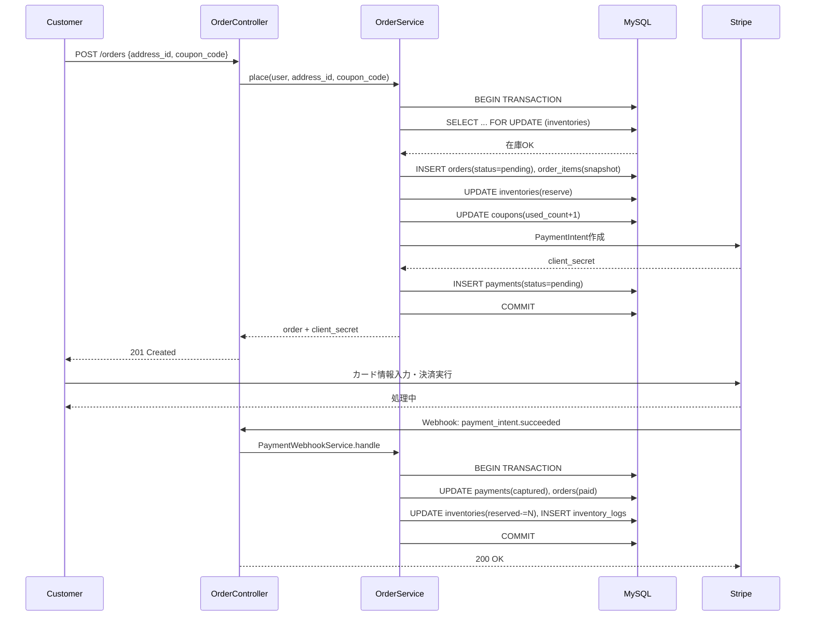
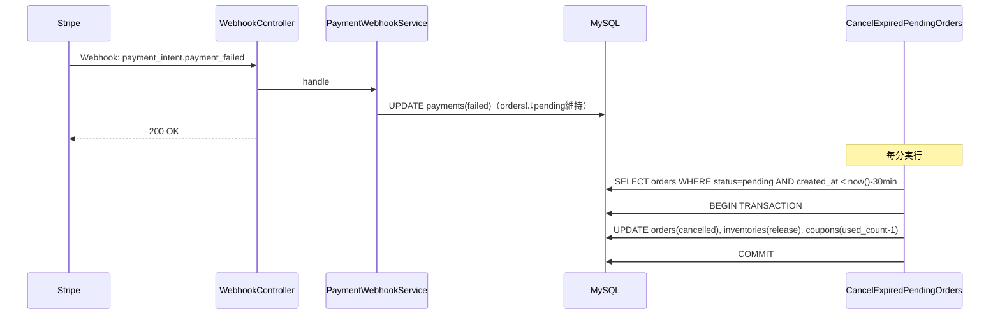

# 詳細設計書

EC Site（ECサイト構築プロジェクト）

---

# 文書管理情報

| 項目 | 内容 |
| --- | --- |
| システム名 | EC Site |
| 文書名 | 詳細設計書 |
| 文書番号 | EC-012 |
| 作成者 | Nguyen Minh Tri |
| 作成日 | 2026/07/13 |
| バージョン | 1.2 |
| ステータス | Draft |

---

# 改訂履歴

| Version | 日付 | 作成者 | 内容 |
| --- | --- | --- | --- |
| 1.0 | 2026/07/13 | Nguyen Minh Tri | 初版作成 |
| 1.1 | 2026/07/14 | Nguyen Minh Tri | 14章にREQ-ID/FUNC-ID逆引き表を追加、E006の一部ケースをE007/E011へ分離。 |
| 1.2 | 2026/07/17 | Nguyen Minh Tri | 3章ディレクトリ構成にResourceNotFoundException/DuplicateReviewExceptionを補記（11章と整合）、5.2節の税率換算表記を明確化（product.tax_rate→tax_categoryから換算）、placed_atの設定タイミングを5.5節（paid時）から5.2節（pending作成時）へ訂正（09_テーブル定義の「注文確定日時」定義と整合）、5.6節の誤記修正。 |

---

# 目次

1. 本書の目的
2. 詳細設計方針
3. ディレクトリ構成
4. Controller詳細設計
5. Service詳細設計（主要処理ロジック）
6. Model詳細設計
7. FormRequest詳細設計（Validation）
8. Middleware詳細設計
9. シーケンス図（主要フロー）
10. トランザクション設計
11. 例外処理詳細設計
12. バッチ・スケジューラ方針
13. ログ出力詳細設計
14. トレーサビリティ
15. まとめ

---

# 1. 本書の目的

本書は`11_基本設計書.md`の外部設計を、実装可能な単位（Controller/Service/Model/FormRequest/Exception）まで分解する。特に5章（Service詳細設計）は、コーディング時に最も参照頻度の高いセクションである。

---

# 2. 詳細設計方針

| 方針ID | 方針 | 内容 |
| --- | --- | --- |
| DD-POL-001 | Fat Service, Thin Controller | 業務ロジックはServiceに集約し、Controllerは入出力の整形のみ行う（Project 01と同一方針）。 |
| DD-POL-002 | 1業務=1トランザクション | 複数テーブルを更新する処理は`DB::transaction()`で必ず囲む。 |
| DD-POL-003 | 例外は業務ごとに1クラス | 業務エラーはカスタムExceptionとして定義し、`render()`でJSON+HTTPステータスを返す。 |
| DD-POL-004 | 悲観的ロック | 在庫更新は`SELECT ... FOR UPDATE`でロックしてから更新する（BR-INV-007）。 |
| DD-POL-005 | スナップショットは作成時に1回だけ | `order_items`/`orders`へのスナップショットは注文確定時の1回のみ行い、以後読み取り専用として扱う。 |

---

# 3. ディレクトリ構成

```
backend/
├── app/
│   ├── Http/
│   │   ├── Controllers/
│   │   │   ├── Auth/AuthController.php
│   │   │   ├── ProductController.php
│   │   │   ├── CategoryController.php
│   │   │   ├── CartController.php
│   │   │   ├── AddressController.php
│   │   │   ├── CouponController.php
│   │   │   ├── OrderController.php
│   │   │   ├── WebhookController.php
│   │   │   ├── ReviewController.php
│   │   │   └── Admin/
│   │   │       ├── ProductController.php
│   │   │       ├── CategoryController.php
│   │   │       ├── VariantController.php
│   │   │       ├── InventoryController.php
│   │   │       ├── OrderController.php
│   │   │       ├── CouponController.php
│   │   │       └── ReportController.php
│   │   ├── Requests/
│   │   │   ├── Auth/...
│   │   │   ├── Cart/AddCartItemRequest.php
│   │   │   ├── Order/PlaceOrderRequest.php
│   │   │   └── Admin/...
│   │   └── Middleware/
│   │       └── EnsureRole.php   # Project 01から流用
│   ├── Services/
│   │   ├── AuthService.php
│   │   ├── ProductService.php
│   │   ├── CartService.php
│   │   ├── InventoryService.php
│   │   ├── CouponService.php
│   │   ├── OrderService.php
│   │   ├── PaymentWebhookService.php
│   │   ├── PaymentService.php     # refund（5.8.1節）。Webhook受信処理はPaymentWebhookServiceに分離
│   │   ├── ReviewService.php
│   │   ├── AdminOrderService.php
│   │   └── ReportService.php
│   ├── Models/
│   │   ├── User.php / Address.php / Category.php / Product.php / ProductVariant.php
│   │   ├── ProductImage.php / Inventory.php / InventoryLog.php
│   │   ├── Cart.php / CartItem.php / Order.php / OrderItem.php
│   │   ├── Payment.php / Shipment.php / Coupon.php / Review.php
│   ├── Exceptions/
│   │   ├── InsufficientStockException.php        # E004
│   │   ├── CouponNotApplicableException.php       # E005
│   │   ├── InvalidOrderStatusTransitionException.php # E006
│   │   ├── ResourceNotFoundException.php          # E007（11章）
│   │   ├── PaymentFailedException.php             # E008
│   │   ├── WebhookSignatureInvalidException.php   # E009
│   │   └── DuplicateReviewException.php           # E011（11章）
│   └── Console/Commands/
│       └── CancelExpiredPendingOrders.php         # BR-INV-006 バッチ
├── database/{migrations,seeders}/
├── routes/{api.php}
└── tests/{Unit,Feature}/
```

---

# 4. Controller詳細設計

| Controller | 主なメソッド | 対応API |
| --- | --- | --- |
| Auth\AuthController | register, login, logout, me, updatePassword | API-001〜005 |
| ProductController | index, show | API-006 / 007 |
| CategoryController | index | API-008 |
| CartController | show, addItem, updateItem, removeItem | API-009〜012 |
| AddressController | index, store, update | API-013 |
| CouponController | validateCode | API-014 |
| OrderController | place, retryPayment, index, show | API-015 / 016 / 018 / 019 |
| WebhookController | handleStripe | API-017 |
| ReviewController | store, indexByProduct | API-020 / 021 |
| Admin\ProductController | store, update, setStatus, storeImage, destroyImage | API-022 / 023 |
| Admin\CategoryController | index, store, update, setStatus | API-024 |
| Admin\VariantController | store, update | API-025 |
| Admin\InventoryController | index, adjust | API-026 / 027 |
| Admin\OrderController | index, updateStatus, storeShipment | API-028〜030 |
| Admin\CouponController | index, store, update, setStatus | API-031 |
| Admin\ReportController | sales, inventory | API-032 / 033 |

---

# 5. Service詳細設計（主要処理ロジック）

## 5.1 CartService::addItem（BR-INV-002）

```text
入力: user_id, variant_id, quantity
1. user_id の active カートを取得、存在しなければ新規作成する
2. product_variants + inventories を variant_id で取得（存在しなければ E007）
3. quantity が inventories.quantity_available を超える場合 → E004（この時点では確保しない、警告目的のみ）
4. cart_items に (cart_id, variant_id) が既に存在する場合 → quantity を加算して更新
   存在しない場合 → 新規行を作成
戻り値: cart_item
```

## 5.2 OrderService::place（本システムの中核処理、BR-ORD-001〜003 / BR-TAX-001〜004 / BR-INV-001〜003 / BR-CPN-001〜004）

```text
入力: user_id, address_id, coupon_code?
1. user_id の active カートを取得、cart_items が空なら E003
2. address_id が user_id 本人の住所であることを確認（他人の住所ならE007）
3. トランザクション開始
4. cart_items の各行について、product_variants + inventories を
   「SELECT ... FOR UPDATE」でロックしながら取得する
   （複数行をロックする際はデッドロック防止のため variant_id 昇順でロックする）
5. 各行で quantity <= inventories.quantity_available を確認、
   不足があれば E004 をスローしトランザクション全体をロールバックする
6. coupon_code が指定されていれば CouponService::validate を呼び出す（E005ならロールバック）
7. 金額を計算する:
     各行: tax_rate = product.tax_categoryから換算（standard=0.10 / reduced=0.08、BR-TAX-001）
           line_subtotal = variant.price * quantity
           line_tax = floor(line_subtotal * tax_rate)  # BR-TAX-004
           line_total = line_subtotal + line_tax
     subtotal = Σ line_subtotal
     tax_total = Σ line_tax
     discount_total = CouponService::calculateDiscount(subtotal, coupon)  # BR-CPN-002
     shipping_fee = 0  # 本スコープでは一律無料（拡張ポイントとして残す）
     grand_total = subtotal + tax_total + shipping_fee - discount_total
8. orders を status=pending, placed_at=now() で作成する。address の内容を shipping_* へコピー（BR-ORD-003）
   （placed_atは「注文確定日時」＝pending作成時点で確定する。09_テーブル定義 TBL-011。決済完了時刻は payments.paid_at が別途持つ）
9. cart_items の各行を order_items へ変換して作成する。
   product_name / variant_label / sku / unit_price / tax_rate をこの時点の値でコピーする（BR-ORD-002）
10. 各 variant について在庫を確保する:
      inventories.quantity_available -= quantity
      inventories.quantity_reserved  += quantity
    inventory_logs に change_type=purchase_deduct は「まだ」記録しない
    （実際の消費確定はWebhook受信時、5.5節参照。ここでは仮押さえのみ）
11. coupon が適用されていれば coupons.used_count += 1（BR-CPN-003）
12. cart.status を converted に更新する（新しいactiveカートは次回追加時に自動作成、5.1節）
13. Stripe PaymentIntent を amount=grand_total で作成し、payments を status=pending で作成する
14. トランザクションコミット
戻り値: order（id, order_number, 金額内訳, stripe_client_secret）
```

## 5.3 CouponService::validate（BR-CPN-001）

```text
入力: coupon_code, subtotal
1. coupons を code で検索、存在しない/status=inactive なら E005
2. today が valid_from 〜 valid_to の範囲外なら E005
3. subtotal < min_purchase_amount なら E005
4. usage_limit が設定されており used_count >= usage_limit なら E005
戻り値: coupon
```

## 5.4 CouponService::calculateDiscount（BR-CPN-002）

```text
入力: subtotal, coupon
1. discount_type == 'fixed' の場合: discount = coupon.discount_value
2. discount_type == 'percent' の場合: discount = floor(subtotal * coupon.discount_value / 100)
3. discount は subtotal を超えない（min(discount, subtotal)）
戻り値: discount_amount
```

## 5.5 PaymentWebhookService::handleStripeEvent（BR-PAY-001〜003 / BR-INV-004〜005）

```text
入力: Stripeイベントペイロード, Stripe-Signatureヘッダ
1. Stripe SDKで署名を検証する。不正なら E009（400、DBへは一切触らない）
2. event.data.object.id（PaymentIntent ID）から payments を stripe_payment_intent_id で検索
   見つからなければログのみ記録し200を返す（自システム管轄外のイベント）
3. 冪等性チェック: payments.status が既に captured/failed の確定状態であれば、
   何もせず200を返す（同一イベントの重複配信対策、BR-PAY-003）
4. event.type == 'payment_intent.succeeded' の場合:
   a. トランザクション開始
   b. payments.status = captured, paid_at = now()
   c. orders.status = pending → paid（placed_atは注文確定時に設定済みのため変更しない、5.2節ステップ8）
   d. 対象 order の各 order_items について:
        inventories.quantity_reserved -= quantity   # 確定消費、availableは5.2節で既に減算済みなので変更しない
        inventory_logs に change_type=purchase_deduct, reference_type=orders, reference_id=order.id で記録
      （BR-INV-004）
   e. トランザクションコミット
5. event.type == 'payment_intent.payment_failed' の場合:
   a. payments.status = failed
   b. orders.status は pending のまま維持する（BR-PAY-002、在庫・クーポンは解放しない。
      解放は5.6節のバッチが期限切れ判定で行う）
6. 200 OK を返す（4-e/5のいずれの場合も、内部エラーが起きても200を返しStripe側リトライには依存しない。
   内部エラーはログに記録し運用手順で復旧する、11章参照）
```

## 5.6 CancelExpiredPendingOrders（バッチ、BR-INV-005〜006）

```text
（スケジューラから毎分実行、12章参照）
1. orders を status=pending かつ created_at < now() - 30分 で抽出する
2. 各 order についてトランザクション開始:
   a. orders.status = cancelled
   b. 各 order_items について:
        inventories.quantity_available += quantity
        inventories.quantity_reserved  -= quantity
        inventory_logs に change_type=release, reference_type=orders, reference_id=order.id で記録
   c. order.coupon_id が設定されていれば coupons.used_count -= 1
   d. トランザクションコミット
```

## 5.7 InventoryService::adjust（BR-INV-008）

```text
入力: variant_id, quantity_change, reason, admin_user_id
1. inventories を variant_id で「SELECT ... FOR UPDATE」取得
2. quantity_available + quantity_change が負になる場合 → E003
3. トランザクション開始
4. inventories.quantity_available += quantity_change
5. inventory_logs に change_type=adjustment, quantity_change, balance_after=更新後の値,
   created_by=admin_user_id で記録
6. トランザクションコミット
戻り値: inventory（更新後）
```

## 5.8 AdminOrderService::updateStatus（BR-ORD-001）

```text
入力: order_id, 新status, admin_user_id
1. orders を id で取得、存在しなければ E007
2. 許可される遷移テーブルと照合する:
     pending  -> {paid(Webhook専用, Adminからは不可), cancelled}
     paid     -> {shipped, cancelled}
     shipped  -> {delivered}
   上記に無い遷移が指定された場合 → E006
3. paid からの cancelled 変更の場合、DBを更新する前に PaymentService::refund（5.8.1節）を呼び出す。
   Stripe返金が失敗したら例外を送出しこの時点で処理全体を中断する（10章：DB確定はStripe成功後の順序を厳守）
4. トランザクション開始
5. orders.status を更新
6. cancelled への変更の場合: 5.6節と同様の在庫解放・クーポン解放処理を実行する
7. トランザクションコミット
```

## 5.8.1 PaymentService::refund（BR-PAY-001の逆操作）

```text
入力: order_id
1. payments を order_id かつ status=captured で検索、存在しなければ E007（返金対象の決済データが見つからない。状態不整合ではなくデータ未検出のため`10_API設計.md`7章のE006/E007使い分けに従いE007とする）
2. Stripe Refund APIを stripe_payment_intent_id を指定して呼び出す
3. Stripe側が失敗を返した場合 → PaymentFailedException相当を送出し、呼び出し元（5.8節）で処理を中断する
4. Stripe側が成功した場合:
     トランザクション開始
     payments.status = refunded
     トランザクションコミット
戻り値: payment（refunded後）
```

## 5.9 AdminOrderService::createShipment（BR-ORD-001）

```text
入力: order_id, carrier, tracking_number
1. orders を id で取得、status != paid なら E006
2. トランザクション開始
3. shipments を作成（status=preparing）
4. orders.status を paid → shipped に更新
5. トランザクションコミット
```

## 5.10 ReviewService::create（BR-REV-001〜002）

```text
入力: user_id, order_item_id, rating, comment
1. order_items を order_item_id で取得し、その親 orders.user_id が user_id 本人であることを確認（E002）
2. 親 orders.status が delivered でなければ E006
3. reviews に同一 order_item_id の既存行があれば E011（重複投稿、BR-REV-002。状態不整合のE006ではなく一意性制約違反として区別する）
4. トランザクション開始
5. reviews を作成（product_id は order_items.variant_id → product_variants.product_id から解決）
6. トランザクションコミット
```

## 5.11 ProductService（Admin商品管理、5.11.1〜5.11.3）

```text
5.11.1 create: products を作成。バリエーション・画像は別APIで後続登録（5.12参照）
5.11.2 update: products を更新
5.11.3 setStatus: products.status を切り替える（ER-003: 物理削除しない）
```

## 5.12 VariantService::create（バリエーション登録時の在庫初期化）

```text
入力: product_id, sku, size, color, price
1. product_variants を作成
2. inventories に variant_id を紐づけ quantity_available=0, quantity_reserved=0 で初期レコードを作成する
   （在庫は別途 5.7 InventoryService::adjust で入荷登録する）
戻り値: variant
```

---

# 6. Model詳細設計

| Model | 主なリレーション | 主なアクセサ/スコープ |
| --- | --- | --- |
| User | hasMany(addresses), hasMany(orders), hasMany(carts) | scopeActive |
| Product | belongsTo(category), hasMany(variants), hasMany(images), hasMany(reviews) | getPriceRangeAttribute（variantsのMIN/MAX） |
| ProductVariant | belongsTo(product), hasOne(inventory), hasMany(inventoryLogs) | - |
| Inventory | belongsTo(variant) | scopeLowStock（quantity_available < 10） |
| Order | belongsTo(user), hasMany(items), hasMany(payments), hasOne(shipment), belongsTo(coupon) | scopeOwnedBy(user), scopePending |
| OrderItem | belongsTo(order), belongsTo(variant) | - |
| Coupon | hasMany(orders) | scopeValid（有効期間・上限） |
| Review | belongsTo(product), belongsTo(user), belongsTo(orderItem) | scopeVisible |

キャスト方針: `orders.grand_total`等の金額列は`integer`キャスト、`order_items.tax_rate`は`decimal:2`キャスト（Project 01の`work_hours`と同じ理由でキャストを明示する、Model詳細は実装時に確定）。

---

# 7. FormRequest詳細設計（Validation）

| FormRequest | 対象API | 主なルール |
| --- | --- | --- |
| RegisterRequest | API-001 | email required/email/unique, password required/min:8 |
| LoginRequest | API-002 | email required, password required |
| AddCartItemRequest | API-010 | variant_id required/exists, quantity required/integer/min:1 |
| PlaceOrderRequest | API-015 | address_id required/exists（本人所有チェックはService側、5.2節） |
| AdjustInventoryRequest | API-027 | quantity_change required/integer, reason required/max:200 |
| UpdateOrderStatusRequest | API-029 | status required/in:pending,paid,shipped,delivered,cancelled（遷移可否はService側） |
| CreateReviewRequest | API-020 | order_item_id required/exists, rating required/integer/between:1,5, comment nullable/max:1000 |

Project 01の方針を踏襲: 「形式チェック」はFormRequest、「業務ルール（DBの現在値に依存する判定）」はServiceで行う（BR-ORD-001の遷移可否、BR-CPN-001の有効性判定等）。

---

# 8. Middleware詳細設計

| Middleware | 用途 |
| --- | --- |
| auth:sanctum | 全Customer/Admin APIに適用 |
| role:admin | Admin配下の全API（`/admin/*`）に適用（Project 01のEnsureRoleをそのまま流用） |
| Webhook用の署名検証 | `WebhookController`内でStripe SDKの`Webhook::constructEvent`を直接使用（Middleware化はせず、Stripeシークレットの取り回しをController内に閉じる） |

---

# 9. シーケンス図（主要フロー）

## 9.1 注文確定〜決済（正常系）



## 9.2 決済失敗〜自動キャンセル



---

# 10. トランザクション設計

| 処理 | トランザクション範囲 | 備考 |
| --- | --- | --- |
| OrderService::place | orders + order_items + inventories + coupons + payments（作成のみ） | 在庫ロック順序を`variant_id`昇順に固定しデッドロックを回避 |
| PaymentWebhookService::handleStripeEvent | payments + orders + inventories + inventory_logs | Webhook受信は再送されうるため冪等性チェックをトランザクション開始前に行う |
| CancelExpiredPendingOrders | orders + inventories + inventory_logs + coupons（1注文単位） | 大量のpending注文を一括処理する場合も、注文単位でトランザクションを分割し1件の失敗が他に波及しないようにする |
| AdminOrderService::updateStatus | orders（+cancelled時は在庫・クーポン解放も含む） | - |
| InventoryService::adjust | inventories + inventory_logs | - |

**決済返金フロー（Admin起因のキャンセル）**: `paid`状態からのキャンセルはStripe側の返金APIを呼び出す処理を伴うため、DBトランザクションとは別に「Stripe返金 成功後にDBを更新する」順序を守る（DB更新が先に成功しStripe返金が失敗すると、返金なしでキャンセル済みという不整合が生じるため）。

---

# 11. 例外処理詳細設計

| Exception | エラーコード | HTTPステータス | 発生元 |
| --- | --- | --- | --- |
| InsufficientStockException | E004 | 409 | CartService, OrderService |
| CouponNotApplicableException | E005 | 409 | CouponService |
| InvalidOrderStatusTransitionException | E006 | 409 | AdminOrderService, ReviewService（未`delivered`の注文へのレビュー） |
| ResourceNotFoundException（Laravel標準の`ModelNotFoundException`を継承） | E007 | 404 | 各Service共通（対象が存在しない場合全般。5.8.1節の返金対象payments未検出を含む） |
| PaymentFailedException | E008 | 402 | OrderService（PaymentIntent作成自体の失敗時） |
| WebhookSignatureInvalidException | E009 | 400 | WebhookController |
| DuplicateReviewException | E011 | 409 | ReviewService（同一order_item_idへの2件目の投稿、BR-REV-002） |

Webhook処理内部で発生したその他の例外（DB接続断等）は、Stripeへは200を返しつつ内部ログに記録する方針とする（9章）。これはStripe Webhookの「失敗時は自動リトライされる」仕組みに反して200を返す一見矛盾した設計だが、リトライに任せると同一イベントが際限なく再送され続けるリスクがあるため、恒久的な内部エラー（バグ等）は運用側の手動対応（`20_運用保守手順書.md`）に委ねる判断とした。

---

# 12. バッチ・スケジューラ方針

| バッチ | 実行頻度 | 内容 |
| --- | --- | --- |
| CancelExpiredPendingOrders | 毎分（Laravel Scheduler + cron） | BR-INV-006の在庫確保期限切れ注文を自動キャンセル |

---

# 13. ログ出力詳細設計

| ログ | 内容 | 出力先 |
| --- | --- | --- |
| Webhook受信ログ | event.id, event.type, 処理結果 | `storage/logs/webhook.log`（想定） |
| 在庫変動ログ | `inventory_logs`テーブル（DBログ、13_インフラ設計と合わせて参照） | DB |
| 決済エラーログ | Stripe API例外の詳細 | `storage/logs/payment.log`（想定） |

---

# 14. トレーサビリティ

## 14.1 REQ-ID / FUNC-ID 逆引き表

本書はController/Service設計をAPI-ID単位で記述しているため（4章・5章）、`07_機能一覧.md`のFUNC-IDや`02_要件定義書.md`のREQ-IDから本書の該当箇所を探す際は、`10_API設計.md`5章のAPI-ID列を経由する。下表は4章のController表にFUNC-ID/REQ-IDを付加したもので、この逆引きを1ステップで完結させる。

| Controller | 対応API | 関連FUNC | 関連REQ |
| --- | --- | --- | --- |
| Auth\AuthController | API-001〜005 | FUNC-001〜004 | REQ-001〜003 / REQ-017 |
| ProductController | API-006 / 007 | FUNC-005〜007 | REQ-005〜007 |
| CategoryController | API-008 | -（補助API、専用FUNCなし） | - |
| CartController | API-009〜012 | FUNC-008 / 009 | REQ-008 / 009 |
| AddressController | API-013 | FUNC-010 | REQ-010 |
| CouponController | API-014 | FUNC-011 | REQ-011 |
| OrderController | API-015 / 016 / 018 / 019 | FUNC-012 / 013 / 014 / 015 / 016 | REQ-012〜015 |
| WebhookController | API-017 | FUNC-013 / 017 / 018 | -（Systemアクター起点のためREQ紐付けなし。`03_ユースケース.md`UC-018参照） |
| ReviewController | API-020 / 021 | FUNC-020 | REQ-016 |
| Admin\ProductController | API-022 / 023 | FUNC-021 / 024 | REQ-018 / 021 |
| Admin\CategoryController | API-024 | FUNC-022 | REQ-019 |
| Admin\VariantController | API-025 | FUNC-023 | REQ-020 |
| Admin\InventoryController | API-026 / 027 | FUNC-019 | REQ-022 |
| Admin\OrderController | API-028〜030 | FUNC-025 / 026 | REQ-023 / 024 |
| Admin\CouponController | API-031 | FUNC-027 | REQ-025 |
| Admin\ReportController | API-032 / 033 | FUNC-028 | REQ-026 |

## 14.2 試験へのトレーサビリティ

`10_API設計.md`のAPI-ID → 本書のService/Controller → `15_単体試験仕様書.md`のUT-ID/`16_結合試験仕様書.md`のIT-IDの順に一意に追跡できる。特にOrderService::place（5.2節）とPaymentWebhookService::handleStripeEvent（5.5節）は、UT-ORD系・IT-PAY系の主要試験対象である。

---

# 15. まとめ

本書の中心はOrderService::place（5.2節）とPaymentWebhookService::handleStripeEvent（5.5節）である。この2メソッドを正確に実装できれば、本プロジェクトの学習目標（トランザクション・在庫・決済）の大部分を達成したことになる。実装時は必ず本章の疑似コードとBR-ID（`02_要件定義書.md`9章）を突き合わせながら進めること。
