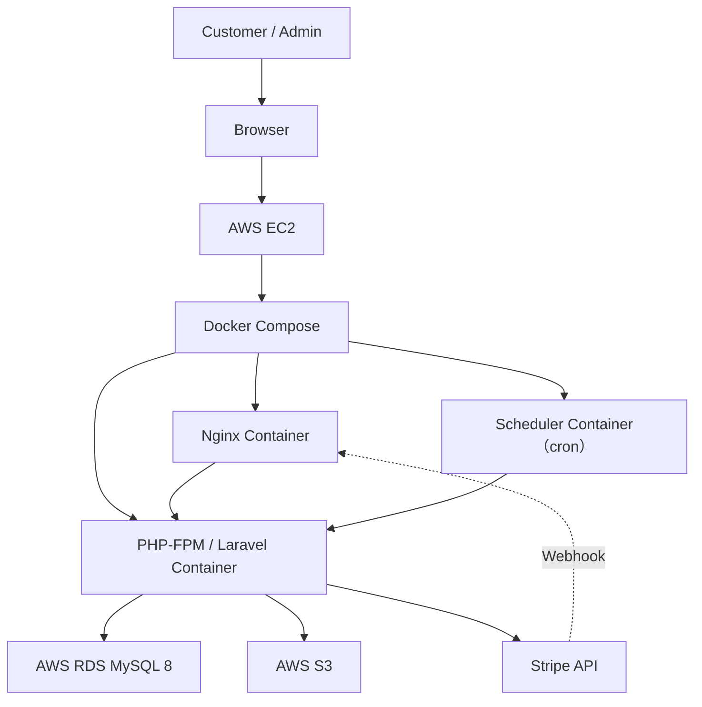

# インフラ設計

EC Site（ECサイト構築プロジェクト）

---

# 文書管理情報

| 項目 | 内容 |
| --- | --- |
| システム名 | EC Site |
| 文書名 | インフラ設計 |
| 文書番号 | EC-013 |
| 作成者 | Nguyen Minh Tri |
| 作成日 | 2026/07/13 |
| バージョン | 1.0 |
| ステータス | Draft |

---

# 改訂履歴

| Version | 日付 | 作成者 | 内容 |
| --- | --- | --- | --- |
| 1.0 | 2026/07/13 | Nguyen Minh Tri | 初版作成 |

---

# 目次

1. 本書の目的
2. インフラ設計方針
3. 全体構成
4. AWS構成
5. Network設計
6. EC2設計
7. Docker設計
8. Nginx設計
9. Application Runtime設計
10. RDS / MySQL設計
11. S3設計
12. Storage / Backup設計
13. Security Group設計
14. 環境変数・Secret管理
15. 監視・ログ設計
16. CI/CD設計
17. バッチ・スケジューラ運用
18. 可用性・復旧設計
19. Cost設計
20. トレーサビリティ
21. まとめ

---

# 1. 本書の目的

本書はEC Siteのインフラ構成を定義する。Project 01（HR & Attendance System）と同一のDocker Compose / AWS基本構成を踏襲しつつ、本プロジェクト特有のS3（商品画像）・Stripe（決済）・バッチ（在庫確保期限切れ処理）の追加要素を定義する。

---

# 2. インフラ設計方針

| 方針ID | 方針 | 内容 |
| --- | --- | --- |
| INF-POL-001 | Docker First | ローカル・本番ともにDocker Composeベースの構成とする（Project 01と統一）。 |
| INF-POL-002 | 段階的AWS移行 | 開発はローカルDocker、検証・本番はAWS EC2+RDS+S3とする。 |
| INF-POL-003 | Secret外部化 | Stripe API Key・DB Password等は環境変数（.env、本番はAWS Secrets Manager想定）で管理し、コードに含めない。 |
| INF-POL-004 | 最小権限 | S3バケットはLaravelアプリケーション用IAMロールのみ書き込み可能とする。 |

---

# 3. 全体構成

## 3.1 Request Flow

`Browser → Nginx → PHP-FPM(Laravel) → MySQL/S3/Stripe`。Project 01と同一のtry_filesパターンを使用する（`try_files $uri $uri/ /index.php?$query_string;`）。

---

# 4. AWS構成

## 4.1 利用AWSサービス

| サービス | 用途 |
| --- | --- |
| EC2 | アプリケーションサーバー（Docker Compose実行） |
| RDS (MySQL 8) | データベース |
| S3 | 商品画像の保存 |
| （将来）ElastiCache (Redis) | 商品一覧キャッシュ（bonus） |
| （将来）CloudWatch | ログ・メトリクス監視 |

## 4.2 環境構成

| 環境 | 用途 |
| --- | --- |
| Local | 開発用Docker Compose、S3の代わりにMinIOまたはローカルディスクを使用可 |
| Development | AWS上の検証環境 |
| Production | 本番環境 |

## 4.3 Region

`ap-northeast-1`（東京リージョン）。Project 01と統一。

---

# 5. Network設計

Project 01と同一のVPC/Subnet設計を再利用する。EC2はPublic Subnet、RDSはPrivate Subnetに配置する。S3はVPCエンドポイント経由でのアクセスを推奨（将来対応、初期はインターネット経由でも可）。

## 5.1 Port設計

| Port | 用途 |
| --- | --- |
| 80/443 | Nginx（HTTP/HTTPS） |
| 3306 | MySQL（EC2からのみ許可） |
| 9000 | PHP-FPM（コンテナ内部通信のみ） |

---

# 6. EC2設計

Project 01と同一構成（t3.micro、Docker/Docker Compose導入済みAMIまたは初回セットアップスクリプトで導入）。

---

# 7. Docker設計

## 7.1 Container構成

| Container | 役割 |
| --- | --- |
| nginx | リバースプロキシ |
| app（PHP-FPM/Laravel） | アプリケーション本体 |
| db（MySQL 8、ローカルのみ。本番はRDS） | データベース |
| scheduler | Laravel Schedulerをcronで実行する軽量コンテナ（Project 01にはなかった新規要素、BR-INV-006のバッチ用） |

## 7.2 Container起動方針

Project 01の`docker-compose.yml`をベースに、`scheduler`サービスを追加する。`scheduler`は`app`と同じイメージを使い、コマンドを`php artisan schedule:work`に変える。

---

# 8. Nginx設計

Project 01の`docker/nginx/default.conf`と同一パターン（`root`を`public/`に限定、`try_files`、隠しファイル拒否）を踏襲する。追加で、Stripe Webhookエンドポイント（`/api/webhooks/stripe`）はCSRF保護対象外とする設定をLaravel側（`bootstrap/app.php`の`withMiddleware`）で行う。

---

# 9. Application Runtime設計

## 9.1 Laravel Runtime

PHP 8.4 / Laravel 12。Project 01と統一し、学習の連続性を優先する。

## 9.2 Filesystem設定

商品画像は`config/filesystems.php`の`s3`ディスクを使用する。ローカル開発では`local`ディスク（`storage/app/public`）にフォールバック可能な構成とする。

## 9.3 Application Health

`/api/health`エンドポイントを維持する（Project 01と同一）。

---

# 10. RDS / MySQL設計

Project 01と同一（db.t3.micro、MySQL 8、utf8mb4）。本プロジェクトでは`SELECT ... FOR UPDATE`を多用するため、トランザクション分離レベルは既定の`REPEATABLE READ`のままとし、意図的な変更は行わない（挙動の変化によるバグ混入を避けるため）。

---

# 11. S3設計

| 項目 | 内容 |
| --- | --- |
| バケット | `ec-site-product-images-{env}` |
| 格納パス | `products/{product_id}/{uuid}.{ext}` |
| アクセス制御 | バケットはPrivate、画像配信はCloudFront経由（将来）またはPre-signed URL/公開読み取り許可（初期はシンプルに公開読み取りのみ許可し、書き込みはIAMロール限定） |
| 削除方針 | 商品画像削除APIでS3オブジェクトも同時削除する |

---

# 12. Storage / Backup設計

| 対象 | 方針 |
| --- | --- |
| RDS | 自動バックアップ（保持7日間、Project 01と同一） |
| S3 | バージョニングを有効化し、誤削除からの復旧を可能にする |
| コード | GitHubリポジトリで管理 |

---

# 13. Security Group設計

Project 01と同一方針（Web SG: 80/443をインターネットに公開、DB SG: EC2からの3306のみ許可）。S3はSGの対象外（IAMポリシーで制御）。

---

# 14. 環境変数・Secret管理

| 変数 | 内容 |
| --- | --- |
| DB_HOST / DB_DATABASE / DB_USERNAME / DB_PASSWORD | RDS接続情報 |
| AWS_ACCESS_KEY_ID / AWS_SECRET_ACCESS_KEY / AWS_BUCKET | S3接続情報（本番はIAMロールを推奨、キー直書きは開発時のみ） |
| STRIPE_KEY / STRIPE_SECRET | Stripe API Key（Sandbox） |
| STRIPE_WEBHOOK_SECRET | Webhook署名検証用シークレット（BR-PAY系の防御の要、絶対にコミットしない） |

---

# 15. 監視・ログ設計

| 監視対象 | 内容 |
| --- | --- |
| CPU / Memory / Disk | Project 01と同一 |
| 決済失敗率 | `payments.status=failed`の直近1時間の件数を将来的にCloudWatchアラート化 |
| Webhook処理エラー | `storage/logs/webhook.log`の異常終了を監視（将来対応） |
| 在庫僅少 | `inventories.quantity_available < 10`のバリエーション数（管理者ダッシュボードSCR-013で表示、将来はSlack通知等を検討） |

---

# 16. CI/CD設計

GitHub Actionsによるpush時自動テスト実行（Project 01と同一）。加えて、`.env.testing`にStripeのテストキーを設定し、Stripe SDKのテストモードでWebhook関連のテストも自動実行できるようにする。

---

# 17. バッチ・スケジューラ運用

| バッチ | 実行方法 |
| --- | --- |
| CancelExpiredPendingOrders（BR-INV-006） | `scheduler`コンテナでLaravel Scheduler（`app/Console/Kernel.php`相当、Laravel 12は`routes/console.php`）を`* * * * *`（毎分）で実行し、内部で該当コマンドを呼び出す |

---

# 18. 可用性・復旧設計

Project 01と同一方針（学習用途のためSLA保証は対象外、RTO 24時間）。決済・注文・在庫データはトランザクションによりRPO=0を担保する（02_要件定義書NFR-007）。

---

# 19. Cost設計

| 項目 | 概算 |
| --- | --- |
| EC2 / RDS | Project 01と共用可能な範囲であれば追加コストなし（別インスタンスにする場合は無料枠内〜数百円/月） |
| S3 | 数十円/月（画像数GB想定） |
| Stripe Sandbox | 無料 |

---

# 20. トレーサビリティ

11_基本設計書3章（システム構成）→ 本書の順に一意に追跡できる。

---

# 21. まとめ

インフラ構成の大部分はProject 01を再利用できる。新規に追加する要素はS3（商品画像）、Stripe（決済・Webhook）、schedulerコンテナ（在庫確保期限切れバッチ）の3点であり、これらが本プロジェクトのインフラ面での学習ポイントである。
