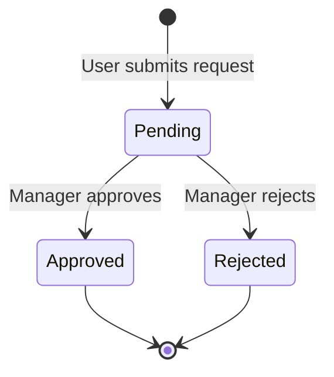
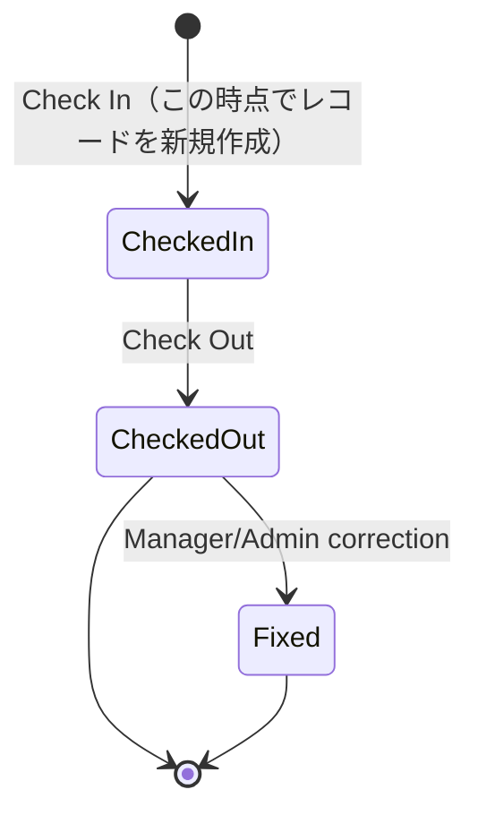

# 要件定義書

HR & Attendance System（勤怠管理システム）

---

# 文書管理情報

| 項目 | 内容 |
| --- | --- |
| システム名 | HR & Attendance System |
| 文書名 | 要件定義書 |
| 文書番号 | DOC-002 |
| 作成者 | Nguyen Minh Tri |
| 作成日 | 2026/06/25 |
| バージョン | 1.2 |
| ステータス | Draft |

---

# 改訂履歴

| Version | 日付 | 作成者 | 内容 |
| --- | --- | --- | --- |
| 1.0 | 2026/06/25 | Nguyen Minh Tri | 初版作成 |
| 1.1 | 2026/07/02 | Nguyen Minh Tri | 整合性レビューによる修正：BR-003に休憩時間の差し引きを明記、leave_requestsのCompleted状態を削除（画面表示時判定に変更）、employeesデータ項目にシフトを追加 |
| 1.2 | 2026/07/02 | Nguyen Minh Tri | 整合性レビューによる修正：attendance_recordsのNotCheckedIn状態を削除（レコード不存在で判定する方針に統一） |

---

# 目次

1. 要件定義の目的
2. システム概要
3. 対象ユーザー
4. 業務範囲
5. 機能要件
6. 要件別受入条件
7. 非機能要件
8. 権限要件
9. 業務ルール
10. 状態遷移
11. データ要件
12. データバリデーションルール
13. 画面要件
14. 外部インターフェース要件
15. セキュリティ要件
16. エラー要件
17. 運用・保守要件
18. 開発対象外
19. 受入条件
20. 用語定義
21. まとめ

---

# 1. 要件定義の目的

本書は、HR & Attendance System（勤怠管理システム）に必要な機能要件、非機能要件、権限、業務ルール、データ要件を定義するものである。

本書で定義した要件は、後続工程で作成する機能一覧、画面設計、ER図、テーブル定義、API設計、試験仕様書の基準とする。

---

# 2. システム概要

本システムは、社員の出勤・退勤、勤怠履歴、休暇申請、管理者承認、社員・部署・シフト管理を行うWebアプリケーションである。

システム構成は以下を想定する。

```text
Browser
   ↓
AWS EC2
   ↓
Docker
   ├── Nginx Container
   ├── PHP-FPM / Laravel Container
   └── Node/Vite Build
   ↓
AWS RDS / MySQL 8
```

バックエンドはPHP 8.4 / Laravel 12、フロントエンドはBlade / HTML / CSS / JavaScript、アセットビルドはNode / Vite、データベースはAWS RDS / MySQL 8を使用する。アプリケーションはAWS EC2上のDocker環境で稼働する。

---

# 3. 対象ユーザー

| ユーザー | 説明 | 主な操作 |
| --- | --- | --- |
| User（一般社員） | 勤怠登録を行う社員 | ログイン、出勤打刻、退勤打刻、勤怠履歴確認、休暇申請 |
| Manager（管理者） | 部門またはチームの勤怠を確認する管理者 | 休暇申請承認、勤怠状況確認、レポート閲覧 |
| Admin（システム管理者） | システム全体を管理する担当者 | 社員管理、部署管理、シフト管理、権限管理 |

---

# 4. 業務範囲

## 4.1 対象業務

| 業務 | 内容 |
| --- | --- |
| 勤怠登録 | 社員が出勤・退勤を打刻する。 |
| 勤怠確認 | 社員または管理者が勤怠履歴を確認する。 |
| 休暇申請 | 社員が有給、欠勤、遅刻、早退を申請する。 |
| 休暇承認 | 管理者が休暇申請を承認または却下する。 |
| 社員管理 | Adminが社員情報を登録、編集、削除する。 |
| 部署管理 | Adminが部署情報を管理する。 |
| シフト管理 | Adminが勤務シフトを管理する。 |
| レポート閲覧 | Managerが月次勤怠情報を確認する。 |

## 4.2 対象外業務

| 業務 | 理由 |
| --- | --- |
| 給与計算 | 初期リリースでは勤怠管理に集中するため。 |
| ICカード打刻 | 専用機器との連携が必要なため。 |
| Slack通知 | 基本機能完成後の追加機能とするため。 |
| 多言語対応 | 初期リリースでは日本語画面を優先するため。 |
| モバイルアプリ | Web版を優先するため。 |

---

# 5. 機能要件

## 5.1 機能要件一覧

| 要件ID | 機能名 | 対象ユーザー | 優先度 | 内容 |
| --- | --- | --- | --- | --- |
| REQ-001 | ログイン | User / Manager / Admin | Must | ユーザーは社員IDまたはメールアドレスとパスワードでログインできる。 |
| REQ-002 | ログアウト | User / Manager / Admin | Must | ログイン中のユーザーはログアウトできる。 |
| REQ-003 | 権限制御 | User / Manager / Admin | Must | ユーザーの権限に応じて利用可能な画面と操作を制御する。 |
| REQ-004 | 出勤打刻 | User | Must | Userは当日の出勤時刻を登録できる。 |
| REQ-005 | 退勤打刻 | User | Must | Userは当日の退勤時刻を登録できる。 |
| REQ-006 | 勤務時間計算 | System | Must | システムは出勤時刻と退勤時刻から勤務時間を計算する。 |
| REQ-007 | 勤怠履歴確認 | User | Must | Userは自分の日別・月別勤怠履歴を確認できる。 |
| REQ-008 | 勤怠検索 | User / Manager | Should | 勤怠履歴を期間、社員、部署などの条件で検索できる。 |
| REQ-009 | 休暇申請 | User | Must | Userは有給、欠勤、遅刻、早退を申請できる。 |
| REQ-010 | 休暇申請一覧 | User / Manager | Must | Userは自分の申請、Managerは承認対象の申請を確認できる。 |
| REQ-011 | 休暇承認 | Manager | Must | Managerは休暇申請を承認または却下できる。 |
| REQ-012 | 勤怠状況確認 | Manager | Must | Managerは担当範囲の社員の勤怠状況を確認できる。 |
| REQ-013 | 月次レポート閲覧 | Manager | Should | Managerは月次勤怠レポートを閲覧できる。 |
| REQ-014 | CSV出力 | Manager / Admin | Should | 勤怠データをCSV形式で出力できる。 |
| REQ-015 | 社員登録 | Admin | Must | Adminは社員情報を登録できる。 |
| REQ-016 | 社員編集 | Admin | Must | Adminは社員情報を編集できる。 |
| REQ-017 | 社員削除 | Admin | Should | Adminは不要な社員情報を削除または無効化できる。 |
| REQ-018 | 部署管理 | Admin | Must | Adminは部署情報を登録、編集、削除できる。 |
| REQ-019 | シフト管理 | Admin | Must | Adminは勤務シフト情報を登録、編集、削除できる。 |
| REQ-020 | パスワード変更 | User / Manager / Admin | Should | ユーザーは自分のパスワードを変更できる。 |
| REQ-021 | 操作ログ記録 | System | Should | 重要操作のログを記録できる。 |

## 5.2 優先度定義

| 優先度 | 意味 |
| --- | --- |
| Must | 初期リリースに必須の要件 |
| Should | 初期リリースで実装したい要件 |
| Could | 余裕があれば実装する要件 |
| Won't | 初期リリースでは実装しない要件 |

---

# 6. 要件別受入条件

主要な機能要件について、Given / When / Then形式で受入条件を定義する。

| 要件ID | Given | When | Then |
| --- | --- | --- | --- |
| REQ-001 | 有効なユーザーが登録されている | 正しい認証情報でログインする | ダッシュボードへ遷移できる |
| REQ-003 | ユーザーがログイン済みである | 権限外の画面へアクセスする | アクセスが拒否される |
| REQ-004 | Userがログイン済みで当日未打刻である | 出勤ボタンを押す | attendance recordに出勤時刻が保存される |
| REQ-005 | Userが当日出勤打刻済みである | 退勤ボタンを押す | 退勤時刻が保存される |
| REQ-006 | 出勤時刻と退勤時刻が登録されている | 勤怠情報を保存する | 勤務時間が自動計算される |
| REQ-007 | Userがログイン済みで勤怠データが存在する | 勤怠履歴画面を開く | 自分の勤怠履歴のみ表示される |
| REQ-009 | Userがログイン済みである | 休暇申請を登録する | leave requestがPending状態で保存される |
| REQ-011 | Managerがログイン済みで承認待ち申請がある | 承認または却下を実行する | 申請状態がApprovedまたはRejectedに更新される |
| REQ-014 | ManagerまたはAdminがログイン済みである | CSV出力を実行する | 権限範囲内の勤怠データCSVをダウンロードできる |
| REQ-015 | Adminがログイン済みである | 社員情報を登録する | employeesに社員情報が保存される |
| REQ-018 | Adminがログイン済みである | 部署情報を登録・編集する | departmentsに部署情報が保存される |
| REQ-019 | Adminがログイン済みである | シフト情報を登録・編集する | shiftsにシフト情報が保存される |

---

# 7. 非機能要件

## 7.1 Performance

| 要件ID | 項目 | 要件 |
| --- | --- | --- |
| NFR-001 | Response Time | 通常操作の画面応答は3秒以内を目標とする。 |
| NFR-002 | Concurrent Users | 初期リリースでは同時接続50ユーザー程度を想定する。 |
| NFR-003 | CSV Export | 月次勤怠CSVは30秒以内に出力できることを目標とする。 |

## 7.2 Availability

| 要件ID | 項目 | 要件 |
| --- | --- | --- |
| NFR-004 | Uptime | 学習用・社内利用想定のため、平日日中の利用を主対象とする。 |
| NFR-005 | SLA | 初期リリースでは明確なSLA保証は対象外とする。 |
| NFR-006 | RTO | 障害発生時は24時間以内の復旧を目標とする。 |
| NFR-007 | RPO | データ損失は最大1日以内を目標とする。 |

## 7.3 Scalability

| 要件ID | 項目 | 要件 |
| --- | --- | --- |
| NFR-008 | Horizontal | 将来的にWebサーバーを複数台構成に拡張できる設計とする。 |
| NFR-009 | Vertical | EC2やRDSのスペック変更により性能向上できる構成とする。 |

## 7.4 Security

| 要件ID | 項目 | 要件 |
| --- | --- | --- |
| NFR-010 | Authentication | ログイン認証を必須とする。 |
| NFR-011 | Authorization | User、Manager、Adminの権限に応じてアクセス制御を行う。 |
| NFR-012 | Encryption | パスワードはハッシュ化して保存する。 |
| NFR-013 | Audit | 重要操作は操作ログとして記録する。 |

## 7.5 Maintainability

| 要件ID | 項目 | 要件 |
| --- | --- | --- |
| NFR-014 | Logging | エラー、アクセス、重要操作のログを確認できるようにする。 |
| NFR-015 | Monitoring | CPU、Memory、Disk、DB、APIの監視を将来対応できる構成とする。 |
| NFR-016 | CI/CD | GitHub Actionsを利用した自動チェック・デプロイを想定する。 |

## 7.6 Usability

| 要件ID | 項目 | 要件 |
| --- | --- | --- |
| NFR-017 | Accessibility | 基本的な視認性、操作性を確保する。 |
| NFR-018 | Multi Language | 初期リリースでは日本語のみ対応する。 |
| NFR-019 | Mobile Support | 初期リリースではPCブラウザを主対象とし、スマートフォン最適化は将来対応とする。 |

---

# 8. 権限要件

| 機能 | User | Manager | Admin |
| --- | --- | --- | --- |
| ログイン / ログアウト | 〇 | 〇 | 〇 |
| 出勤打刻 | 〇 | 〇 | 〇 |
| 退勤打刻 | 〇 | 〇 | 〇 |
| 自分の勤怠履歴確認 | 〇 | 〇 | 〇 |
| 全社員勤怠確認 | × | 〇 | 〇 |
| 休暇申請 | 〇 | 〇 | 〇 |
| 休暇承認 | × | 〇 | 〇 |
| 月次レポート閲覧 | × | 〇 | 〇 |
| CSV出力 | × | 〇 | 〇 |
| 社員管理 | × | × | 〇 |
| 部署管理 | × | × | 〇 |
| シフト管理 | × | × | 〇 |
| 権限管理 | × | × | 〇 |

---

# 9. 業務ルール

| ルールID | ルール | 内容 |
| --- | --- | --- |
| BR-001 | 1日1回の出勤打刻 | 同一勤務日に出勤打刻は原則1回のみ登録できる。 |
| BR-002 | 退勤打刻の順序 | 退勤打刻は出勤打刻後にのみ登録できる。 |
| BR-003 | 勤務時間計算 | 勤務時間は、退勤時刻から出勤時刻を差し引いた時間から、社員に割り当てられたシフトの休憩時間（break_minutes）を差し引いて算出する。 |
| BR-004 | 休暇申請状態 | 休暇申請はPending、Approved、Rejectedの状態を持つ。 |
| BR-005 | 申請後の変更 | 承認済みの休暇申請はUserが直接変更できない。 |
| BR-006 | 承認権限 | ManagerまたはAdminのみ休暇申請を承認・却下できる。 |
| BR-007 | 退職社員 | 退職または無効化された社員はログインできない。 |
| BR-008 | CSV出力範囲 | CSV出力は権限のある社員・部署の勤怠データのみ対象とする。 |

---

# 10. 状態遷移

## 10.1 leave_requests 状態遷移

休暇申請は以下の状態を持つ。DBに保存する状態はPending / Approved / Rejectedの3つのみとし、対象日を経過したApproved申請は状態を変更せず、画面表示時にend_dateと現在日付を比較して「済」ラベルを付与する（バッチ処理を不要にするための方針）。



| 状態 | 説明 | 変更可能者 |
| --- | --- | --- |
| Pending | 承認待ち | User / Manager / Admin |
| Approved | 承認済み（表示時にend_date経過を判定） | Manager / Admin |
| Rejected | 却下済み | Manager / Admin |

## 10.2 attendance_records 状態遷移

レコードは出勤打刻の時点で初めて作成されるため、「出勤打刻前（未出勤）」はDB上の状態として保持しない。該当employee_id・work_dateのレコードが存在しないことをもって、画面側で「未出勤」と判定する。



| 状態 | 説明 |
| --- | --- |
| CheckedIn | 出勤打刻済み、退勤前（レコードはこの状態で新規作成される） |
| CheckedOut | 退勤打刻済み |
| Fixed | 管理者により修正済み |

---

# 11. データ要件

## 11.1 管理対象データ

| データ | 説明 | 主な項目 |
| --- | --- | --- |
| employees | 社員情報 | 社員ID、氏名、メール、部署、シフト、役割、状態 |
| departments | 部署情報 | 部署ID、部署名、状態 |
| roles | 権限情報 | 権限ID、権限名 |
| shifts | シフト情報 | シフトID、開始時刻、終了時刻、休憩時間 |
| attendance_records | 勤怠情報 | 勤務日、出勤時刻、退勤時刻、勤務時間、状態 |
| leave_requests | 休暇申請情報 | 申請種別、開始日、終了日、理由、承認状態 |
| audit_logs | 操作ログ | 操作者、操作内容、対象、実行日時 |

## 11.2 データ保持

| データ | 保持方針 |
| --- | --- |
| 社員情報 | 利用中は保持し、退職後は無効化状態で保持する。 |
| 勤怠情報 | 月次レポート作成のため保持する。 |
| 休暇申請情報 | 承認履歴確認のため保持する。 |
| 操作ログ | トラブル調査のため一定期間保持する。 |

---

# 12. データバリデーションルール

| 対象 | 項目 | ルール |
| --- | --- | --- |
| employees | employee_id | Required / Unique / Max 50 |
| employees | name | Required / Max 100 |
| employees | email | Required / Email Format / Max 255 / Unique |
| employees | password | Required / 8〜20 chars / Hash保存 |
| employees | role_id | Required / rolesに存在すること |
| employees | department_id | Required / departmentsに存在すること |
| departments | department_name | Required / Max 100 / Unique |
| shifts | shift_name | Required / Max 100 |
| shifts | start_time | Required / Time Format |
| shifts | end_time | Required / Time Format / start_timeより後 |
| shifts | break_minutes | Required / Integer / 0以上 |
| attendance_records | work_date | Required / Date Format |
| attendance_records | check_in_time | Required for Check In / Time Format |
| attendance_records | check_out_time | Required for Check Out / Time Format / check_in_timeより後 |
| leave_requests | leave_type | Required / paid_leave, absence, late, early_leaveのいずれか |
| leave_requests | start_date | Required / Date Format |
| leave_requests | end_date | Required / Date Format / start_date以降 |
| leave_requests | reason | Required / Max 500 |

---

# 13. 画面要件

| 画面ID | 画面名 | 対象ユーザー | 概要 |
| --- | --- | --- | --- |
| SCR-001 | ログイン画面 | User / Manager / Admin | 認証情報を入力してログインする。 |
| SCR-002 | ダッシュボード | User / Manager / Admin | ログイン後のトップ画面。 |
| SCR-003 | 打刻画面 | User / Manager / Admin | 出勤・退勤を登録する。 |
| SCR-004 | 勤怠履歴画面 | User / Manager / Admin | 勤怠履歴を確認する。 |
| SCR-005 | 休暇申請画面 | User / Manager / Admin | 休暇申請を登録する。 |
| SCR-006 | 休暇承認画面 | Manager / Admin | 申請を承認・却下する。 |
| SCR-007 | 社員管理画面 | Admin | 社員情報を管理する。 |
| SCR-008 | 部署管理画面 | Admin | 部署情報を管理する。 |
| SCR-009 | シフト管理画面 | Admin | シフト情報を管理する。 |
| SCR-010 | レポート画面 | Manager / Admin | 月次勤怠レポートを確認する。 |

---

# 14. 外部インターフェース要件

初期リリースでは外部システム連携は対象外とする。

ただし、将来的に以下の連携を検討できる設計とする。

* 給与計算システム連携
* ICカード打刻連携
* Slack通知
* メール通知

---

# 15. セキュリティ要件

| 要件ID | 要件 | 内容 |
| --- | --- | --- |
| SEC-001 | 認証必須 | ログインしていないユーザーは業務画面を利用できない。 |
| SEC-002 | 権限制御 | 権限のない画面、API、操作にアクセスできない。 |
| SEC-003 | パスワード保護 | パスワードは平文で保存しない。 |
| SEC-004 | 入力チェック | 入力値に対して必須、形式、桁数のチェックを行う。 |
| SEC-005 | 操作ログ | 承認、削除、権限変更などの重要操作を記録する。 |

---

# 16. エラー要件

| エラーID | エラー名 | 発生条件 | 表示・処理 |
| --- | --- | --- | --- |
| E001 | Login Failed | 認証情報が一致しない | ログインに失敗した旨を表示する |
| E002 | Permission Denied | 権限外の画面・操作にアクセスした | アクセス権限がない旨を表示する |
| E003 | Validation Error | 必須、形式、桁数、日付範囲が不正 | 対象項目ごとにエラーを表示する |
| E004 | Duplicate Attendance | 同一日に出勤または退勤を重複登録した | 二重打刻できない旨を表示する |
| E005 | Check Out Without Check In | 出勤打刻なしで退勤打刻した | 先に出勤打刻が必要である旨を表示する |
| E006 | Leave Request Already Processed | 処理済み申請を更新しようとした | 最新状態を再表示する |
| E007 | Data Not Found | 対象データが存在しない | データが見つからない旨を表示する |
| E008 | CSV Export Failed | CSV生成に失敗した | エラーメッセージを表示し、ログを記録する |
| E009 | Database Error | DB登録・更新・検索でエラーが発生した | システムエラーを表示し、ログを記録する |
| E010 | Session Timeout | セッションが期限切れになった | ログイン画面へ遷移する |

---

# 17. 運用・保守要件

| 要件ID | 要件 | 内容 |
| --- | --- | --- |
| OPS-001 | バックアップ | DBバックアップを取得できる構成とする。 |
| OPS-002 | ログ確認 | アプリケーションログ、エラーログを確認できるようにする。 |
| OPS-003 | 障害対応 | 障害発生時に原因調査と復旧手順を実行できるようにする。 |
| OPS-004 | デプロイ | GitHub Actions、Docker、Nginxを利用したデプロイを想定する。 |
| OPS-005 | 変更管理 | 仕様変更はIssueまたはドキュメントで管理する。 |

---

# 18. 開発対象外

| 項目 | 理由 |
| --- | --- |
| 給与計算 | Phase2で対応予定とする。 |
| 外部システム連携 | MVP対象外とする。 |
| ICカード連携 | 専用機器が必要なため将来対応とする。 |
| 多言語対応 | 初期リリースでは日本語のみとする。 |
| 24/7高可用性構成 | 初期リリースでは学習用・社内利用想定のため対象外とする。 |

---

# 19. 受入条件

本システムは、以下を満たした場合に初期リリース可能と判断する。

| 条件ID | 受入条件 |
| --- | --- |
| AC-001 | User、Manager、Adminが正常にログインできる。 |
| AC-002 | Userが出勤・退勤を登録できる。 |
| AC-003 | Userが自分の勤怠履歴を確認できる。 |
| AC-004 | Userが休暇申請を登録できる。 |
| AC-005 | Managerが休暇申請を承認・却下できる。 |
| AC-006 | Adminが社員、部署、シフトを管理できる。 |
| AC-007 | 権限のないユーザーが管理機能へアクセスできない。 |
| AC-008 | 月次勤怠情報を画面で確認できる。 |
| AC-009 | 主要な正常系・異常系テストが完了している。 |

---

# 20. 用語定義

| 用語 | 意味 |
| --- | --- |
| 打刻 | 出勤または退勤の時刻を登録すること。 |
| 勤怠 | 出勤、退勤、休暇、遅刻、早退などの勤務状況。 |
| 休暇申請 | 有給、欠勤、遅刻、早退などを申請すること。 |
| Manager | 休暇承認や勤怠確認を行う管理者。 |
| Admin | 社員、部署、シフト、権限を管理するシステム管理者。 |
| RTO | 障害発生から復旧までの目標時間。 |
| RPO | 障害発生時に許容するデータ損失範囲。 |

---

# 21. まとめ

本書では、HR & Attendance Systemの機能要件、非機能要件、権限、業務ルール、データ要件、受入条件を定義した。

本システムの初期リリースでは、ログイン、打刻、勤怠履歴確認、休暇申請、休暇承認、社員管理、部署管理、シフト管理、レポート閲覧を中心に実装する。

本書の要件IDを基準として、後続の機能一覧、画面設計、ER図、テーブル定義、API設計、試験仕様書へ展開する。
