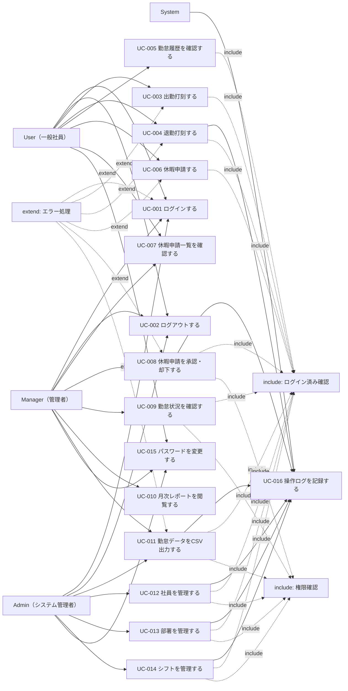

# ユースケース

HR & Attendance System（勤怠管理システム）

---

# 文書管理情報

| 項目 | 内容 |
| --- | --- |
| システム名 | HR & Attendance System |
| 文書名 | ユースケース |
| 文書番号 | DOC-003 |
| 作成者 | Nguyen Minh Tri |
| 作成日 | 2026/06/25 |
| バージョン | 1.1 |
| ステータス | Draft |

---

# 改訂履歴

| Version | 日付 | 作成者 | 内容 |
| --- | --- | --- | --- |
| 1.0 | 2026/06/25 | Nguyen Minh Tri | 初版作成 |
| 1.1 | 2026/07/14 | Nguyen Minh Tri | 整合性レビューによる修正：UC-003/UC-004の基本フローを「システムが現在時刻を登録」から「Userが入力した時刻を登録」に変更し、10_API設計・12_詳細設計書・15_単体試験仕様書（クライアント送信のcheck_in_time/check_out_time）と統一 |

---

# 目次

1. 本書の目的
2. アクター定義
3. ユースケース一覧
4. ユースケース図
5. Include / Extend 関係
6. 共通事前条件・事後条件
7. ユースケース詳細
8. ユースケースと要件の対応
9. 例外・共通ルール
10. まとめ

---

# 1. 本書の目的

本書は、HR & Attendance Systemの利用者とシステムの相互作用をユースケースとして整理するものである。

本書で定義したユースケースは、要件定義書、業務フロー、画面設計、API設計、試験仕様書へ展開するための基準とする。

---

# 2. アクター定義

| アクター | 説明 | 主な利用目的 |
| --- | --- | --- |
| User（一般社員） | 勤怠登録を行う社員 | ログイン、出勤打刻、退勤打刻、勤怠履歴確認、休暇申請 |
| Manager（管理者） | 部門またはチームの勤怠を確認する管理者 | 休暇申請承認、勤怠状況確認、レポート閲覧 |
| Admin（システム管理者） | システム全体を管理する担当者 | 社員管理、部署管理、シフト管理、権限管理 |
| System | 自動処理を行うシステム | 勤務時間計算、権限制御、操作ログ記録 |

---

# 3. ユースケース一覧

| UC ID | ユースケース名 | 主アクター | 関連REQ | 関連画面 | 優先度 |
| --- | --- | --- | --- | --- | --- |
| UC-001 | ログインする | User / Manager / Admin | REQ-001 / REQ-003 | SCR-001 | Must |
| UC-002 | ログアウトする | User / Manager / Admin | REQ-002 | SCR-002 | Must |
| UC-003 | 出勤打刻する | User | REQ-004 | SCR-003 | Must |
| UC-004 | 退勤打刻する | User | REQ-005 / REQ-006 | SCR-003 | Must |
| UC-005 | 勤怠履歴を確認する | User | REQ-007 / REQ-008 | SCR-004 | Must |
| UC-006 | 休暇申請する | User | REQ-009 | SCR-005 | Must |
| UC-007 | 休暇申請一覧を確認する | User / Manager | REQ-010 | SCR-005 / SCR-006 | Must |
| UC-008 | 休暇申請を承認・却下する | Manager | REQ-011 | SCR-006 | Must |
| UC-009 | 勤怠状況を確認する | Manager | REQ-012 / REQ-008 | SCR-004 | Must |
| UC-010 | 月次レポートを閲覧する | Manager | REQ-013 | SCR-010 | Should |
| UC-011 | 勤怠データをCSV出力する | Manager / Admin | REQ-014 | SCR-010 | Should |
| UC-012 | 社員を管理する | Admin | REQ-015 / REQ-016 / REQ-017 | SCR-007 | Must |
| UC-013 | 部署を管理する | Admin | REQ-018 | SCR-008 | Must |
| UC-014 | シフトを管理する | Admin | REQ-019 | SCR-009 | Must |
| UC-015 | パスワードを変更する | User / Manager / Admin | REQ-020 | SCR-002 | Should |
| UC-016 | 操作ログを記録する | System | REQ-021 | - | Should |

---

# 4. ユースケース図

---

# 5. Include / Extend 関係

## 5.1 Include

複数のユースケースで必ず実行される共通処理をincludeとして定義する。

| Include ID | 共通処理 | 対象ユースケース | 内容 |
| --- | --- | --- | --- |
| INC-001 | ログイン済み確認 | UC-003〜UC-015 | 業務機能を実行する前にセッションを確認する。 |
| INC-002 | 権限確認 | UC-008〜UC-014 | ManagerまたはAdmin権限が必要な操作で権限を確認する。 |
| INC-003 | 入力チェック | UC-001 / UC-006 / UC-012 / UC-013 / UC-014 | 必須、形式、桁数、重複を確認する。 |
| INC-004 | 操作ログ記録 | UC-008 / UC-011 / UC-012 / UC-013 / UC-014 | 重要操作をaudit logに記録する。 |

## 5.2 Extend

通常フローから条件付きで発生する処理をextendとして定義する。

| Extend ID | 拡張処理 | 発生条件 | 対象ユースケース |
| --- | --- | --- | --- |
| EXT-001 | セッションタイムアウト | セッション期限切れ | UC-003〜UC-015 |
| EXT-002 | 権限エラー | 権限外の操作 | UC-008〜UC-014 |
| EXT-003 | DBエラー | 登録、更新、検索、CSV出力失敗 | UC-003 / UC-004 / UC-006 / UC-008 / UC-011〜UC-014 |
| EXT-004 | バリデーションエラー | 入力値不正 | UC-001 / UC-006 / UC-012 / UC-013 / UC-014 |

---

# 6. 共通事前条件・事後条件

## 6.1 共通事前条件

| 条件ID | 内容 |
| --- | --- |
| PRE-001 | ユーザーがシステムに登録されていること。 |
| PRE-002 | ユーザーが有効状態であること。 |
| PRE-003 | 業務機能を利用する場合、ユーザーがログイン済みであること。 |
| PRE-004 | Manager / Admin機能を利用する場合、必要な権限を持つこと。 |
| PRE-005 | 登録・更新対象の関連マスタが存在すること。 |

## 6.2 共通事後条件

| 条件ID | 内容 |
| --- | --- |
| POST-001 | 登録・更新・削除または無効化の結果がDBに保存されること。 |
| POST-002 | 重要操作は操作ログに記録されること。 |
| POST-003 | エラー発生時はデータ不整合を起こさないこと。 |
| POST-004 | 権限外アクセス時は対象データが表示・変更されないこと。 |

---

# 7. ユースケース詳細

## 7.1 UC-001 ログインする

| 項目 | 内容 |
| --- | --- |
| UC ID | UC-001 |
| ユースケース名 | ログインする |
| 主アクター | User / Manager / Admin |
| 関連要件 | REQ-001 / REQ-003 |
| 関連画面 | SCR-001 |
| 事前条件 | ユーザー情報が登録され、有効状態であること。 |
| 事後条件 | ユーザーが権限に応じた画面へ遷移できること。 |

### 基本フロー

1. ユーザーはログイン画面を開く。
2. ユーザーは社員IDまたはメールアドレスとパスワードを入力する。
3. システムは入力値を検証する。
4. システムは認証情報を確認する。
5. システムはユーザーの権限を判定する。
6. システムはダッシュボードを表示する。

### 代替・例外フロー

| ケース | 内容 |
| --- | --- |
| 入力不足 | 必須項目のエラーメッセージを表示する。 |
| 認証失敗 | ログイン失敗メッセージを表示する。 |
| 無効ユーザー | ログインを拒否する。 |
| DBエラー | システムエラーを表示し、エラーログを記録する。 |

---

## 7.2 UC-003 出勤打刻する

| 項目 | 内容 |
| --- | --- |
| UC ID | UC-003 |
| ユースケース名 | 出勤打刻する |
| 主アクター | User |
| 関連要件 | REQ-004 |
| 関連画面 | SCR-003 |
| 事前条件 | Userがログイン済みであること。 |
| 事後条件 | 当日の出勤時刻が登録されること。 |

### 基本フロー

1. Userは打刻画面を開く。
2. Userは出勤時刻を入力し、出勤ボタンを押す（画面初期値は端末の現在時刻だが、送信値はUserが確定した時刻とする）。
3. システムは当日の出勤打刻の有無を確認する。
4. システムはUserが入力した時刻を出勤時刻として登録する（10_API設計 API-004、クライアントがcheck_in_timeを送信する方式に統一）。
5. システムは登録完了メッセージを表示する。

### 代替・例外フロー

| ケース | 内容 |
| --- | --- |
| 既に出勤打刻済み | 二重打刻を防止し、エラーメッセージを表示する。 |
| ログイン期限切れ | ログイン画面へ遷移する。 |
| DBエラー | 登録を中止し、エラーメッセージを表示する。 |

---

## 7.3 UC-004 退勤打刻する

| 項目 | 内容 |
| --- | --- |
| UC ID | UC-004 |
| ユースケース名 | 退勤打刻する |
| 主アクター | User |
| 関連要件 | REQ-005 / REQ-006 |
| 関連画面 | SCR-003 |
| 事前条件 | Userがログイン済みであり、当日の出勤打刻が登録済みであること。 |
| 事後条件 | 退勤時刻と勤務時間が登録されること。 |

### 基本フロー

1. Userは打刻画面を開く。
2. Userは退勤時刻を入力し、退勤ボタンを押す（画面初期値は端末の現在時刻だが、送信値はUserが確定した時刻とする）。
3. システムは当日の出勤打刻を確認する。
4. システムはUserが入力した時刻を退勤時刻として登録する（10_API設計 API-005、クライアントがcheck_out_timeを送信する方式に統一）。
5. システムは出勤時刻と退勤時刻から勤務時間を計算する。
6. システムは登録完了メッセージを表示する。

### 代替・例外フロー

| ケース | 内容 |
| --- | --- |
| 出勤打刻なし | 退勤打刻を拒否し、出勤打刻が必要であることを表示する。 |
| 既に退勤打刻済み | 二重打刻を防止し、エラーメッセージを表示する。 |
| ログイン期限切れ | ログイン画面へ遷移する。 |
| DBエラー | 登録を中止し、エラーメッセージを表示する。 |

---

## 7.4 UC-005 勤怠履歴を確認する

| 項目 | 内容 |
| --- | --- |
| UC ID | UC-005 |
| ユースケース名 | 勤怠履歴を確認する |
| 主アクター | User |
| 関連要件 | REQ-007 / REQ-008 |
| 関連画面 | SCR-004 |
| 事前条件 | Userがログイン済みであること。 |
| 事後条件 | Userが自分の勤怠履歴を確認できること。 |

### 基本フロー

1. Userは勤怠履歴画面を開く。
2. Userは対象年月または期間を指定する。
3. システムは対象期間の勤怠データを検索する。
4. システムは日別勤怠一覧を表示する。

### 代替・例外フロー

| ケース | 内容 |
| --- | --- |
| データなし | データが存在しない旨を表示する。 |
| 不正な期間 | 期間入力のエラーメッセージを表示する。 |
| ログイン期限切れ | ログイン画面へ遷移する。 |

---

## 7.5 UC-006 休暇申請する

| 項目 | 内容 |
| --- | --- |
| UC ID | UC-006 |
| ユースケース名 | 休暇申請する |
| 主アクター | User |
| 関連要件 | REQ-009 |
| 関連画面 | SCR-005 |
| 事前条件 | Userがログイン済みであること。 |
| 事後条件 | 休暇申請がPending状態で登録されること。 |

### 基本フロー

1. Userは休暇申請画面を開く。
2. Userは申請種別、対象日、理由を入力する。
3. システムは入力内容を検証する。
4. システムは休暇申請をPending状態で登録する。
5. システムは登録完了メッセージを表示する。

### 代替・例外フロー

| ケース | 内容 |
| --- | --- |
| 必須項目不足 | 入力エラーを表示する。 |
| 対象日が不正 | 日付エラーを表示する。 |
| 重複申請 | 既存申請がある場合、確認またはエラーを表示する。 |
| ログイン期限切れ | ログイン画面へ遷移する。 |
| DBエラー | 登録を中止し、エラーメッセージを表示する。 |

---

## 7.6 UC-008 休暇申請を承認・却下する

| 項目 | 内容 |
| --- | --- |
| UC ID | UC-008 |
| ユースケース名 | 休暇申請を承認・却下する |
| 主アクター | Manager |
| 関連要件 | REQ-011 |
| 関連画面 | SCR-006 |
| 事前条件 | Managerがログイン済みであり、承認対象の申請が存在すること。 |
| 事後条件 | 休暇申請の状態がApprovedまたはRejectedに更新されること。 |

### 基本フロー

1. Managerは休暇承認画面を開く。
2. システムは承認待ち申請一覧を表示する。
3. Managerは申請内容を確認する。
4. Managerは承認または却下を選択する。
5. システムは申請状態を更新する。
6. システムは操作ログを記録する。

### 代替・例外フロー

| ケース | 内容 |
| --- | --- |
| 対象申請なし | 承認待ち申請がない旨を表示する。 |
| 既に処理済み | 更新を拒否し、最新状態を表示する。 |
| 権限なし | アクセスを拒否する。 |
| ログイン期限切れ | ログイン画面へ遷移する。 |
| DBエラー | 更新を中止し、エラーログを記録する。 |

---

## 7.7 UC-009 勤怠状況を確認する

| 項目 | 内容 |
| --- | --- |
| UC ID | UC-009 |
| ユースケース名 | 勤怠状況を確認する |
| 主アクター | Manager |
| 関連要件 | REQ-012 / REQ-008 |
| 関連画面 | SCR-004 |
| 事前条件 | Managerがログイン済みであること。 |
| 事後条件 | Managerが担当範囲の社員の勤怠状況を確認できること。 |

### 基本フロー

1. Managerは勤怠履歴画面を開く。
2. Managerは対象部署、社員、期間を指定する。
3. システムは条件に一致する勤怠データを検索する。
4. システムは勤怠一覧を表示する。

### 代替・例外フロー

| ケース | 内容 |
| --- | --- |
| 検索結果なし | 該当データがない旨を表示する。 |
| 権限外の社員指定 | 検索を拒否する。 |
| ログイン期限切れ | ログイン画面へ遷移する。 |

---

## 7.8 UC-011 勤怠データをCSV出力する

| 項目 | 内容 |
| --- | --- |
| UC ID | UC-011 |
| ユースケース名 | 勤怠データをCSV出力する |
| 主アクター | Manager / Admin |
| 関連要件 | REQ-014 |
| 関連画面 | SCR-010 |
| 事前条件 | ManagerまたはAdminがログイン済みであること。 |
| 事後条件 | 勤怠データがCSV形式で出力されること。 |

### 基本フロー

1. ManagerまたはAdminはレポート画面を開く。
2. 対象年月、部署、社員などの条件を指定する。
3. システムはCSV出力対象データを検索する。
4. システムはCSVファイルを生成する。
5. ユーザーはCSVファイルをダウンロードする。
6. システムは操作ログを記録する。

### 代替・例外フロー

| ケース | 内容 |
| --- | --- |
| 対象データなし | 空データまたはエラーメッセージを表示する。 |
| 出力エラー | エラーメッセージを表示し、ログを記録する。 |
| 権限なし | アクセスを拒否する。 |
| DBエラー | CSV生成を中止し、エラーログを記録する。 |

---

## 7.9 UC-012 社員を管理する

| 項目 | 内容 |
| --- | --- |
| UC ID | UC-012 |
| ユースケース名 | 社員を管理する |
| 主アクター | Admin |
| 関連要件 | REQ-015 / REQ-016 / REQ-017 |
| 関連画面 | SCR-007 |
| 事前条件 | Adminがログイン済みであること。 |
| 事後条件 | 社員情報が登録、更新、削除または無効化されること。 |

### 基本フロー

1. Adminは社員管理画面を開く。
2. Adminは社員情報の登録、編集、削除または無効化を選択する。
3. システムは入力内容を検証する。
4. システムは社員情報を保存する。
5. システムは操作ログを記録する。

### 代替・例外フロー

| ケース | 内容 |
| --- | --- |
| 必須項目不足 | 入力エラーを表示する。 |
| メール重複 | 重複エラーを表示する。 |
| 権限なし | アクセスを拒否する。 |
| DBエラー | 保存を中止し、エラーログを記録する。 |

---

## 7.10 UC-013 部署を管理する

| 項目 | 内容 |
| --- | --- |
| UC ID | UC-013 |
| ユースケース名 | 部署を管理する |
| 主アクター | Admin |
| 関連要件 | REQ-018 |
| 関連画面 | SCR-008 |
| 事前条件 | Adminがログイン済みであること。 |
| 事後条件 | 部署情報が登録、更新、削除または無効化されること。 |

### 基本フロー

1. Adminは部署管理画面を開く。
2. Adminは部署情報の登録、編集、削除または無効化を選択する。
3. システムは入力内容を検証する。
4. システムは部署情報を保存する。
5. システムは操作ログを記録する。

### 代替・例外フロー

| ケース | 内容 |
| --- | --- |
| 部署名重複 | 重複エラーを表示する。 |
| 使用中部署の削除 | 削除を拒否し、無効化を案内する。 |
| 権限なし | アクセスを拒否する。 |
| DBエラー | 保存を中止し、エラーログを記録する。 |

---

## 7.11 UC-014 シフトを管理する

| 項目 | 内容 |
| --- | --- |
| UC ID | UC-014 |
| ユースケース名 | シフトを管理する |
| 主アクター | Admin |
| 関連要件 | REQ-019 |
| 関連画面 | SCR-009 |
| 事前条件 | Adminがログイン済みであること。 |
| 事後条件 | シフト情報が登録、更新、削除または無効化されること。 |

### 基本フロー

1. Adminはシフト管理画面を開く。
2. Adminはシフト情報の登録、編集、削除または無効化を選択する。
3. システムは開始時刻、終了時刻、休憩時間を検証する。
4. システムはシフト情報を保存する。
5. システムは操作ログを記録する。

### 代替・例外フロー

| ケース | 内容 |
| --- | --- |
| 時刻範囲不正 | 開始時刻、終了時刻のエラーを表示する。 |
| 使用中シフトの削除 | 削除を拒否し、無効化を案内する。 |
| 権限なし | アクセスを拒否する。 |
| DBエラー | 保存を中止し、エラーログを記録する。 |

---

# 8. ユースケースと要件の対応

| UC ID | 関連REQ | 関連SCR | 備考 |
| --- | --- | --- | --- |
| UC-001 | REQ-001 / REQ-003 | SCR-001 | 認証・権限制御 |
| UC-002 | REQ-002 | SCR-002 | ログアウト |
| UC-003 | REQ-004 | SCR-003 | 出勤打刻 |
| UC-004 | REQ-005 / REQ-006 | SCR-003 | 退勤打刻・勤務時間計算 |
| UC-005 | REQ-007 / REQ-008 | SCR-004 | 自分の勤怠履歴 |
| UC-006 | REQ-009 | SCR-005 | 休暇申請 |
| UC-007 | REQ-010 | SCR-005 / SCR-006 | 申請一覧 |
| UC-008 | REQ-011 / REQ-021 | SCR-006 | 承認・ログ |
| UC-009 | REQ-012 / REQ-008 | SCR-004 | 管理者確認 |
| UC-010 | REQ-013 | SCR-010 | 月次レポート |
| UC-011 | REQ-014 / REQ-021 | SCR-010 | CSV出力・ログ |
| UC-012 | REQ-015 / REQ-016 / REQ-017 / REQ-021 | SCR-007 | 社員管理・ログ |
| UC-013 | REQ-018 / REQ-021 | SCR-008 | 部署管理・ログ |
| UC-014 | REQ-019 / REQ-021 | SCR-009 | シフト管理・ログ |
| UC-015 | REQ-020 | SCR-002 | パスワード変更 |
| UC-016 | REQ-021 | - | 操作ログ |

---

# 9. 例外・共通ルール

| ルールID | 内容 |
| --- | --- |
| UC-RULE-001 | ログインしていないユーザーは業務画面を利用できない。 |
| UC-RULE-002 | 権限のない画面、機能、データにはアクセスできない。 |
| UC-RULE-003 | 登録、更新、削除、承認、CSV出力などの重要操作はログ記録対象とする。 |
| UC-RULE-004 | 必須項目、形式、日付範囲、重複は各画面でチェックする。 |
| UC-RULE-005 | 削除によって履歴不整合が起きる場合は、物理削除ではなく無効化を優先する。 |
| UC-RULE-006 | DBエラー発生時は処理を中断し、データ不整合を防止する。 |
| UC-RULE-007 | セッションタイムアウト時はログイン画面へ遷移し、元の操作は保存しない。 |

---

# 10. まとめ

本書では、HR & Attendance Systemにおけるアクター、ユースケース、基本フロー、例外フロー、要件との対応関係を定義した。

本書のUC IDを基準として、業務フロー、画面設計、API設計、試験仕様書へ展開する。

