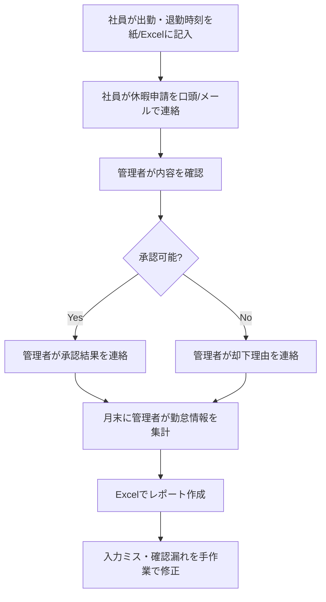
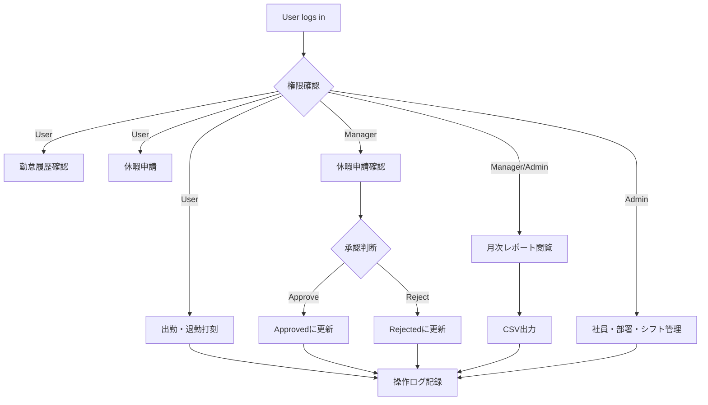
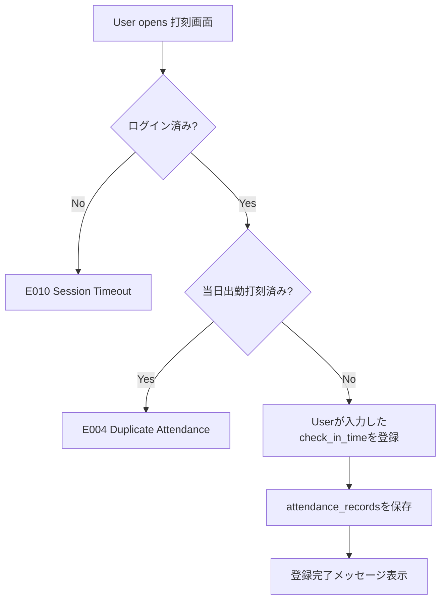
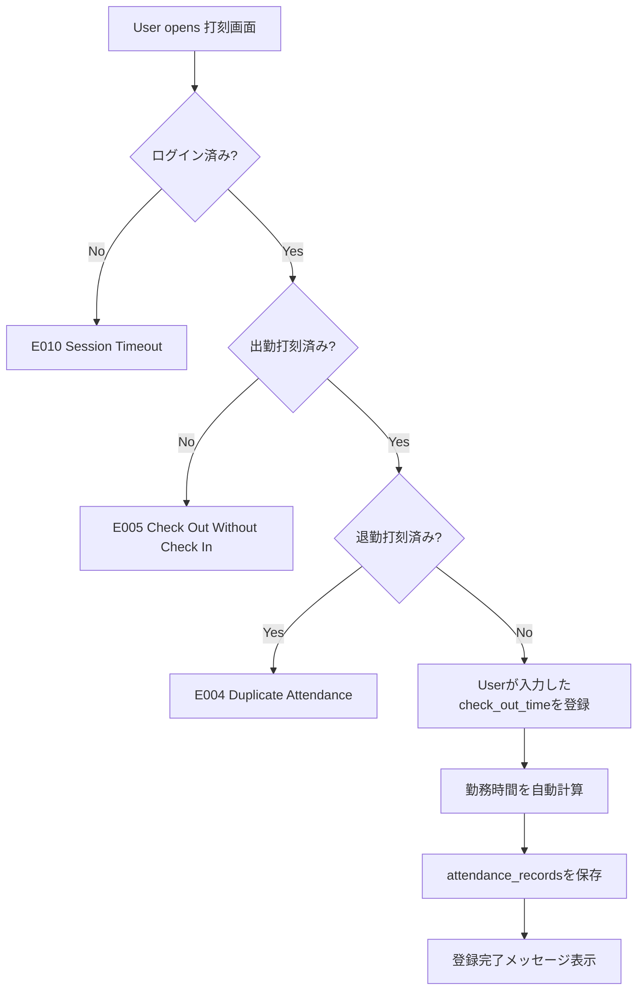
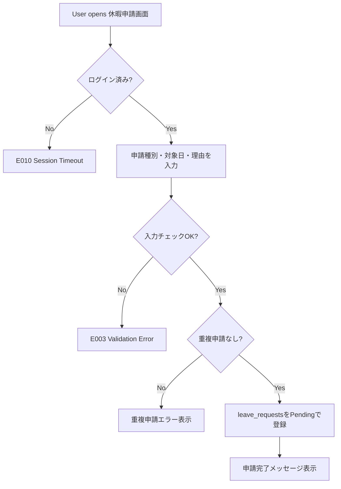
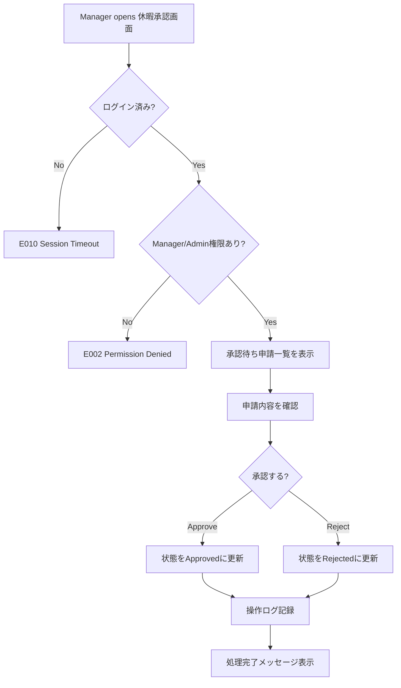
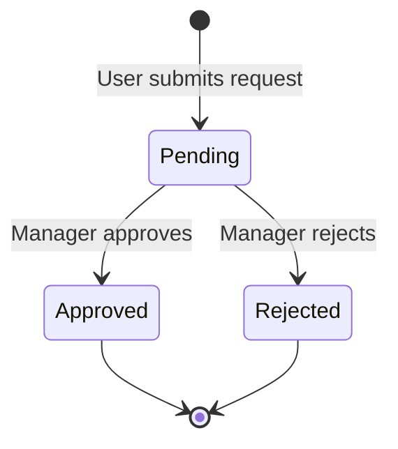
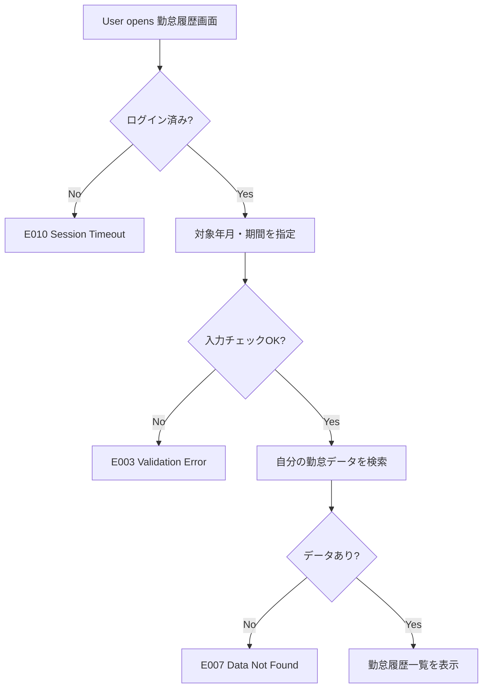
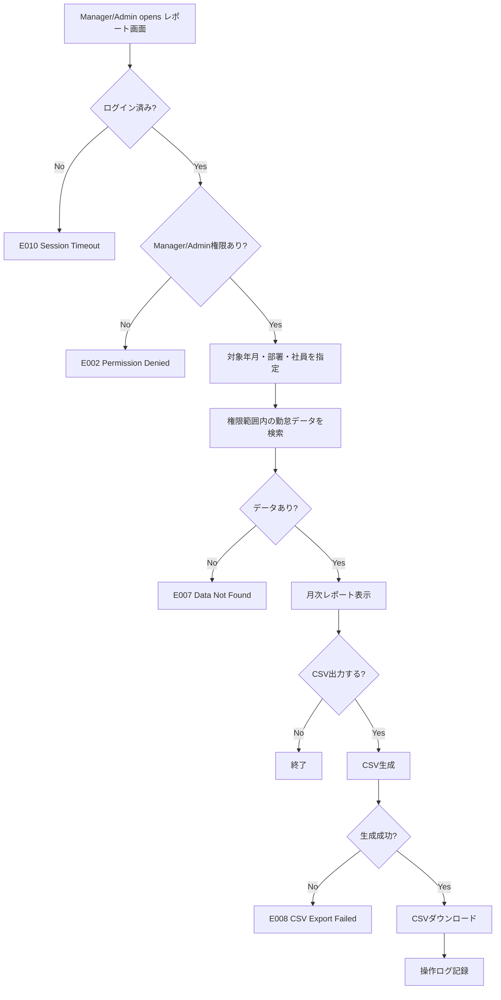
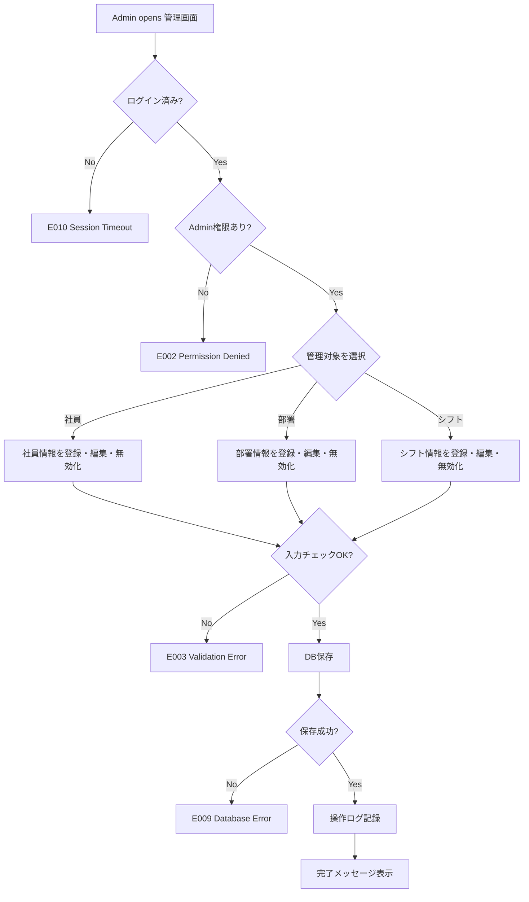

# 業務フロー

HR & Attendance System（勤怠管理システム）

---

# 文書管理情報

| 項目 | 内容 |
| --- | --- |
| システム名 | HR & Attendance System |
| 文書名 | 業務フロー |
| 文書番号 | DOC-004 |
| 作成者 | Nguyen Minh Tri |
| 作成日 | 2026/06/25 |
| バージョン | 1.2 |
| ステータス | Draft |

---

# 改訂履歴

| Version | 日付 | 作成者 | 内容 |
| --- | --- | --- | --- |
| 1.0 | 2026/06/25 | Nguyen Minh Tri | 初版作成 |
| 1.1 | 2026/07/02 | Nguyen Minh Tri | 整合性レビューによる修正：BR-003に休憩時間の差し引きを明記、休暇申請状態遷移からCompletedを削除 |
| 1.2 | 2026/07/14 | Nguyen Minh Tri | 整合性レビューによる修正：5.1/5.2の打刻フローを「現在時刻をcheck_in/out_timeとして登録」から「Userが入力したcheck_in/out_timeを登録」に変更し、10_API設計・12_詳細設計書・15_単体試験仕様書（クライアント送信方式）と統一 |

---

# 目次

1. 本書の目的
2. 業務概要
3. AS-IS 業務フロー
4. TO-BE 業務フロー
5. 打刻業務フロー
6. 休暇申請・承認業務フロー
7. 勤怠確認・レポート業務フロー
8. マスタ管理業務フロー
9. 例外フロー
10. 業務ルール対応
11. ユースケース対応
12. まとめ

---

# 1. 本書の目的

本書は、HR & Attendance Systemにおける勤怠管理業務の流れを整理し、AS-ISとTO-BEの違いを明確にするものである。

本書で定義した業務フローは、画面遷移図、画面設計、API設計、テスト仕様書の入力情報として利用する。

---

# 2. 業務概要

本システムでは、以下の業務を対象とする。

| 業務ID | 業務名 | 主担当 | 関連UC | 関連REQ |
| --- | --- | --- | --- | --- |
| BF-001 | ログイン・認証 | User / Manager / Admin | UC-001 / UC-002 | REQ-001 / REQ-002 / REQ-003 |
| BF-002 | 出勤・退勤打刻 | User | UC-003 / UC-004 | REQ-004 / REQ-005 / REQ-006 |
| BF-003 | 勤怠履歴確認 | User / Manager | UC-005 / UC-009 | REQ-007 / REQ-008 / REQ-012 |
| BF-004 | 休暇申請 | User | UC-006 / UC-007 | REQ-009 / REQ-010 |
| BF-005 | 休暇承認 | Manager | UC-008 | REQ-011 |
| BF-006 | 月次レポート・CSV出力 | Manager / Admin | UC-010 / UC-011 | REQ-013 / REQ-014 |
| BF-007 | 社員管理 | Admin | UC-012 | REQ-015 / REQ-016 / REQ-017 |
| BF-008 | 部署管理 | Admin | UC-013 | REQ-018 |
| BF-009 | シフト管理 | Admin | UC-014 | REQ-019 |
| BF-010 | 操作ログ記録 | System | UC-016 | REQ-021 |

---

# 3. AS-IS 業務フロー

現状は、紙またはExcelによる勤怠管理を想定する。

## 3.1 AS-IS 課題

| 課題ID | 課題 | 影響 |
| --- | --- | --- |
| ASIS-001 | 打刻情報が手入力である | 入力漏れ、記録ミスが発生しやすい |
| ASIS-002 | 休暇申請の状態が見えにくい | 承認漏れ、確認漏れが発生する |
| ASIS-003 | 月次集計が手作業である | 管理者の作業負担が大きい |
| ASIS-004 | 権限管理が明確でない | 不適切な閲覧・編集が発生する可能性がある |
| ASIS-005 | 操作履歴が残りにくい | 問題発生時の原因調査が難しい |

---

# 4. TO-BE 業務フロー

TO-BEでは、打刻、休暇申請、承認、レポート確認をWebシステム上で一元管理する。

## 4.1 TO-BE 改善点

| 改善ID | 改善内容 | 対応課題 |
| --- | --- | --- |
| TOBE-001 | 出退勤を画面から登録する | ASIS-001 |
| TOBE-002 | 休暇申請状態をPending / Approved / Rejectedで管理する | ASIS-002 |
| TOBE-003 | 月次レポートとCSV出力をシステム化する | ASIS-003 |
| TOBE-004 | User / Manager / Adminで権限制御する | ASIS-004 |
| TOBE-005 | 重要操作をaudit logに記録する | ASIS-005 |

---

# 5. 打刻業務フロー

## 5.1 出勤打刻

## 5.2 退勤打刻

## 5.3 打刻業務ルール

| ルール | 内容 |
| --- | --- |
| BR-001 | 同一勤務日に出勤打刻は原則1回のみ登録できる。 |
| BR-002 | 退勤打刻は出勤打刻後にのみ登録できる。 |
| BR-003 | 勤務時間は退勤時刻から出勤時刻を差し引いた時間から、シフトの休憩時間（break_minutes）を差し引いて算出する。 |

---

# 6. 休暇申請・承認業務フロー

## 6.1 休暇申請

## 6.2 休暇承認

## 6.3 休暇申請状態遷移

DBに保存する状態はPending / Approved / Rejectedの3つのみとする。対象日を経過したApproved申請の状態は変更せず、画面表示時にend_dateと現在日付を比較して「済」を付加表示する。

---

# 7. 勤怠確認・レポート業務フロー

## 7.1 User 勤怠履歴確認

## 7.2 Manager 勤怠状況確認・CSV出力

---

# 8. マスタ管理業務フロー

Adminは、社員、部署、シフトを管理する。

## 8.1 マスタ管理方針

| 対象 | 方針 |
| --- | --- |
| 社員 | 退職・利用停止の場合は物理削除より無効化を優先する。 |
| 部署 | 使用中部署は削除せず、無効化を優先する。 |
| シフト | 勤怠履歴と関連するため、使用中シフトは無効化を優先する。 |

---

# 9. 例外フロー

| エラーID | エラー名 | 発生業務 | 処理 |
| --- | --- | --- | --- |
| E001 | Login Failed | ログイン | ログイン失敗メッセージを表示する。 |
| E002 | Permission Denied | 承認、レポート、マスタ管理 | アクセス権限がない旨を表示する。 |
| E003 | Validation Error | 休暇申請、検索、マスタ管理 | 対象項目ごとにエラーを表示する。 |
| E004 | Duplicate Attendance | 出勤・退勤打刻 | 二重打刻できない旨を表示する。 |
| E005 | Check Out Without Check In | 退勤打刻 | 先に出勤打刻が必要である旨を表示する。 |
| E006 | Leave Request Already Processed | 休暇承認 | 最新状態を再表示する。 |
| E007 | Data Not Found | 勤怠確認、レポート | データが見つからない旨を表示する。 |
| E008 | CSV Export Failed | CSV出力 | エラーメッセージを表示し、ログを記録する。 |
| E009 | Database Error | 登録・更新・検索 | システムエラーを表示し、ログを記録する。 |
| E010 | Session Timeout | 全業務画面 | ログイン画面へ遷移する。 |

---

# 10. 業務ルール対応

| 業務ルールID | 対応業務 | 対応内容 |
| --- | --- | --- |
| BR-001 | 出勤打刻 | 同一勤務日の二重出勤打刻を防止する。 |
| BR-002 | 退勤打刻 | 出勤打刻なしの退勤打刻を防止する。 |
| BR-003 | 退勤打刻 | 退勤登録時に、退勤時刻と出勤時刻の差からシフトの休憩時間を差し引いて勤務時間を計算する。 |
| BR-004 | 休暇申請 | Pending、Approved、Rejectedで状態管理する。 |
| BR-005 | 休暇申請 | 承認済み申請はUserが直接変更できない。 |
| BR-006 | 休暇承認 | ManagerまたはAdminのみ承認・却下できる。 |
| BR-007 | ログイン | 無効化された社員のログインを拒否する。 |
| BR-008 | CSV出力 | 権限範囲内の勤怠データのみ出力する。 |

---

# 11. ユースケース対応

| 業務ID | 業務名 | 関連UC | 関連画面 |
| --- | --- | --- | --- |
| BF-001 | ログイン・認証 | UC-001 / UC-002 | SCR-001 / SCR-002 |
| BF-002 | 出勤・退勤打刻 | UC-003 / UC-004 | SCR-003 |
| BF-003 | 勤怠履歴確認 | UC-005 / UC-009 | SCR-004 |
| BF-004 | 休暇申請 | UC-006 / UC-007 | SCR-005 |
| BF-005 | 休暇承認 | UC-008 | SCR-006 |
| BF-006 | 月次レポート・CSV出力 | UC-010 / UC-011 | SCR-010 |
| BF-007 | 社員管理 | UC-012 | SCR-007 |
| BF-008 | 部署管理 | UC-013 | SCR-008 |
| BF-009 | シフト管理 | UC-014 | SCR-009 |
| BF-010 | 操作ログ記録 | UC-016 | - |

---

# 12. まとめ

本書では、HR & Attendance SystemのAS-IS、TO-BE、打刻、休暇申請・承認、勤怠確認・レポート、マスタ管理、例外処理の業務フローを定義した。

本書の業務IDとフローを基準として、次工程の画面遷移図、画面設計、API設計、試験仕様書へ展開する。
