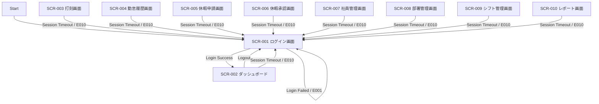
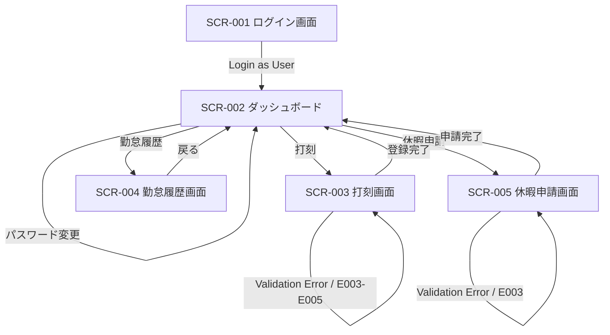
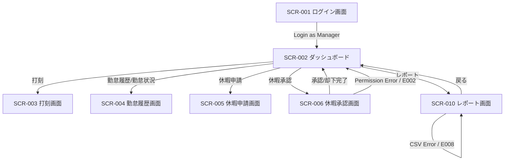
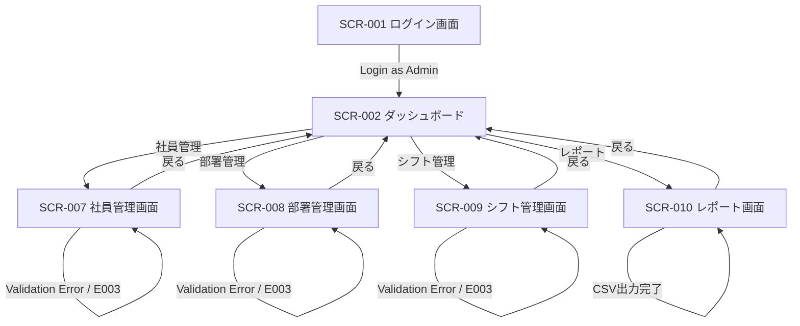

# 画面遷移図

HR & Attendance System（勤怠管理システム）

---

# 文書管理情報

| 項目 | 内容 |
| --- | --- |
| システム名 | HR & Attendance System |
| 文書名 | 画面遷移図 |
| 文書番号 | DOC-005 |
| 作成者 | Nguyen Minh Tri |
| 作成日 | 2026/07/02 |
| バージョン | 1.0 |
| ステータス | Draft |

---

# 改訂履歴

| Version | 日付 | 作成者 | 内容 |
| --- | --- | --- | --- |
| 1.0 | 2026/07/02 | Nguyen Minh Tri | 初版作成 |

---

# 目次

1. 本書の目的
2. 画面一覧
3. 共通画面遷移
4. User画面遷移
5. Manager画面遷移
6. Admin画面遷移
7. 権限別利用可能画面
8. 例外時画面遷移
9. 画面遷移ルール
10. トレーサビリティ
11. まとめ

---

# 1. 本書の目的

本書は、HR & Attendance Systemにおける画面間の遷移を定義するものである。

本書で定義した画面ID、遷移条件、権限別利用範囲は、画面設計、API設計、テスト仕様書の基準とする。

---

# 2. 画面一覧

| 画面ID | 画面名 | 対象ユーザー | 概要 | 関連UC | 関連REQ |
| --- | --- | --- | --- | --- | --- |
| SCR-001 | ログイン画面 | User / Manager / Admin | 認証情報を入力してログインする。 | UC-001 | REQ-001 / REQ-003 |
| SCR-002 | ダッシュボード | User / Manager / Admin | ログイン後のトップ画面。 | UC-002 / UC-015 | REQ-002 / REQ-020 |
| SCR-003 | 打刻画面 | User / Manager / Admin | 出勤・退勤を登録する。 | UC-003 / UC-004 | REQ-004 / REQ-005 / REQ-006 |
| SCR-004 | 勤怠履歴画面 | User / Manager / Admin | 勤怠履歴を確認する。 | UC-005 / UC-009 | REQ-007 / REQ-008 / REQ-012 |
| SCR-005 | 休暇申請画面 | User / Manager / Admin | 休暇申請を登録・確認する。 | UC-006 / UC-007 | REQ-009 / REQ-010 |
| SCR-006 | 休暇承認画面 | Manager / Admin | 休暇申請を承認・却下する。 | UC-008 | REQ-011 |
| SCR-007 | 社員管理画面 | Admin | 社員情報を管理する。 | UC-012 | REQ-015 / REQ-016 / REQ-017 |
| SCR-008 | 部署管理画面 | Admin | 部署情報を管理する。 | UC-013 | REQ-018 |
| SCR-009 | シフト管理画面 | Admin | シフト情報を管理する。 | UC-014 | REQ-019 |
| SCR-010 | レポート画面 | Manager / Admin | 月次勤怠レポート確認、CSV出力を行う。 | UC-010 / UC-011 | REQ-013 / REQ-014 |

---

# 3. 共通画面遷移

全ユーザー共通のログイン、ダッシュボード、ログアウト、セッションタイムアウトの遷移を定義する。

---

# 4. User画面遷移

User（一般社員）は、打刻、勤怠履歴確認、休暇申請を中心に利用する。

## 4.1 User遷移一覧

| From | To | 操作 | 条件 |
| --- | --- | --- | --- |
| SCR-001 | SCR-002 | ログイン | 認証成功 |
| SCR-002 | SCR-003 | 打刻メニュー選択 | User権限 |
| SCR-002 | SCR-004 | 勤怠履歴メニュー選択 | User権限 |
| SCR-002 | SCR-005 | 休暇申請メニュー選択 | User権限 |
| SCR-003 | SCR-002 | 出勤・退勤登録完了 | 登録成功 |
| SCR-005 | SCR-002 | 休暇申請登録完了 | 登録成功 |
| SCR-002 | SCR-001 | ログアウト | ログアウト実行 |

---

# 5. Manager画面遷移

Manager（管理者）は、User機能に加えて、休暇承認、勤怠状況確認、レポート閲覧、CSV出力を利用する。

## 5.1 Manager遷移一覧

| From | To | 操作 | 条件 |
| --- | --- | --- | --- |
| SCR-001 | SCR-002 | ログイン | 認証成功、Manager権限 |
| SCR-002 | SCR-006 | 休暇承認メニュー選択 | Manager権限 |
| SCR-002 | SCR-010 | レポートメニュー選択 | Manager権限 |
| SCR-006 | SCR-002 | 承認・却下完了 | 更新成功 |
| SCR-010 | SCR-010 | CSV出力 | 出力成功または出力エラー |
| SCR-010 | SCR-002 | 戻る | ダッシュボードへ戻る |

---

# 6. Admin画面遷移

Admin（システム管理者）は、社員、部署、シフト、権限関連の管理機能を利用する。

## 6.1 Admin遷移一覧

| From | To | 操作 | 条件 |
| --- | --- | --- | --- |
| SCR-001 | SCR-002 | ログイン | 認証成功、Admin権限 |
| SCR-002 | SCR-007 | 社員管理メニュー選択 | Admin権限 |
| SCR-002 | SCR-008 | 部署管理メニュー選択 | Admin権限 |
| SCR-002 | SCR-009 | シフト管理メニュー選択 | Admin権限 |
| SCR-002 | SCR-010 | レポートメニュー選択 | Admin権限 |
| SCR-007 | SCR-007 | 社員登録・編集・無効化 | 保存成功または入力エラー |
| SCR-008 | SCR-008 | 部署登録・編集・無効化 | 保存成功または入力エラー |
| SCR-009 | SCR-009 | シフト登録・編集・無効化 | 保存成功または入力エラー |

---

# 7. 権限別利用可能画面

| 画面ID | 画面名 | User | Manager | Admin |
| --- | --- | --- | --- | --- |
| SCR-001 | ログイン画面 | 〇 | 〇 | 〇 |
| SCR-002 | ダッシュボード | 〇 | 〇 | 〇 |
| SCR-003 | 打刻画面 | 〇 | 〇 | 〇 |
| SCR-004 | 勤怠履歴画面 | 〇 | 〇 | 〇 |
| SCR-005 | 休暇申請画面 | 〇 | 〇 | 〇 |
| SCR-006 | 休暇承認画面 | × | 〇 | 〇 |
| SCR-007 | 社員管理画面 | × | × | 〇 |
| SCR-008 | 部署管理画面 | × | × | 〇 |
| SCR-009 | シフト管理画面 | × | × | 〇 |
| SCR-010 | レポート画面 | × | 〇 | 〇 |

---

# 8. 例外時画面遷移

| エラーID | 発生画面 | 遷移先 | 処理 |
| --- | --- | --- | --- |
| E001 | SCR-001 | SCR-001 | ログイン失敗メッセージを表示する。 |
| E002 | SCR-006 / SCR-007 / SCR-008 / SCR-009 / SCR-010 | SCR-002 | 権限エラーを表示し、ダッシュボードへ戻す。 |
| E003 | 入力画面全般 | 同一画面 | 入力エラーを表示し、同一画面に留まる。 |
| E004 | SCR-003 | SCR-003 | 二重打刻エラーを表示する。 |
| E005 | SCR-003 | SCR-003 | 出勤打刻が必要であることを表示する。 |
| E006 | SCR-006 | SCR-006 | 申請の最新状態を再表示する。 |
| E007 | SCR-004 / SCR-010 | 同一画面 | データなしメッセージを表示する。 |
| E008 | SCR-010 | SCR-010 | CSV出力エラーを表示する。 |
| E009 | 登録・更新画面 | 同一画面 | システムエラーを表示し、ログを記録する。 |
| E010 | 業務画面全般 | SCR-001 | セッション切れとしてログイン画面へ遷移する。 |

---

# 9. 画面遷移ルール

| ルールID | 内容 |
| --- | --- |
| TR-001 | 未ログインユーザーが業務画面へアクセスした場合、SCR-001へ遷移する。 |
| TR-002 | ログイン成功後は権限に関係なくSCR-002へ遷移する。 |
| TR-003 | SCR-002に表示するメニューはユーザー権限により制御する。 |
| TR-004 | 権限外画面へアクセスした場合、E002を表示しSCR-002へ戻す。 |
| TR-005 | 入力エラー発生時は同一画面に留まり、対象項目のエラーを表示する。 |
| TR-006 | 登録、更新、承認、CSV出力の成功後は完了メッセージを表示する。 |
| TR-007 | セッションタイムアウト発生時はSCR-001へ遷移する。 |

---

# 10. トレーサビリティ

| 画面ID | 関連BF | 関連UC | 関連REQ | 主なエラー |
| --- | --- | --- | --- | --- |
| SCR-001 | BF-001 | UC-001 | REQ-001 / REQ-003 | E001 |
| SCR-002 | BF-001 | UC-002 / UC-015 | REQ-002 / REQ-020 | E010 |
| SCR-003 | BF-002 | UC-003 / UC-004 | REQ-004 / REQ-005 / REQ-006 | E003 / E004 / E005 / E010 |
| SCR-004 | BF-003 | UC-005 / UC-009 | REQ-007 / REQ-008 / REQ-012 | E003 / E007 / E010 |
| SCR-005 | BF-004 | UC-006 / UC-007 | REQ-009 / REQ-010 | E003 / E010 |
| SCR-006 | BF-005 | UC-008 | REQ-011 | E002 / E006 / E010 |
| SCR-007 | BF-007 | UC-012 | REQ-015 / REQ-016 / REQ-017 | E002 / E003 / E009 / E010 |
| SCR-008 | BF-008 | UC-013 | REQ-018 | E002 / E003 / E009 / E010 |
| SCR-009 | BF-009 | UC-014 | REQ-019 | E002 / E003 / E009 / E010 |
| SCR-010 | BF-006 | UC-010 / UC-011 | REQ-013 / REQ-014 | E002 / E007 / E008 / E010 |

---

# 11. まとめ

本書では、HR & Attendance Systemの画面一覧、共通画面遷移、User / Manager / Admin別の画面遷移、権限別利用可能画面、例外時遷移、トレーサビリティを定義した。

本書の画面IDと遷移ルールを基準として、次工程の画面設計、API設計、テスト仕様書へ展開する。
