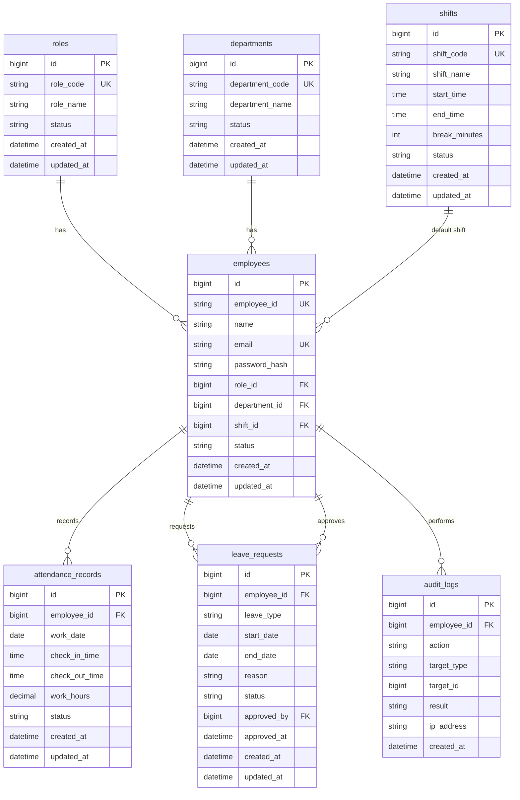

# ER図

HR & Attendance System（勤怠管理システム）

---

# 文書管理情報

| 項目 | 内容 |
| --- | --- |
| システム名 | HR & Attendance System |
| 文書名 | ER図 |
| 文書番号 | DOC-008 |
| 作成者 | Nguyen Minh Tri |
| 作成日 | 2026/07/02 |
| バージョン | 1.2 |
| ステータス | Draft |

---

# 改訂履歴

| Version | 日付 | 作成者 | 内容 |
| --- | --- | --- | --- |
| 1.0 | 2026/07/02 | Nguyen Minh Tri | 初版作成 |
| 1.1 | 2026/07/02 | Nguyen Minh Tri | 整合性レビューによる修正：leave_requestsのCompleted状態を削除 |
| 1.2 | 2026/07/02 | Nguyen Minh Tri | 整合性レビューによる修正：attendance_recordsのNotCheckedIn状態を削除（レコード不存在で判定する方針に統一） |

---

# 目次

1. 本書の目的
2. ER設計方針
3. エンティティ一覧
4. ER図
5. リレーション定義
6. エンティティ詳細
7. 主キー・外部キー一覧
8. インデックス方針
9. データ削除・保持方針
10. 正規化方針
11. トレーサビリティ
12. まとめ

---

# 1. 本書の目的

本書は、HR & Attendance Systemで利用するデータの論理構造とエンティティ間の関係を定義するものである。

本書で定義したエンティティ、リレーション、キー設計は、次工程のテーブル定義、API設計、実装、テスト仕様書の基準とする。

---

# 2. ER設計方針

| 方針ID | 方針 | 内容 |
| --- | --- | --- |
| ER-001 | Logical First | 本書では論理ERを定義し、物理カラム型や詳細制約はテーブル定義書で定義する。 |
| ER-002 | Traceability | エンティティは要件、機能、画面、APIと対応できるようにする。 |
| ER-003 | Soft Delete Priority | 勤怠・申請履歴と関連するマスタは物理削除より無効化を優先する。 |
| ER-004 | Auditability | 承認、CSV出力、マスタ更新などの重要操作はaudit_logsに記録する。 |
| ER-005 | Normalization | 初期設計では第3正規形を基本とし、集計値は必要最小限にする。 |

---

# 3. エンティティ一覧

| エンティティ | 論理名 | 概要 | 主な関連機能 |
| --- | --- | --- | --- |
| roles | 権限 | User、Manager、Adminなどの権限を管理する。 | FUNC-003 |
| departments | 部署 | 社員の所属部署を管理する。 | FUNC-017 |
| shifts | シフト | 勤務開始・終了時刻、休憩時間を管理する。 | FUNC-018 |
| employees | 社員 | ログインユーザーおよび社員基本情報を管理する。 | FUNC-001 / FUNC-014〜FUNC-016 |
| attendance_records | 勤怠記録 | 出勤、退勤、勤務時間、勤務状態を管理する。 | FUNC-004〜FUNC-008 |
| leave_requests | 休暇申請 | 有給、欠勤、遅刻、早退などの申請と承認状態を管理する。 | FUNC-009〜FUNC-011 |
| audit_logs | 操作ログ | 重要操作の実行者、操作内容、対象、結果を記録する。 | FUNC-020 |

---

# 4. ER図

---

# 5. リレーション定義

| リレーションID | 親エンティティ | 子エンティティ | 多重度 | 内容 |
| --- | --- | --- | --- | --- |
| REL-001 | roles | employees | 1:N | 1つの権限は複数の社員に割り当てられる。 |
| REL-002 | departments | employees | 1:N | 1つの部署には複数の社員が所属する。 |
| REL-003 | shifts | employees | 1:N | 1つの標準シフトは複数の社員に割り当てられる。 |
| REL-004 | employees | attendance_records | 1:N | 1人の社員は複数日の勤怠記録を持つ。 |
| REL-005 | employees | leave_requests | 1:N | 1人の社員は複数の休暇申請を持つ。 |
| REL-006 | employees | audit_logs | 1:N | 1人の社員は複数の操作ログを発生させる。 |
| REL-007 | employees | leave_requests.approved_by | 1:N | Manager/Adminが複数の休暇申請を承認・却下する。 |

---

# 6. エンティティ詳細

## 6.1 roles

| 項目 | 内容 |
| --- | --- |
| 目的 | User、Manager、Adminなどの権限を管理する。 |
| 主キー | id |
| 一意キー | role_code |
| 主な状態 | active / inactive |
| 関連REQ | REQ-003 |
| 関連FUNC | FUNC-003 |

## 6.2 departments

| 項目 | 内容 |
| --- | --- |
| 目的 | 社員の所属部署を管理する。 |
| 主キー | id |
| 一意キー | department_code / department_name |
| 主な状態 | active / inactive |
| 関連REQ | REQ-018 |
| 関連FUNC | FUNC-017 |

## 6.3 shifts

| 項目 | 内容 |
| --- | --- |
| 目的 | 勤務シフトの開始時刻、終了時刻、休憩時間を管理する。 |
| 主キー | id |
| 一意キー | shift_code |
| 主な状態 | active / inactive |
| 関連REQ | REQ-019 |
| 関連FUNC | FUNC-018 |

## 6.4 employees

| 項目 | 内容 |
| --- | --- |
| 目的 | ログインユーザーおよび社員情報を管理する。 |
| 主キー | id |
| 一意キー | employee_id / email |
| 外部キー | role_id / department_id / shift_id |
| 主な状態 | active / inactive |
| 関連REQ | REQ-001 / REQ-015 / REQ-016 / REQ-017 |
| 関連FUNC | FUNC-001 / FUNC-014 / FUNC-015 / FUNC-016 |

## 6.5 attendance_records

| 項目 | 内容 |
| --- | --- |
| 目的 | 社員の日別勤怠記録を管理する。 |
| 主キー | id |
| 外部キー | employee_id |
| 一意制約 | employee_id + work_date |
| 主な状態 | CheckedIn / CheckedOut / Fixed（「未出勤」は該当employee_id・work_dateのレコードが存在しないことで判定し、状態としては保持しない） |
| 関連REQ | REQ-004 / REQ-005 / REQ-006 / REQ-007 / REQ-008 / REQ-012 |
| 関連FUNC | FUNC-004 / FUNC-005 / FUNC-006 / FUNC-007 / FUNC-008 |

## 6.6 leave_requests

| 項目 | 内容 |
| --- | --- |
| 目的 | 休暇、欠勤、遅刻、早退の申請と承認状態を管理する。 |
| 主キー | id |
| 外部キー | employee_id / approved_by |
| 主な状態 | Pending / Approved / Rejected（対象日経過は画面表示時にend_dateから判定し、状態としては保持しない） |
| 関連REQ | REQ-009 / REQ-010 / REQ-011 |
| 関連FUNC | FUNC-009 / FUNC-010 / FUNC-011 |

## 6.7 audit_logs

| 項目 | 内容 |
| --- | --- |
| 目的 | 重要操作の操作履歴を記録する。 |
| 主キー | id |
| 外部キー | employee_id |
| 対象参照 | target_type + target_id |
| 関連REQ | REQ-021 |
| 関連FUNC | FUNC-020 |

---

# 7. 主キー・外部キー一覧

| エンティティ | 主キー | 外部キー |
| --- | --- | --- |
| roles | id | - |
| departments | id | - |
| shifts | id | - |
| employees | id | role_id → roles.id / department_id → departments.id / shift_id → shifts.id |
| attendance_records | id | employee_id → employees.id |
| leave_requests | id | employee_id → employees.id / approved_by → employees.id |
| audit_logs | id | employee_id → employees.id |

---

# 8. インデックス方針

| エンティティ | インデックス候補 | 目的 |
| --- | --- | --- |
| roles | role_code | 権限コード検索、一意制約 |
| departments | department_code / department_name | 部署検索、一意制約 |
| shifts | shift_code | シフト検索、一意制約 |
| employees | employee_id / email | ログイン、社員検索、一意制約 |
| employees | role_id / department_id / shift_id | 権限別、部署別、シフト別検索 |
| attendance_records | employee_id + work_date | 日別勤怠検索、二重打刻防止 |
| attendance_records | work_date | 月次レポート、CSV出力 |
| leave_requests | employee_id + status | 自分の申請一覧、状態検索 |
| leave_requests | status + start_date | 承認待ち申請検索 |
| audit_logs | employee_id / created_at | 操作履歴検索 |
| audit_logs | target_type + target_id | 対象データの操作履歴追跡 |

---

# 9. データ削除・保持方針

| エンティティ | 削除方針 | 理由 |
| --- | --- | --- |
| roles | 無効化優先 | 社員履歴との整合性を維持するため。 |
| departments | 無効化優先 | 過去の社員・勤怠履歴と紐づくため。 |
| shifts | 無効化優先 | 過去の勤怠履歴と紐づくため。 |
| employees | 無効化優先 | 勤怠、休暇、操作ログと紐づくため。 |
| attendance_records | 原則保持 | 月次レポート、監査、履歴確認に必要なため。 |
| leave_requests | 原則保持 | 承認履歴確認に必要なため。 |
| audit_logs | 一定期間保持 | 障害調査、監査確認に必要なため。 |

---

# 10. 正規化方針

| 観点 | 方針 |
| --- | --- |
| 第1正規形 | 繰り返し項目を持たず、1カラムに1値を保持する。 |
| 第2正規形 | 複合キーに部分従属する項目を持たない。 |
| 第3正規形 | 部署名、権限名、シフト名などはマスタへ分離する。 |
| 集計値 | 月次集計値は原則保存せず、attendance_recordsから算出する。 |
| 監査ログ | 操作対象はtarget_type + target_idで汎用的に保持する。 |

---

# 11. トレーサビリティ

| エンティティ | 関連FUNC | 関連REQ | 関連SCR |
| --- | --- | --- | --- |
| roles | FUNC-003 | REQ-003 | SCR-002 |
| departments | FUNC-017 | REQ-018 | SCR-008 |
| shifts | FUNC-018 | REQ-019 | SCR-009 |
| employees | FUNC-001 / FUNC-014 / FUNC-015 / FUNC-016 | REQ-001 / REQ-015 / REQ-016 / REQ-017 | SCR-001 / SCR-007 |
| attendance_records | FUNC-004 / FUNC-005 / FUNC-006 / FUNC-007 / FUNC-008 / FUNC-012 / FUNC-013 | REQ-004 / REQ-005 / REQ-006 / REQ-007 / REQ-008 / REQ-012 / REQ-013 / REQ-014 | SCR-003 / SCR-004 / SCR-010 |
| leave_requests | FUNC-009 / FUNC-010 / FUNC-011 | REQ-009 / REQ-010 / REQ-011 | SCR-005 / SCR-006 |
| audit_logs | FUNC-020 | REQ-021 | - |

---

# 12. まとめ

本書では、HR & Attendance Systemの論理ERとして、roles、departments、shifts、employees、attendance_records、leave_requests、audit_logsの7エンティティを定義した。

本書のエンティティ、リレーション、キー、インデックス方針を基準として、次工程のテーブル定義書で物理カラム、データ型、制約、インデックスを詳細化する。
