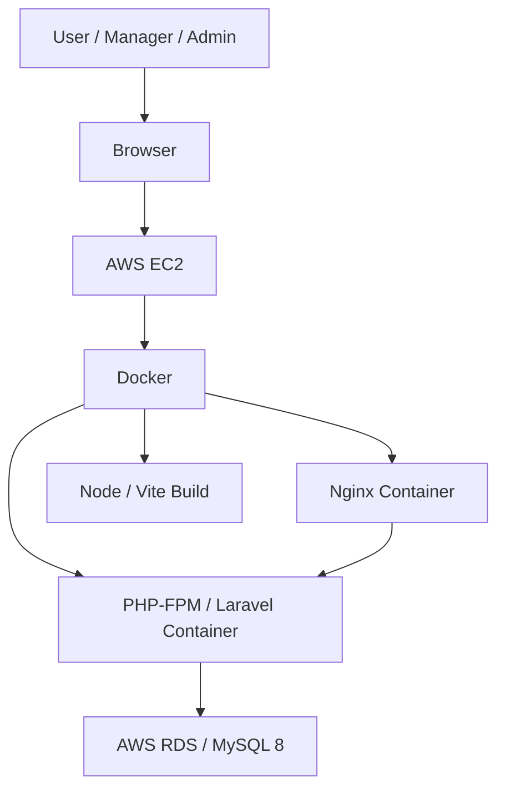
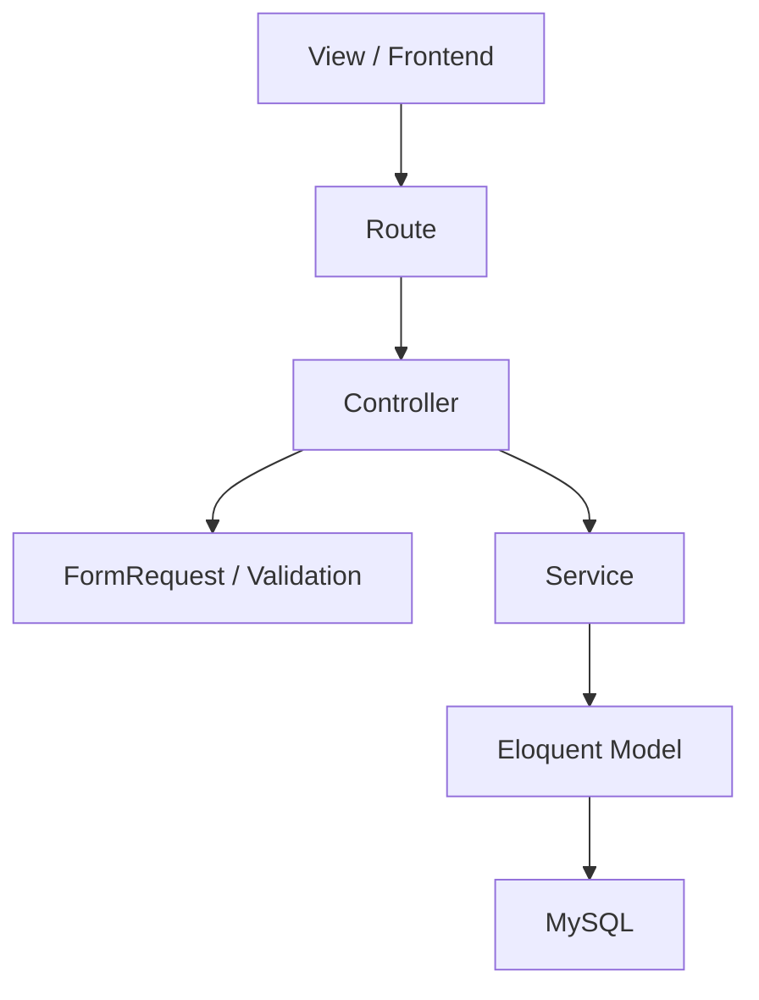
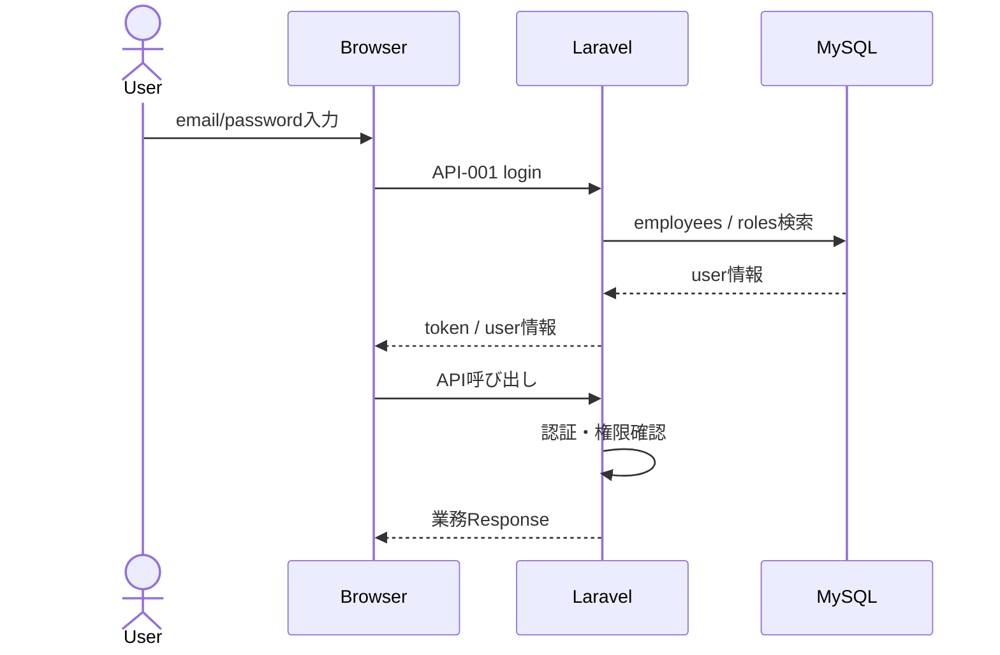
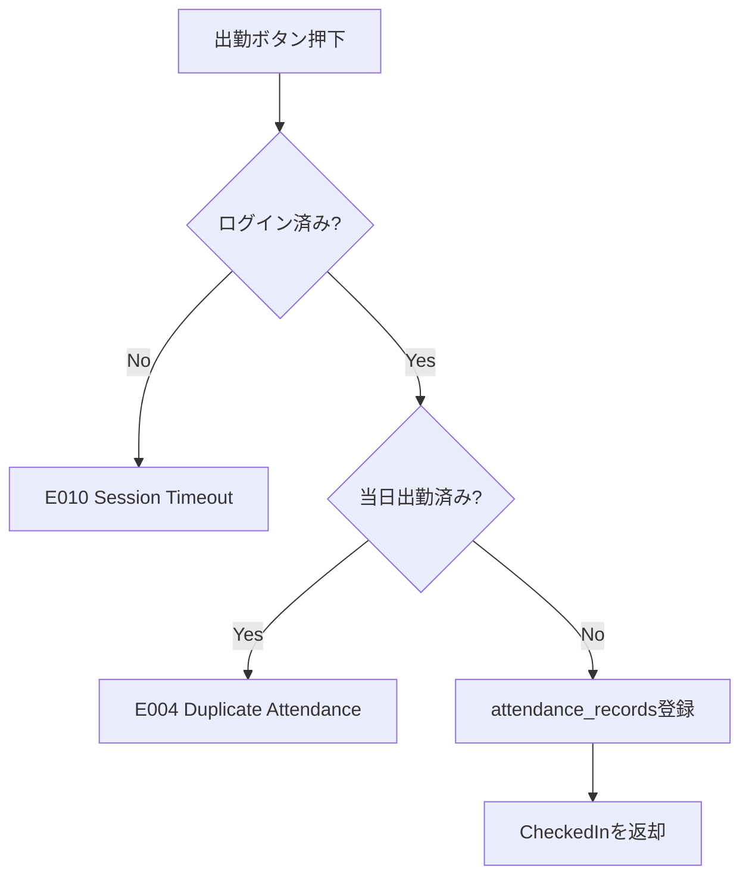
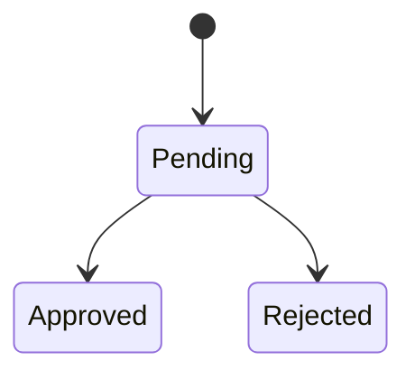

# 基本設計書

HR & Attendance System（勤怠管理システム）

---

# 文書管理情報

| 項目 | 内容 |
| --- | --- |
| システム名 | HR & Attendance System |
| 文書名 | 基本設計書 |
| 文書番号 | DOC-011 |
| 作成者 | Nguyen Minh Tri |
| 作成日 | 2026/07/02 |
| バージョン | 1.1 |
| ステータス | Draft |

---

# 改訂履歴

| Version | 日付 | 作成者 | 内容 |
| --- | --- | --- | --- |
| 1.0 | 2026/07/02 | Nguyen Minh Tri | 初版作成 |
| 1.1 | 2026/07/02 | Nguyen Minh Tri | 整合性レビューによる修正：work_hours計算式とスナップショット方針を明記、leave_requestsのCompleted状態を削除 |

---

# 目次

1. 本書の目的
2. 設計範囲
3. システム構成
4. アプリケーション構成
5. 画面設計概要
6. 機能設計概要
7. API設計概要
8. データ設計概要
9. 認証・認可設計
10. 業務処理設計
11. エラー・例外設計
12. ログ・監査設計
13. 非機能設計
14. トレーサビリティ
15. まとめ

---

# 1. 本書の目的

本書は、HR & Attendance Systemの基本設計を定義する。

要件定義、ユースケース、業務フロー、画面設計、ER図、テーブル定義、API設計をもとに、実装前に必要となるシステム全体構成、アプリケーション構成、主要処理方式、権限制御、エラー処理、非機能設計を整理する。

本書は詳細設計書、実装、単体試験、結合試験、システム試験の基準資料とする。

---

# 2. 設計範囲

## 2.1 In Scope

| 区分 | 内容 |
| --- | --- |
| 認証・認可 | ログイン、ログアウト、セッション確認、Role Based Access Control |
| 勤怠管理 | 出勤打刻、退勤打刻、勤務時間計算、勤怠履歴確認、勤怠検索 |
| 休暇管理 | 休暇申請、申請一覧、承認、却下、状態管理 |
| レポート | 月次勤怠レポート表示、CSV出力 |
| マスタ管理 | 社員、部署、シフトの登録・編集・無効化 |
| 監査 | 重要操作のaudit_logs記録 |
| 非機能 | 性能、可用性、セキュリティ、保守性の基本方針 |

## 2.2 Out Scope

| 区分 | 内容 |
| --- | --- |
| 給与計算 | 勤務時間をもとにした給与計算は対象外 |
| 外部連携 | 会計、人事、給与システムとの連携は対象外 |
| モバイルアプリ | 初期リリースではPCブラウザを主対象とする |
| 高度な承認ワークフロー | 多段階承認、代理承認は対象外 |
| 24/7 SLA | 初期リリースでは厳密なSLA保証は対象外 |

---

# 3. システム構成

## 3.1 全体構成

## 3.2 構成要素

| 構成要素 | 役割 |
| --- | --- |
| Browser | ユーザー操作、画面表示、API呼び出し |
| AWS EC2 | Webアプリケーション実行基盤 |
| Docker | Nginx、Laravel、Vite build環境のコンテナ管理 |
| Nginx Container | 静的ファイル配信、Laravelへのリバースプロキシ |
| PHP-FPM / Laravel Container | 業務ロジック、API、認証、DBアクセス |
| Node / Vite Build | Frontend asset build |
| AWS RDS / MySQL 8 | 勤怠、社員、申請、監査ログの永続化 |

## 3.3 通信方式

| 区間 | 通信方式 | 内容 |
| --- | --- | --- |
| Browser → Nginx | HTTPS | 画面表示、API呼び出し |
| Nginx → Laravel | FastCGI / HTTP内部通信 | PHP-FPMへリクエスト転送 |
| Laravel → MySQL | TCP / MySQL Protocol | データ検索・登録・更新 |

---

# 4. アプリケーション構成

## 4.1 Layer構成

## 4.2 Layer責務

| Layer | 主な責務 |
| --- | --- |
| View / Frontend | 画面表示、入力、API呼び出し、エラー表示 |
| Route | URLとControllerの対応付け、Middleware適用 |
| Controller | Request受領、認可確認、Service呼び出し、Response返却 |
| FormRequest | 入力チェック、形式チェック、権限付きValidation |
| Service | 業務ロジック、状態遷移、トランザクション制御 |
| Model | DBテーブルとの対応、関連定義 |
| Middleware | 認証、権限制御、セッション確認 |

## 4.3 Module構成

| Module | 主な対象 | 関連API | 関連Table |
| --- | --- | --- | --- |
| Auth | 認証、ログアウト、パスワード、セッション | API-001 / API-002 / API-003 / API-019 / API-021 | employees / roles |
| Attendance | 打刻、勤務時間、勤怠履歴、検索 | API-004〜API-008 | attendance_records |
| Leave | 休暇申請、一覧、承認、却下 | API-009〜API-011 | leave_requests |
| Report | 月次レポート、CSV出力 | API-012 / API-013 | attendance_records / employees |
| Employee | 社員登録、編集、無効化 | API-014〜API-016 | employees |
| Master | 部署、シフト管理 | API-017 / API-018 | departments / shifts |
| Audit | 操作ログ記録 | API-020 | audit_logs |

---

# 5. 画面設計概要

| 画面ID | 画面名 | 対象ユーザー | 主な機能 | 関連API |
| --- | --- | --- | --- | --- |
| SCR-001 | ログイン画面 | User / Manager / Admin | ログイン | API-001 |
| SCR-002 | ダッシュボード | User / Manager / Admin | メニュー表示、ログアウト、パスワード変更 | API-002 / API-003 / API-019 / API-021 |
| SCR-003 | 打刻画面 | User / Manager / Admin | 出勤、退勤、勤務時間確認 | API-004 / API-005 / API-006 |
| SCR-004 | 勤怠履歴画面 | User / Manager / Admin | 自分の勤怠履歴、勤怠検索 | API-007 / API-008 |
| SCR-005 | 休暇申請画面 | User / Manager / Admin | 休暇申請、申請一覧 | API-009 / API-010 |
| SCR-006 | 休暇承認画面 | Manager / Admin | 申請確認、承認、却下 | API-010 / API-011 |
| SCR-007 | 社員管理画面 | Admin | 社員登録、編集、無効化 | API-014 / API-015 / API-016 |
| SCR-008 | 部署管理画面 | Admin | 部署登録、編集、無効化 | API-017 |
| SCR-009 | シフト管理画面 | Admin | シフト登録、編集、無効化 | API-018 |
| SCR-010 | レポート画面 | Manager / Admin | 月次レポート、CSV出力 | API-012 / API-013 |

---

# 6. 機能設計概要

| 機能カテゴリ | FUNC | 概要 | 設計方針 |
| --- | --- | --- | --- |
| 認証・権限 | FUNC-001 / FUNC-002 / FUNC-003 / FUNC-019 / FUNC-021 | ログイン、ログアウト、権限制御、パスワード変更、セッション確認 | Laravel認証機構とMiddlewareで制御する |
| 勤怠 | FUNC-004〜FUNC-008 | 打刻、勤務時間計算、履歴、検索 | attendance_recordsを中心に日別勤怠を管理する |
| 休暇 | FUNC-009〜FUNC-011 | 休暇申請、一覧、承認 | leave_requestsの状態をPending / Approved / Rejectedで管理する（対象日経過は画面表示時にend_dateから判定） |
| レポート | FUNC-012 / FUNC-013 | 月次集計、CSV出力 | attendance_recordsから都度集計する |
| マスタ管理 | FUNC-014〜FUNC-018 | 社員、部署、シフト管理 | statusによる無効化を基本とする |
| 監査 | FUNC-020 | 操作ログ記録 | 重要操作をaudit_logsへ保存する |

---

# 7. API設計概要

## 7.1 API方針

| 項目 | 内容 |
| --- | --- |
| API形式 | REST API |
| データ形式 | JSON |
| 認証 | Laravel Sanctumまたは同等方式 |
| 入力検証 | FormRequest相当で実施 |
| Response形式 | `success`, `message`, `data` / `error`を共通化 |

## 7.2 APIカテゴリ

| カテゴリ | API ID | Endpoint概要 |
| --- | --- | --- |
| Auth | API-001〜API-003 / API-019 / API-021 | `/auth/*` |
| Attendance | API-004〜API-008 | `/attendance*` |
| Leave | API-009〜API-011 | `/leave-requests*` |
| Report | API-012〜API-013 | `/reports/*` |
| Employee | API-014〜API-016 | `/employees*` |
| Department | API-017 | `/departments*` |
| Shift | API-018 | `/shifts*` |
| Audit | API-020 | `/audit-logs` |

---

# 8. データ設計概要

## 8.1 Entity一覧

| Entity | 概要 | 主な関連機能 |
| --- | --- | --- |
| roles | 権限管理 | FUNC-003 |
| departments | 部署管理 | FUNC-017 |
| shifts | シフト管理 | FUNC-018 |
| employees | 社員、ログインユーザー | FUNC-001 / FUNC-014〜FUNC-016 |
| attendance_records | 勤怠記録 | FUNC-004〜FUNC-008 / FUNC-012 / FUNC-013 |
| leave_requests | 休暇申請 | FUNC-009〜FUNC-011 |
| audit_logs | 操作ログ | FUNC-020 |

## 8.2 主要Relation

| Relation ID | 親 | 子 | 関係 | 内容 |
| --- | --- | --- | --- | --- |
| REL-001 | roles | employees | 1:N | 1つの権限は複数社員に割り当てられる |
| REL-002 | departments | employees | 1:N | 1つの部署には複数社員が所属する |
| REL-003 | shifts | employees | 1:N | 1つの標準シフトは複数社員に割り当てられる |
| REL-004 | employees | attendance_records | 1:N | 1人の社員は複数日の勤怠記録を持つ |
| REL-005 | employees | leave_requests | 1:N | 1人の社員は複数の休暇申請を持つ |
| REL-006 | employees | audit_logs | 1:N | 1人の社員は複数の操作ログを発生させる |
| REL-007 | employees | leave_requests.approved_by | 1:N | Manager/Adminが申請を承認・却下する |

## 8.3 データ保持方針

| 対象 | 方針 | 理由 |
| --- | --- | --- |
| employees | statusで無効化 | 勤怠・申請・監査ログとの整合性維持 |
| departments | statusで無効化 | 過去データとの関連維持 |
| shifts | statusで無効化 | 過去勤怠の勤務条件参照のため |
| attendance_records | 原則保持 | 月次レポート、履歴確認、監査に必要 |
| leave_requests | 原則保持 | 申請・承認履歴の確認に必要 |
| audit_logs | 一定期間保持 | 障害調査、監査確認に必要 |

---

# 9. 認証・認可設計

## 9.1 認証フロー

## 9.2 権限制御

| Role | 利用可能範囲 |
| --- | --- |
| User | 自分の勤怠、休暇申請、自分の履歴、パスワード変更 |
| Manager | User範囲に加え、承認対象申請、担当範囲の勤怠検索、月次レポート |
| Admin | 全機能、社員・部署・シフト管理 |
| System | 勤務時間計算、操作ログ記録など内部処理 |

## 9.3 権限制御方式

| 対象 | 方式 |
| --- | --- |
| 画面表示 | Roleに応じてSidebar/Menuを制御する |
| API実行 | Middleware / PolicyでRoleを検証する |
| データ取得 | Userは本人、Managerは担当範囲、Adminは全件に制限する |
| 更新操作 | ControllerまたはServiceで権限と状態を検証する |

---

# 10. 業務処理設計

## 10.1 出勤打刻

| 項目 | 内容 |
| --- | --- |
| 対象API | API-004 |
| 対象Table | attendance_records |
| 主な処理 | 当日勤怠の存在確認、未打刻の場合にcheck_in_time登録 |
| Transaction | 必要 |
| 主なエラー | E003 / E004 / E009 / E010 |

処理概要:

## 10.2 退勤打刻

| 項目 | 内容 |
| --- | --- |
| 対象API | API-005 / API-006 |
| 対象Table | attendance_records / shifts |
| 主な処理 | 出勤済み確認、退勤時刻登録、勤務時間計算（work_hours = 退勤時刻 − 出勤時刻 − シフトの休憩時間） |
| Transaction | 必要 |
| 主なエラー | E003 / E004 / E005 / E009 / E010 |

work_hoursは退勤登録時にattendance_recordsへ確定値として保存する。以後、社員のシフトが変更されてもwork_hoursは再計算しない（スナップショット方式）。

## 10.3 休暇申請・承認

| 項目 | 申請 | 承認 |
| --- | --- | --- |
| 対象API | API-009 | API-011 |
| 対象Table | leave_requests | leave_requests / audit_logs |
| 状態 | Pendingで登録 | ApprovedまたはRejectedへ更新 |
| Transaction | 必要 | 必要 |
| 主なエラー | E003 / E009 / E010 | E002 / E006 / E009 / E010 |

状態遷移:

## 10.4 レポート・CSV

| 項目 | 内容 |
| --- | --- |
| 対象API | API-012 / API-013 |
| 対象Table | attendance_records / employees / departments / audit_logs |
| 集計方式 | attendance_recordsから対象月・社員・部署で検索し、都度集計 |
| CSV出力 | Manager / Adminのみ可能 |
| 操作ログ | CSV出力時にaudit_logsへ記録 |

## 10.5 マスタ管理

| 対象 | API | 方針 |
| --- | --- | --- |
| 社員 | API-014〜API-016 | 登録・編集・status無効化 |
| 部署 | API-017 | 登録・編集・status無効化 |
| シフト | API-018 | 登録・編集・status無効化 |

---

# 11. エラー・例外設計

## 11.1 エラー分類

| Error ID | 分類 | HTTP Status | 処理方針 |
| --- | --- | --- | --- |
| E001 | Login Failed | 401 | 認証失敗メッセージを表示 |
| E002 | Permission Denied | 403 | 権限エラーメッセージを表示 |
| E003 | Validation Error | 422 | 項目別エラーを表示 |
| E004 | Duplicate Attendance | 409 | 二重打刻不可を表示 |
| E005 | Check Out Without Check In | 409 | 出勤打刻が必要である旨を表示 |
| E006 | Leave Request Already Processed | 409 | 最新状態を再表示 |
| E007 | Data Not Found | 404 | データなしメッセージを表示 |
| E008 | CSV Export Failed | 500 | エラー表示、ログ記録 |
| E009 | Database Error | 500 | システムエラー表示、ログ記録 |
| E010 | Session Timeout | 401 | ログイン画面へ誘導 |

## 11.2 例外処理方針

| 例外種別 | 方針 |
| --- | --- |
| ValidationException | E003として返却 |
| AuthenticationException | E010として返却 |
| AuthorizationException | E002として返却 |
| ModelNotFoundException | E007として返却 |
| QueryException | E009として返却し、詳細はログに出力 |
| CSV生成例外 | E008として返却し、audit_logsまたはapplication logへ記録 |

---

# 12. ログ・監査設計

## 12.1 ログ種別

| ログ種別 | 内容 | 保存先 |
| --- | --- | --- |
| Application Log | システムエラー、例外、デバッグ情報 | Laravel log |
| Access Log | HTTPアクセス情報 | Nginx log |
| Error Log | Nginx / PHP-FPMエラー | Nginx / PHP-FPM log |
| Audit Log | 重要操作の履歴 | audit_logs |

## 12.2 Audit対象

| 操作 | 対象Table | 記録内容 |
| --- | --- | --- |
| 休暇承認・却下 | leave_requests | employee_id, action, target_type, target_id, result |
| CSV出力 | attendance_records | employee_id, action, target_type, result |
| 社員登録・編集・無効化 | employees | employee_id, action, target_type, target_id, result |
| 部署登録・編集・無効化 | departments | employee_id, action, target_type, target_id, result |
| シフト登録・編集・無効化 | shifts | employee_id, action, target_type, target_id, result |

---

# 13. 非機能設計

| NFR | 項目 | 基本設計方針 |
| --- | --- | --- |
| NFR-001 | Response Time | 通常APIは3秒以内を目標とし、検索条件とIndexを利用する |
| NFR-002 | Concurrent Users | 初期リリースは50ユーザー程度を想定する |
| NFR-003 | CSV Export | 月次CSVは30秒以内を目標とし、対象月・部署・社員で絞り込む |
| NFR-004 / NFR-005 | Availability / SLA | 平日日中利用を主対象とし、初期リリースでは厳密SLA対象外 |
| NFR-006 / NFR-007 | RTO / RPO | 24時間以内復旧、最大1日以内のデータ損失を目標 |
| NFR-008 / NFR-009 | Scalability | EC2 / RDSのスケールアップ、将来的なWeb複数台構成を考慮 |
| NFR-010〜NFR-013 | Security | 認証、認可、パスワードHash、Auditを実装 |
| NFR-014〜NFR-016 | Maintainability | Logging、Monitoring拡張、GitHub Actionsを想定 |
| NFR-017〜NFR-019 | Usability | PCブラウザ中心、日本語UI、基本的な視認性を確保 |

---

# 14. トレーサビリティ

| 設計対象 | 関連REQ | 関連UC | 関連BF | 関連SCR | 関連API | 関連Table |
| --- | --- | --- | --- | --- | --- | --- |
| 認証・権限 | REQ-001 / REQ-002 / REQ-003 / REQ-020 | UC-001 / UC-002 / UC-015 | BF-001 | SCR-001 / SCR-002 | API-001 / API-002 / API-003 / API-019 / API-021 | employees / roles |
| 勤怠打刻 | REQ-004 / REQ-005 / REQ-006 | UC-003 / UC-004 | BF-002 | SCR-003 | API-004 / API-005 / API-006 | attendance_records |
| 勤怠確認 | REQ-007 / REQ-008 / REQ-012 | UC-005 / UC-009 | BF-003 | SCR-004 | API-007 / API-008 | attendance_records / employees |
| 休暇申請 | REQ-009 / REQ-010 | UC-006 / UC-007 | BF-004 | SCR-005 | API-009 / API-010 | leave_requests |
| 休暇承認 | REQ-011 | UC-008 | BF-005 | SCR-006 | API-010 / API-011 | leave_requests / audit_logs |
| レポート | REQ-013 / REQ-014 | UC-010 / UC-011 | BF-006 | SCR-010 | API-012 / API-013 | attendance_records / employees / audit_logs |
| 社員管理 | REQ-015 / REQ-016 / REQ-017 | UC-012 | BF-007 | SCR-007 | API-014 / API-015 / API-016 | employees / audit_logs |
| 部署管理 | REQ-018 | UC-013 | BF-008 | SCR-008 | API-017 | departments / audit_logs |
| シフト管理 | REQ-019 | UC-014 | BF-009 | SCR-009 | API-018 | shifts / audit_logs |
| 操作ログ | REQ-021 | UC-016 | BF-010 | - | API-020 | audit_logs |

---

# 15. まとめ

本書では、HR & Attendance Systemの基本設計として、システム構成、アプリケーションLayer、Module構成、画面・API・データの関係、認証・認可、主要業務処理、エラー処理、ログ・監査、非機能設計を定義した。

本書を基準として、次工程では各Controller、Service、Model、Validation、Transaction、Exception Handlingの詳細を詳細設計書に展開する。
