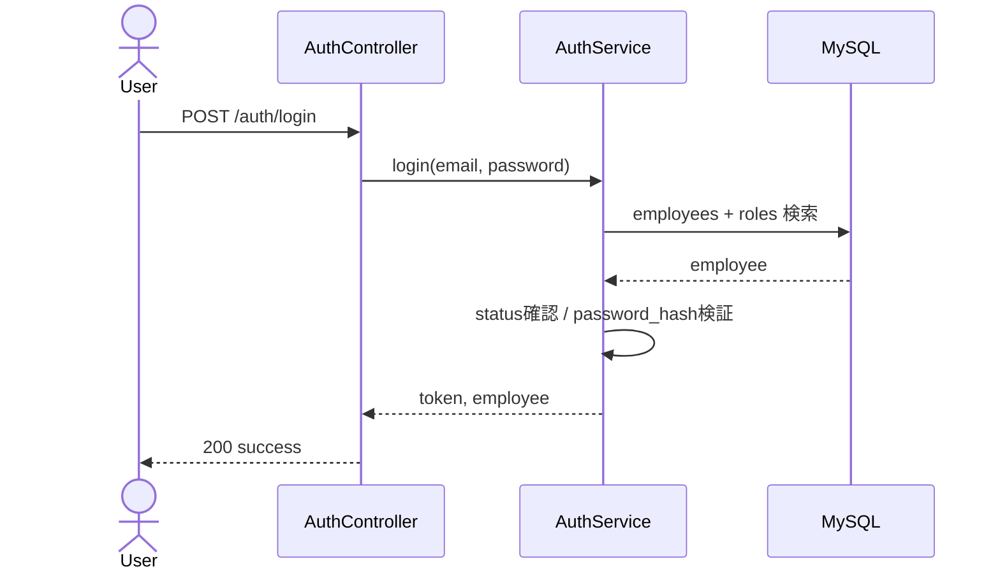
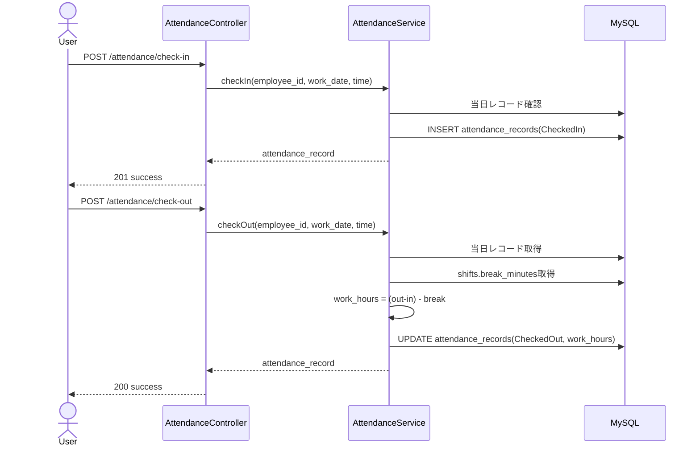
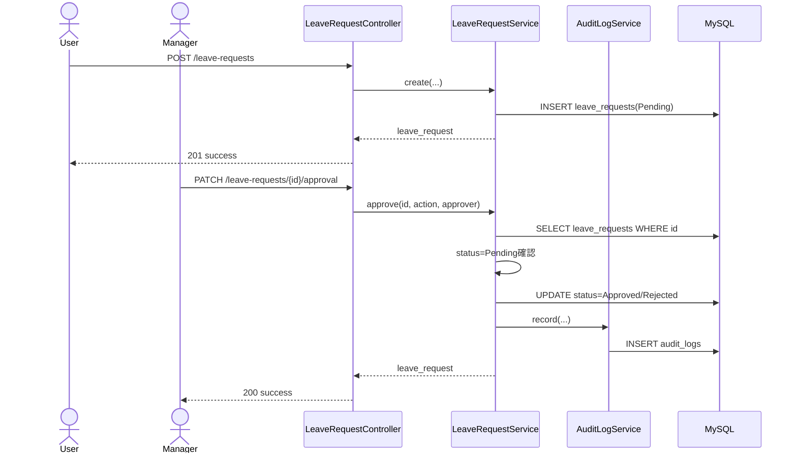
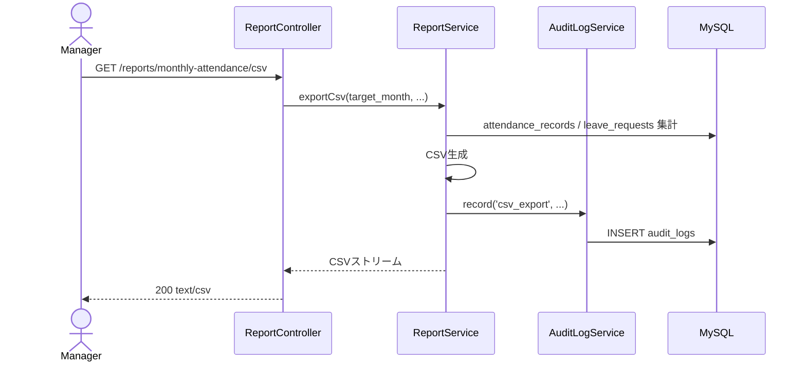

# 詳細設計書

HR & Attendance System（勤怠管理システム）

---

# 文書管理情報

| 項目 | 内容 |
| --- | --- |
| システム名 | HR & Attendance System |
| 文書名 | 詳細設計書 |
| 文書番号 | DOC-012 |
| 作成者 | Nguyen Minh Tri |
| 作成日 | 2026/07/02 |
| バージョン | 1.3 |
| ステータス | Draft |

---

# 改訂履歴

| Version | 日付 | 作成者 | 内容 |
| --- | --- | --- | --- |
| 1.0 | 2026/07/02 | Nguyen Minh Tri | 初版作成 |
| 1.1 | 2026/07/15 | Nguyen Minh Tri | 整合性レビューによる修正：LeaveRequest fillableにcommentを追加（09_テーブル定義 v1.3のleave_requests.comment列追加に対応） |
| 1.2 | 2026/07/16 | Nguyen Minh Tri | 7章（FormRequest詳細設計）を全面改訂。Markdown表内のエスケープ`\|`がHTML変換時に列崩れ・バックスラッシュ表示バグ（¥文字化け）を起こしていたため、FormRequestごとの`rules()`実装コードブロックに置き換えた。 |
| 1.3 | 2026/07/16 | Nguyen Minh Tri | 7章の全ルールをパイプ区切り文字列から配列形式に統一。UpdateEmployeeRequestの自己レコード除外を文字列連結から`Rule::unique()->ignore()`のfluent builderに変更（Laravel推奨パターン）。 |

---

# 目次

1. 本書の目的
2. 詳細設計方針
3. ディレクトリ構成
4. Controller詳細設計
5. Service詳細設計（主要処理ロジック）
6. Model詳細設計
7. FormRequest詳細設計（Validation）
8. Middleware / Policy詳細設計
9. シーケンス図（主要フロー）
10. トランザクション設計
11. 例外処理詳細設計
12. バッチ・スケジューラ方針
13. ログ出力詳細設計
14. トレーサビリティ
15. まとめ

---

# 1. 本書の目的

本書は、基本設計書（11）で定義したシステム構成・Layer構成・Module構成をもとに、実装者がそのままコーディングできる粒度までHR & Attendance Systemの内部設計を詳細化するものである。

Controller・Service・Model・FormRequest・Middleware・Policyの責務分担、主要業務処理の処理ロジック、例外処理、トランザクション境界を明確にし、単体試験仕様書（15）・結合試験仕様書（16）の試験項目がそのまま実装と対応するようにする。

---

# 2. 詳細設計方針

| 方針ID | 方針 | 内容 |
| --- | --- | --- |
| DD-POL-001 | Thin Controller | ControllerはRequest受領・認可・Service呼び出し・Response整形のみを行い、業務ロジックを持たない。 |
| DD-POL-002 | Fat Service | 業務ロジック、状態遷移、トランザクション制御はServiceに集約する。 |
| DD-POL-003 | FormRequest First | 入力検証はController内ではなくFormRequestで完結させる。 |
| DD-POL-004 | Policy Based Authorization | 権限判定はMiddlewareでのRole判定とPolicyでのデータ範囲判定を分離する。 |
| DD-POL-005 | Explicit Transaction | 複数テーブルを更新する処理は`DB::transaction()`で明示的に囲む。 |
| DD-POL-006 | No Hidden Batch | 12_詳細設計時点でスケジューラ・キューに依存する処理を作らない（13章参照）。 |
| DD-POL-007 | Traceable Exception | 例外はErrorHandlerで一元的にError ID（E001〜E010）へ変換する。 |

---

# 3. ディレクトリ構成

Laravel 12の標準構成に、本システム向けのServices / Policiesディレクトリを追加した構成とする。

```text
app/
├── Http/
│   ├── Controllers/
│   │   ├── Auth/
│   │   │   └── AuthController.php        # API-001,002,003,019,021
│   │   ├── AttendanceController.php      # API-004〜008
│   │   ├── LeaveRequestController.php    # API-009〜011
│   │   ├── ReportController.php          # API-012,013
│   │   ├── EmployeeController.php        # API-014〜016
│   │   ├── DepartmentController.php      # API-017
│   │   └── ShiftController.php           # API-018
│   ├── Requests/
│   │   ├── Auth/LoginRequest.php
│   │   ├── Auth/UpdatePasswordRequest.php
│   │   ├── Attendance/CheckInRequest.php
│   │   ├── Attendance/CheckOutRequest.php
│   │   ├── Attendance/AttendanceSearchRequest.php
│   │   ├── LeaveRequest/StoreLeaveRequestRequest.php
│   │   ├── LeaveRequest/ApprovalRequest.php
│   │   ├── Report/MonthlyReportRequest.php
│   │   ├── Employee/StoreEmployeeRequest.php
│   │   ├── Employee/UpdateEmployeeRequest.php
│   │   ├── Department/StoreDepartmentRequest.php
│   │   └── Shift/StoreShiftRequest.php
│   └── Middleware/
│       ├── EnsureRole.php                # Role Based Access Control
│       └── EnsureActiveEmployee.php      # BR-007 無効化社員の遮断
├── Services/
│   ├── AuthService.php
│   ├── AttendanceService.php
│   ├── LeaveRequestService.php
│   ├── ReportService.php
│   ├── EmployeeService.php
│   ├── DepartmentService.php
│   ├── ShiftService.php
│   └── AuditLogService.php
├── Models/
│   ├── Employee.php
│   ├── Role.php
│   ├── Department.php
│   ├── Shift.php
│   ├── AttendanceRecord.php
│   ├── LeaveRequest.php
│   └── AuditLog.php
├── Policies/
│   ├── AttendancePolicy.php
│   ├── LeaveRequestPolicy.php
│   ├── EmployeePolicy.php
│   ├── DepartmentPolicy.php
│   ├── ShiftPolicy.php
│   └── ReportPolicy.php
└── Exceptions/
    └── Handler.php                       # 例外→Error ID変換（11章）
```

---

# 4. Controller詳細設計

| Controller | Method | HTTP | Endpoint | 呼び出しService | 権限（Middleware/Policy） |
| --- | --- | --- | --- | --- | --- |
| AuthController | login | POST | `/auth/login` | AuthService::login | Public |
| AuthController | logout | POST | `/auth/logout` | AuthService::logout | auth |
| AuthController | me | GET | `/auth/me` | AuthService::me | auth |
| AuthController | updatePassword | PATCH | `/auth/password` | AuthService::updatePassword | auth |
| AuthController | session | GET | `/auth/session` | AuthService::sessionStatus | auth |
| AttendanceController | checkIn | POST | `/attendance/check-in` | AttendanceService::checkIn | auth |
| AttendanceController | checkOut | POST | `/attendance/check-out` | AttendanceService::checkOut | auth |
| AttendanceController | workHours | GET | `/attendance/{id}/work-hours` | AttendanceService::getWorkHours | auth, AttendancePolicy@view |
| AttendanceController | myAttendance | GET | `/attendance/me` | AttendanceService::myAttendance | auth |
| AttendanceController | search | GET | `/attendance` | AttendanceService::search | auth, AttendancePolicy@search |
| LeaveRequestController | store | POST | `/leave-requests` | LeaveRequestService::create | auth |
| LeaveRequestController | index | GET | `/leave-requests` | LeaveRequestService::list | auth, LeaveRequestPolicy@viewAny |
| LeaveRequestController | approval | PATCH | `/leave-requests/{id}/approval` | LeaveRequestService::approve | role:manager,admin |
| ReportController | monthly | GET | `/reports/monthly-attendance` | ReportService::monthly | role:manager,admin |
| ReportController | csv | GET | `/reports/monthly-attendance/csv` | ReportService::exportCsv | role:manager,admin |
| EmployeeController | store | POST | `/employees` | EmployeeService::create | role:admin |
| EmployeeController | update | PUT | `/employees/{id}` | EmployeeService::update | role:admin |
| EmployeeController | setStatus | PATCH | `/employees/{id}/status` | EmployeeService::setStatus | role:admin |
| DepartmentController | index/store/update/setStatus | GET/POST/PUT/PATCH | `/departments*` | DepartmentService | role:admin |
| ShiftController | index/store/update/setStatus | GET/POST/PUT/PATCH | `/shifts*` | ShiftService | role:admin |

Controllerは各Method内で「FormRequestからDTO相当の配列取得 → Service呼び出し → 共通Response形式で返却」の3ステップのみを行い、業務判断（状態確認・計算等）を含めない。

---

# 5. Service詳細設計（主要処理ロジック）

## 5.1 AuthService::login

```text
入力: email, password
1. employees を email で検索する
2. 見つからない、または status = inactive の場合 → E001 を投げる（BR-007）
3. password_hash を検証する。不一致なら E001
4. token（またはsession）を発行する
5. employees.role_id から role_name を取得し返却する
戻り値: access_token, employee情報
```

## 5.2 AttendanceService::checkIn（BR-ATT-001 / BR-ATT-002）

```text
入力: employee_id（認証ユーザー本人固定）, work_date, check_in_time
1. attendance_records を employee_id + work_date で検索する
2. 既に存在する場合 → E004（二重打刻）
3. トランザクション開始
4. attendance_records に status=CheckedIn で新規作成
5. トランザクションコミット
戻り値: attendance_record（id, work_date, check_in_time, status）
```

## 5.3 AttendanceService::checkOut（BR-ATT-003 / BR-ATT-004 / BR-ATT-005）

```text
入力: employee_id, work_date, check_out_time
1. attendance_records を employee_id + work_date で検索する
2. 存在しない場合 → E005（出勤打刻なし退勤）
3. status が既に CheckedOut/Fixed の場合 → E004（二重打刻）
4. check_out_time が check_in_time 以前の場合 → E003
5. 対象社員の employees.shift_id から shifts.break_minutes を取得する
6. work_hours を算出する：
     raw_minutes = check_out_time - check_in_time （分単位）
     work_minutes = raw_minutes - shifts.break_minutes
     work_hours = work_minutes / 60 （小数第2位まで、DECIMAL(5,2)）
   ※ break_minutesはこの時点のシフト値を使用し、以後シフトが変更されても
     この attendance_records.work_hours は再計算しない（スナップショット方針）
7. トランザクション開始
8. attendance_records を更新（check_out_time, work_hours, status=CheckedOut）
9. トランザクションコミット
戻り値: attendance_record（work_hours含む）
```

## 5.4 AttendanceService::search（データ範囲制御）

```text
入力: 認証ユーザーのrole, department_id?, employee_id?, from_date?, to_date?
1. role = User の場合 → employee_id を強制的に自分自身に固定する
2. role = Manager の場合 → department_id を自部署に固定、
   もしくは自分が承認者となっているemployee範囲に限定する
3. role = Admin の場合 → 制限なし
4. 上記条件でattendance_recordsをクエリし、ページングして返却する
```

## 5.5 LeaveRequestService::create

```text
入力: employee_id, leave_type, start_date, end_date, reason
1. start_date <= end_date を検証する（不正ならE003、FormRequestで一次チェック済みだがService側でも防御的に確認）
2. トランザクション開始
3. leave_requests に status=Pending で登録
4. トランザクションコミット
戻り値: leave_request（id, status=Pending）
```

## 5.6 LeaveRequestService::approve（BR-LEV-001〜003）

```text
入力: leave_request_id, action(approve|reject), comment(nullable), 承認者employee_id
1. leave_requests を id で検索する。存在しなければ E007
2. status が Pending 以外の場合 → E006（処理済み申請の更新）
3. トランザクション開始
4. action=approve なら status=Approved、action=reject なら status=Rejected に更新
   approved_by = 承認者employee_id、approved_at = now()、comment = 入力のcomment（09 v1.3で追加した列へ保存）
5. AuditLogService::record('leave_request_' . action . 'd', 'leave_requests', id, 'success') を呼び出す
6. トランザクションコミット
```

## 5.7 LeaveRequestService（表示用ヘルパー：isCompletedDisplay）

```text
# leave_requestsはDB上status=Approved/Pending/Rejectedのみを持つ（Completedは持たない）。
# 「済」表示は一覧取得時に以下を計算して付与する（DBは更新しない）。
入力: leave_request（status, end_date）
表示ロジック:
  if status == 'Approved' and end_date < today():
      display_label = 'Approved（済）'
  else:
      display_label = status
```

## 5.8 ReportService::monthly

```text
入力: target_month, department_id?, employee_id?
1. AttendanceService::search と同様のデータ範囲制御を適用する
2. target_month の1日〜末日でattendance_recordsを検索する
3. 社員ごとに 勤務日数 / 総勤務時間（work_hoursの合計） / 休暇日数（承認済みleave_requestsから算出） / 遅刻・早退回数 を集計する
   ※ 休暇日数はDBのstatus=Approvedを対象とし、5.7のような表示専用の「済」ラベルは集計条件に含めない
4. 集計結果を返却する
```

## 5.9 ReportService::exportCsv

```text
入力: target_month, department_id?, employee_id?
1. ReportService::monthly と同一条件でデータを取得する
2. CSVヘッダー（社員名,部署,勤務日数,総勤務時間,休暇日数,遅刻早退回数）を出力する
3. 各行を出力する
4. 生成に失敗した場合 → E008
5. 成功時、AuditLogService::record('csv_export', 'attendance_records', null, 'success') を呼び出す
戻り値: text/csv レスポンス（ファイル名 attendance_YYYYMM.csv）
```

## 5.10 EmployeeService::create / update / setStatus

```text
create:
1. employee_id / email の一意性をDB制約でも担保（FormRequestのunique検証と二重防御）
2. password をハッシュ化してpassword_hashへ保存
3. トランザクション開始 → employees登録 → AuditLogService::record('employee_created', ...) → コミット

update:
1. 対象employeeが存在しなければ E007
2. name/email/role_id/department_id/shift_id/statusを更新
3. AuditLogService::recordを呼び出す

setStatus（BR-EMP-001）:
1. 物理削除は行わず、statusをactive/inactiveに更新するのみ
2. AuditLogService::recordを呼び出す
```

## 5.11 DepartmentService / ShiftService

社員管理と同一パターン（登録・編集・status切替、物理削除なし）。ShiftServiceのみ`start_time < end_time`の検証をService側でも防御的に再確認する。

## 5.12 AuditLogService::record

```text
入力: actor_employee_id, action, target_type, target_id, result, ip_address
1. audit_logs に1件INSERTする（このINSERT自体は呼び出し元のトランザクションに含める）
2. 失敗してもホスト処理（例：休暇承認）自体を失敗させない設計とするか、
   一体的に失敗させるかはDD-POL-005に基づき「重要操作は一体トランザクション」とし、
   audit_logs書き込み失敗時もE009として全体をロールバックする
```

---

# 6. Model詳細設計

| Model | fillable（主要） | リレーション | 補足 |
| --- | --- | --- | --- |
| Employee | employee_id, name, email, password_hash, role_id, department_id, shift_id, status | belongsTo Role/Department/Shift、hasMany AttendanceRecord/LeaveRequest/AuditLog | password_hashはhidden属性としAPIレスポンスから除外する |
| Role | role_code, role_name, status | hasMany Employee | - |
| Department | department_code, department_name, status | hasMany Employee | - |
| Shift | shift_code, shift_name, start_time, end_time, break_minutes, status | hasMany Employee | - |
| AttendanceRecord | employee_id, work_date, check_in_time, check_out_time, work_hours, status | belongsTo Employee | work_hoursはcast:decimal:2 |
| LeaveRequest | employee_id, leave_type, start_date, end_date, reason, status, approved_by, approved_at, comment | belongsTo Employee（employee_id）、belongsTo Employee as approver（approved_by） | scopeIsOverdue()：status=Approved かつ end_date<today を抽出する表示補助スコープ（5.7と対応）。commentは承認/却下時の任意コメント（09 v1.3で追加、ApprovalRequestで検証済みの値の保存先） |
| AuditLog | employee_id, action, target_type, target_id, result, ip_address | belongsTo Employee | created_atのみ（updated_atなし） |

---

# 7. FormRequest詳細設計（Validation）

各FormRequestの`rules()`メソッドをそのまま実装できる形で示す（コーディング時はこのコードブロックを転記し、フィールド名だけ実テーブルと突き合わせて確認する）。すべて失敗時は`FormRequest`の標準例外（`ValidationException`）を投げ、11章のExceptionHandlerがE003へ変換する。

**記法方針**: 1フィールドに複数ルールを持つ場合は、パイプ区切り文字列（`'required|max:50'`）ではなく配列形式（`['required', 'max:50']`）で統一する。理由: (1) `Rule::unique()->ignore()` 等のfluent builderオブジェクトはパイプ文字列に埋め込めず配列形式が必須、(2) ルール値自体にカンマ・パイプを含むケースで誤爆しない、(3) ルールの追加・削除がgit差分で1行単位になり読みやすい。

| FormRequest | 呼び出し元（Controller::Method） |
| --- | --- |
| LoginRequest | AuthController::login |
| UpdatePasswordRequest | AuthController::updatePassword |
| CheckInRequest | AttendanceController::checkIn |
| CheckOutRequest | AttendanceController::checkOut |
| AttendanceSearchRequest | AttendanceController::search |
| StoreLeaveRequestRequest | LeaveRequestController::store |
| ApprovalRequest | LeaveRequestController::approval |
| MonthlyReportRequest | ReportController::monthly / csv |
| StoreEmployeeRequest | EmployeeController::store |
| UpdateEmployeeRequest | EmployeeController::update |
| StoreDepartmentRequest | DepartmentController::store |
| StoreShiftRequest | ShiftController::store |

## 7.1 LoginRequest

```php
public function rules(): array
{
    return [
        'email'    => ['required', 'email', 'max:255'],
        'password' => ['required', 'min:8', 'max:20'],
    ];
}
```

## 7.2 UpdatePasswordRequest

```php
public function rules(): array
{
    return [
        'current_password' => ['required'],
        'new_password'      => ['required', 'min:8', 'max:20', 'confirmed'],
    ];
}
```

## 7.3 CheckInRequest

```php
public function rules(): array
{
    return [
        'work_date'     => ['required', 'date'],
        'check_in_time' => ['required', 'date_format:H:i:s'],
    ];
}
```

## 7.4 CheckOutRequest

```php
public function rules(): array
{
    return [
        'work_date'      => ['required', 'date'],
        'check_out_time' => ['required', 'date_format:H:i:s', 'after:check_in_time'],
    ];
}
```

## 7.5 AttendanceSearchRequest

```php
public function rules(): array
{
    return [
        'employee_id'   => ['nullable', 'exists:employees,id'],
        'department_id' => ['nullable', 'exists:departments,id'],
        'from_date'     => ['nullable', 'date'],
        'to_date'       => ['nullable', 'date'],
    ];
}
```

## 7.6 StoreLeaveRequestRequest

```php
public function rules(): array
{
    return [
        'leave_type' => ['required', 'in:paid_leave,absence,late,early_leave'],
        'start_date' => ['required', 'date'],
        'end_date'   => ['required', 'date', 'after_or_equal:start_date'],
        'reason'     => ['required', 'max:500'],
    ];
}
```

## 7.7 ApprovalRequest

```php
public function rules(): array
{
    return [
        'action'  => ['required', 'in:approve,reject'],
        'comment' => ['nullable', 'max:500'],
    ];
}
```

## 7.8 MonthlyReportRequest

```php
public function rules(): array
{
    return [
        'target_month' => ['required', 'date_format:Y-m'],
    ];
}
```

## 7.9 StoreEmployeeRequest

```php
public function rules(): array
{
    return [
        'employee_id'   => ['required', 'max:50', 'unique:employees'],
        'name'          => ['required', 'max:100'],
        'email'         => ['required', 'email', 'max:255', 'unique:employees'],
        'password'      => ['required', 'min:8', 'max:20'],
        'role_id'       => ['required', 'exists:roles,id'],
        'department_id' => ['required', 'exists:departments,id'],
        'shift_id'      => ['nullable', 'exists:shifts,id'],
    ];
}
```

## 7.10 UpdateEmployeeRequest

`StoreEmployeeRequest`に準ずるが、`employee_id`/`email`のunique判定は自レコード除外する。文字列連結（`"unique:employees,employee_id,{$id}"`）ではなく、`Rule::unique()->ignore()`のfluent builderを使う（`use Illuminate\Validation\Rule;`が必要）。

```php
use Illuminate\Validation\Rule;

public function rules(): array
{
    $employeeId = $this->route('employee')->id;

    return [
        'employee_id'   => ['required', 'max:50', Rule::unique('employees')->ignore($employeeId)],
        'name'          => ['required', 'max:100'],
        'email'         => ['required', 'email', 'max:255', Rule::unique('employees')->ignore($employeeId)],
        'role_id'       => ['required', 'exists:roles,id'],
        'department_id' => ['required', 'exists:departments,id'],
        'shift_id'      => ['nullable', 'exists:shifts,id'],
    ];
}
```

## 7.11 StoreDepartmentRequest

```php
public function rules(): array
{
    return [
        'department_code' => ['required', 'max:50', 'unique:departments'],
        'department_name' => ['required', 'max:100', 'unique:departments'],
    ];
}
```

## 7.12 StoreShiftRequest

```php
public function rules(): array
{
    return [
        'shift_code'    => ['required', 'max:50', 'unique:shifts'],
        'start_time'    => ['required', 'date_format:H:i:s'],
        'end_time'      => ['required', 'date_format:H:i:s', 'after:start_time'],
        'break_minutes' => ['required', 'integer', 'min:0'],
    ];
}
```

---

# 8. Middleware / Policy詳細設計

## 8.1 EnsureRole Middleware

```text
入力: 許可ロール一覧（例: role:manager,admin）
1. 認証ユーザーが存在しなければ E010
2. 認証ユーザーのrole_nameが許可ロールに含まれなければ E002
3. 含まれる場合は次の処理へ
```

## 8.2 EnsureActiveEmployee Middleware（BR-007）

```text
1. 認証ユーザーのemployees.statusがinactiveの場合、既存トークン/セッションを無効化しE001相当を返却する
```

## 8.3 Policy詳細

| Policy | Method | ロジック |
| --- | --- | --- |
| AttendancePolicy | search | User: employee_id引数が自分自身のときのみtrue。Manager: department_id引数が自部署のときのみtrue。Admin: 常にtrue |
| LeaveRequestPolicy | viewAny | User: 自分のemployee_idの申請のみ。Manager: 自分の申請＋自部署の承認対象。Admin: 全件 |
| LeaveRequestPolicy | approve | Manager/Adminのみtrue、かつ対象leave_request.status=Pendingのときのみtrue |
| EmployeePolicy / DepartmentPolicy / ShiftPolicy | any | Adminのみtrue |
| ReportPolicy | view/export | Manager/Adminのみtrue、Managerはdepartment_id指定時に自部署以外を拒否 |

---

# 9. シーケンス図（主要フロー）

## 9.1 ログイン



## 9.2 出勤〜退勤



## 9.3 休暇申請〜承認



## 9.4 月次レポートCSV出力



---

# 10. トランザクション設計

| 処理 | トランザクション範囲 | 理由 |
| --- | --- | --- |
| 出勤打刻 | attendance_records INSERT単体 | 単一テーブル更新だが、重複チェックとINSERTの間の競合をunique制約で最終防御する |
| 退勤打刻 | attendance_records UPDATE単体 | 同上 |
| 休暇申請 | leave_requests INSERT単体 | 単一テーブル更新 |
| 休暇承認・却下 | leave_requests UPDATE + audit_logs INSERT | 承認結果と監査ログの整合性を保証するため1トランザクションとする |
| CSV出力 | 集計読み取り + audit_logs INSERT | ログ記録もトランザクションに含め、記録漏れを防ぐ |
| 社員/部署/シフトの登録・編集・無効化 | 対象テーブルUPDATE/INSERT + audit_logs INSERT | 同上 |

トランザクション中に例外が発生した場合は全てロールバックし、E009として返却する（DD-POL-005 / IT-COM-003対応）。

---

# 11. 例外処理詳細設計

| Laravel例外 | 発生箇所 | 変換先Error ID | HTTP Status |
| --- | --- | --- | --- |
| ValidationException | FormRequest | E003 | 422 |
| AuthenticationException | Middleware（未認証） | E010 | 401 |
| AuthorizationException | Policy / EnsureRole | E002 | 403 |
| ModelNotFoundException | Controller/Service（findOrFail） | E007 | 404 |
| DuplicateAttendanceException（独自） | AttendanceService::checkIn/checkOut | E004 | 409 |
| CheckOutWithoutCheckInException（独自） | AttendanceService::checkOut | E005 | 409 |
| LeaveRequestAlreadyProcessedException（独自） | LeaveRequestService::approve | E006 | 409 |
| CsvExportException（独自） | ReportService::exportCsv | E008 | 500 |
| QueryException / PDOException | Service全般 | E009 | 500 |

独自例外（Duplicate/CheckOutWithoutCheckIn/LeaveRequestAlreadyProcessed/CsvExport）は`app/Exceptions/`配下に定義し、`Handler.php`でError ID・HTTP Statusへ一括変換する。これによりController/Serviceでは業務条件のみを判定し、HTTP Statusの詳細を意識しない。

---

# 12. バッチ・スケジューラ方針

要件定義書（02）の整合性レビューにより、leave_requestsは「Approved／Pending／Rejected」の3状態のみをDBに保持し、対象日経過後の「済」表示は一覧取得時（5.7）に動的判定する方針へ変更済みである。

そのため、本システムはLaravel Scheduler・Queueに依存するバッチ処理を**一切必要としない**。インフラ設計（13）のScheduler/Queueが引き続き「初期リリースでは対象外」となっていることは、この設計判断と整合している。

将来、給与計算連携や有給休暇の自動失効処理など、日次バッチが必要な機能を追加する場合は、本章を更新したうえでインフラ設計のScheduler方針もあわせて見直す。

---

# 13. ログ出力詳細設計

| ログ種別 | 出力先 | 出力内容 | 除外情報 |
| --- | --- | --- | --- |
| Application Log | `storage/logs/laravel.log` | 例外スタックトレース、Service内エラー | password, password_hash, DB_PASSWORD, APP_KEY, access_token |
| Access Log | Nginxコンテナ | HTTPメソッド、Path、Status、応答時間 | - |
| Audit Log | `audit_logs`テーブル | employee_id, action, target_type, target_id, result, ip_address, created_at | password系全般 |

Laravelの例外ハンドラでは、`report()`でApplication Logへ詳細を出力し、`render()`ではE001〜E010に対応する安全なメッセージのみをレスポンスへ返す（14_セキュリティ設計 14章と整合）。

---

# 14. トレーサビリティ

| 詳細設計対象 | 関連基本設計（11） | 関連API | 関連Table | 関連試験 |
| --- | --- | --- | --- | --- |
| AuthService | 9. 認証・認可設計 | API-001/002/003/019/021 | employees / roles | UT-AUTH- / IT-AUTH- / ST-AUTH- |
| AttendanceService | 10.1 / 10.2 | API-004〜008 | attendance_records / shifts | UT-ATT- / IT-ATT- / ST-FUNC-004〜008 |
| LeaveRequestService | 10.3 | API-009〜011 | leave_requests / audit_logs | UT-LEV- / IT-LEV- / ST-FUNC-009〜011 |
| ReportService | 10.4 | API-012/013 | attendance_records / audit_logs | UT-REP- / IT-REP- / ST-FUNC-012/013 |
| EmployeeService / DepartmentService / ShiftService | 10.5 | API-014〜018 | employees / departments / shifts | UT-MST- / IT-MST- / ST-FUNC-014〜018 |
| AuditLogService | 12章 | API-020 | audit_logs | UT-AUD- / IT-AUD- / ST-SEC-008 |

---

# 15. まとめ

本書では、基本設計書（11）を踏まえ、Controller/Service/Model/FormRequest/Middleware/Policyの詳細設計、主要業務処理の処理ロジック（特にBR-ATT-005の勤務時間計算とBR-LEV-001〜003の休暇承認）、シーケンス図、トランザクション境界、例外処理のError ID変換、バッチ不要の設計判断、ログ出力方針を定義した。

本書を基準として、実装（backend/frontend）および単体・結合・システム試験を進める。
