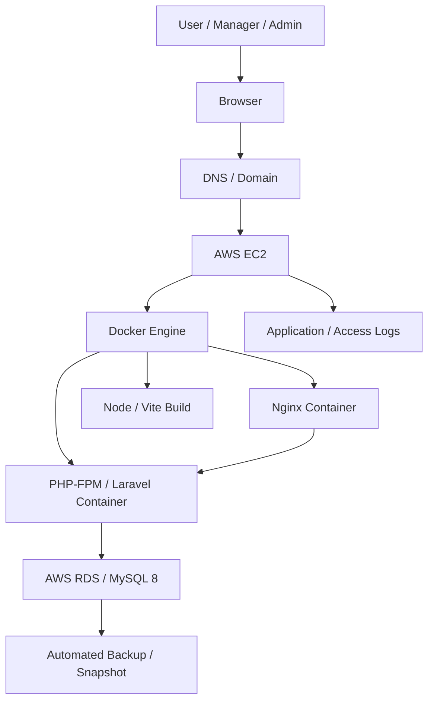
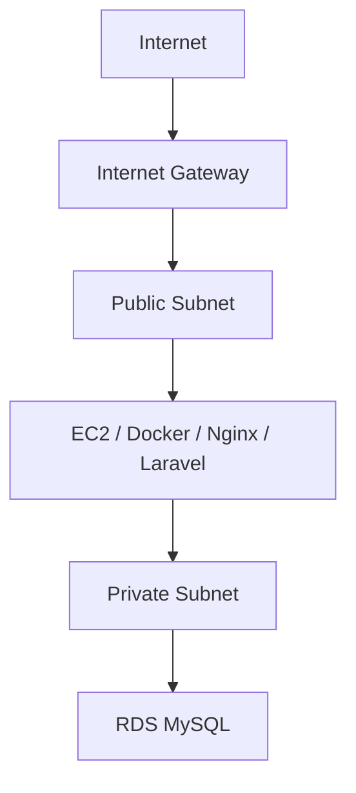
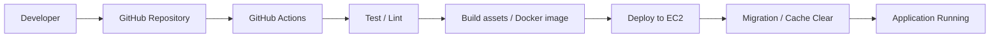

# インフラ設計

HR & Attendance System（勤怠管理システム）

---

# 文書管理情報

| 項目 | 内容 |
| --- | --- |
| システム名 | HR & Attendance System |
| 文書名 | インフラ設計 |
| 文書番号 | DOC-013 |
| 作成者 | Nguyen Minh Tri |
| 作成日 | 2026/07/02 |
| バージョン | 1.0 |
| ステータス | Draft |

---

# 改訂履歴

| Version | 日付 | 作成者 | 内容 |
| --- | --- | --- | --- |
| 1.0 | 2026/07/02 | Nguyen Minh Tri | 初版作成 |

---

# 目次

1. 本書の目的
2. インフラ設計方針
3. 全体構成
4. AWS構成
5. Network設計
6. EC2設計
7. Docker設計
8. Nginx設計
9. Application Runtime設計
10. RDS / MySQL設計
11. Storage / Backup設計
12. Security Group設計
13. 環境変数・Secret管理
14. 監視・ログ設計
15. CI/CD設計
16. 可用性・復旧設計
17. Cost設計
18. トレーサビリティ
19. まとめ

---

# 1. 本書の目的

本書は、HR & Attendance Systemを稼働させるためのインフラ構成を定義する。

対象はAWS EC2、Docker、Nginx、PHP-FPM / Laravel、Node / Vite Build、AWS RDS / MySQL 8を中心とした構成である。

本書は、開発・検証・本番環境の構築、デプロイ、監視、障害対応、運用保守の基準資料とする。

---

# 2. インフラ設計方針

| 方針ID | 方針 | 内容 |
| --- | --- | --- |
| INF-POL-001 | Simple Architecture | 個人ポートフォリオ・学習用途として、シンプルで理解しやすい構成にする。 |
| INF-POL-002 | Docker Based | EC2上でDockerを利用し、環境差異を小さくする。 |
| INF-POL-003 | Managed DB | DBはAWS RDS / MySQL 8を利用し、バックアップと保守性を高める。 |
| INF-POL-004 | Security First | Public公開はNginxのみとし、DBは外部公開しない。 |
| INF-POL-005 | Scalability Ready | 将来的にEC2 / RDSのスケールアップ、Web複数台化を可能にする。 |
| INF-POL-006 | Observability | CPU、Memory、Disk、DB、API、Logを確認できる構成にする。 |
| INF-POL-007 | Cost Control | 初期リリースでは小規模構成とし、不要な常時稼働リソースを避ける。 |

---

# 3. 全体構成

## 3.1 Request Flow

| Step | Flow | 内容 |
| --- | --- | --- |
| 1 | Browser → DNS | ユーザーがドメインへアクセスする。 |
| 2 | DNS → EC2 | Public IPまたはElastic IPへ名前解決する。 |
| 3 | EC2 → Nginx Container | HTTP/HTTPSリクエストをNginxが受け付ける。 |
| 4 | Nginx → Laravel Container | API / PHP処理をPHP-FPM / Laravelへ転送する。 |
| 5 | Laravel → RDS | MySQLへデータ検索・登録・更新を行う。 |
| 6 | Laravel → Nginx → Browser | JSONまたは画面Responseを返却する。 |

---

# 4. AWS構成

## 4.1 利用AWSサービス

| Service | 用途 | 初期構成 |
| --- | --- | --- |
| EC2 | Web / Application Server | t3.small相当を想定 |
| RDS | MySQL Database | db.t3.micro相当を想定 |
| VPC | Network分離 | Default VPCまたは専用VPC |
| Security Group | 通信制御 | Web / DB用に分離 |
| EBS | EC2 Disk | gp3 |
| CloudWatch | 監視・ログ確認 | 基本メトリクス利用 |
| IAM | 権限管理 | 最小権限のRole / User |
| Route 53 | DNS | 独自ドメイン利用時 |
| ACM | SSL証明書 | HTTPS化時 |

## 4.2 環境構成

| 環境 | 用途 | 構成 |
| --- | --- | --- |
| Local | 開発 | Local Docker / MySQLまたは開発DB |
| Development | 検証 | EC2 + Docker + RDS Development DB |
| Production | 本番想定 | EC2 + Docker + RDS Production DB |

## 4.3 Region

| 項目 | 内容 |
| --- | --- |
| Region | ap-northeast-1（Tokyo）を想定 |
| 理由 | 日本国内利用、低レイテンシ、学習環境との親和性 |

---

# 5. Network設計

## 5.1 Network概要

## 5.2 Subnet設計

| Subnet | Public/Private | 配置対象 | 内容 |
| --- | --- | --- | --- |
| Public Subnet | Public | EC2 | InternetからHTTP/HTTPSを受け付ける。 |
| Private Subnet | Private | RDS | 外部から直接アクセスさせない。 |

Note:

| 項目 | 内容 |
| --- | --- |
| 初期構成 | 学習用途ではDefault VPCも可とする。 |
| 推奨構成 | 本番想定ではEC2をPublic Subnet、RDSをPrivate Subnetに配置する。 |
| 将来拡張 | ALB導入時はALBをPublic Subnet、EC2をPrivate Subnetへ移動する。 |

## 5.3 Port設計

| Port | Protocol | From | To | 用途 |
| --- | --- | --- | --- | --- |
| 80 | HTTP | Internet | EC2 / Nginx | HTTPアクセス、HTTPSリダイレクト |
| 443 | HTTPS | Internet | EC2 / Nginx | 画面・APIアクセス |
| 22 | SSH | 管理者IP | EC2 | 管理作業 |
| 3306 | MySQL | EC2 Security Group | RDS | LaravelからDB接続 |

---

# 6. EC2設計

## 6.1 EC2基本設計

| 項目 | 内容 |
| --- | --- |
| Instance Type | t3.small相当を想定 |
| OS | Ubuntu LTS または Amazon Linux 2023 |
| Disk | EBS gp3 / 20GB以上 |
| Role | Web / Application Server |
| Public IP | Elastic IP利用を推奨 |
| Timezone | Asia/Tokyo |

## 6.2 EC2導入Software

| Software | 用途 |
| --- | --- |
| Docker Engine | Container実行 |
| Docker Compose | 複数Container管理 |
| Git | Source取得 |
| Nginx Container | Web Server |
| PHP-FPM / Laravel Container | Application Runtime |
| Node / Vite | Frontend asset build |

## 6.3 EC2 Directory設計

| Path | 用途 |
| --- | --- |
| `/var/www/hr-attendance` | Application配置先 |
| `/var/www/hr-attendance/.env` | Laravel環境設定 |
| `/var/log/nginx` | Nginx log mount先 |
| `/var/log/hr-attendance` | Application log確認用 |
| `/backup` | 一時backup配置先 |

---

# 7. Docker設計

## 7.1 Container構成

| Container | Image / Runtime | 役割 |
| --- | --- | --- |
| nginx | nginx stable | 静的ファイル配信、Reverse Proxy |
| app | PHP 8.4 FPM + Laravel 12 | API、業務処理、DB接続 |
| node | Node LTS | Vite build用。常時起動は必須ではない。 |

## 7.2 Docker Network

| Network | 接続Container | 用途 |
| --- | --- | --- |
| app-network | nginx / app | NginxからLaravelへ内部通信 |
| external | app → RDS | LaravelからRDSへ接続 |

## 7.3 Volume設計

| Volume / Mount | 用途 |
| --- | --- |
| app source | Laravel application source |
| storage | Laravel storage / logs |
| public build | Vite build成果物 |
| nginx logs | access.log / error.log |

## 7.4 Container起動方針

| 項目 | 方針 |
| --- | --- |
| Restart Policy | `unless-stopped` |
| Health Check | Nginx HTTP応答、Laravel `/health`相当を将来追加 |
| Build | GitHub ActionsまたはEC2上でDocker build |
| Migration | Deploy時に手動またはCI/CDで実行 |

---

# 8. Nginx設計

## 8.1 Nginx役割

| 役割 | 内容 |
| --- | --- |
| Reverse Proxy | PHP-FPM / Laravelへリクエスト転送 |
| Static File | Vite build済みassetを配信 |
| Access Log | HTTPアクセスを記録 |
| Error Log | Web Serverエラーを記録 |
| HTTPS | SSL終端はNginxまたは将来ALBで実施 |

## 8.2 Routing方針

| Path | 転送先 | 内容 |
| --- | --- | --- |
| `/` | Laravel / static | Web画面表示 |
| `/api/*` | Laravel | REST API |
| `/build/*` | static file | Vite asset |
| `/health` | LaravelまたはNginx | Health Check |

## 8.3 HTTPS方針

| 環境 | 方針 |
| --- | --- |
| Local | HTTP可 |
| Development | HTTPS推奨 |
| Production | HTTPS必須 |

---

# 9. Application Runtime設計

## 9.1 Laravel Runtime

| 項目 | 内容 |
| --- | --- |
| PHP | PHP 8.4 |
| Framework | Laravel 12 |
| Web Runtime | PHP-FPM |
| Auth | Laravel Sanctumまたは同等方式 |
| Queue | 初期リリースでは必須対象外 |
| Scheduler | 初期リリースでは必須対象外 |

## 9.2 Laravel Cache設計

| 対象 | 方針 |
| --- | --- |
| config cache | Deploy時に生成 |
| route cache | Deploy時に生成 |
| view cache | Deploy時に生成 |
| application cache | 初期構成ではfile cacheを想定 |

## 9.3 Application Health

| Check | 内容 |
| --- | --- |
| HTTP | Nginxが応答すること |
| Laravel | `/health`でApplication応答を確認できること |
| DB | LaravelからRDSへ接続できること |

---

# 10. RDS / MySQL設計

## 10.1 RDS基本設計

| 項目 | 内容 |
| --- | --- |
| Engine | MySQL 8 |
| Instance Class | db.t3.micro相当を想定 |
| Storage | gp3 / 20GB以上 |
| Public Access | No |
| Multi-AZ | 初期リリースでは任意。将来対応候補 |
| Backup | Automated Backup有効 |
| Character Set | utf8mb4 |
| Timezone | Asia/TokyoまたはUTC管理 |

## 10.2 Database設計

| 項目 | 内容 |
| --- | --- |
| Database Name | `hr_attendance` |
| Migration | Laravel Migrationで管理 |
| Main Tables | roles, departments, shifts, employees, attendance_records, leave_requests, audit_logs |
| Connection | Laravel `.env`で管理 |

## 10.3 DB接続方針

| 項目 | 内容 |
| --- | --- |
| 接続元 | EC2 / Laravel Containerのみ |
| 接続Port | 3306 |
| 認証情報 | `.env`またはSecret管理 |
| 外部公開 | 禁止 |

## 10.4 DB Performance方針

| 対象 | 方針 |
| --- | --- |
| 勤怠検索 | `employee_id`, `work_date`, `status`のIndexを利用 |
| 月次レポート | `work_date`で対象月を絞り込む |
| 休暇承認 | `status`, `start_date`で承認待ち検索 |
| 操作ログ | `employee_id`, `created_at`, `target_type`, `target_id`で検索 |

---

# 11. Storage / Backup設計

## 11.1 Backup対象

| 対象 | Backup方式 | 目的 |
| --- | --- | --- |
| RDS | Automated Backup / Snapshot | DB復旧 |
| EC2 Source | GitHub Repository | Source復旧 |
| `.env` | Secret管理、別途保管 | 環境復旧 |
| Laravel storage | 必要に応じてEBS/S3 backup | Log / upload file保持 |

## 11.2 Backup Policy

| 項目 | 方針 |
| --- | --- |
| RDS Backup Retention | 7日を目安 |
| Snapshot | Release前、Migration前に取得 |
| RPO | 最大1日以内のデータ損失を目標 |
| RTO | 24時間以内の復旧を目標 |

## 11.3 Restore方針

| 障害 | 復旧方針 |
| --- | --- |
| Application障害 | GitHubから再Deploy |
| EC2障害 | 新規EC2へDocker環境を再構築 |
| DB障害 | RDS Backup / Snapshotから復元 |
| Migration失敗 | Snapshot復元またはRollback migration |

---

# 12. Security Group設計

## 12.1 Web Security Group

| Inbound | Source | 用途 |
| --- | --- | --- |
| TCP 80 | 0.0.0.0/0 | HTTP |
| TCP 443 | 0.0.0.0/0 | HTTPS |
| TCP 22 | 管理者IPのみ | SSH |

| Outbound | Destination | 用途 |
| --- | --- | --- |
| TCP 3306 | DB Security Group | MySQL接続 |
| TCP 443 | Internet | package download, API, GitHub |
| TCP 80 | Internet | package download |

## 12.2 DB Security Group

| Inbound | Source | 用途 |
| --- | --- | --- |
| TCP 3306 | Web Security Group | LaravelからMySQL接続 |

| Outbound | Destination | 用途 |
| --- | --- | --- |
| - | - | 原則不要 |

## 12.3 Security Rule

| Rule ID | 内容 |
| --- | --- |
| SEC-INF-001 | RDSはPublic Accessを無効にする。 |
| SEC-INF-002 | SSHは管理者IPのみに制限する。 |
| SEC-INF-003 | `.env`をGit管理しない。 |
| SEC-INF-004 | DB passwordは強固な値を使用する。 |
| SEC-INF-005 | HTTPSを本番環境で必須とする。 |

---

# 13. 環境変数・Secret管理

## 13.1 主な環境変数

| Key | 内容 |
| --- | --- |
| APP_ENV | `local` / `development` / `production` |
| APP_KEY | Laravel application key |
| APP_DEBUG | 本番では`false` |
| APP_URL | Application URL |
| DB_HOST | RDS endpoint |
| DB_PORT | 3306 |
| DB_DATABASE | `hr_attendance` |
| DB_USERNAME | DB user |
| DB_PASSWORD | DB password |
| SESSION_LIFETIME | Session timeout |

## 13.2 Secret管理方針

| 対象 | 方針 |
| --- | --- |
| `.env` | EC2上でのみ管理し、Repositoryへcommitしない。 |
| GitHub Actions Secret | Deploy key、SSH key、環境変数を登録する。 |
| DB Password | 権限者のみ参照可能にする。 |
| APP_KEY | 環境ごとに異なる値を利用する。 |

---

# 14. 監視・ログ設計

## 14.1 監視対象

| 対象 | 指標 | 閾値目安 |
| --- | --- | --- |
| EC2 | CPU | 80%以上が継続 |
| EC2 | Memory | 80%以上が継続 |
| EC2 | Disk | 80%以上 |
| RDS | CPU | 80%以上が継続 |
| RDS | Free Storage | 20%未満 |
| RDS | Connections | 上限接近 |
| API | 5xx Error | 増加傾向 |
| Application | Error Log | E008 / E009増加 |

## 14.2 Log設計

| Log | 保存場所 | 内容 |
| --- | --- | --- |
| Nginx Access Log | EC2 / Container volume | HTTP request |
| Nginx Error Log | EC2 / Container volume | Web server error |
| Laravel Log | `storage/logs` | Application error |
| Audit Log | MySQL `audit_logs` | 重要操作履歴 |
| Docker Log | EC2 | Container stdout / stderr |

## 14.3 Alert方針

| Alert | 通知条件 |
| --- | --- |
| CPU High | EC2 / RDS CPU高負荷が継続 |
| Disk High | EC2 disk使用率80%以上 |
| DB Error | E009が短時間に複数発生 |
| CSV Error | E008発生 |
| Application Down | `/health`応答なし |

---

# 15. CI/CD設計

## 15.1 CI/CD概要

## 15.2 Pipeline方針

| Step | 内容 |
| --- | --- |
| Checkout | Source取得 |
| Test | Unit test / Feature testを実行 |
| Build | Composer install、npm build、Docker build |
| Deploy | EC2へSSH deployまたはpull deploy |
| Migration | `php artisan migrate --force` |
| Cache | `config:cache`, `route:cache`, `view:cache` |
| Health Check | Deploy後に`/health`確認 |

## 15.3 Deploy方針

| 項目 | 方針 |
| --- | --- |
| 初期 | EC2上でGit pull + Docker Compose restart |
| 将来 | Docker image registry + blue/green deploy |
| Rollback | Git commit戻し、Docker restart、必要に応じてDB rollback |

---

# 16. 可用性・復旧設計

## 16.1 可用性方針

| 項目 | 内容 |
| --- | --- |
| Uptime | 平日日中利用を主対象 |
| SLA | 初期リリースでは明確なSLA保証なし |
| RTO | 24時間以内の復旧目標 |
| RPO | 最大1日以内のデータ損失目標 |

## 16.2 障害パターン

| 障害 | 影響 | 対応 |
| --- | --- | --- |
| EC2停止 | 画面/API利用不可 | EC2再起動、Docker再起動 |
| Container停止 | 対象機能利用不可 | `docker compose ps/logs/restart`確認 |
| RDS停止 | DB利用不可 | RDS状態確認、Snapshot復旧 |
| Disk不足 | Log書込、Deploy失敗 | Log削除、Disk拡張 |
| Migration失敗 | DB不整合 | Backup復元、Rollback |

## 16.3 将来拡張

| 拡張 | 内容 |
| --- | --- |
| ALB | 複数EC2構成、HTTPS終端 |
| Auto Scaling | Web server水平拡張 |
| RDS Multi-AZ | DB可用性向上 |
| ElastiCache | Session / Cache分離 |
| S3 | file storage、backup保存 |
| CloudFront | static asset配信最適化 |

---

# 17. Cost設計

## 17.1 初期Cost想定

| Resource | 想定 | 備考 |
| --- | --- | --- |
| EC2 | t3.small | Web / Application |
| RDS | db.t3.micro | MySQL 8 |
| EBS | 20GB以上 | EC2 disk |
| RDS Storage | 20GB以上 | DB storage |
| CloudWatch | 基本メトリクス中心 | Log保存量に注意 |
| Route 53 / Domain | 任意 | 独自ドメイン利用時 |

## 17.2 Cost Control

| 方針 | 内容 |
| --- | --- |
| Small Start | 初期は小さいInstanceで開始する。 |
| Monitoring | CPU / Memory / DB負荷を見て変更する。 |
| Log Retention | 不要な長期Log保存を避ける。 |
| Stop Dev Environment | 開発環境は不要時に停止する。 |

---

# 18. トレーサビリティ

| インフラ項目 | 関連NFR | 関連設計 | 内容 |
| --- | --- | --- | --- |
| EC2 / Docker | NFR-001 / NFR-002 / NFR-009 | 基本設計書 | Application実行基盤 |
| RDS / MySQL | NFR-003 / NFR-007 / NFR-009 | ER図 / テーブル定義 | 勤怠・社員・申請データ保存 |
| Security Group | NFR-010 / NFR-011 / NFR-012 | セキュリティ設計 | 通信制御、DB非公開 |
| Backup | NFR-006 / NFR-007 | 運用保守手順書 | RTO / RPO対応 |
| Monitoring | NFR-014 / NFR-015 | 監視設計 | CPU、Memory、Disk、DB、API監視 |
| CI/CD | NFR-016 | リリース手順書 | GitHub Actions、Deploy自動化 |
| HTTPS | NFR-010 / NFR-012 | セキュリティ設計 | 通信暗号化 |

---

# 19. まとめ

本書では、HR & Attendance Systemのインフラ構成として、AWS EC2、Docker、Nginx、PHP-FPM / Laravel、Node / Vite Build、AWS RDS / MySQL 8を中心とした構成を定義した。

初期リリースではシンプルな単一EC2構成を採用し、将来的にはALB、Auto Scaling、RDS Multi-AZ、S3、CloudFrontなどに拡張できる設計とする。
