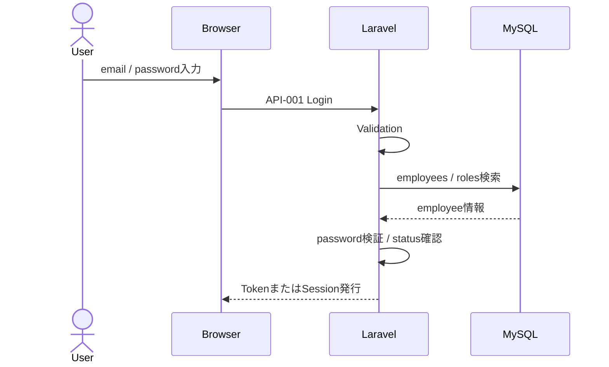

# セキュリティ設計

HR & Attendance System（勤怠管理システム）

---

# 文書管理情報

| 項目 | 内容 |
| --- | --- |
| システム名 | HR & Attendance System |
| 文書名 | セキュリティ設計 |
| 文書番号 | DOC-014 |
| 作成者 | Nguyen Minh Tri |
| 作成日 | 2026/07/02 |
| バージョン | 1.1 |
| ステータス | Draft |

---

# 改訂履歴

| Version | 日付 | 作成者 | 内容 |
| --- | --- | --- | --- |
| 1.0 | 2026/07/02 | Nguyen Minh Tri | 初版作成 |
| 1.1 | 2026/07/21 | Nguyen Minh Tri | 自動セキュリティレビューで発見: `Employee.php`の`$fillable`に`role_id`/`status`/`password_hash`等の権限関連列が含まれていた（Mass Assignment / Privilege Escalationのリスク）。8.1節Mass Assignment方針を具体化し、権限関連列は`$fillable`から除外・Service層で`forceFill()`/`forceCreate()`により明示的にbypassする方針を明文化。`backend/`実コードと`guide/`04・05章を同方針で修正。 |

---

# 目次

1. 本書の目的
2. セキュリティ設計方針
3. 保護対象
4. 認証設計
5. 認可設計
6. セッション設計
7. パスワード設計
8. 入力検証設計
9. Web Security設計
10. API Security設計
11. Data Security設計
12. Infrastructure Security設計
13. Audit / Logging設計
14. Error Handling設計
15. Threat Model
16. Security Checklist
17. トレーサビリティ
18. まとめ

---

# 1. 本書の目的

本書は、HR & Attendance Systemのセキュリティ設計を定義する。

本システムは社員情報、勤怠情報、休暇申請、操作ログを扱うため、認証、認可、入力検証、通信保護、データ保護、監査ログを適切に設計する必要がある。

本書は、要件定義書、API設計、テーブル定義、インフラ設計と整合し、実装、試験、運用保守の基準資料とする。

---

# 2. セキュリティ設計方針

| 方針ID | 方針 | 内容 |
| --- | --- | --- |
| SEC-POL-001 | Authentication Required | ログイン後の業務画面・APIは認証必須とする。 |
| SEC-POL-002 | Role Based Access Control | User / Manager / Adminの権限に応じて画面、API、データ範囲を制御する。 |
| SEC-POL-003 | Least Privilege | 各ユーザーは必要最小限の機能・データのみ利用可能とする。 |
| SEC-POL-004 | Password Protection | パスワードは平文保存せず、Hash化して保存する。 |
| SEC-POL-005 | Input Validation | すべての入力値をサーバー側で検証する。 |
| SEC-POL-006 | Secure Communication | 本番環境ではHTTPSを必須とする。 |
| SEC-POL-007 | Auditability | 承認、CSV出力、マスタ更新などの重要操作をaudit_logsへ記録する。 |
| SEC-POL-008 | Secret Protection | `.env`、DB password、APP_KEYなどのSecretをGit管理しない。 |

---

# 3. 保護対象

| 保護対象 | 主な情報 | 重要度 | 保護方針 |
| --- | --- | --- | --- |
| employees | 社員番号、氏名、メール、権限、部署、password_hash | High | 認可制御、Hash化、DB非公開 |
| attendance_records | 勤務日、出勤時刻、退勤時刻、勤務時間 | High | 本人・権限範囲内のみ参照可能 |
| leave_requests | 休暇種別、期間、理由、承認状態 | High | 本人・承認者・Adminのみ参照可能 |
| roles | 権限情報 | Medium | Adminのみ管理可能 |
| departments | 部署情報 | Medium | Adminのみ管理可能 |
| shifts | シフト情報 | Medium | Adminのみ管理可能 |
| audit_logs | 操作者、操作内容、対象、結果、日時 | High | System記録、参照制限 |
| `.env` | DB password、APP_KEY、認証設定 | Critical | Repository管理禁止、権限者のみ参照 |

---

# 4. 認証設計

## 4.1 認証方式

| 項目 | 内容 |
| --- | --- |
| 対象API | API-001 / API-002 / API-003 / API-019 / API-021 |
| 認証方式 | Laravel Sanctumまたは同等方式 |
| Login ID | email |
| Password | password |
| 認証対象Table | employees / roles |
| 無効ユーザー | employees.status = inactiveの場合はログイン不可 |

## 4.2 認証フロー

## 4.3 認証エラー

| Error ID | 条件 | Response |
| --- | --- | --- |
| E001 | emailまたはpassword不一致 | 401 Login Failed |
| E003 | email/password未入力、形式不正 | 422 Validation Error |
| E010 | SessionまたはToken期限切れ | 401 Session Timeout |

---

# 5. 認可設計

## 5.1 Role定義

| Role | 権限概要 |
| --- | --- |
| User | 自分の勤怠、休暇申請、自分の履歴、パスワード変更 |
| Manager | User権限に加え、承認対象申請、担当範囲の勤怠確認、月次レポート |
| Admin | 全機能、社員・部署・シフト管理 |
| System | 内部処理、勤務時間計算、操作ログ記録 |

## 5.2 画面認可

| 画面ID | User | Manager | Admin |
| --- | --- | --- | --- |
| SCR-001 ログイン | 〇 | 〇 | 〇 |
| SCR-002 ダッシュボード | 〇 | 〇 | 〇 |
| SCR-003 打刻 | 〇 | 〇 | 〇 |
| SCR-004 勤怠履歴 | 〇 | 〇 | 〇 |
| SCR-005 休暇申請 | 〇 | 〇 | 〇 |
| SCR-006 休暇承認 | × | 〇 | 〇 |
| SCR-007 社員管理 | × | × | 〇 |
| SCR-008 部署管理 | × | × | 〇 |
| SCR-009 シフト管理 | × | × | 〇 |
| SCR-010 レポート | × | 〇 | 〇 |

## 5.3 API認可

| API ID | User | Manager | Admin | 方針 |
| --- | --- | --- | --- | --- |
| API-001 | Public | Public | Public | 未ログインでも利用可 |
| API-002 / API-003 / API-019 / API-021 | 〇 | 〇 | 〇 | 認証済みのみ |
| API-004〜API-007 | 〇 | 〇 | 〇 | 原則本人データ |
| API-008 | 〇 | 〇 | 〇 | Userは本人、Managerは担当範囲、Adminは全件 |
| API-009 / API-010 | 〇 | 〇 | 〇 | 自分または承認対象 |
| API-011 | × | 〇 | 〇 | Manager/Adminのみ |
| API-012 / API-013 | × | 〇 | 〇 | Manager/Adminのみ |
| API-014〜API-018 | × | × | 〇 | Adminのみ |
| API-020 | - | - | - | System内部処理 |

## 5.4 データ範囲制御

| Role | 勤怠データ | 休暇申請 | マスタ |
| --- | --- | --- | --- |
| User | 自分のみ | 自分のみ | 参照・更新不可 |
| Manager | 担当範囲 | 承認対象と自分 | 参照・更新不可 |
| Admin | 全社員 | 全申請 | 登録・編集・無効化可能 |

---

# 6. セッション設計

| 項目 | 内容 |
| --- | --- |
| Session方式 | Laravel Sanctum tokenまたはLaravel session |
| Session Timeout | 30分無操作 |
| Token期限 | 8時間 |
| Logout | API-002でTokenまたはSessionを破棄 |
| Session確認 | API-021で認証状態を確認 |
| 期限切れ時 | E010を返却し、ログイン画面へ誘導 |

## 6.1 Cookie利用時の方針

| 属性 | 方針 |
| --- | --- |
| HttpOnly | 有効 |
| Secure | 本番環境で有効 |
| SameSite | LaxまたはStrict |
| CSRF | Cookie認証の場合はCSRF tokenを必須 |

---

# 7. パスワード設計

## 7.1 Password Policy

| 項目 | ルール |
| --- | --- |
| Length | 8〜20 chars |
| Required | 必須 |
| 保存方式 | `password_hash`へHash化して保存 |
| 平文保存 | 禁止 |
| 表示 | 画面・API Responseへ返却禁止 |
| 変更API | API-019 |

## 7.2 Password変更

| 項目 | 内容 |
| --- | --- |
| 現在Password確認 | 必須 |
| 新Password確認 | `new_password_confirmation`で確認 |
| Hash更新 | 検証後に新しいHashを保存 |
| 失敗時 | E003またはE009 |

---

# 8. 入力検証設計

## 8.1 Validation方針

| 方針 | 内容 |
| --- | --- |
| Server Side Validation | すべての入力値をLaravel FormRequest相当で検証する。 |
| Client Side Validation | UX向上目的で実施するが、信頼境界とはしない。 |
| Error Response | E003 Validation Errorとして返却する。 |
| Mass Assignment | `$fillable`には権限に関わらない一般フィールドのみを含める（例: `Employee`は`employee_id`/`name`/`email`のみ）。`role_id`/`department_id`/`shift_id`/`status`/`password_hash`など権限・認証に関わる列は`$fillable`に含めない — 将来のコードが`Model::create($request->all())`のような呼び出しをしても特権昇格させないための最終防衛線とする。管理者操作等で正当にこれらの列を更新する場合は、`role:admin`Middleware等で認可済みのService層に限り`forceFill()`/`forceCreate()`で明示的にbypassする（`guide/`05章 EmployeeServiceが実装例）。 |

## 8.2 主なValidation

| 対象 | 項目 | Rule |
| --- | --- | --- |
| Login | email | required / email / max:255 |
| Login | password | required / min:8 / max:20 |
| Employee | employee_id | required / max:50 / unique |
| Employee | email | required / email / max:255 / unique |
| Leave Request | start_date / end_date | date / start_date <= end_date |
| Shift | start_time / end_time | time / start_time < end_time |
| Report | target_month | required / YYYY-MM |

---

# 9. Web Security設計

## 9.1 OWASP対策

| リスク | 対策 |
| --- | --- |
| Injection | Eloquent / Query Builderのparameter bindingを利用する。 |
| XSS | Blade escapeを利用し、ユーザー入力をそのままHTML出力しない。 |
| CSRF | Cookie認証の場合はCSRF tokenを利用する。 |
| Broken Access Control | Middleware / Policy / ServiceでRoleとデータ範囲を検証する。 |
| Security Misconfiguration | APP_DEBUG=false、本番env分離、不要port閉鎖。 |
| Sensitive Data Exposure | HTTPS、password hash、Secret非公開。 |

## 9.2 Browser Security Header

| Header | 方針 |
| --- | --- |
| Strict-Transport-Security | Productionで有効化検討 |
| X-Content-Type-Options | `nosniff` |
| X-Frame-Options | `SAMEORIGIN`または`DENY` |
| Referrer-Policy | `strict-origin-when-cross-origin` |
| Content-Security-Policy | 将来対応。初期は安全なscript/style運用を優先 |

---

# 10. API Security設計

| 項目 | 方針 |
| --- | --- |
| Authentication | 認証API以外は認証必須 |
| Authorization | APIごとにRoleを検証 |
| CORS | Frontend Originのみ許可 |
| Rate Limit | Login APIに試行回数制限を設定 |
| Response | password_hash、Secret、stack traceを返却しない |
| Error | 詳細な内部例外はAPI Responseに含めない |
| Audit | 重要更新APIはaudit_logsへ記録 |

## 10.1 Rate Limit

| 対象API | 方針 |
| --- | --- |
| API-001 Login | IPまたはLogin ID単位で試行回数制限 |
| API-013 CSV出力 | 過剰実行を避けるため必要に応じて制限 |
| API-014〜API-018 Master更新 | Adminのみ、操作ログを記録 |

---

# 11. Data Security設計

## 11.1 Database保護

| 項目 | 方針 |
| --- | --- |
| RDS Public Access | 無効 |
| DB接続元 | EC2 / Laravel Containerのみ |
| DB Port | 3306をWeb Security Groupからのみ許可 |
| DB Password | `.env`またはSecretで管理 |
| Backup | RDS Automated Backup / Snapshot |

## 11.2 Data Masking / Response制御

| 対象 | 方針 |
| --- | --- |
| password_hash | API Responseへ返却禁止 |
| DB password | Log / Responseへ出力禁止 |
| APP_KEY | Log / Responseへ出力禁止 |
| audit_logs | 原則System内部利用。必要時のみ権限者が参照 |
| 社員情報 | Userは本人情報のみ、Managerは担当範囲、Adminは全件 |

---

# 12. Infrastructure Security設計

## 12.1 Network / Security Group

| 対象 | 方針 |
| --- | --- |
| EC2 Inbound 80 | HTTPアクセス、HTTPS redirect用途 |
| EC2 Inbound 443 | HTTPSアクセス |
| EC2 Inbound 22 | 管理者IPのみ |
| RDS Inbound 3306 | Web Security Groupのみ |
| RDS Public Access | 無効 |

## 12.2 Server Security

| 項目 | 方針 |
| --- | --- |
| OS Update | 定期的にsecurity updateを適用 |
| SSH Key | password loginを避け、key認証を利用 |
| Docker | 不要Containerを停止、image更新を行う |
| `.env` Permission | 権限者のみ読み取り可能 |
| APP_DEBUG | Productionではfalse |

## 12.3 HTTPS

| 環境 | 方針 |
| --- | --- |
| Local | HTTP可 |
| Development | HTTPS推奨 |
| Production | HTTPS必須 |

---

# 13. Audit / Logging設計

## 13.1 Audit対象操作

| 操作 | 対象API | 記録先 |
| --- | --- | --- |
| 休暇承認・却下 | API-011 | audit_logs |
| CSV出力 | API-013 | audit_logs |
| 社員登録・編集・無効化 | API-014〜API-016 | audit_logs |
| 部署登録・編集・無効化 | API-017 | audit_logs |
| シフト登録・編集・無効化 | API-018 | audit_logs |

## 13.2 Audit Log項目

| 項目 | 内容 |
| --- | --- |
| employee_id | 操作者 |
| action | 操作内容 |
| target_type | 対象種別 |
| target_id | 対象ID |
| result | success / failure |
| ip_address | 操作者IP |
| created_at | 操作日時 |

## 13.3 Log出力禁止情報

| 対象 | 方針 |
| --- | --- |
| password | 出力禁止 |
| password_hash | 出力禁止 |
| DB_PASSWORD | 出力禁止 |
| APP_KEY | 出力禁止 |
| access_token | 原則出力禁止 |

---

# 14. Error Handling設計

| Error ID | Security観点 | 方針 |
| --- | --- | --- |
| E001 | 認証失敗 | email存在有無が分からない共通メッセージにする |
| E002 | 権限エラー | 権限不足のみ表示し、内部条件は表示しない |
| E003 | 入力エラー | 項目別に安全なValidation messageを返す |
| E009 | DBエラー | 詳細SQLやstack traceをResponseへ返さない |
| E010 | Session Timeout | 再ログインを促す |

---

# 15. Threat Model

| Threat ID | 脅威 | 影響 | 対策 |
| --- | --- | --- | --- |
| TH-001 | Password総当たり | 不正ログイン | Rate Limit、強固なPassword、認証失敗メッセージ共通化 |
| TH-002 | 権限外データ参照 | 個人情報漏洩 | RBAC、データ範囲制御、Policy |
| TH-003 | SQL Injection | DB改ざん・漏洩 | Eloquent、parameter binding、Validation |
| TH-004 | XSS | Session窃取、画面改ざん | Escape、CSP検討、入力値Sanitize |
| TH-005 | CSRF | 意図しない更新操作 | CSRF token、SameSite Cookie |
| TH-006 | Secret漏洩 | DB侵害、なりすまし | `.env`非commit、Secret管理 |
| TH-007 | DB外部公開 | データ漏洩 | RDS Public Access無効、Security Group制限 |
| TH-008 | 操作追跡不能 | 障害・不正調査困難 | audit_logs、application log |

---

# 16. Security Checklist

| Check ID | 項目 | 完了条件 |
| --- | --- | --- |
| SEC-CHK-001 | 認証必須 | API-002〜API-021が認証必須になっている |
| SEC-CHK-002 | 権限制御 | User / Manager / Adminのアクセス制御が実装されている |
| SEC-CHK-003 | Password Hash | password_hashのみDB保存されている |
| SEC-CHK-004 | Validation | すべての入力APIにValidationがある |
| SEC-CHK-005 | CSRF / CORS | 認証方式に応じたCSRF / CORS設定がある |
| SEC-CHK-006 | HTTPS | ProductionでHTTPSが有効 |
| SEC-CHK-007 | Secret | `.env`がGit管理されていない |
| SEC-CHK-008 | RDS非公開 | RDS Public Accessが無効 |
| SEC-CHK-009 | SSH制限 | SSHが管理者IPのみに制限されている |
| SEC-CHK-010 | Audit Log | 重要操作がaudit_logsに記録されている |
| SEC-CHK-011 | Error Response | stack traceやSQL詳細がResponseに出ない |
| SEC-CHK-012 | APP_DEBUG | Productionでfalse |

---

# 17. トレーサビリティ

| Security対象 | 関連NFR | 関連REQ | 関連API | 関連Table | 関連Error |
| --- | --- | --- | --- | --- | --- |
| 認証 | NFR-010 | REQ-001 / REQ-002 / REQ-003 | API-001 / API-002 / API-003 / API-021 | employees / roles | E001 / E010 |
| 認可 | NFR-011 | REQ-003 | API-003 / API-008 / API-011〜API-018 | roles / employees | E002 |
| Password | NFR-012 | REQ-001 / REQ-020 | API-001 / API-019 | employees | E001 / E003 |
| Audit | NFR-013 | REQ-021 | API-011 / API-013〜API-018 / API-020 | audit_logs | E009 |
| Input Validation | NFR-010 / NFR-011 | REQ-001〜REQ-021 | API-001〜API-021 | 全主要Table | E003 |
| Infrastructure | NFR-010 / NFR-012 | - | - | RDS / EC2 | - |

---

# 18. まとめ

本書では、HR & Attendance Systemのセキュリティ設計として、認証、認可、セッション、パスワード、入力検証、Web/API/Data/Infrastructure Security、Audit、Error Handling、Threat Modelを定義した。

本設計を基準として、実装時にはLaravel Middleware、Policy、FormRequest、Hash、CSRF/CORS、Security Group、audit_logsを適切に設定し、単体試験・結合試験・システム試験で確認する。
