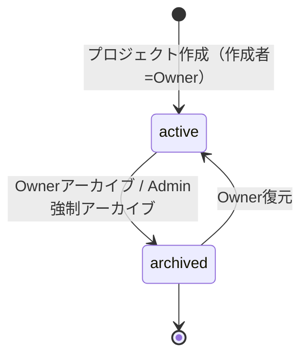
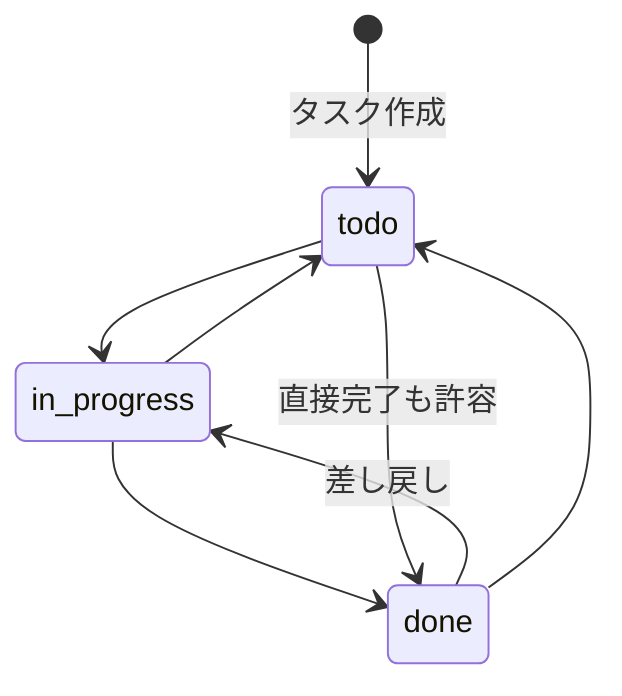
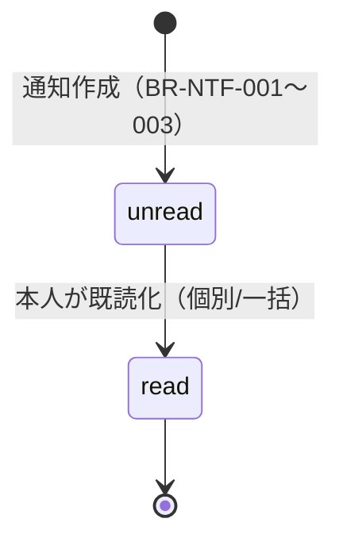

# 要件定義書

Project Management System（プロジェクト管理システム）

---

# 文書管理情報

| 項目 | 内容 |
| --- | --- |
| システム名 | Project Management System |
| 文書名 | 要件定義書 |
| 文書番号 | PMS-002 |
| 作成者 | Nguyen Minh Tri |
| 作成日 | 2026/07/17 |
| バージョン | 1.3 |
| ステータス | Draft |

---

# 改訂履歴

| Version | 日付 | 作成者 | 内容 |
| --- | --- | --- | --- |
| 0.0 | 2026/07/17 | Nguyen Minh Tri | スケルトン作成 |
| 1.0 | 2026/07/17 | Nguyen Minh Tri | 初版作成。8章の権限マトリクスと9章の業務ルール（BR-PRM/PRJ/TSK/CMT/FIL/NTF）を確定。00_開発計画書が08/09へ先送りしていた論点のうち「除名メンバーの担当タスクの扱い」を本書で確定（BR-PRJ-005）。 |
| 1.1 | 2026/07/18 | Nguyen Minh Tri | 整合性監査による修正2件: ①8章のプロジェクト作成をAdmin×に訂正（BR-PRM-004「業務不参加」と矛盾 — 作成するとBR-PRJ-001で自動的にOwnerになってしまうため）。②自主脱退を正式要件化（REQ-009に含め、8章に行を追加。BR-PRJ-002/005が前提としていたが権限付与が漏れていた）。 |
| 1.2 | 2026/07/19 | Nguyen Minh Tri | 15_単体試験仕様書作成時の整合性監査による修正2件: ①8章凡例に補足を追加 — Admin列の×はプロジェクト資源ではスコープ付きバインディングにより実際にはE007として観測される（E002はAPI-007のみ。12_詳細設計書 8章・10_API設計と整合）。②メンバー一覧閲覧のAdminセルを〇（運用）→×に訂正 — Adminがメンバー一覧を取得できるAPIは存在せず（API-011はバインディングで遮断、API-034はOwner名・メンバー数のみ）、BR-PRM-004の運用限定原則とも整合。 |
| 1.3 | 2026/07/21 | Nguyen Minh Tri | 全体整合性監査で発見: 8章「プロジェクト一覧（自分の参加分）」のAdminセルが「〇（全件・運用）」となっていたが、API-006はメンバー参加分のみ返す設計（Adminは業務不参加、BR-PRM-004）のため実際は0件。15_単体試験仕様書§8の既存の正しい記述（「200（0件 — 全件はAPI-034/#20）」）に合わせて訂正。 |

---

# 目次

1. 要件定義の目的
2. システム概要
3. 対象ユーザー
4. 業務範囲
5. 機能要件
6. 要件別受入条件
7. 非機能要件
8. 権限要件（権限マトリクス）
9. 業務ルール
10. 状態遷移
11. データ要件
12. データバリデーションルール
13. 画面要件
14. 外部インターフェース要件
15. セキュリティ要件
16. エラー要件
17. 運用・保守要件
18. 開発対象外
19. 受入条件
20. 用語定義
21. まとめ

---

# 1. 要件定義の目的

本書は、Project Management System が「何を実現しなければならないか（WHAT）」を明確化し、以降の基本設計・詳細設計・API設計・テスト仕様の唯一の判断根拠とする。本プロジェクトの学習目的（SPA分離・プロジェクト単位の認可・通知）のうち、特に**8章（権限マトリクス）と9章（業務ルール）は全設計・全実装・全試験が参照する背骨**であり、実装時に最も参照頻度の高いセクションとなる。

---

# 2. システム概要

チーム向けのプロジェクト・タスク管理システム（Kanban方式）。ユーザーはプロジェクトを作成して他ユーザーを招待し、タスクの作成・割当・進捗管理（カンバン）・コメント・ファイル共有を行う。関係する操作はアプリ内通知として届く。フロントエンドはVue 3 SPA、バックエンドはLaravel API（00_開発計画書 4章/6章）。

---

# 3. 対象ユーザー

| ユーザー種別 | 層 | 説明 |
|---|---|---|
| Admin | グローバル（`users.role=admin`） | システム運用者。ユーザー管理・全プロジェクトの運用管理のみ行い、業務（タスク・コメント・ファイル）には参加しない |
| Owner | プロジェクト単位（`project_members.role=owner`） | プロジェクト管理者。メンバー・設定・タスク削除の権限を持つ |
| Member | プロジェクト単位（`project_members.role=member`） | プロジェクト参加者。タスク・カンバン・コメント・ファイルの日常操作を行う |
| 非メンバー | - | 認証済みだが当該プロジェクトに参加していないユーザー。当該プロジェクトの資源には一切アクセスできない |

---

# 4. 業務範囲

## 4.1 対象業務

- 会員登録・認証（SPA向けトークン認証）
- プロジェクトのライフサイクル管理（作成〜アーカイブ）
- メンバー招待・ロール管理
- タスク管理（CRUD・担当・期限・優先度）とカンバン運用
- タスク上のコラボレーション（コメント・ファイル共有）
- アプリ内通知（3種）と既読管理、期限接近バッチ
- システム運用（Adminによるユーザー・プロジェクト管理）

## 4.2 対象外業務

00_開発計画書 2.2節と同一（ガント・工数・複数ワークスペース・メール/Slack通知・@メンション・全文検索・ゲスト共有・モバイルアプリ・多言語UI）。

---

# 5. 機能要件

## 5.1 機能要件一覧

| 要件ID | 機能名 | 対象ユーザー | 優先度 | 内容 |
| --- | --- | --- | --- | --- |
| REQ-001 | 会員登録 | 未認証ユーザー | Must | 氏名・メールアドレス・パスワードで登録できる。 |
| REQ-002 | ログイン | 全ユーザー | Must | メールアドレスとパスワードでログインし、トークンを取得できる。 |
| REQ-003 | ログアウト | 認証済みユーザー | Must | トークンを失効できる。 |
| REQ-004 | 権限制御（2層） | System | Must | グローバルロール×プロジェクトロールで全操作を制御する（8章）。 |
| REQ-005 | プロジェクト作成 | 認証済みユーザー | Must | プロジェクトを作成でき、作成者が自動的にOwnerになる。 |
| REQ-006 | プロジェクト一覧・詳細 | Owner / Member | Must | 自分が参加するプロジェクトのみ一覧・詳細を閲覧できる。 |
| REQ-007 | プロジェクト編集・アーカイブ | Owner | Must | 名称・説明の編集、アーカイブ（論理無効化）・復元ができる。 |
| REQ-008 | メンバー招待 | Owner | Must | 登録済みユーザーをメールアドレス指定で招待できる（即時参加）。 |
| REQ-009 | ロール変更・除名・自主脱退 | Owner（自主脱退は本人） | Must | メンバーのロール変更（owner⇔member）・除名ができる。メンバー本人は自主脱退できる。最後のOwner保護（BR-PRJ-002）。 |
| REQ-010 | タスク作成 | Owner / Member | Must | タイトル・説明・担当者・期限・優先度を指定してタスクを作成できる。 |
| REQ-011 | タスク編集 | Owner / Member | Must | プロジェクト内の全タスクを編集できる（担当者・期限・優先度・ステータス含む）。 |
| REQ-012 | タスク削除 | Owner | Must | タスクを削除できる（コメント・ファイルも連動削除）。 |
| REQ-013 | タスク一覧・検索 | Owner / Member | Must | タイトル部分一致・担当者・ステータスで絞り込める。 |
| REQ-014 | カンバン表示 | Owner / Member | Must | ステータス3列のボードでタスクを表示できる。 |
| REQ-015 | カンバン移動・並び替え | Owner / Member | Must | D&Dで列間移動（ステータス変更）・列内並び替え（position変更）ができる。 |
| REQ-016 | コメント投稿 | Owner / Member | Must | タスクにコメントを投稿できる。担当者へ通知が飛ぶ（BR-NTF-002）。 |
| REQ-017 | コメント削除 | Owner / Member | Must | 自分のコメントを削除できる。Ownerは任意のコメントを削除できる（モデレーション）。 |
| REQ-018 | ファイルアップロード | Owner / Member | Must | タスクにファイルを添付できる（S3保存、BR-FIL-001の制限）。 |
| REQ-019 | ファイル一覧・ダウンロード | Owner / Member | Must | 添付ファイルの一覧表示・ダウンロードができる（メンバーのみ）。 |
| REQ-020 | ファイル削除 | Owner / Member | Must | アップロード者本人またはOwnerがファイルを削除できる。 |
| REQ-021 | 通知一覧・未読件数 | 認証済みユーザー | Must | 自分宛の通知一覧と未読件数を取得できる。 |
| REQ-022 | 通知既読化 | 認証済みユーザー | Must | 通知を個別・一括で既読にできる。 |
| REQ-023 | 期限接近通知バッチ | System | Must | 期限24時間前の未完了タスクの担当者へ`task_due_soon`を作成する（毎時実行）。 |
| REQ-024 | リアルタイム配信 | System | Could（bonus） | 通知・カンバン変更をWebSocket（Reverb）で配信する。失敗時はポーリング。 |
| REQ-025 | パスワード変更 | 認証済みユーザー | Should | 現在のパスワード確認のうえ変更できる。 |
| REQ-026 | ユーザー管理（Admin） | Admin | Should | 全ユーザーの一覧・無効化（`status=inactive`）ができる。 |
| REQ-027 | プロジェクト管理（Admin） | Admin | Should | 全プロジェクトの一覧・強制アーカイブができる（運用対応）。 |
| REQ-028 | 操作ログ記録 | System | Should | メンバー変更・削除系操作をアプリケーションログに記録する。 |

## 5.2 優先度定義

| 優先度 | 意味 |
| --- | --- |
| Must | 初期リリースに必須の要件 |
| Should | 初期リリースで実装したい要件 |
| Could | 余裕があれば実装する要件（bonus） |
| Won't | 初期リリースでは実装しない要件 |

---

# 6. 要件別受入条件

| 要件ID | Given | When | Then |
| --- | --- | --- | --- |
| REQ-001 | 未登録のメールアドレスを持っている | 氏名・メール・パスワードで登録する | `users`が`role=user`, `status=active`で作成され、自動ログイン状態になる。重複メールはE003 |
| REQ-002 | 登録済みかつ`status=active` | 正しい資格情報でログインする | トークン（有効期限8時間）が発行される。不一致・inactiveはE001 |
| REQ-003 | ログイン中 | ログアウトする | トークンが失効し、以後のアクセスはE010 |
| REQ-004 | Memberとしてプロジェクトに参加中 | Owner専用操作（招待等）を試みる | E002で拒否される。非メンバーが同じ操作を試みるとE007（存在秘匿、BR-PRM-006） |
| REQ-005 | ログイン中 | プロジェクトを作成する | `projects`が`status=active`で作成され、同一トランザクションで作成者が`role=owner`の`project_members`行を得る |
| REQ-006 | 複数プロジェクトが存在し、うち一部に参加中 | プロジェクト一覧を開く | 自分が参加するプロジェクトのみ表示される（他人のプロジェクトは件数にも現れない） |
| REQ-007 | Ownerである | プロジェクトをアーカイブする | `status=archived`になり、以後タスク・コメント・ファイルの書込系操作はE006（BR-PRJ-003）。復元でactiveに戻る |
| REQ-008 | Ownerであり、招待対象が登録済みユーザー | メールアドレスを指定して招待する | `project_members`に`role=member`で追加される（即時参加）。既参加者はE011、未登録メールはE007 |
| REQ-009 | Ownerであり、対象がプロジェクトメンバー | ロール変更または除名する | `project_members`が更新/削除される。最後のOwnerの降格・除名・脱退はE006（BR-PRJ-002）。除名者の担当タスクは担当者NULL化（BR-PRJ-005） |
| REQ-010 | Owner/Memberである | タスクを作成する | `tasks`が`status=todo`で作成され、担当者指定時は`task_assigned`通知が飛ぶ（本人指定時を除く、BR-NTF-001） |
| REQ-011 | Owner/Memberである | 他人が作成したタスクを編集する | 編集できる（BR-PRM-005）。担当者変更時は新担当者へ`task_assigned`通知 |
| REQ-012 | Ownerである | タスクを削除する | タスクとそのコメント・ファイル（S3オブジェクト含む）が削除される。MemberはE002 |
| REQ-013 | プロジェクトにタスクが複数ある | タイトル・担当者・ステータスで検索する | 条件一致するタスクのみ返る（当該プロジェクト内のみ） |
| REQ-014 | プロジェクトにタスクがある | カンバンボードを開く | todo/in_progress/doneの3列に、各列`position`昇順でタスクが表示される |
| REQ-015 | カンバン表示中 | タスクを別列へD&Dする | `status`と`position`が更新され、同一列内の順序が保たれる（BR-TSK-001/002） |
| REQ-016 | タスクに担当者が設定されている | 担当者以外がコメントを投稿する | `task_comments`に保存され、担当者へ`task_commented`通知が飛ぶ。担当者本人の投稿では通知なし（BR-NTF-002） |
| REQ-017 | 自分のコメントが存在する | 削除する | 削除できる。他人のコメントはOwnerのみ削除可、MemberはE002 |
| REQ-018 | Owner/Memberである | 10MB以下・許可種別のファイルをアップロードする | S3に保存され`task_files`に記録される。サイズ超過・不正種別はE003（BR-FIL-001） |
| REQ-019 | ファイルが添付されている | メンバーがダウンロードする | 権限判定を通過した場合のみ取得できる。非メンバーはE007 |
| REQ-020 | 自分がアップロードしたファイルがある | 削除する | DB行とS3オブジェクトの両方が削除される（BR-FIL-003）。他人のファイルはOwnerのみ |
| REQ-021 | 自分宛の通知がある | 通知一覧を開く | 自分宛のみ新しい順で返り、未読件数が取得できる |
| REQ-022 | 未読通知がある | 既読化する（個別/一括） | `is_read=true`になる。他人の通知は対象外（E007） |
| REQ-023 | 期限24時間以内・未完了・担当者ありのタスクが存在する | バッチが実行される | 担当者へ`task_due_soon`が作成される。同一タスクへの2回目は作成されない（BR-NTF-003） |
| REQ-024 | （bonus）Reverb稼働中に通知が作成される | - | WebSocket購読中のクライアントにリアルタイム配信される。配信失敗してもDB通知は残る（BR-NTF-006） |
| REQ-025 | 現在のパスワードを知っている | 新パスワードへ変更する | `password_hash`が更新される。現在のパスワード不一致はE003 |
| REQ-026 | Adminである | ユーザーを無効化する | `status=inactive`になり、当該ユーザーはログイン不可。一般ユーザーの実行はE002 |
| REQ-027 | Adminである | 任意のプロジェクトを強制アーカイブする | `status=archived`になる。Adminはタスク・コメント・ファイルの内容には触れない（BR-PRM-004） |
| REQ-028 | メンバー変更・削除系操作が実行される | 操作が完了する | 実行者・対象・日時がアプリケーションログに記録される |

---

# 7. 非機能要件

## 7.1 Performance

| 要件ID | 項目 | 要件 |
| --- | --- | --- |
| NFR-001 | Response Time | 一覧・カンバン表示は2秒以内。カンバンD&Dの反映は1秒以内（楽観的UI更新を許容） |
| NFR-002 | Concurrent Users | 初期リリースでは同時接続50ユーザー程度を想定 |
| NFR-003 | ファイル転送 | 10MBファイルのアップロードが実用時間内に完了し、処理中はUIに進捗を表示 |

## 7.2 Availability

| 要件ID | 項目 | 要件 |
| --- | --- | --- |
| NFR-004 | Uptime | 学習用途のためSLA保証は対象外。開発・デモ時間帯の安定稼働を目標 |
| NFR-005 | RTO | 障害発生時24時間以内の復旧を目標 |
| NFR-006 | RPO | DB日次バックアップ（最大1日の損失許容）。S3はバージョニングで誤削除復旧可 |
| NFR-007 | WebSocket障害 | Reverb停止時もコア機能（DB通知・ポーリング）は継続する（BR-NTF-006） |

## 7.3 Scalability

| 要件ID | 項目 | 要件 |
| --- | --- | --- |
| NFR-008 | Horizontal | APIはステートレス（トークン認証）とし、将来の複数台構成に対応できる設計とする |
| NFR-009 | Storage | 添付ファイルはS3に保存し、EC2ローカルディスクに依存しない |

## 7.4 Security

| 要件ID | 項目 | 要件 |
| --- | --- | --- |
| NFR-010 | Authentication | Sanctumトークン認証（有効期限8時間）。パスワードはハッシュ保存 |
| NFR-011 | Authorization | 2層ロールモデル（8章）を全APIに適用。判定はPolicyに一元化 |
| NFR-012 | IDOR防止 | プロジェクト資源へのアクセスは必ずメンバーシップ経由でスコープし、非メンバーには存在を秘匿する（E007） |
| NFR-013 | CORS | APIはSPAの配信オリジンのみ許可する |
| NFR-014 | ファイル保護 | S3バケットはPrivate。ダウンロードは権限判定を通した経路のみ（方式は14_セキュリティ設計で確定） |
| NFR-015 | Audit | メンバー変更・削除系操作を操作ログとして記録（REQ-028） |
| NFR-016 | Encryption | 通信は全面HTTPS化 |

## 7.5 Maintainability

| 要件ID | 項目 | 要件 |
| --- | --- | --- |
| NFR-017 | Logging | エラーログ・操作ログ・バッチ実行ログを確認できる |
| NFR-018 | CI/CD | GitHub Actionsでバックエンドテスト + フロントエンドビルド/型チェックを自動実行 |
| NFR-019 | 型安全 | フロントエンドはTypeScript strictモードでエラー0を維持 |

## 7.6 Usability

| 要件ID | 項目 | 要件 |
| --- | --- | --- |
| NFR-020 | PC First | 業務ツールのためPC（1024px以上）を最適化対象とする。タブレット・モバイルは閲覧・既読操作を保証し、カンバンD&Dは対象外としてよい（Project 02のMobile Firstとは意図的に方針が異なる） |
| NFR-021 | Accessibility | コントラスト・フォームラベル等の基本的配慮 |
| NFR-022 | Multi Language | 日本語UIのみ |

---

# 8. 権限要件（権限マトリクス）

**本プロジェクトの背骨。** 10_API設計の全API・15_単体試験仕様書の権限試験は本表を正とする。

凡例: 〇=可 / ×=不可（E002） / −=対象外 / 秘=存在秘匿（E007、BR-PRM-006）

**×セルの実際のエラーコードに関する補足（v1.2）**: ×=E002が成立するのは「対象の存在を知る資格がある（=メンバーシップ判定を通過した）actor」のみ。**Adminは業務プロジェクトのメンバーではないため、`/projects/{projectId}/...`配下のAPIではメンバーシップ判定（スコープ付きバインディング、12_詳細設計書 8章）の段階でE007となり、Policyまで到達しない**。したがって本表のAdmin列の×は、プロジェクト資源に対しては実際にはE007として観測される（10_API設計の各API「主なエラー」欄と一致）。E002として観測されるAdminの×は、バインディングを経由しないAPI-007（プロジェクト作成、ProjectPolicy::create）のみ。試験（15_単体試験仕様書 8章）はこの実コードで検証する。

| 操作 | Admin | Owner | Member | 非メンバー |
| --- | --- | --- | --- | --- |
| プロジェクト作成 | ×（BR-PRM-004: 作成すると自動的にOwnerとなり業務参加になるため） | 〇 | 〇 | 〇（一般ユーザーは誰でも作成可） |
| プロジェクト一覧（自分の参加分） | 〇（0件 — Adminは業務プロジェクトに参加しないため。全件把握は下表「全プロジェクト一覧」＝API-034で行う） | 〇 | 〇 | 〇（自分の分のみ） |
| プロジェクト詳細・カンバン閲覧 | × | 〇 | 〇 | 秘 |
| プロジェクト編集・アーカイブ・復元 | 〇（強制アーカイブのみ） | 〇 | × | 秘 |
| メンバー一覧閲覧 | ×（Owner名・メンバー数のみAPI-034の全プロジェクト一覧で把握可） | 〇 | 〇 | 秘 |
| メンバー招待・ロール変更・除名 | × | 〇 | × | 秘 |
| 自主脱退（本人によるプロジェクト離脱） | − | 〇（最後のOwnerはE006） | 〇 | − |
| タスク閲覧・検索 | × | 〇 | 〇 | 秘 |
| タスク作成・編集（担当・期限・状態含む） | × | 〇 | 〇 | 秘 |
| タスク削除 | × | 〇 | × | 秘 |
| カンバン移動・並び替え | × | 〇 | 〇 | 秘 |
| コメント投稿 | × | 〇 | 〇 | 秘 |
| コメント削除（自分の） | × | 〇 | 〇 | 秘 |
| コメント削除（他人の） | × | 〇 | × | 秘 |
| ファイル添付・ダウンロード | × | 〇 | 〇 | 秘 |
| ファイル削除（自分がアップロードした分） | × | 〇 | 〇 | 秘 |
| ファイル削除（他人の分） | × | 〇 | × | 秘 |
| 通知一覧・既読化（自分宛のみ） | 〇 | 〇 | 〇 | 〇（自分宛のみ） |
| ユーザー管理（一覧・無効化） | 〇 | × | × | × |
| 全プロジェクト一覧・強制アーカイブ | 〇 | × | × | × |

**Adminの原則（BR-PRM-004）**: Adminは運用者であり業務参加者ではない。プロジェクトの中身（タスク・コメント・ファイル）にはメンバーでない限りアクセスできない（プライバシー保護）。運用上必要な操作は「存在の確認（一覧）」と「強制アーカイブ」に限定する。

---

# 9. 業務ルール

## 9.1 権限（BR-PRM）

| ルールID | ルール | 内容 |
| --- | --- | --- |
| BR-PRM-001 | 2層ロールモデル | 権限は`users.role`（admin/user）と`project_members.role`（owner/member）の2層で判定する。プロジェクト資源への操作可否は必ずプロジェクトロールで決まり、グローバルロールでは決まらない（Admin例外はBR-PRM-004の範囲のみ）。 |
| BR-PRM-002 | メンバーシップ必須 | プロジェクト資源（タスク・コメント・ファイル・メンバー情報）へのすべてのアクセスは、対象リソースが属するプロジェクトのメンバーであることを前提とする。 |
| BR-PRM-003 | Owner専用操作 | メンバー招待・ロール変更・除名、プロジェクト編集・アーカイブ、タスク削除、他人のコメント/ファイルの削除はOwnerのみ実行できる。 |
| BR-PRM-004 | Adminの運用限定 | Adminはユーザー管理・全プロジェクトの一覧/強制アーカイブのみ可能。タスク・コメント・ファイルの閲覧・操作は不可。 |
| BR-PRM-005 | プロジェクト内の対等編集 | タスクの閲覧・作成・編集・カンバン操作は、担当者・作成者にかかわらずプロジェクトの全メンバーが行える（チームボード方式。削除のみOwner専用）。 |
| BR-PRM-006 | 存在の秘匿 | 非メンバーからのプロジェクト資源アクセスはE007（404）で返し、リソースの存在自体を秘匿する。権限不足のメンバー（例: Memberの招待操作）はE002（403）で返す — 対象の存在を知っている者にのみ権限エラーを見せる。 |

## 9.2 プロジェクト・メンバー（BR-PRJ）

| ルールID | ルール | 内容 |
| --- | --- | --- |
| BR-PRJ-001 | 作成者=初代Owner | プロジェクト作成時、作成者を`role=owner`のメンバーとして同一トランザクションで登録する。 |
| BR-PRJ-002 | 最後のOwner保護 | `role=owner`のメンバーが1人しかいない場合、そのOwnerの降格・除名・自主脱退を禁止する（E006）。プロジェクトが管理不能になることを防ぐ。 |
| BR-PRJ-003 | アーカイブは読取専用化 | `projects.status=archived`のプロジェクトは全書込系操作（タスク・コメント・ファイル・メンバー変更）をE006で拒否する。閲覧は可能。Ownerは復元（active化）できる。物理削除は行わない。 |
| BR-PRJ-004 | 招待は即時参加 | 招待は登録済みユーザーのメールアドレス指定で行い、承諾フローなしで即時`role=member`として参加する。既参加者への再招待はE011。未登録メールはE007（ユーザー探索を防ぐため、登録有無を丁寧に区別するメッセージは返さない）。 |
| BR-PRJ-005 | 除名時の担当解除 | メンバーを除名（または自主脱退）した場合、当該プロジェクト内でそのユーザーが担当するタスクの`assignee`をNULL化する。理由: 非メンバーが担当者として残ると、通知先（BR-NTF）と権限判定（BR-PRM-002）が破綻するため。過去のコメント・アップロード済みファイルは履歴として残す（作成者表示は保持）。 |

## 9.3 タスク・カンバン（BR-TSK）

| ルールID | ルール | 内容 |
| --- | --- | --- |
| BR-TSK-001 | ステータス自由遷移 | `tasks.status`は`todo` / `in_progress` / `done`の3値。カンバン運用のため**全遷移を許可**する（done→todoの差し戻しも可）。Project 02の注文ステータスのような遷移制限は設けない — この対比自体が学習ポイント。 |
| BR-TSK-002 | 表示順の一意管理 | カンバンの表示順は`tasks.position`で管理する。順序は同一（プロジェクト×ステータス列）内で一意に定まる。採番方式・同時更新の整合はDB設計（09_テーブル定義）で確定する。 |
| BR-TSK-003 | 担当者はメンバーのみ | `assignee`に指定できるのは当該プロジェクトのメンバーのみ。担当者なし（NULL）を許容する。 |
| BR-TSK-004 | 期限は任意・過去も許容 | `due_date`は任意入力。過去日付も許容し（遅延タスクの登録）、期限超過は画面表示で強調するのみ。 |
| BR-TSK-005 | 優先度 | `priority`は`low` / `middle` / `high`の3値、デフォルト`middle`。 |
| BR-TSK-006 | プロジェクト間移動禁止 | タスクの所属プロジェクトは作成時に確定し、変更（プロジェクト間移動）は対象外とする。 |
| BR-TSK-007 | タスク削除は物理削除 | タスク削除時、配下のコメント・ファイル（S3オブジェクト含む）を連動削除する。注文のような会計証憑性はないため、Project 02と異なり物理削除を採用する — この対比も学習ポイント。 |

## 9.4 コメント（BR-CMT）

| ルールID | ルール | 内容 |
| --- | --- | --- |
| BR-CMT-001 | 投稿はメンバーのみ | コメントは当該プロジェクトのメンバーのみ投稿できる。 |
| BR-CMT-002 | 削除権限 | 自分のコメントは本人が削除できる。Ownerは任意のコメントを削除できる（モデレーション）。 |
| BR-CMT-003 | 編集は対象外 | コメントの編集機能は設けない（削除→再投稿で代替）。誤解を招く「編集済み」状態管理を初期スコープから排除する。 |

## 9.5 ファイル（BR-FIL）

| ルールID | ルール | 内容 |
| --- | --- | --- |
| BR-FIL-001 | アップロード制限 | 1ファイル最大10MB。許可種別: 画像（png/jpg/jpeg/gif/webp）、文書（pdf/docx/xlsx/pptx）、テキスト（txt/csv/md）、圧縮（zip）。拡張子とMIMEタイプの両方で検証する。1タスクあたり最大20ファイル。 |
| BR-FIL-002 | 取得はメンバーのみ | S3バケットはPrivateとし、ダウンロードは権限判定（メンバーシップ確認）を通した経路のみ許可する。S3のオブジェクトURLを直接公開しない。 |
| BR-FIL-003 | 削除の連動 | ファイル削除時はDB行とS3オブジェクトを両方削除する。削除権限はアップロード者本人またはOwner。 |
| BR-FIL-004 | 保存パス規約 | `projects/{project_id}/tasks/{task_id}/{uuid}.{ext}`。元のファイル名はDBに保持し、S3キーには使わない（日本語ファイル名・重複対策）。 |

## 9.6 通知（BR-NTF）

| ルールID | ルール | 内容 |
| --- | --- | --- |
| BR-NTF-001 | task_assigned | タスクの担当者に設定された時、新担当者へ通知する。**自分で自分を担当にした場合は通知しない**（本人除外の原則）。担当者変更のたびに新担当者へ発火する。 |
| BR-NTF-002 | task_commented | タスクにコメントが投稿された時、そのタスクの担当者へ通知する。コメント投稿者本人が担当者の場合は通知しない。担当者なしのタスクでは通知しない。 |
| BR-NTF-003 | task_due_soon | 毎時バッチが「期限まで24時間以内・`status != done`・担当者あり」のタスクを抽出し、担当者へ通知する。**同一タスクにつき1回のみ**発火する（担当者変更後の再発火もしない — 新担当者はtask_assignedで気づける）。 |
| BR-NTF-004 | 既読管理 | 通知は受信者本人のみ閲覧・既読化できる。個別既読と一括既読を提供する。 |
| BR-NTF-005 | 通知は削除しない | ユーザーによる通知削除機能は設けない（既読管理のみ）。保持期間による自動削除は将来対応とする。 |
| BR-NTF-006 | リアルタイムは補助 | DB上の通知レコードが正であり、Reverbによるリアルタイム配信（bonus）は補助手段。配信失敗はエラーとせず、ポーリング（通知一覧の定期取得）で代替する。 |

---

# 10. 状態遷移

## 10.1 projects 状態遷移

| 状態 | 説明 | 変更可能者 |
| --- | --- | --- |
| active | 通常運用中 | Owner / Admin（強制アーカイブ） |
| archived | 読取専用（BR-PRJ-003）。物理削除はしない | Owner（復元） |

## 10.2 tasks 状態遷移

全遷移を許可する（BR-TSK-001）。制限はカンバンUI上も設けない。

## 10.3 notifications 状態遷移

---

# 11. データ要件

## 11.1 管理対象データ

| データ | 説明 | 主な項目 |
| --- | --- | --- |
| users | 全ユーザー | 氏名、メール、パスワード、グローバルロール、状態 |
| projects | プロジェクト | 名称、説明、状態（active/archived） |
| project_members | 参加関係（2層ロールの2層目） | プロジェクト、ユーザー、プロジェクトロール、参加日時 |
| tasks | タスク | タイトル、説明、担当者、期限、優先度、ステータス、表示順 |
| task_comments | コメント | タスク、投稿者、本文 |
| task_files | 添付ファイル | タスク、アップロード者、元ファイル名、S3キー、サイズ、MIME |
| notifications | 通知 | 受信者、種別（3種）、参照先タスク、既読フラグ |

## 11.2 データ保持

| データ | 保持方針 |
| --- | --- |
| プロジェクト | アーカイブ（論理無効化）のみ。物理削除しない |
| タスク・コメント・ファイル | タスク削除時に物理削除（BR-TSK-007）。それ以外は保持 |
| 除名メンバーの痕跡 | コメント・ファイルは残す（投稿者名表示は保持）。担当だけ解除（BR-PRJ-005） |
| 通知 | 削除機能なし（BR-NTF-005）。保持期間バッチは将来対応 |

---

# 12. データバリデーションルール

| 対象 | 項目 | ルール |
| --- | --- | --- |
| users | email | Required / Email形式 / Max 255 / Unique |
| users | password | Required / 8〜20文字 / ハッシュ保存 |
| users | name | Required / Max 100 |
| projects | name | Required / Max 100 |
| projects | description | Optional / Max 2000 |
| project_members | 招待email | Required / 登録済みユーザーであること（Service層で判定） |
| tasks | title | Required / Max 200 |
| tasks | description | Optional / Max 5000 |
| tasks | assignee | Optional / 当該プロジェクトのメンバーであること（BR-TSK-003、Service層） |
| tasks | due_date | Optional / 日付形式（過去日許容、BR-TSK-004） |
| tasks | priority | Required / `low, middle, high` のいずれか |
| tasks | status | Required / `todo, in_progress, done` のいずれか |
| task_comments | body | Required / Max 2000 |
| task_files | file | Required / Max 10MB / BR-FIL-001の種別（拡張子+MIME両方） |
| notifications | - | ユーザー入力なし（System生成のみ） |

---

# 13. 画面要件

SPA（Vue 3）の全12画面。モーダル・パネルとして実装する画面にも画面IDを付与する（試験仕様のトレーサビリティのため）。OOUI（プロジェクト→タスクという対象物選択型）を採用する。

| 画面ID | 画面名 | 対象ユーザー | 形態 |
| --- | --- | --- | --- |
| SCR-001 | ログイン画面 | 全ユーザー | ページ |
| SCR-002 | 会員登録画面 | 未認証ユーザー | ページ |
| SCR-003 | プロジェクト一覧（ホーム） | 認証済みユーザー | ページ |
| SCR-004 | カンバンボード（プロジェクト詳細） | Owner / Member | ページ |
| SCR-005 | タスク詳細（編集・コメント・ファイル） | Owner / Member | パネル/モーダル |
| SCR-006 | タスク作成 | Owner / Member | モーダル |
| SCR-007 | メンバー管理 | Owner（閲覧はMember可） | ページ |
| SCR-008 | プロジェクト設定 | Owner | ページ |
| SCR-009 | 通知一覧 | 認証済みユーザー | ドロップダウン+ページ |
| SCR-010 | マイページ（パスワード変更） | 認証済みユーザー | ページ |
| SCR-011 | ユーザー管理（Admin） | Admin | ページ |
| SCR-012 | プロジェクト管理（Admin） | Admin | ページ |

画面遷移は05_画面遷移図、レイアウト・状態バリエーション（Loading/Empty/Error、Project 02の5.0節共通ルールを踏襲）は06_画面設計で定義する。

---

# 14. 外部インターフェース要件

| 外部サービス | 用途 | 連携方式 |
| --- | --- | --- |
| AWS S3 | 添付ファイル保存 | Laravel Filesystem（s3ドライバ）、Privateバケット |
| Laravel Reverb（bonus） | 通知・カンバン変更のリアルタイム配信 | WebSocket（Laravel Echo + private channel、認可はメンバーシップで判定） |

決済・メール等の外部連携はない（Project 02より外部依存が少ない分、認可設計に集中する）。

---

# 15. セキュリティ要件

7.4節（NFR-010〜016）を参照。詳細は14_セキュリティ設計に記載する。特に以下は本プロジェクト固有:

- SPA認証方式（トークン保管場所・CSRF考慮）の確定（PoC後に14へ記録）
- Reverbのprivate channel認可（メンバーでないチャンネルを購読できないこと）
- S3 Privateバケット + 権限判定つきダウンロード経路

---

# 16. エラー要件

| エラーコード | 内容 | HTTPステータス |
| --- | --- | --- |
| E001 | ログイン失敗 | 401 |
| E002 | 権限エラー（メンバーだが権限不足） | 403 |
| E003 | バリデーションエラー（ファイル制限違反含む） | 422 |
| E006 | 状態不整合（アーカイブ済みへの書込、最後のOwner保護違反） | 409 |
| E007 | 対象データ未検出（非メンバーへの存在秘匿を含む、BR-PRM-006） | 404 |
| E010 | 未認証 | 401 |
| E011 | 重複操作（既参加メンバーへの再招待等） | 409 |

エラーコードの意味はProject 01/02と統一する（E001/E002/E003/E006/E007/E010/E011は全プロジェクト共通の語彙）。Project 02固有のE004/E005/E008/E009（在庫・クーポン・決済・Webhook）は本プロジェクトでは使用しない。

---

# 17. 運用・保守要件

- 期限接近通知バッチ（毎時実行、BR-NTF-003）— Project 02のScheduler構成を流用
- S3バージョニングによる誤削除復旧
- DB日次バックアップ（RDS自動バックアップ、保持7日）
- メンバー変更・削除系操作ログの参照手順（20_運用保守手順書）
- Reverb障害時の縮退運転（ポーリングのみ）確認手順

---

# 18. 開発対象外

- ガントチャート・工数管理・レポート集計
- 複数ワークスペース／組織（テナント）機能
- メール通知・Slack等の外部サービス連携
- コメントの@メンション解析（将来拡張: `task_mentioned`通知）
- コメント編集（BR-CMT-003）
- 全文検索（タスク検索はタイトル部分一致のみ）
- ゲスト共有リンク（未ログイン閲覧）
- タスクのプロジェクト間移動（BR-TSK-006）
- モバイルアプリ・多言語UI（日本語のみ、内部文書はベトナム語併記）

00_開発計画書 2.2節、01_企画書 9.2節と同一（コメント編集・タスク移動は本書で追加確定）。

---

# 19. 受入条件

- 6章の受入条件（REQ-001〜028）をすべて満たす
- 8章の権限マトリクスの全セル（ロール×操作）が単体試験で網羅され、全件Passする（01_企画書 11章KPIと連動）
- 9章の業務ルールに反する状態がDBに存在しないことをテストで保証する
- 非メンバーによる全アクセス経路（タスク・コメント・ファイル・通知・WebSocketチャンネル）がE007で拒否される

---

# 20. 用語定義

| 用語 | 説明 |
| --- | --- |
| 2層ロールモデル | グローバルロール（users.role）とプロジェクトロール（project_members.role）の組合せで権限を判定する方式 |
| メンバーシップ | あるユーザーが`project_members`行を持つこと。全プロジェクト資源アクセスの前提条件 |
| カンバン | ステータスを列として表現するタスクボード。列間移動=ステータス変更 |
| position | カンバン列内の表示順を決める数値。同一（プロジェクト×ステータス）内で一意 |
| fan-out | 1つの操作イベントから複数ユーザー（本件では主に担当者）への通知を生成する処理 |
| 本人除外の原則 | 自分の操作によって自分に通知が飛ばないこと（BR-NTF-001/002） |
| 存在の秘匿 | 権限のないリソースについて403ではなく404を返し、存在自体を知らせないこと（BR-PRM-006） |
| IDOR | Insecure Direct Object Reference。IDを差し替えて他人の資源にアクセスする攻撃。本書ではメンバーシップスコープで防御 |

---

# 21. まとめ

本要件定義書は、Project Management Systemの機能要件28件に加え、本プロジェクトの核心である**権限マトリクス（8章）**と**業務ルール6分類（9章: BR-PRM/PRJ/TSK/CMT/FIL/NTF）**を明文化した。Project 02が「お金と在庫の整合性」を業務ルールの中心に置いたのに対し、本書の中心は「誰が・どの文脈で・何をできるか」である。以降の08_ER図 09_テーブル定義 10_API設計 12_詳細設計書は、すべて本章のルールID（BR-ID）を根拠として設計する。

---
