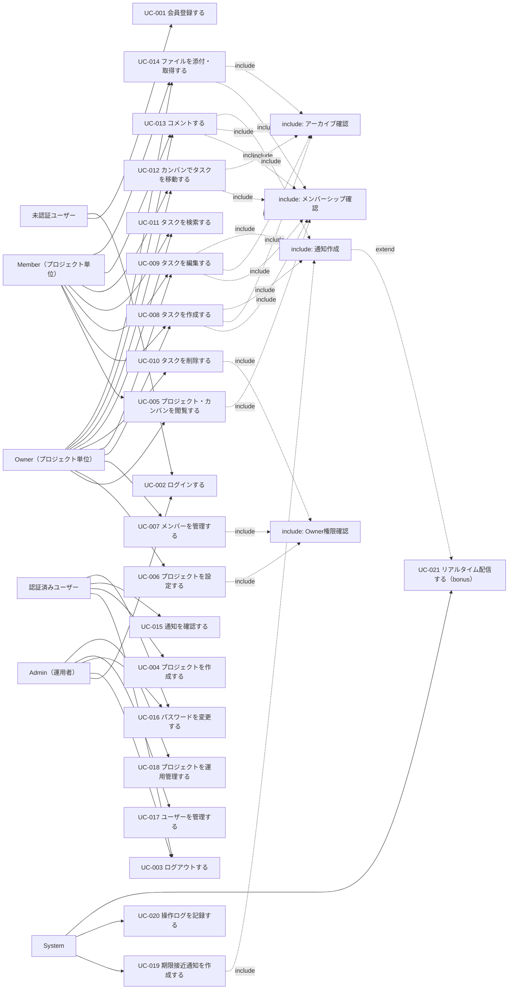

# ユースケース

Project Management System（プロジェクト管理システム）

---

# 文書管理情報

| 項目 | 内容 |
| --- | --- |
| システム名 | Project Management System |
| 文書名 | ユースケース |
| 文書番号 | PMS-003 |
| 作成者 | Nguyen Minh Tri |
| 作成日 | 2026/07/17 |
| バージョン | 1.1 |
| ステータス | Draft |

---

# 改訂履歴

| Version | 日付 | 作成者 | 内容 |
| --- | --- | --- | --- |
| 0.0 | 2026/07/17 | Nguyen Minh Tri | スケルトン作成 |
| 1.0 | 2026/07/17 | Nguyen Minh Tri | 初版作成（全21ユースケース、02_要件定義書 v1.0の権限マトリクス・BR-IDと整合） |
| 1.1 | 2026/07/18 | Nguyen Minh Tri | 整合性監査による修正2件: ①UC-007に自主脱退（本人実行）を明記（02 v1.1と整合）。②UC-015 3-aを「遷移せずインライン表示」に訂正（task_id=NULL時はprojectIdが導出できず遷移先URL自体を構成できないため）。 |

---

# 目次

1. 本書の目的
2. アクター定義
3. ユースケース一覧
4. ユースケース図
5. Include / Extend 関係
6. 共通事前条件・事後条件
7. ユースケース詳細
8. ユースケースと要件の対応
9. 例外・共通ルール
10. まとめ

---

# 1. 本書の目的

本書は、Project Management Systemにおいて「誰が（WHO）」「何を行うか（WHAT）」をユースケースとして定義する。02_要件定義書の機能要件（REQ-001〜028）を利用者視点の振る舞いに変換し、04_業務フロー 05_画面遷移図 07_機能一覧の基準とする。

本システムのユースケースの特徴は、**同じ操作でも「どのプロジェクトに対してか」でアクターの立場（Owner/Member/非メンバー）が変わる**ことである。この文脈依存性はINC-002（メンバーシップ確認）として全プロジェクト系ユースケースに織り込む。

---

# 2. アクター定義

| アクター | 説明 | 対応ロール |
| --- | --- | --- |
| 未認証ユーザー | 登録・ログイン前の利用者 | - |
| 認証済みユーザー | ログイン済みの一般利用者。プロジェクトの文脈に入るとOwner/Memberのいずれかになる | `users.role=user` |
| Owner | 対象プロジェクトの管理者 | `project_members.role=owner` |
| Member | 対象プロジェクトの参加者 | `project_members.role=member` |
| Admin | システム運用者。業務（タスク等）には参加しない（BR-PRM-004） | `users.role=admin` |
| System | バッチ（期限接近通知）・リアルタイム配信・ログ記録の実行主体 | - |

**注意**: Owner/Memberは「ユーザーの属性」ではなく「あるプロジェクトとの関係」である。同一の認証済みユーザーがプロジェクトAではOwner、プロジェクトBではMember、プロジェクトCでは非メンバーとなる（02_要件定義書 3章）。

---

# 3. ユースケース一覧

| UC-ID | ユースケース名 | 主アクター | 関連REQ | 関連SCR | 優先度 |
| --- | --- | --- | --- | --- | --- |
| UC-001 | 会員登録する | 未認証ユーザー | REQ-001 | SCR-002 | Must |
| UC-002 | ログインする | 認証済みユーザー / Admin | REQ-002 | SCR-001 | Must |
| UC-003 | ログアウトする | 認証済みユーザー / Admin | REQ-003 | - | Must |
| UC-004 | プロジェクトを作成する | 認証済みユーザー | REQ-005 | SCR-003 | Must |
| UC-005 | プロジェクト・カンバンを閲覧する | Owner / Member | REQ-006 / 014 | SCR-003 / 004 | Must |
| UC-006 | プロジェクトを設定する | Owner | REQ-007 | SCR-008 | Must |
| UC-007 | メンバーを管理する | Owner | REQ-008 / 009 | SCR-007 | Must |
| UC-008 | タスクを作成する | Owner / Member | REQ-010 | SCR-006 | Must |
| UC-009 | タスクを編集する | Owner / Member | REQ-011 | SCR-005 | Must |
| UC-010 | タスクを削除する | Owner | REQ-012 | SCR-005 | Must |
| UC-011 | タスクを検索する | Owner / Member | REQ-013 | SCR-004 | Must |
| UC-012 | カンバンでタスクを移動する | Owner / Member | REQ-015 | SCR-004 | Must |
| UC-013 | コメントする | Owner / Member | REQ-016 / 017 | SCR-005 | Must |
| UC-014 | ファイルを添付・取得する | Owner / Member | REQ-018 / 019 / 020 | SCR-005 | Must |
| UC-015 | 通知を確認する | 認証済みユーザー | REQ-021 / 022 | SCR-009 | Must |
| UC-016 | パスワードを変更する | 認証済みユーザー / Admin | REQ-025 | SCR-010 | Should |
| UC-017 | ユーザーを管理する | Admin | REQ-026 | SCR-011 | Should |
| UC-018 | プロジェクトを運用管理する | Admin | REQ-027 | SCR-012 | Should |
| UC-019 | 期限接近通知を作成する | System | REQ-023 | - | Must |
| UC-020 | 操作ログを記録する | System | REQ-028 | - | Should |
| UC-021 | リアルタイム配信する | System | REQ-024 | - | Could（bonus） |

REQ-004（権限制御）は特定のユースケースに紐づかない横断的要件であり、INC-001〜005（5章）として全ユースケースに織り込まれる（07_機能一覧で横断的機能として採番する）。

---

# 4. ユースケース図

---

# 5. Include / Extend 関係

## 5.1 Include

| Include ID | 共通処理 | 対象ユースケース | 内容 |
| --- | --- | --- | --- |
| INC-001 | ログイン済み確認 | UC-003〜UC-021（認証必須の全UC） | Sanctumトークンを検証する。無効ならE010。 |
| INC-002 | メンバーシップ確認 | UC-005〜UC-014 | 対象リソースが属するプロジェクトのメンバーであることを確認する（BR-PRM-002）。非メンバーならE007（存在秘匿、BR-PRM-006）。**本システムで最も重要な共通処理**。 |
| INC-003 | Owner権限確認 | UC-006 / UC-007 / UC-010、UC-013/014の他人分削除 | `project_members.role=owner`を確認する（BR-PRM-003）。Memberが実行するとE002。 |
| INC-004 | Admin権限確認 | UC-017 / UC-018 | `users.role=admin`を確認する。一般ユーザーはE002。 |
| INC-005 | アーカイブ確認 | UC-006〜UC-014の書込系操作 | 対象プロジェクトが`status=active`であることを確認する（BR-PRJ-003）。archivedへの書込はE006。 |
| INC-006 | 入力チェック | 入力を伴う全UC | 必須・形式・桁数・範囲・ファイル制限（BR-FIL-001）を確認する。違反はE003。 |
| INC-007 | 通知作成 | UC-008 / UC-009 / UC-013 / UC-019 | BR-NTF-001〜003の条件を判定し、`notifications`を作成する（本人除外の原則を含む）。 |
| INC-008 | 操作ログ記録 | UC-007 / UC-010 / UC-017 / UC-018 | メンバー変更・削除系操作をアプリケーションログに記録する（REQ-028 → UC-020）。 |

## 5.2 Extend

| Extend ID | 拡張処理 | 発生条件 | 対象ユースケース |
| --- | --- | --- | --- |
| EXT-001 | セッションタイムアウト | 未認証・トークン期限切れ（8時間） | 認証必須の全UC |
| EXT-002 | 権限エラー（E002） | メンバーだが権限不足（Owner専用操作等） | UC-006 / UC-007 / UC-010 / UC-013 / UC-014 / UC-017 / UC-018 |
| EXT-003 | 存在秘匿（E007） | 非メンバーがプロジェクト資源へアクセス | UC-005〜UC-014 |
| EXT-004 | 状態不整合（E006） | archivedへの書込、最後のOwner保護違反 | UC-006〜UC-014 |
| EXT-005 | 重複操作（E011） | 既参加メンバーへの再招待 | UC-007 |
| EXT-006 | バリデーションエラー（E003） | 入力値不正・ファイル制限違反 | 入力を伴う全UC |
| EXT-007 | リアルタイム配信（bonus） | 通知作成・カンバン変更時にReverbが稼働している | UC-021（INC-007から拡張） |

---

# 6. 共通事前条件・事後条件

## 6.1 共通事前条件

| 条件ID | 内容 |
| --- | --- |
| PRE-001 | ユーザーがシステムに登録されていること（UC-001以外）。 |
| PRE-002 | ユーザーが有効状態（`users.status=active`）であること。 |
| PRE-003 | 認証必須のUCでは、ログイン済み（有効なトークン保持）であること。 |
| PRE-004 | プロジェクト系UC（UC-005〜014）では、対象プロジェクトのメンバーであること（INC-002）。 |
| PRE-005 | 書込系UCでは、対象プロジェクトが`status=active`であること（INC-005）。 |

## 6.2 共通事後条件

| 条件ID | 内容 |
| --- | --- |
| POST-001 | 状態を変更する操作は、対応するテーブルに変更内容が保存される。 |
| POST-002 | 複数テーブルにまたがる操作（プロジェクト作成+Owner登録、除名+担当解除、タスク削除+連動削除）は、失敗時に全変更がロールバックされる。 |
| POST-003 | 通知条件（BR-NTF-001〜003）に合致する操作は、`notifications`が作成される。 |
| POST-004 | メンバー変更・削除系操作は操作ログに記録される（INC-008）。 |

---

# 7. ユースケース詳細

## 7.1 UC-001 会員登録する

**アクター**: 未認証ユーザー
**事前条件**: 対象のメールアドレスが未登録であること
**事後条件**: POST-001（`users`にrole=user, status=activeで作成、自動ログイン）

### 基本フロー
1. 未認証ユーザーが会員登録画面（SCR-002）を開く
2. 氏名・メールアドレス・パスワード・パスワード確認を入力する
3. SystemがINC-006を実行し、メールアドレスの重複を確認する
4. `users`を作成し、トークンを発行して自動ログイン状態でプロジェクト一覧（SCR-003）へ遷移する

### 代替・例外フロー
- 3-a. メールアドレス重複・形式不正・パスワード不一致 → E003

---

## 7.2 UC-002 ログインする

**アクター**: 認証済みユーザー / Admin
**事前条件**: PRE-001, PRE-002
**事後条件**: トークン発行（有効期限8時間）

### 基本フロー
1. ログイン画面（SCR-001）でメールアドレスとパスワードを入力する
2. Systemが認証情報を検証する
3. トークンを発行し、プロジェクト一覧（SCR-003。Adminはユーザー管理SCR-011）へ遷移する

### 代替・例外フロー
- 2-a. 認証情報不一致・`status=inactive` → いずれも同一のE001（アカウント有無を推測させない）

---

## 7.3 UC-003 ログアウトする

**アクター**: 認証済みユーザー / Admin
**事前条件**: PRE-003
**事後条件**: トークン無効化

### 基本フロー
1. ヘッダーの「ログアウト」を押す
2. Systemが現在のトークンを無効化し、ログイン画面へ遷移する

### 代替・例外フロー
- なし

---

## 7.4 UC-004 プロジェクトを作成する

**アクター**: 認証済みユーザー
**事前条件**: PRE-001〜003
**事後条件**: POST-001, POST-002（`projects`作成 + 作成者が`role=owner`で`project_members`に登録、BR-PRJ-001）

### 基本フロー
1. プロジェクト一覧（SCR-003）で「新規プロジェクト」を押す
2. 名称・説明を入力する
3. SystemがINC-006を実行する
4. 同一トランザクションで`projects`（status=active）と作成者のOwnerメンバーシップを作成する
5. 作成したプロジェクトのカンバンボード（SCR-004）へ遷移する

### 代替・例外フロー
- 3-a. 名称未入力・桁数超過 → E003

---

## 7.5 UC-005 プロジェクト・カンバンを閲覧する

**アクター**: Owner / Member
**事前条件**: PRE-001〜004
**事後条件**: なし（閲覧のみ）

### 基本フロー
1. プロジェクト一覧（SCR-003）を開く。Systemは自分が参加するプロジェクトのみを表示する
2. プロジェクトを選択し、カンバンボード（SCR-004）を開く
3. Systemがtodo/in_progress/doneの3列に、各列`position`昇順でタスクを表示する

### 代替・例外フロー
- 2-a. 非メンバーがプロジェクトIDを直接指定 → E007（INC-002 / BR-PRM-006。一覧に出ないだけでなくID直撃も遮断）
- 2-b. AdminがプロジェクトIDを直接指定 → E007（BR-PRM-004: Adminは業務不参加）

---

## 7.6 UC-006 プロジェクトを設定する

**アクター**: Owner
**事前条件**: PRE-001〜004、INC-003（Owner権限）
**事後条件**: POST-001

### 基本フロー
1. プロジェクト設定画面（SCR-008）を開く
2. 名称・説明を編集、またはアーカイブ/復元を実行する
3. Systemが`projects`を更新する

### 代替・例外フロー
- 2-a. Memberが実行 → E002（INC-003）
- 2-b. archivedプロジェクトへの編集（アーカイブ/復元以外） → E006（BR-PRJ-003）

---

## 7.7 UC-007 メンバーを管理する

**アクター**: Owner
**事前条件**: PRE-001〜005、INC-003
**事後条件**: POST-001, POST-002, POST-004

### 基本フロー
1. メンバー管理画面（SCR-007）を開く（閲覧はMemberも可）
2. 招待: 登録済みユーザーのメールアドレスを入力 → Systemが`project_members`にrole=memberで追加する（即時参加、BR-PRJ-004）
3. ロール変更: owner⇔memberを切り替える
4. 除名: メンバーを除名する。Systemは同一トランザクションで当該ユーザーの担当タスクを担当解除（assignee NULL化）する（BR-PRJ-005）
5. 操作をログに記録する（INC-008）

### 代替・例外フロー
- 2-a. 既参加メンバーへの再招待 → E011
- 2-b. 未登録メールアドレス → E007（登録有無を丁寧に区別しない、BR-PRJ-004）
- 3-a/4-a. 最後のOwnerの降格・除名・自主脱退 → E006（BR-PRJ-002）
- 全般. Memberが実行 → E002（例外: 自分自身を対象とするDELETE＝自主脱退は本人権限で実行できる。最後のOwnerの脱退はE006、担当解除はBR-PRJ-005を除名と同様に適用）

---

## 7.8 UC-008 タスクを作成する

**アクター**: Owner / Member
**事前条件**: PRE-001〜005
**事後条件**: POST-001, POST-003（担当者指定時、BR-NTF-001）

### 基本フロー
1. カンバンボードで「タスク作成」（SCR-006）を開く
2. タイトル・説明・担当者・期限・優先度を入力する
3. SystemがINC-006と担当者のメンバーシップ（BR-TSK-003）を確認する
4. `tasks`をstatus=todo、対象列の末尾positionで作成する
5. 担当者が指定され、かつ作成者本人でない場合、`task_assigned`通知を作成する（INC-007）

### 代替・例外フロー
- 3-a. 担当者が当該プロジェクトのメンバーでない → E003
- 4-a. archivedプロジェクト → E006

---

## 7.9 UC-009 タスクを編集する

**アクター**: Owner / Member
**事前条件**: PRE-001〜005
**事後条件**: POST-001, POST-003（担当者変更時）

### 基本フロー
1. タスク詳細（SCR-005）を開く
2. タイトル・説明・担当者・期限・優先度・ステータスを編集する（担当者・作成者でなくても編集可、BR-PRM-005）
3. Systemが更新し、担当者が変更された場合は新担当者へ`task_assigned`通知を作成する（本人除外、BR-NTF-001）

### 代替・例外フロー
- 2-a. 非メンバー → E007
- 3-a. 新担当者が非メンバー → E003

---

## 7.10 UC-010 タスクを削除する

**アクター**: Owner
**事前条件**: PRE-001〜005、INC-003
**事後条件**: POST-002, POST-004（タスク+コメント+ファイル（S3含む）の連動物理削除、BR-TSK-007）

### 基本フロー
1. タスク詳細で「削除」を押し、確認する
2. Systemが同一トランザクションで`tasks`・`task_comments`・`task_files`を削除し、S3オブジェクトも削除する
3. 操作をログに記録する（INC-008）

### 代替・例外フロー
- 1-a. Memberが実行 → E002（BR-PRM-003）

---

## 7.11 UC-011 タスクを検索する

**アクター**: Owner / Member
**事前条件**: PRE-001〜004
**事後条件**: なし

### 基本フロー
1. カンバンボード上部の検索欄にキーワード（タイトル部分一致）・担当者・ステータスを指定する
2. Systemが当該プロジェクト内で条件に一致するタスクのみを表示する

### 代替・例外フロー
- 2-a. 一致0件 → 空表示（正常系、06_画面設計のEmpty状態）

---

## 7.12 UC-012 カンバンでタスクを移動する

**アクター**: Owner / Member
**事前条件**: PRE-001〜005
**事後条件**: POST-001（status・positionの更新）

本システムのUI上の中核ユースケース。`tasks.status`は全遷移自由（BR-TSK-001）。

### 基本フロー
1. カンバンボードでタスクカードをドラッグする
2. 別の列（ステータス）または同一列内の別位置にドロップする
3. Systemが`status`（列間移動時）と`position`（BR-TSK-002）を更新する
4. 画面は楽観的に即時反映し、API失敗時は元の位置に戻す（NFR-001）

### 代替・例外フロー
- 3-a. archivedプロジェクト → E006
- 3-b. 同時に他メンバーが同じ列を並び替えた場合 → positionの整合はDB設計で保証する（09_テーブル定義で採番方式を確定）。クライアントは最新状態を再取得する
- 4-a. （bonus）Reverb稼働時は他メンバーの画面にも変更が配信される（UC-021）

---

## 7.13 UC-013 コメントする

**アクター**: Owner / Member
**事前条件**: PRE-001〜005
**事後条件**: POST-001, POST-003（BR-NTF-002）

### 基本フロー
1. タスク詳細（SCR-005）のコメント欄に本文を入力し投稿する
2. Systemが`task_comments`を作成する
3. タスクに担当者がおり、かつ投稿者本人でない場合、担当者へ`task_commented`通知を作成する（INC-007）

### 代替・例外フロー
- 1-a. 本文未入力・2000字超過 → E003
- 削除. 自分のコメントは本人が削除可。他人のコメントの削除はOwnerのみ（BR-CMT-002）、MemberはE002
- 編集は提供しない（BR-CMT-003）

---

## 7.14 UC-014 ファイルを添付・取得する

**アクター**: Owner / Member
**事前条件**: PRE-001〜005
**事後条件**: POST-001（S3保存 + `task_files`記録）

### 基本フロー
1. タスク詳細でファイルを選択しアップロードする
2. SystemがINC-006（サイズ10MB以下・許可種別・タスクあたり20件以下、BR-FIL-001）を検証する
3. S3（`projects/{project_id}/tasks/{task_id}/{uuid}.{ext}`、BR-FIL-004）へ保存し、`task_files`に記録する
4. ダウンロード時はメンバーシップ確認（INC-002）を通過した場合のみファイルを取得できる（BR-FIL-002）

### 代替・例外フロー
- 2-a. サイズ超過・不正種別・件数超過 → E003
- 4-a. 非メンバーのダウンロード試行 → E007
- 削除. アップロード者本人またはOwnerのみ。DB行とS3オブジェクトを両方削除する（BR-FIL-003）

---

## 7.15 UC-015 通知を確認する

**アクター**: 認証済みユーザー
**事前条件**: PRE-001〜003
**事後条件**: POST-001（既読化時）

### 基本フロー
1. ヘッダーの通知アイコン（未読件数バッジ）から通知一覧（SCR-009）を開く
2. Systemが自分宛の通知のみを新しい順で表示する
3. 通知を選択すると対象タスクへ遷移し、当該通知が既読になる
4. 「すべて既読にする」で一括既読化できる（BR-NTF-004）

### 代替・例外フロー
- 3-a. 対象タスクが削除済み（task_id=NULL、REL-011） → 通知は残るが、遷移先URLを構成できないためクリックによる遷移は行わず「タスクは削除されました」をインライン表示する（G-07は直接URLアクセス用の防御として別途機能する）
- 3-b. 他人の通知IDを直接指定した既読化 → E007

---

## 7.16 UC-016 パスワードを変更する

**アクター**: 認証済みユーザー / Admin
**事前条件**: PRE-001〜003、現在のパスワードを知っていること
**事後条件**: POST-001（`password_hash`更新）

### 基本フロー
1. マイページ（SCR-010）で現在のパスワードと新パスワードを入力する
2. Systemが現在のパスワードを検証し、新パスワードをハッシュ化して保存する

### 代替・例外フロー
- 2-a. 現在のパスワード不一致 → E003

---

## 7.17 UC-017 ユーザーを管理する

**アクター**: Admin
**事前条件**: PRE-001〜003、INC-004
**事後条件**: POST-001, POST-004

### 基本フロー
1. ユーザー管理画面（SCR-011）で全ユーザーを一覧表示する
2. 対象ユーザーを無効化（`status=inactive`）する
3. 操作をログに記録する（INC-008）

### 代替・例外フロー
- 全般. 一般ユーザーが実行 → E002
- 2-a. 無効化されたユーザーは以後ログイン不可（E001）。参加中プロジェクトのメンバーシップ・担当は保持する（復帰を想定した無効化であり除名ではない）

---

## 7.18 UC-018 プロジェクトを運用管理する

**アクター**: Admin
**事前条件**: PRE-001〜003、INC-004
**事後条件**: POST-001, POST-004

### 基本フロー
1. プロジェクト管理画面（SCR-012）で全プロジェクトを一覧表示する（名称・Owner・メンバー数・状態のみ）
2. 対象プロジェクトを強制アーカイブする
3. 操作をログに記録する（INC-008）

### 代替・例外フロー
- 1-a. タスク・コメント・ファイルの内容閲覧はできない（BR-PRM-004）
- 復元はプロジェクトOwnerのみ行える（Admin強制アーカイブへの異議は運用フローで対応、20_運用保守手順書）

---

## 7.19 UC-019 期限接近通知を作成する

**アクター**: System（毎時バッチ）
**事前条件**: なし
**事後条件**: POST-003

### 基本フロー
1. Systemが毎時、「期限まで24時間以内・`status != done`・担当者あり」のタスクを抽出する
2. 各タスクについて、`task_due_soon`通知が未作成であることを確認する（BR-NTF-003: 1タスク1回）
3. 担当者へ`task_due_soon`通知を作成する（INC-007）

### 代替・例外フロー
- 2-a. 既に通知済みのタスク → スキップ
- 処理は失敗タスクを飛ばして継続する（1件の失敗が他に波及しない）

---

## 7.20 UC-020 操作ログを記録する

**アクター**: System
**事前条件**: なし（他UCからincludeされる）
**事後条件**: POST-004

### 基本フロー
1. メンバー変更・削除系操作（UC-007/010/017/018）の完了時に呼び出される
2. 実行者・対象・操作内容・日時をアプリケーションログに記録する

### 代替・例外フロー
- ログ記録の失敗は業務操作自体を失敗させない（ログはベストエフォート、エラーログに残す）

---

## 7.21 UC-021 リアルタイム配信する（bonus）

**アクター**: System（Reverb）
**事前条件**: Reverbコンテナが稼働していること、クライアントがprivate channelを購読済みであること
**事後条件**: なし（DB状態は変更しない）

### 基本フロー
1. 通知作成（INC-007）またはカンバン変更（UC-012）が発生する
2. Systemが対象プロジェクト／対象ユーザーのprivate channelへイベントをbroadcastする
3. 購読中のクライアントが画面を即時更新する

### 代替・例外フロー
- 2-a. channel購読の認可はメンバーシップで判定する（非メンバーは購読不可、NFR-012）
- 2-b. 配信失敗・Reverb停止 → エラーとせず、クライアントのポーリングで代替する（BR-NTF-006）

---

# 8. ユースケースと要件の対応

| UC-ID | 関連REQ | UC-ID | 関連REQ |
| --- | --- | --- | --- |
| UC-001 | REQ-001 | UC-012 | REQ-015 |
| UC-002 | REQ-002 | UC-013 | REQ-016 / 017 |
| UC-003 | REQ-003 | UC-014 | REQ-018 / 019 / 020 |
| UC-004 | REQ-005 | UC-015 | REQ-021 / 022 |
| UC-005 | REQ-006 / 014 | UC-016 | REQ-025 |
| UC-006 | REQ-007 | UC-017 | REQ-026 |
| UC-007 | REQ-008 / 009 | UC-018 | REQ-027 |
| UC-008 | REQ-010 | UC-019 | REQ-023 |
| UC-009 | REQ-011 | UC-020 | REQ-028 |
| UC-010 | REQ-012 | UC-021 | REQ-024 |
| UC-011 | REQ-013 | （INC-001〜005） | REQ-004 |

---

# 9. 例外・共通ルール

- 認証必須のUCで未認証・トークン失効の場合、常にE010を返しログイン画面へ誘導する（EXT-001）
- 非メンバーによるプロジェクト資源アクセスは、全UCで一貫してE007（存在秘匿）とする。E002（権限エラー）を返すのは「対象の存在を知る権利があるメンバー」に対してのみ（BR-PRM-006）
- archivedプロジェクトへの書込系操作は全UCで一貫してE006とする（BR-PRJ-003）
- 通知は「本人の操作では本人に飛ばない」を全UCで貫く（BR-NTF-001/002の本人除外の原則）
- エラーコードの意味は02_要件定義書 16章の定義に従う

---

# 10. まとめ

全21ユースケースを定義した。本書の核心はINC-002（メンバーシップ確認）であり、UC-005〜014のすべてが「対象プロジェクトのメンバーか？」という同一の問いを通過する。この共通性が12_詳細設計書でのPolicy一元化の根拠となる。また、UC-012（カンバン移動）の同時更新整合とUC-019（期限バッチ）の重複防止は、09_テーブル定義のDB制約設計に直結する論点として引き継ぐ。

---
