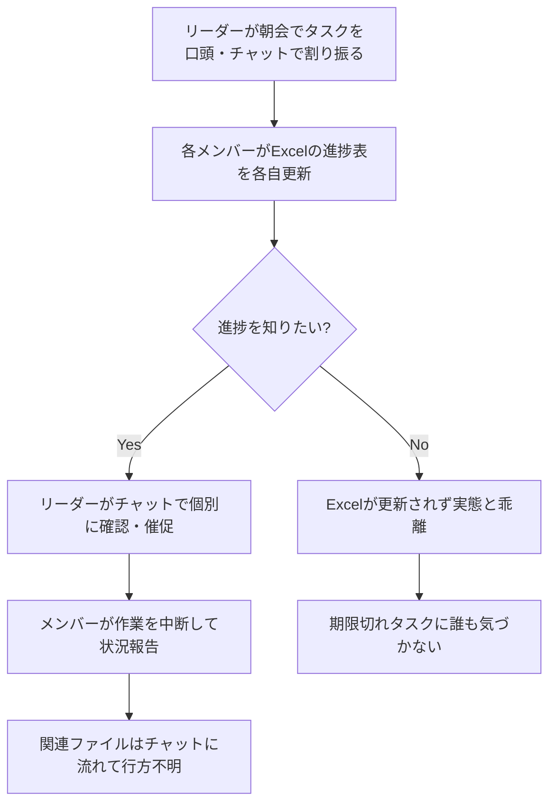
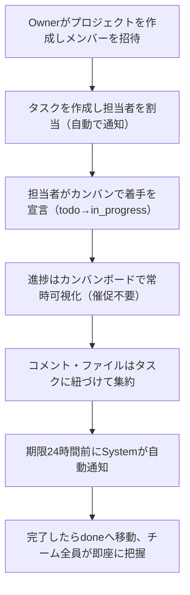
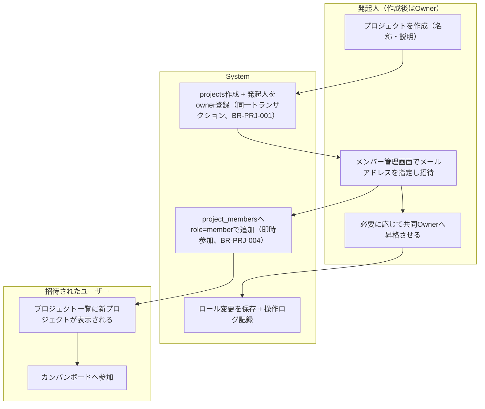
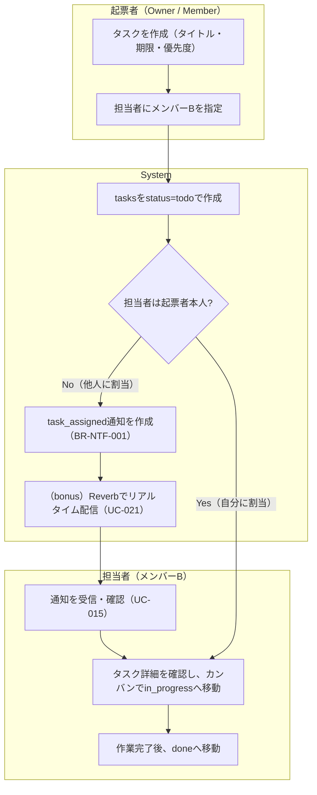
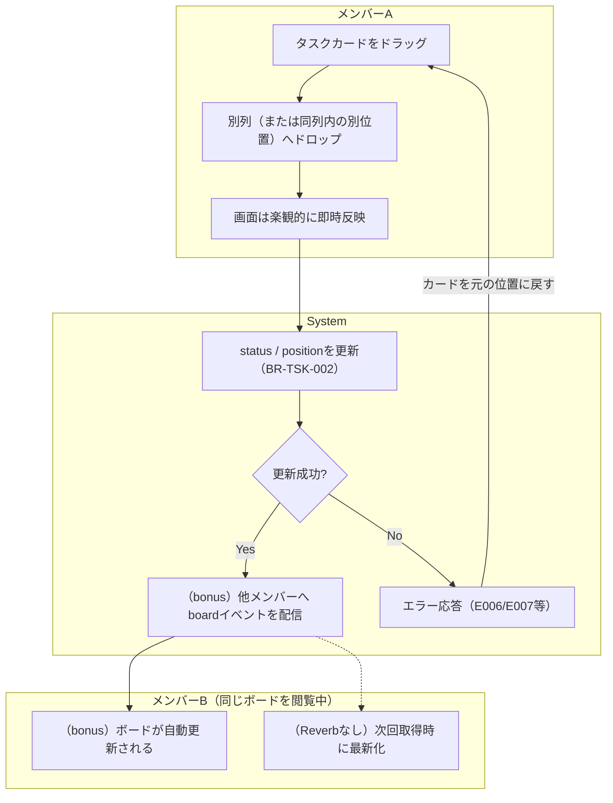
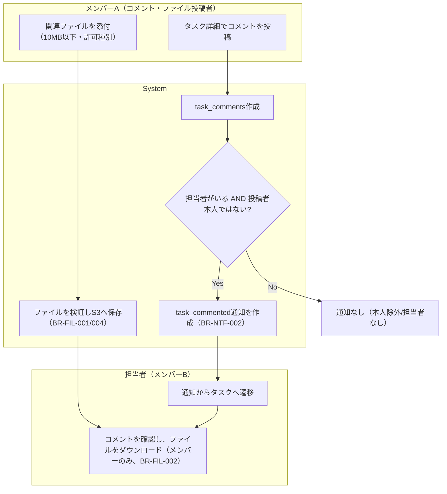
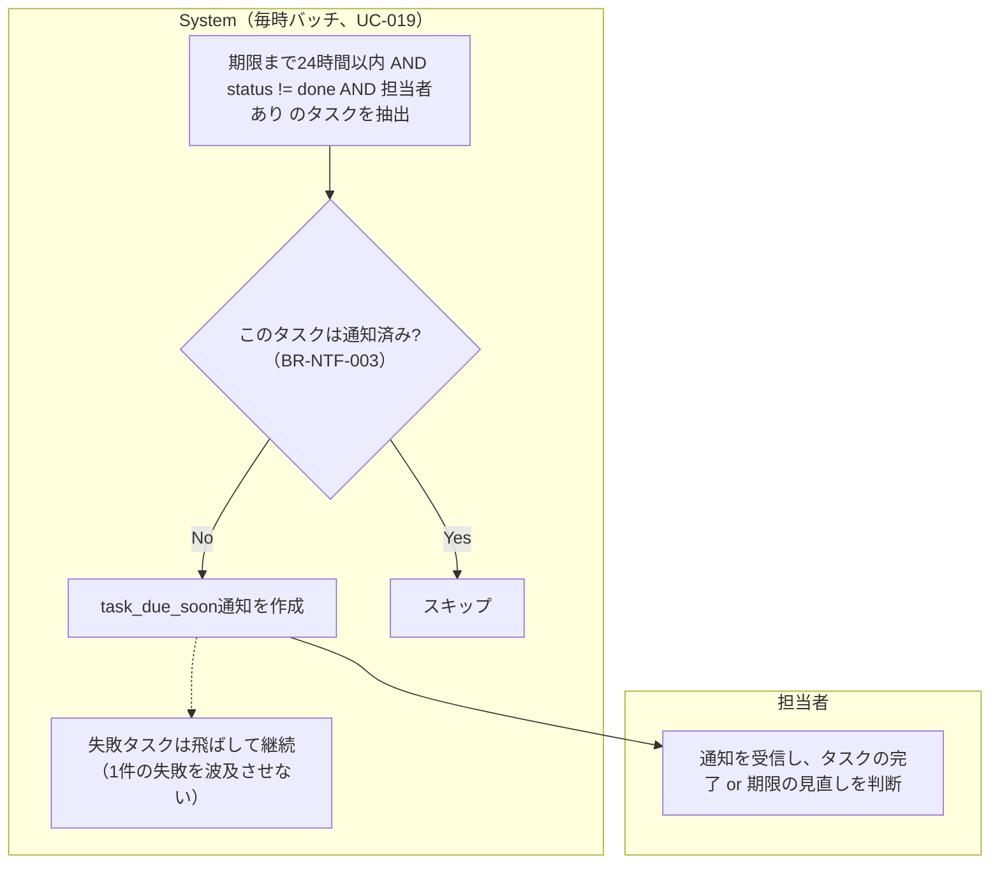
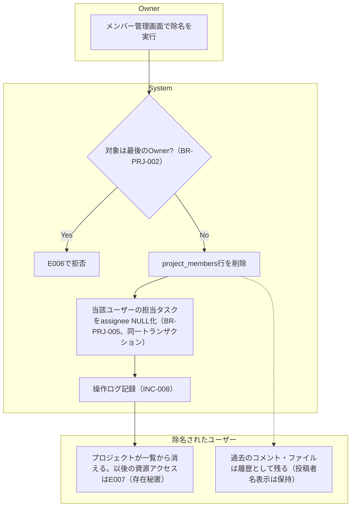
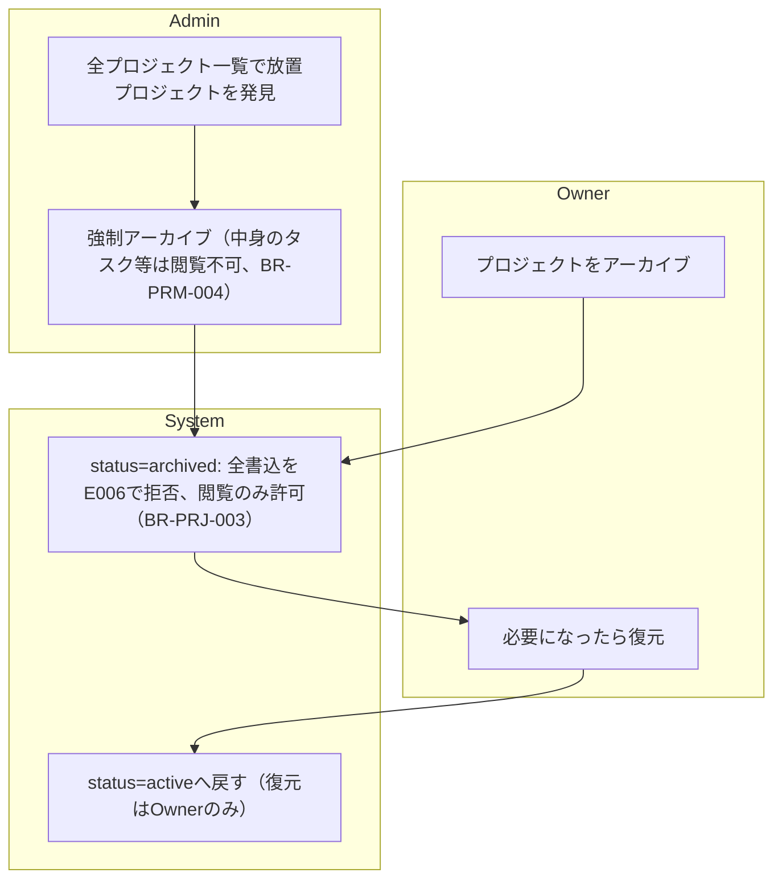

# 業務フロー

Project Management System（プロジェクト管理システム）

---

# 文書管理情報

| 項目 | 内容 |
| --- | --- |
| システム名 | Project Management System |
| 文書名 | 業務フロー |
| 文書番号 | PMS-004 |
| 作成者 | Nguyen Minh Tri |
| 作成日 | 2026/07/17 |
| バージョン | 1.0 |
| ステータス | Draft |

---

# 改訂履歴

| Version | 日付 | 作成者 | 内容 |
| --- | --- | --- | --- |
| 0.0 | 2026/07/17 | Nguyen Minh Tri | スケルトン作成 |
| 1.0 | 2026/07/17 | Nguyen Minh Tri | 初版作成（BF-001〜007、03_ユースケース v1.0のUC-IDと整合） |

---

# 目次

1. 本書の目的
2. 業務概要と業務フロー一覧
3. AS-IS 業務フロー（想定：システム化以前）
4. TO-BE 業務フロー（本システム導入後）
5. プロジェクト立ち上げ業務フロー（BF-002）
6. タスク運用業務フロー（BF-003）
7. カンバン操作フロー（BF-004）
8. コラボレーション業務フロー（BF-005）
9. 期限接近通知バッチフロー（BF-006）
10. 運用業務フロー（BF-007: 除名・アーカイブ・Admin）
11. 例外フロー
12. 業務ルール対応
13. ユースケース対応
14. まとめ

---

# 1. 本書の目的

本書は、Project Management Systemが支える業務の流れを、アクター（スイムレーン）ごとの時系列で定義する。02_要件定義書の業務ルール（BR-ID）と03_ユースケースのUC-IDを業務の文脈に配置し、05_画面遷移図以降の設計の基準とする。

本システムの業務フローの特徴は、**1人の操作が他のメンバーへの通知として波及する**（fan-out）ことである。各フローでは「誰の操作が」「誰に何を届けるか」を明示する。

---

# 2. 業務概要と業務フロー一覧

想定利用者は5〜10名規模の開発チーム（社内・オフショア混成を想定）。チャットとExcelに分散したタスク管理を本システムに集約し、「今誰が何をしているか」「自分は何をすべきか」を常に可視化する。

| BF-ID | 業務フロー | 主なアクター | 関連UC | 記載章 |
| --- | --- | --- | --- | --- |
| BF-001 | 認証フロー | 未認証ユーザー / System | UC-001〜003 | （単純なため図は省略。UC-001/002の基本フローを参照） |
| BF-002 | プロジェクト立ち上げ | 発起人（→Owner）/ 招待されるユーザー / System | UC-004 / 007 | 5章 |
| BF-003 | タスク運用 | Owner / Member / 担当者 / System | UC-008 / 009 / 015 | 6章 |
| BF-004 | カンバン操作 | Member / System | UC-012 / 021 | 7章 |
| BF-005 | コラボレーション（コメント・ファイル） | Member / 担当者 / System | UC-013 / 014 / 015 | 8章 |
| BF-006 | 期限接近通知（バッチ） | System / 担当者 | UC-019 / 015 | 9章 |
| BF-007 | 運用（除名・アーカイブ・Admin） | Owner / Admin / System | UC-006 / 007 / 017 / 018 | 10章 |

---

# 3. AS-IS 業務フロー（想定：システム化以前）

## 3.1 AS-IS 課題

- タスクの割当・進捗がチャットとExcelに分散し、「今の状態」の正が存在しない
- 進捗確認が人力（催促）で行われ、確認する側もされる側も時間を奪われる
- 期限切れに気づく仕組みがなく、遅延の発見が事後になる
- ファイルがチャットのタイムラインに埋もれ、後から探せない
- 誰がどのタスクの情報を見てよいかの管理がなく、プロジェクト外への情報漏れに気づけない

---

# 4. TO-BE 業務フロー（本システム導入後）

## 4.1 TO-BE 改善点

| 項目 | AS-IS | TO-BE |
| --- | --- | --- |
| タスクの正 | チャットとExcelに分散 | `tasks`テーブルに一元化、カンバンで常時可視化 |
| 割当の伝達 | 口頭・チャット（見落とし発生） | `task_assigned`通知が自動で届く（BR-NTF-001） |
| 進捗確認 | リーダーが個別に催促 | カンバンの列（BR-TSK-001）を見るだけ。催促という業務自体を消す |
| 期限管理 | 人間の記憶頼み | Systemが毎時監視し期限24時間前に自動通知（BR-NTF-003） |
| ファイル | チャットに流れて散逸 | タスクに添付しS3へ集約（BR-FIL-004）、メンバーのみ取得可（BR-FIL-002） |
| 情報の境界 | 管理なし | メンバーシップによるアクセス制御（BR-PRM-002/006） |

---

# 5. プロジェクト立ち上げ業務フロー（BF-002）

**業務上のポイント**: 招待は承諾フローなしの即時参加（BR-PRJ-004）のため、誤招待は除名（BF-007）で取り消す運用となる。招待相手は事前にシステム登録が必要（未登録メールはE007）。

---

# 6. タスク運用業務フロー（BF-003）

タスクの誕生から完了までの基本サイクル。**通知のfan-out（誰の操作が誰に届くか）**が本フローの中心である。

**業務上のポイント**:
- 通知は「他人への割当」でのみ発火する（本人除外の原則）。自己割当で自分に通知が来る煩わしさを設計段階で排除している
- 担当者の変更（UC-009）も同じ経路で新担当者へ`task_assigned`を発火する
- in_progress→doneの移動に承認は不要（BR-TSK-001の自由遷移）。品質ゲートが必要なチームはdone列への移動をレビュー完了の合図とする運用でカバーする

---

# 7. カンバン操作フロー（BF-004）

**業務上のポイント**: 同じ列を複数メンバーが同時に並び替える競合は日常的に起きる。整合の最終責任はDB側のposition設計（09_テーブル定義で確定）が持ち、クライアントは失敗時に巻き戻して再取得する、が原則。

---

# 8. コラボレーション業務フロー（BF-005）

**業務上のポイント**: 議論と成果物がタスクに紐づくため、後から参加したメンバーも文脈を追える（AS-IS課題「ファイルの散逸」の解消）。ダウンロードは毎回メンバーシップ判定を通る — チャットのように「URLを知っていれば誰でも見られる」状態を作らない。

---

# 9. 期限接近通知バッチフロー（BF-006）

**業務上のポイント**: 通知は1タスク1回のみ（毎時再送しない — 通知過多はAS-ISの「催促」の再来になる）。期限を過ぎたタスクへの追加通知も行わず、ボード上の強調表示（06_画面設計）に委ねる。

---

# 10. 運用業務フロー（BF-007: 除名・アーカイブ・Admin）

## 10.1 メンバー除名フロー

## 10.2 アーカイブ・Admin運用フロー

---

# 11. 例外フロー

| 例外 | 発生フロー | システムの挙動 | 業務上の対応 |
| --- | --- | --- | --- |
| 非メンバーがプロジェクト資源へアクセス | 全BF | E007（存在秘匿、BR-PRM-006） | 参加が必要ならOwnerに招待を依頼する |
| Memberが Owner専用操作を実行 | BF-002 / 007 | E002 | Ownerに操作を依頼、または昇格してもらう |
| archivedプロジェクトへの書込 | BF-003〜005 | E006（BR-PRJ-003） | Ownerが復元してから操作する |
| 最後のOwnerの降格・除名・脱退 | BF-007 | E006（BR-PRJ-002） | 先に他メンバーをOwnerへ昇格させる |
| 既参加メンバーへの再招待 | BF-002 | E011 | メンバー一覧を確認する |
| ファイル制限違反（サイズ・種別・件数） | BF-005 | E003（BR-FIL-001） | ファイルを分割・変換して再添付 |
| カンバン同時並び替えの競合 | BF-004 | DB側で整合を保証し、クライアントは再取得 | 特別な対応不要（自動回復） |
| Reverb停止 | BF-003〜005 | 配信のみ停止、DB通知は継続（BR-NTF-006） | ポーリングで代替。運用手順は20_運用保守手順書 |
| 担当者が無効化（inactive）されたユーザー | BF-003 / 006 | メンバーシップ・担当は保持（UC-017）。通知は作成されるがログイン不可のため未読のまま | Ownerが担当を付け替える |

---

# 12. 業務ルール対応

| BF-ID | 主要な適用ルール |
| --- | --- |
| BF-002 | BR-PRJ-001（作成者=Owner）/ BR-PRJ-004（即時参加）/ BR-PRJ-002（最後のOwner保護） |
| BF-003 | BR-NTF-001（割当通知・本人除外）/ BR-TSK-001（自由遷移）/ BR-TSK-003（担当者はメンバーのみ） |
| BF-004 | BR-TSK-002（position一意）/ BR-PRJ-003（archived書込禁止） |
| BF-005 | BR-NTF-002（コメント通知）/ BR-FIL-001〜004（ファイル制限・保護） |
| BF-006 | BR-NTF-003（期限通知・1タスク1回） |
| BF-007 | BR-PRJ-002 / BR-PRJ-005（除名時の担当解除）/ BR-PRM-004（Admin運用限定）/ BR-PRJ-003 |

---

# 13. ユースケース対応

2章の一覧表を参照（BF-ID ⇔ UC-IDの対応を記載済み）。逆引き: UC-005（閲覧）とUC-015（通知確認）は複数BFに横断的に登場する。UC-020（操作ログ）はBF-002/007の各操作に付随する。

---

# 14. まとめ

本業務フローの核心は、AS-ISの「人力による伝達・確認・催促」を、**通知のfan-out（BF-003/005/006）とカンバンの常時可視化（BF-004）に置き換える**ことである。同時に、メンバーシップ境界（BR-PRM）が全フローの前提として機能し、「見える人にしか見えない」ことを業務の自然な流れの中で保証する。次工程の05_画面遷移図 06_画面設計は、本書のフローが画面上で迷いなく実行できることを基準に設計する。

---
