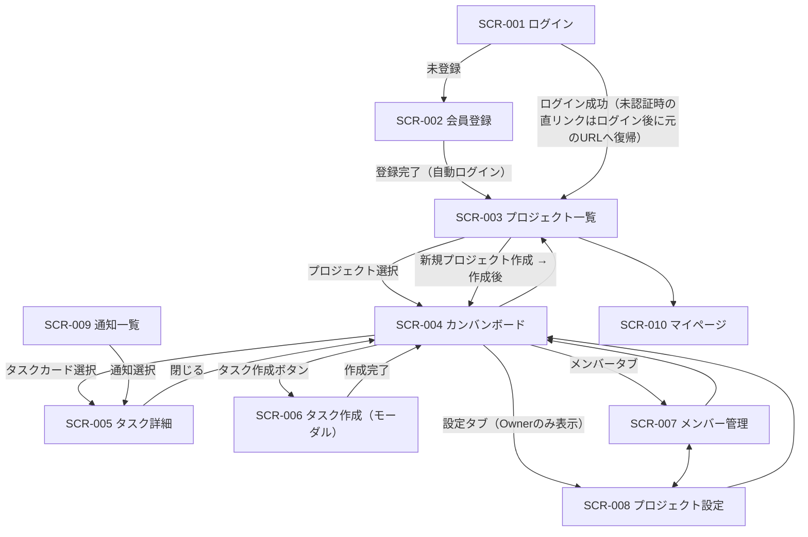
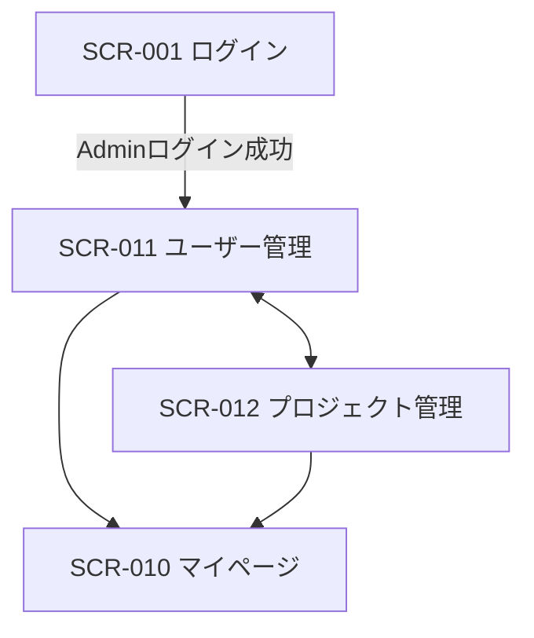

# 画面遷移図

Project Management System（プロジェクト管理システム）

---

# 文書管理情報

| 項目 | 内容 |
| --- | --- |
| システム名 | Project Management System |
| 文書名 | 画面遷移図 |
| 文書番号 | PMS-005 |
| 作成者 | Nguyen Minh Tri |
| 作成日 | 2026/07/17 |
| バージョン | 1.0 |
| ステータス | Draft |

---

# 改訂履歴

| Version | 日付 | 作成者 | 内容 |
| --- | --- | --- | --- |
| 0.0 | 2026/07/17 | Nguyen Minh Tri | スケルトン作成 |
| 1.0 | 2026/07/17 | Nguyen Minh Tri | 初版作成（SPA前提のルートパス列を追加。SCR-005のURL直リンク化 — 通知遷移先の要件 — を確定） |

---

# 目次

1. 本書の目的
2. 画面ID一覧（ルートパス付き）
3. 認証済みユーザー向け画面遷移図
4. Admin向け画面遷移図
5. Role別ナビゲーション
6. 条件付き遷移（ナビゲーションガード）
7. まとめ

---

# 1. 本書の目的

Project Management Systemの全12画面について、画面ID・SPAルートパス・遷移条件を定義する。本システムはVue 3 SPAのため、「画面遷移」はVue Routerのルート遷移として実装される。ページ・モーダル・パネルの別と、ナビゲーションガード（6章）の適用条件を本書で確定する。

---

# 2. 画面ID一覧（ルートパス付き）

| 画面ID | 画面名 | 対象ユーザー | 形態 | ルートパス |
| --- | --- | --- | --- | --- |
| SCR-001 | ログイン画面 | 全ユーザー | ページ | `/login` |
| SCR-002 | 会員登録画面 | 未認証ユーザー | ページ | `/register` |
| SCR-003 | プロジェクト一覧（ホーム） | 認証済みユーザー | ページ | `/projects` |
| SCR-004 | カンバンボード | Owner / Member | ページ | `/projects/:projectId/board` |
| SCR-005 | タスク詳細 | Owner / Member | パネル（**URL直リンク可**） | `/projects/:projectId/tasks/:taskId` |
| SCR-006 | タスク作成 | Owner / Member | モーダル（独自ルートなし） | -（SCR-004上で開く） |
| SCR-007 | メンバー管理 | Owner（閲覧はMember可） | ページ | `/projects/:projectId/members` |
| SCR-008 | プロジェクト設定 | Owner | ページ | `/projects/:projectId/settings` |
| SCR-009 | 通知一覧 | 認証済みユーザー | ドロップダウン + ページ | `/notifications` |
| SCR-010 | マイページ | 認証済みユーザー | ページ | `/mypage` |
| SCR-011 | ユーザー管理（Admin） | Admin | ページ | `/admin/users` |
| SCR-012 | プロジェクト管理（Admin） | Admin | ページ | `/admin/projects` |

**設計判断（SCR-005のURL直リンク化）**: タスク詳細はカンバン上のパネルとして表示するが、**独自のルートパスを持つ**。理由: 通知（UC-015）の遷移先として「特定タスクへ直接飛べるURL」が必須であり、チャット等へのリンク共有（メンバー間）にも使えるため。パネルUIとURLの両立はVue Routerのネストされたルートで実現する（12_詳細設計書）。逆にSCR-006（タスク作成）は一時的な入力状態でありURL化しない。

---

# 3. 認証済みユーザー向け画面遷移図

ヘッダー（共通レイアウト、06_画面設計 3章）の通知アイコン・マイページメニューは全認証済み画面からSCR-009/SCR-010へ遷移できる（図では代表としてSCR-003からの線のみ記載）。

---

# 4. Admin向け画面遷移図

Adminは業務画面（SCR-003〜009）のナビゲーションを持たない（BR-PRM-004: 運用限定。プロジェクトIDを直接指定してもE007 — 03_ユースケース UC-005 2-b）。

---

# 5. Role別ナビゲーション

| メニュー | 未認証 | 認証済みユーザー | Admin |
| --- | --- | --- | --- |
| ログイン / 会員登録 | 〇 | -（ログアウト後に表示） | - |
| プロジェクト一覧 | × | 〇 | × |
| カンバン / タスク / メンバー / 設定 | × | 〇（参加プロジェクトのみ。設定タブはOwnerのみ表示） | × |
| 通知 | × | 〇 | 〇（自分宛のみ。運用上ほぼ空） |
| マイページ | × | 〇 | 〇 |
| ユーザー管理 / プロジェクト管理 | × | × | 〇 |

**注**: 「設定タブはOwnerのみ表示」はUI上の配慮であり、権限の実体はAPI側のPolicy判定（BR-PRM-003）。URLを直接叩いたMemberにはE002を返し、フロントは権限エラー画面を表示する（6章 G-04）。

---

# 6. 条件付き遷移（ナビゲーションガード）

SPAのため、遷移条件はVue Routerのナビゲーションガード + API応答エラーの2段階で守る。ガードIDは12_詳細設計書（フロントエンド設計）で実装と対応付ける。

| ガードID | 対象ルート | 条件 | 不成立時の挙動 |
| --- | --- | --- | --- |
| G-01 | `/login` `/register`以外の全ルート | 認証済み（トークン保持）であること | `/login`へリダイレクト。ログイン成功後、元のURLへ復帰（クエリ`redirect`） |
| G-02 | `/login` `/register` | 未認証であること | 認証済みなら`/projects`（Adminは`/admin/users`）へリダイレクト |
| G-03 | `/projects/:projectId/*` | 当該プロジェクトのメンバーであること（INC-002） | API応答E007を受け、`/projects`へ戻し「プロジェクトが見つかりません」を表示（存在秘匿、BR-PRM-006） |
| G-04 | `/projects/:projectId/settings` | Ownerであること | API応答E002を受け、権限エラー表示（対象の存在は隠さない — メンバーではあるため） |
| G-05 | `/admin/*` | `users.role=admin`であること | E002。一般ユーザーには管理メニュー自体を表示しない |
| G-06 | 書込操作全般（遷移ではなく操作ガード） | プロジェクトが`status=active`であること | E006を受け、「アーカイブ済みのため読取専用です」バナーを表示（BR-PRJ-003） |
| G-07 | `/projects/:projectId/tasks/:taskId` | タスクが存在すること | 削除済み・不存在はE007を受け、ボードへ戻し「タスクが見つかりません」を表示（UC-015 3-a: 通知からの遷移で発生し得る） |

---

# 7. まとめ

全12画面のうち、業務の中心はSCR-004（カンバンボード）であり、タスク詳細・作成・メンバー・設定はすべてボードを起点に放射状に配置した（OOUI: プロジェクトという対象を選んでから操作する構造）。SPA特有の設計判断として、①SCR-005のURL直リンク化（通知遷移の要件）、②ガードを「フロントのルートガード + APIのPolicy判定」の二重防御とし、権限の実体は常にAPI側に置くこと、の2点を確定した。

---
