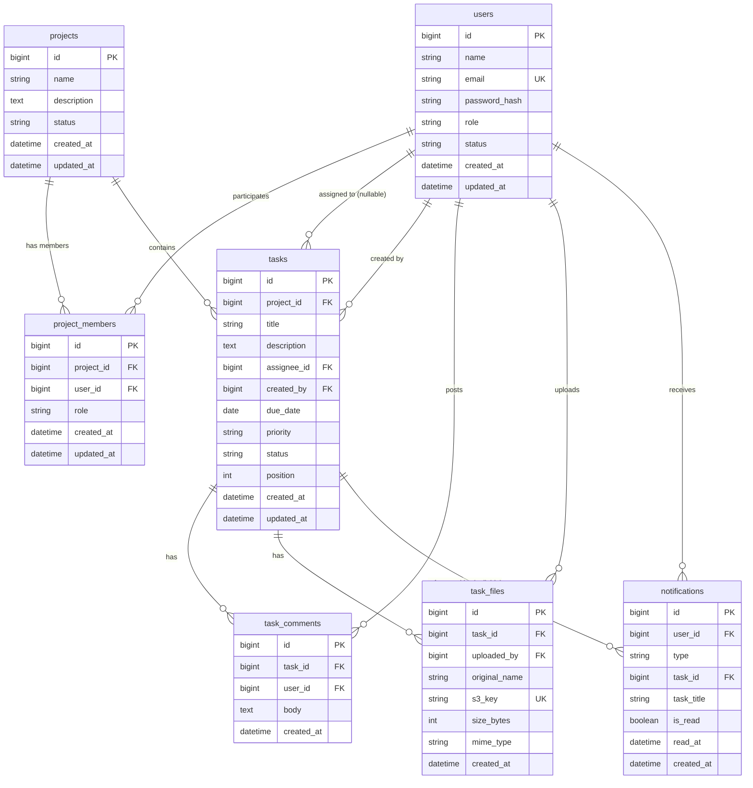

# ER図

Project Management System（プロジェクト管理システム）

---

# 文書管理情報

| 項目 | 内容 |
| --- | --- |
| システム名 | Project Management System |
| 文書名 | ER図 |
| 文書番号 | PMS-008 |
| 作成者 | Nguyen Minh Tri |
| 作成日 | 2026/07/18 |
| バージョン | 1.1 |
| ステータス | Draft |

---

# 改訂履歴

| Version | 日付 | 作成者 | 内容 |
| --- | --- | --- | --- |
| 0.0 | 2026/07/17 | Nguyen Minh Tri | スケルトン作成 |
| 1.0 | 2026/07/18 | Nguyen Minh Tri | 初版作成（7テーブル・11リレーション。notificationsへのtask_titleスナップショット採用、通知のtask_id SET NULL方針を確定） |
| 1.1 | 2026/07/21 | Nguyen Minh Tri | 全体整合性監査: 11章・2章の`.drawio`ステータス記述が「未作成」のまま陳腐化していた（`/drawio-er`スキルで既に生成済み）ため「作成済み」に訂正。 |

---

# 目次

1. 本書の目的
2. ER設計方針
3. エンティティ一覧
4. ER図
5. リレーション定義
6. エンティティ詳細（業務上の要点）
7. 主キー・外部キー一覧
8. インデックス方針
9. データ削除・保持方針
10. 正規化方針とあえて非正規化した点
11. drawio図面ファイル
12. トレーサビリティ
13. まとめ

---

# 1. 本書の目的

本書は、Project Management Systemで利用するデータの論理構造とエンティティ間の関係を定義する。本書のエンティティ・リレーション・キー設計は、次工程の`09_テーブル定義.md`（物理設計）、`10_API設計.md`、実装、テスト仕様書の基準とする。

---

# 2. ER設計方針

| 方針ID | 方針 | 内容 |
| --- | --- | --- |
| ER-001 | Logical First | 本書では論理ERを定義し、物理カラム型・詳細制約は`09_テーブル定義.md`で定義する。 |
| ER-002 | Traceability | エンティティは要件（REQ）、機能（FUNC）、業務ルール（BR）と対応させる。 |
| ER-003 | 2層ロールのDB表現 | プロジェクトロールは`project_members`（中間テーブル + role列）で表現する。`users`側にプロジェクト権限を持たせない（BR-PRM-001）。 |
| ER-004 | 履歴の生存 | 通知はタスク削除後も残す（UC-015 3-a）。参照FKはSET NULL + 表示用スナップショットで独立性を保つ（10章）。 |
| ER-005 | 物理削除の採用 | タスク系（tasks/task_comments/task_files）はタスク削除時に連動物理削除する（BR-TSK-007）。Project 02の「会計証憑は削除しない」方針との対比を意図的に採用。 |
| ER-006 | Normalization | 第3正規形を基本とし、通知の表示独立性のみ意図的に非正規化する（10章）。 |

---

# 3. エンティティ一覧

テーブルIDは`09_テーブル定義.md`および`diagrams/er/pms_erd.drawio`（11章）のTBL-IDと一致させる。

| テーブルID | エンティティ | 論理名 | 概要 | 主な関連機能 |
| --- | --- | --- | --- | --- |
| TBL-001 | users | ユーザー | 全利用者（グローバルロール admin/user を保持）。 | FUNC-001〜004 / 030 |
| TBL-002 | projects | プロジェクト | プロジェクト本体。状態はactive/archived。 | FUNC-005〜008 / 031 |
| TBL-003 | project_members | プロジェクトメンバー | users×projectsの中間テーブル。**プロジェクトロール（owner/member）を保持する2層ロールモデルの核**。 | FUNC-009〜012 / 032 |
| TBL-004 | tasks | タスク | タスク本体。担当者・期限・優先度・ステータス・カンバン表示順を保持。 | FUNC-013〜019 |
| TBL-005 | task_comments | タスクコメント | タスクへのコメント（編集なし・不変、BR-CMT-003）。 | FUNC-020 / 021 |
| TBL-006 | task_files | タスク添付ファイル | S3オブジェクトへの参照（元ファイル名・サイズ・MIME）。 | FUNC-022〜024 |
| TBL-007 | notifications | 通知 | 受信者・種別（3種）・参照タスク・既読状態。 | FUNC-025〜028 |

---

# 4. ER図

---

# 5. リレーション定義

| リレーションID | 親エンティティ | 子エンティティ | 多重度 | 内容 |
| --- | --- | --- | --- | --- |
| REL-001 | users | project_members | 1:N | 1ユーザーは複数プロジェクトに参加できる。 |
| REL-002 | projects | project_members | 1:N | 1プロジェクトは複数メンバーを持つ。`UNIQUE(project_id, user_id)`で重複参加を防ぐ（BR-PRJ-004のE011の実体）。 |
| REL-003 | projects | tasks | 1:N | 1プロジェクトは複数タスクを持つ。プロジェクト間移動は不可（BR-TSK-006）。 |
| REL-004 | users | tasks | 1:N（nullable） | 担当者（`assignee_id`）。担当なしを許容（BR-TSK-003）。除名時にNULL化（BR-PRJ-005）。 |
| REL-005 | users | tasks | 1:N | 作成者（`created_by`）。監査・表示用であり権限判定には使わない（編集権限はメンバーシップで決まる、BR-PRM-005）。 |
| REL-006 | tasks | task_comments | 1:N | 1タスクは複数コメントを持つ。タスク削除で連動削除（BR-TSK-007）。 |
| REL-007 | users | task_comments | 1:N | 投稿者。除名後もコメントは残り投稿者名を表示し続ける（BR-PRJ-005）。 |
| REL-008 | tasks | task_files | 1:N | 1タスクは複数ファイルを持つ（最大20件、BR-FIL-001）。タスク削除で連動削除 + S3オブジェクト削除。 |
| REL-009 | users | task_files | 1:N | アップロード者（`uploaded_by`）。削除権限判定（本人 or Owner、BR-FIL-003）に使用する。 |
| REL-010 | users | notifications | 1:N | 受信者。本人のみ閲覧・既読化できる（BR-NTF-004）。 |
| REL-011 | tasks | notifications | 1:N（nullable） | 遷移先タスクへの参照。**タスク削除時はSET NULLとし通知自体は残す**（UC-015 3-a。表示はtask_titleスナップショットで継続、10章）。 |

---

# 6. エンティティ詳細（業務上の要点）

全カラム定義は`09_テーブル定義.md`を参照。本章では業務上の要点のみ補足する。

| エンティティ | 業務上の要点 |
| --- | --- |
| project_members | 2層ロールモデルの2層目。「あるユーザーがあるプロジェクトで何者か」はこのテーブルの1行が決める。全プロジェクト資源アクセスの権限判定（INC-002/003）はこの行の存在とrole列を参照する。 |
| tasks | `assignee_id`と`created_by`はどちらも`users`参照だが役割が異なる（REL-004/005）。`position`は同一（project_id × status）内の表示順で、採番方式・同時更新の整合は`09_テーブル定義.md` 11章の設計判断で確定する。 |
| task_comments | 編集機能がないため不変（`updated_at`を持たない）。「投稿の事実」の記録。 |
| task_files | S3オブジェクトの実体は持たず`s3_key`で参照する。行の削除とS3オブジェクトの削除は必ずセット（BR-FIL-003）。`original_name`は表示専用でS3キーには使わない（BR-FIL-004）。 |
| notifications | `task_title`は作成時点のタスク名のスナップショット。参照先タスクが削除・改名されても通知文面は作成時点のまま表示できる（Project 02のorder_itemsと同じスナップショット思想の小規模適用）。 |

---

# 7. 主キー・外部キー一覧

| テーブル | PK | 主なFK（ON DELETE） |
| --- | --- | --- |
| users | id | - |
| projects | id | - |
| project_members | id | project_id → projects.id（CASCADE）、user_id → users.id（CASCADE） |
| tasks | id | project_id → projects.id（CASCADE）、assignee_id → users.id（SET NULL）、created_by → users.id（RESTRICT） |
| task_comments | id | task_id → tasks.id（CASCADE）、user_id → users.id（RESTRICT） |
| task_files | id | task_id → tasks.id（CASCADE）、uploaded_by → users.id（RESTRICT） |
| notifications | id | user_id → users.id（CASCADE）、task_id → tasks.id（**SET NULL**、REL-011） |

**方針**: 本システムでは`users`と`projects`の物理削除はスコープ外（無効化・アーカイブのみ）のため、CASCADEは主に「タスク削除→コメント/ファイル/通知参照の整理」（BR-TSK-007）のために機能する。`created_by`/`user_id`（投稿者）/`uploaded_by`のRESTRICTは「履歴の作成者を消せない」ことの表明であり、万一将来ユーザー物理削除を導入する際の防波堤となる。

---

# 8. インデックス方針

| 対象 | 種別 | 用途 |
| --- | --- | --- |
| users.email | UNIQUE | ログイン検索 |
| project_members (project_id, user_id) | UNIQUE | 重複参加防止（E011）+ メンバーシップ判定（INC-002）の高速化 — **全APIが通る最頻クエリ** |
| project_members (user_id) | INDEX | 自分の参加プロジェクト一覧（SCR-003） |
| tasks (project_id, status, position) | INDEX | カンバン表示（列ごとposition昇順、SCR-004）。一意性はDB制約にせずアプリ層で保証（`09_テーブル定義.md` 11章 — 並び替え時の一時的重複をUNIQUEが妨げるため） |
| tasks (assignee_id) | INDEX | 担当者絞込（REQ-013）・期限バッチの抽出（FUNC-028） |
| tasks (due_date, status) | INDEX | 期限接近バッチ「期限24時間以内かつ未完了」の抽出 |
| task_files.s3_key | UNIQUE | S3オブジェクトとの1:1対応保証 |
| notifications (user_id, is_read, created_at) | INDEX | 通知一覧・未読件数（SCR-009、最頻の読み取り） |
| notifications (task_id, type) | INDEX | `task_due_soon`の重複チェック（BR-NTF-003。UNIQUEにしない理由は`09_テーブル定義.md` 11章） |

---

# 9. データ削除・保持方針

| データ | 方針 |
| --- | --- |
| users | 物理削除しない。無効化（status=inactive）のみ（UC-017。メンバーシップ・担当は保持） |
| projects | 物理削除しない。アーカイブ（status=archived）のみ（BR-PRJ-003） |
| tasks / task_comments / task_files | タスク削除時に連動物理削除（BR-TSK-007）。S3オブジェクトも同時削除 |
| project_members | 除名時に行削除。担当タスクのNULL化を同一トランザクションで実施（BR-PRJ-005） |
| notifications | ユーザー削除機能なし（BR-NTF-005）。タスク削除時も残す（task_id=NULL化）。保持期間バッチは将来対応 |

---

# 10. 正規化方針とあえて非正規化した点

| 対象 | 状態 | 理由 |
| --- | --- | --- |
| notifications.task_title | 意図的な非正規化（tasksと重複） | 通知はタスク削除後も残る仕様（UC-015 3-a）のため、JOINでは表示が破綻する。作成時点のタスク名をスナップショットし、通知文面の表示独立性を保つ。Project 02の`order_items`スナップショットと同じ思想の最小適用。 |
| プロジェクトのOwner表示（SCR-012等） | 正規化維持（projectsにowner列を持たない） | Ownerは複数人になり得る + ロール変更で頻繁に変わるため、`project_members.role=owner`から都度導出する。projectsへの重複保持は更新漏れの温床になる。 |
| tasksの未完了件数（SCR-003のカード表示） | 正規化維持（projectsに集計列を持たない） | 表示のたびにCOUNTで導出する。規模（NFR-002: 50同時接続）では集計列の同期コストが利益を上回る。 |
| それ以外 | 第3正規形 | 関数従属性に基づき正規化する。 |

---

# 11. drawio図面ファイル

`../diagrams/er/pms_erd.drawio`（**作成済み** — `/drawio-er`スキルで生成、7テーブル/11リレーション）。規約はEC Siteと同一: swimlane形式、PK行=淡黄/FK行=淡青、FK依存レベル順の列配置、迂回レーン方式の配線。

FK依存レベルの目安: Lv0=users / Lv1=projects, notifications(users参照分) / Lv2=project_members, tasks / Lv3=task_comments, task_files。`tasks`は`users`を3本のFK（assignee_id/created_by + notifications経由）で参照するため、配線時はchannelXの割り当てに注意する。

---

# 12. トレーサビリティ

`02_要件定義書.md`の業務ルール（BR-PRM/PRJ/TSK/CMT/FIL/NTF）→ 本書のリレーション定義（5章）→ `09_テーブル定義.md`の物理制約、の順に一意に追跡できる。

---

# 13. まとめ

本ER図の核心は2点である。①`project_members`（REL-001/002）が2層ロールモデルのDB実体であり、`UNIQUE(project_id, user_id)`とrole列が全権限判定の根拠となる。②通知の生存戦略（REL-011: SET NULL + task_titleスナップショット）— 「参照先が消えても事実の記録は残す」という設計判断は、Project 02で学んだスナップショット思想を通知という新しい文脈で再適用したものである。この2点を`09_テーブル定義.md`の物理制約（UNIQUE・FK・インデックス）として正確に落とし込むことが次工程の任務となる。

---
