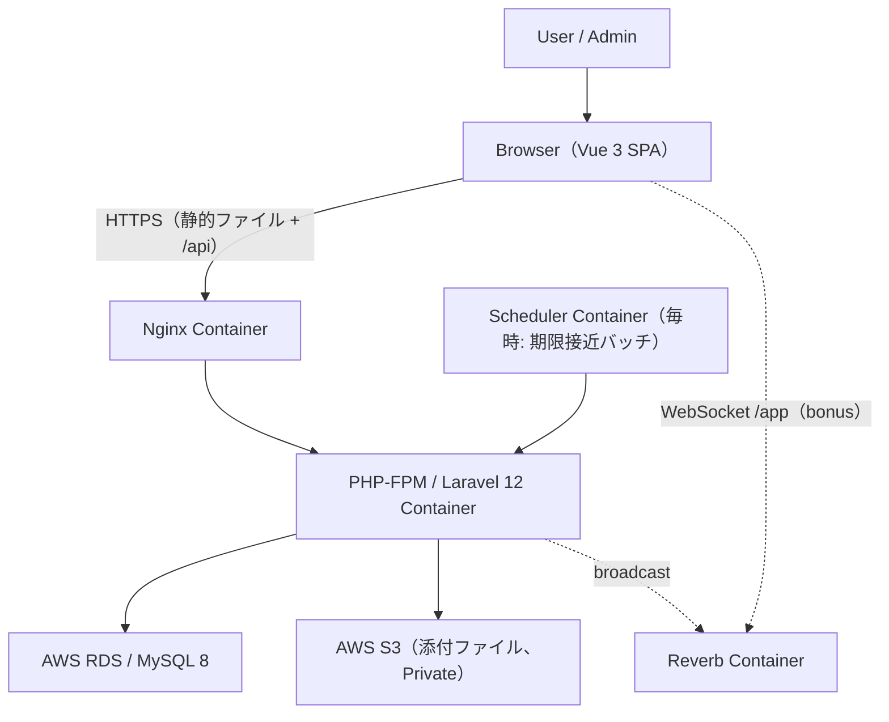
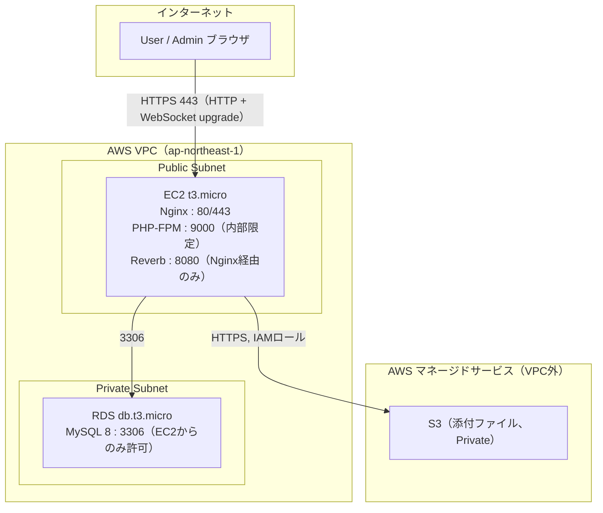

# 基本設計書

Project Management System（プロジェクト管理システム）

---

# 文書管理情報

| 項目 | 内容 |
| --- | --- |
| システム名 | Project Management System |
| 文書名 | 基本設計書 |
| 文書番号 | PMS-011 |
| 作成者 | Nguyen Minh Tri |
| 作成日 | 2026/07/18 |
| バージョン | 1.2 |
| ステータス | Draft |

---

# 改訂履歴

| Version | 日付 | 作成者 | 内容 |
| --- | --- | --- | --- |
| 0.0 | 2026/07/17 | Nguyen Minh Tri | スケルトン作成 |
| 1.0 | 2026/07/18 | Nguyen Minh Tri | 初版作成（外部設計の統合。画面×DBマッピング、トランザクション境界、DB↔S3の順序方針を新規確定） |
| 1.1 | 2026/07/18 | Nguyen Minh Tri | 13.2節に注記追加: MemberPolicyは実装上ProjectPolicyのメソッドへ吸収（12_詳細設計書 3章の確定に追従。概念一覧としての本表は維持）。 |
| 1.2 | 2026/07/21 | Nguyen Minh Tri | 全体整合性監査: 13.2節がforceArchiveをProjectPolicyのメソッドであるかのように記載していたが、`12_詳細設計書.md`8章（Policy設計の正）にforceArchiveはPolicyとして存在せず、`role:admin`Middlewareのみで判定される設計。表記を訂正し12章を参照するよう修正。 |

---

# 目次

1. 本書の目的
2. 設計範囲
3. システム構成
4. アプリケーション構成
5. 業務フロー概要
6. 画面設計概要
7. 機能設計概要
8. API設計概要
9. データ設計概要
10. 外部インターフェース一覧
11. ファイル一覧
12. 帳票レイアウト
13. 認証・認可設計
14. 業務処理設計
15. エラー・例外設計
16. ログ・監査設計
17. まとめ

---

# 1. 本書の目的

本書は、Project Management Systemの外部設計（WHAT）を統合する。個別に確定済みの`04_業務フロー.md`〜`10_API設計.md`を横断的に束ね、それらに現れない統合レベルの設計 — システム構成、画面×DB処理マッピング、トランザクション境界、DB↔S3の処理順序 — を確定する。内部設計（HOW）は`12_詳細設計書.md`で定義する。

---

# 2. 設計範囲

## 2.1 In Scope

`02_要件定義書.md` 4.1節の対象業務（認証 / プロジェクト・メンバー管理 / タスク・カンバン / コメント・ファイル / 通知 / Admin運用）に対応する全設計。

## 2.2 Out Scope

`02_要件定義書.md` 18章と同一（ガント・工数・テナント・メール/Slack・@メンション・コメント編集・全文検索・ゲスト共有・タスク間移動・モバイルアプリ・多言語UI）。

---

# 3. システム構成

## 3.1 全体構成



## 3.2 コンポーネント一覧

| コンポーネント | 役割 |
| --- | --- |
| Nginx | SPAビルド済み静的ファイルの配信 + `/api`のLaravelへのリバースプロキシ |
| Vue 3 SPA | フロントエンド（Vite build。開発時はviteコンテナがHMR配信） |
| PHP-FPM / Laravel 12 | REST API本体（Controller→FormRequest→Policy→Service→Model） |
| MySQL 8 (RDS) | 永続データストア（7テーブル、`09_テーブル定義.md`） |
| S3 | 添付ファイル保存（Privateバケット、BR-FIL-002） |
| Reverb（bonus） | WebSocketサーバー（通知・ボード変更の配信、`10_API設計.md` 9章） |
| Scheduler | `task_due_soon`バッチの毎時実行（Project 02のScheduler構成を流用） |

## 3.3 ネットワーク構成図



| Security Group | 許可ポート | 許可元 |
| --- | --- | --- |
| Web SG（EC2） | 80, 443 | インターネット全体（WebSocketも443のNginx経由でupgrade） |
| DB SG（RDS） | 3306 | Web SGのみ |
| S3 | SG対象外 | IAMロールのみ（Publicアクセス全ブロック — Project 02の商品画像と異なり読み取りも公開しない） |

詳細は`13_インフラ設計.md`で定義する。Project 02との主な差分: ①Reverb用のWebSocketパスをNginxでプロキシ、②S3が完全Private、③外部決済（Stripe）が存在せずインバウンドWebhookがない。

---

# 4. アプリケーション構成

## 4.1 レイヤー構成

Project 01/02のController→Service→Model構成を踏襲し、本システムでは**Policy層**を正式に追加する（2層ロール判定の一元化、API-POL-005）。

| 層 | 責務 | 本システムでの要点 |
| --- | --- | --- |
| （FE）Views / Components | 画面描画・状態3態の表示 | デザイントークン（`06_画面設計.md` 2.1節）のみ使用 |
| （FE）Stores（Pinia） | 認証状態・ボード状態・通知状態 | 楽観的更新と巻き戻し（UI-003） |
| （FE）API Client | fetchベースの共通クライアント | エラーエンベロープの一元ハンドリング（E010→ログイン誘導等） |
| （BE）Controller | 入出力の整形のみ（Thin） | ルートモデルバインディング + Policy呼び出し |
| （BE）FormRequest | 形式バリデーション | ファイルは拡張子+MIME（BR-FIL-001） |
| （BE）**Policy** | **認可判定の一元化** | メンバーシップ（INC-002）・ロール（INC-003/004）・アーカイブ（INC-005）をここに集約 |
| （BE）Service | 業務ロジック・トランザクション | fan-out、position採番、担当解除連動（14章） |
| （BE）Model | Eloquent・リレーション・スコープ | `scopeOwnedBy`等（`12_詳細設計書.md`） |

## 4.2 ディレクトリ構成（概要）

```
Project_Management_System/
├── frontend/                 # Vue 3 SPA（Vite + TypeScript + Pinia）
│   └── src/{views, components, stores, composables, api, router}
├── backend/                  # Laravel 12 API
│   └── app/{Http/Controllers, Http/Requests, Policies, Services, Models, Console}
├── docker/                   # nginx / php / (vite, reverb)
├── docker-compose.yml
└── docs/                     # 本設計文書一式
```

詳細ツリーは`12_詳細設計書.md`で確定する。

---

# 5. 業務フロー概要

AS-IS（チャット+Excel分散管理）→ TO-BE（カンバン一元化 + 通知fan-out）の全体像と、BF-001〜007の各フローは`04_業務フロー.md`を正とする。本書では統合上の要点のみ再掲する:

| 観点 | 設計上の含意 |
| --- | --- |
| 1操作→N通知（fan-out） | タスク割当・コメントのService処理に通知作成が副作用として組み込まれる（14章の処理一覧に明記） |
| カンバン常時可視化 | ボード取得（API-015）が最頻APIとなるため、`(project_id, status, position)`インデックスとフラット配列応答で最適化 |
| メンバーシップ境界 | 全フローがINC-002を通る — Policy層の設計（13章）が全業務の前提 |

---

# 6. 画面設計概要

## 6.1 画面一覧・遷移

全12画面（SCR-001〜012）・ルートパス・ナビゲーションガード（G-01〜07）は`05_画面遷移図.md`、各画面の項目・状態3態は`06_画面設計.md`を正とする。

## 6.2 主要画面レイアウト（WF要約）

### SCR-004 カンバンボード（1024px以上）

```
+--------------------------------------------------------------------+
| Global Header: ロゴ | 通知(3) | ユーザーメニュー                    |
+--------------------------------------------------------------------+
| Project Header: プロジェクト名 [ボード] [メンバー] [設定(Owner)]    |
| （archived時: ⚠ アーカイブ済みのため読取専用です）                  |
+--------------------------------------------------------------------+
| 検索: [キーワード] [担当者▼] [ステータス▼]        [+ タスク作成]   |
+----------------------+----------------------+----------------------+
| ● todo (4)           | ● in_progress (2)    | ● done (7)           |
| +------------------+ | +------------------+ | +------------------+ |
| | タイトル         | | | タイトル         | | | タイトル         | |
| | 👤担当 7/19 [高] | | | 👤担当 7/18 [中] | | | 👤担当  --  [低] | |
| +------------------+ | +------------------+ | +------------------+ |
| | ...（D&D可能）   | | |                  | | |                  | |
+----------------------+----------------------+----------------------+
```

### SCR-005 タスク詳細（ボード上の右パネル、URL直リンク可）

```
+--------------------------- [x] 閉じる -----------------------------+
| タイトル（インライン編集）                                          |
| 担当者▼ | 期限 📅 | 優先度▼ | ステータス▼      [🗑 削除(Owner)]  |
| 説明（インライン編集）                                              |
+---------------------------------------------------------------------+
| 添付ファイル (2/20)  [+ ファイル追加]                               |
|   📎 設計書.pdf 1.0MB (山田) [DL] [削除]                            |
+---------------------------------------------------------------------+
| コメント                                                            |
|   佐藤 7/18 10:00 「レビューしました」[削除(本人/Owner)]            |
|   [コメントを入力...                    ] [投稿]                    |
+---------------------------------------------------------------------+
```

## 6.3 画面×DB処理マッピング

C=作成 / R=参照 / U=更新 / D=削除。プロジェクト系画面（SCR-004〜008）は権限判定のため常に`project_members`をRする（INC-002）ため表では省略する。

| 画面 | users | projects | project_members | tasks | task_comments | task_files | notifications |
| --- | --- | --- | --- | --- | --- | --- | --- |
| SCR-001 ログイン | R | - | - | - | - | - | - |
| SCR-002 会員登録 | C | - | - | - | - | - | - |
| SCR-003 プロジェクト一覧 | - | R/C | C（作成時Owner登録） | R（件数） | - | - | - |
| SCR-004 カンバン | R（担当者名） | R | - | R/U（status・position） | - | - | - |
| SCR-005 タスク詳細 | R | R | - | R/U/D | C/R/D | C/R/D | C（副作用） |
| SCR-006 タスク作成 | R（担当者選択） | R | - | C | - | - | C（副作用） |
| SCR-007 メンバー管理 | R | R | C/R/U/D | U（除名時の担当解除） | - | - | - |
| SCR-008 プロジェクト設定 | - | R/U | - | - | - | - | - |
| SCR-009 通知一覧 | - | - | - | R（JOIN: project_id導出） | - | - | R/U（既読） |
| SCR-010 マイページ | R/U | - | - | - | - | - | - |
| SCR-011 ユーザー管理 | R/U | - | - | - | - | - | - |
| SCR-012 プロジェクト管理 | R（Owner名導出） | R/U（強制アーカイブ） | R | - | - | - | - |

**表から読み取れる設計上の含意**: ①`notifications`への書込（C）はSCR-005/006の操作の副作用としてのみ発生し、ユーザーが直接作成する画面は存在しない。②`tasks`のU権限が3画面（004/005/007）に分散する — うちSCR-007の担当解除だけは本人操作でなくシステム連動（BR-PRJ-005）。

---

# 7. 機能設計概要

全33機能（FUNC-001〜033）・9分類は`07_機能一覧.md`を正とする。統合上の要点: System実行系5機能（FUNC-027〜029, 032〜033）は画面を持たないため、試験仕様書ではAPI・バッチ・イベントの単位で検証する。

---

# 8. API設計概要

REST 35本（API-001〜035）+ WebSocketイベント5種は`10_API設計.md`を正とする。統合上の要点:

| 方針 | 内容 |
| --- | --- |
| URLネスト | プロジェクト資源は`/projects/{id}/...`配下（API-POL-004） |
| 認可2段判定 | 認証→メンバーシップ→ロール（API-POL-005、13章） |
| position採番 | クライアントはbefore/afterのみ申告、採番はサーバー責務（API-019） |
| リアルタイム | RESTが正、WebSocketは補助（BR-NTF-006） |

---

# 9. データ設計概要

## 9.1 テーブル概要

7テーブル（TBL-001〜007）・11リレーション。論理設計は`08_ER図.md`、物理設計（型・制約・インデックス・設計判断）は`09_テーブル定義.md`を正とする。

## 9.2 コード一覧（ENUM値）

全文書・実装・試験で以下の値に統一する（`09_テーブル定義.md` 7章と同一）:

| コード | 値 | 使用箇所 |
| --- | --- | --- |
| users.role | admin / user | グローバルロール |
| users.status | active / inactive | ユーザー状態 |
| projects.status | active / archived | プロジェクト状態 |
| project_members.role | owner / member | プロジェクトロール |
| tasks.priority | low / middle / high | 優先度 |
| tasks.status | todo / in_progress / done | カンバン3列 |
| notifications.type | task_assigned / task_commented / task_due_soon | 通知3種 |

---

# 10. 外部インターフェース一覧

| IF | 方向 | プロトコル | 内容 |
| --- | --- | --- | --- |
| AWS S3 | Laravel → S3 | HTTPS（Laravel Filesystem s3） | 添付ファイルのput/get/delete。IAMロール認証 |
| Reverb（bonus） | Laravel → Reverb → Browser | WebSocket | 通知・ボードイベントのbroadcast（`10_API設計.md` 9章） |

Project 02と異なり、外部からのインバウンド連携（Webhook等）は存在しない。攻撃面が「認証済みユーザーによる越権」に集中するため、セキュリティ設計（`14_セキュリティ設計.md`）はIDOR対策を最優先とする。

---

# 11. ファイル一覧

| 分類 | ファイル | 保存先 |
| --- | --- | --- |
| 添付ファイル | `projects/{project_id}/tasks/{task_id}/{uuid}.{ext}`（BR-FIL-004） | S3（Private） |
| SPAビルド成果物 | `frontend/dist/*` | EC2（Nginx配信） |
| アプリケーションログ | laravel.log（操作ログ含む） | EC2（`20_運用保守手順書.md`でローテーション方針） |

帳票出力・CSVエクスポート等のファイル生成機能は存在しない。

---

# 12. 帳票レイアウト

対象外（本システムに帳票はない。レポート機能自体がOut Scope — `02_要件定義書.md` 18章）。

---

# 13. 認証・認可設計

## 13.1 認証

Sanctumトークン認証（有効期限8時間）。SPA側のトークン保管方式・CSRF考慮は`14_セキュリティ設計.md`で確定する（基盤構築フェーズ冒頭のPoC対象、`00_開発計画書.md` 11章）。

## 13.2 認可（本システムの背骨）

判定の正は`02_要件定義書.md` 8章の権限マトリクス。実装はPolicyに一元化する:

| Policy | 対象リソース | 主な判定 |
| --- | --- | --- |
| ProjectPolicy | projects | view=メンバー / update・archive=Owner / **create=一般ユーザーのみ（Admin不可、BR-PRM-004）**（forceArchiveはPolicyではなく`role:admin`Middlewareで判定 — `12_詳細設計書.md`8章参照） |
| MemberPolicy | project_members | manage=Owner / leave=本人（最後のOwnerはE006、BR-PRJ-002） |
| TaskPolicy | tasks | view・create・update・move=メンバー / delete=Owner |
| CommentPolicy | task_comments | create=メンバー / delete=本人 or Owner |
| FilePolicy | task_files | view・upload=メンバー / delete=アップロード者 or Owner |
| NotificationPolicy | notifications | view・read=受信者本人 |

非メンバーへの応答はPolicy拒否をE007へ変換する（存在秘匿、BR-PRM-006。メンバーの権限不足のみE002）。この変換規則の実装位置は`12_詳細設計書.md`で確定する。

**注**: MemberPolicyは実装上、独立クラスとせずProjectPolicyのメソッド（`manageMembers` / `leave`）として吸収する（`12_詳細設計書.md` 3章 — メンバー行の認可は常に親プロジェクトのロールで決まるため）。本表は概念上の判定一覧として有効。

---

# 14. 業務処理設計

## 14.1 主要業務処理一覧

| 処理 | 内容 | 通知副作用 |
| --- | --- | --- |
| プロジェクト作成 | projects + 作成者Owner登録（BR-PRJ-001） | なし |
| メンバー招待 | 登録済みユーザー確認 → project_members追加（BR-PRJ-004） | なし（将来拡張候補） |
| 除名・自主脱退 | project_members削除 + 担当タスクNULL化（BR-PRJ-005）+ 最後のOwner保護 | なし |
| タスク作成・編集 | tasks書込 + 担当者変更判定 | `task_assigned`（本人除外、BR-NTF-001） |
| カンバン移動 | 列単位ロック + 隙間法採番（`09_テーブル定義.md` 11章-1） | なし（BR-NTF対象外） |
| コメント投稿 | task_comments作成 | `task_commented`（担当者あり・本人除外、BR-NTF-002） |
| ファイル操作 | S3 put/get/delete + task_files（順序は14.2） | なし |
| タスク削除 | tasks+comments+files連動削除 + S3削除 | なし（既存通知はSET NULLで残存） |
| 期限接近バッチ | 毎時抽出 + 重複チェック（BR-NTF-003） | `task_due_soon` |

## 14.2 トランザクション境界とDB↔S3の順序方針

| 処理 | トランザクション範囲 | 備考 |
| --- | --- | --- |
| プロジェクト作成 | projects + project_members | 「Ownerのいないプロジェクト」を一瞬も作らない |
| 除名・自主脱退 | project_members + tasks（担当解除） | BR-PRJ-005の連動を原子的に |
| タスク作成・編集 | tasks + notifications | 通知作成も同一トランザクション（作成されたのに通知だけ消えることを防ぐ） |
| カンバン移動 | tasks（対象列を`SELECT ... FOR UPDATE`） | リナンバリング発生時も同一トランザクション内 |
| コメント投稿 | task_comments + notifications | 同上 |
| バッチ | 1タスク=1トランザクション | 1件の失敗を波及させない（Project 02バッチと同一方針） |

**DB↔S3の順序方針（本書で確定）**: S3はトランザクションに参加できないため、「DBを正、S3孤児は許容」を原則とする。

- **アップロード**: S3 put成功 → DB insert。insert失敗時はS3オブジェクトを削除試行し、失敗してもエラーログのみ（孤児オブジェクトは無害。棚卸手順は`20_運用保守手順書.md`）
- **削除（ファイル単体・タスク連動とも）**: DBトランザクションcommit成功 → S3 delete。S3削除失敗はエラーログのみ（DB上は削除済みが正であり、ユーザーからは見えない）
- 逆順（S3を先に削除）は、DBロールバック時に「行はあるが実体がないファイル」というユーザー可視の破損を生むため採用しない

---

# 15. エラー・例外設計

共通エンベロープ（`10_API設計.md` 3.3節）とエラーコード7種（E001/E002/E003/E006/E007/E010/E011 — `02_要件定義書.md` 16章）を全APIで統一する。例外クラスの設計（コードとの対応・render実装）は`12_詳細設計書.md`で定義する。E002/E007の使い分け（存在秘匿）が本システム固有の核心である。

---

# 16. ログ・監査設計

| ログ | 内容 | 出力先 |
| --- | --- | --- |
| 操作ログ（監査） | メンバー変更・削除系操作（API-012〜014, 020, 033, 035）の実行者・対象・日時 | アプリケーションログ（FUNC-033） |
| バッチ実行ログ | 期限バッチの処理件数・失敗タスク | アプリケーションログ |
| エラーログ | 例外・S3操作失敗（14.2の孤児記録含む） | アプリケーションログ |

専用の監査テーブルは設けない（Project 02のAPI-POL-006と同じ判断 — 将来対応候補）。ローテーション・参照手順は`20_運用保守手順書.md`。

---

# 17. まとめ

外部設計を統合し、個別文書に現れなかった3つの統合判断を確定した: ①画面×DBマッピングにより「通知はユーザーが直接作るものではなく常に副作用」という構造を可視化、②トランザクション境界 — 特に「通知は業務操作と同一トランザクション」「バッチは1タスク1トランザクション」、③DB↔S3の順序方針（DBが正・S3孤児許容）。次工程の`12_詳細設計書.md`は、13章のPolicy 6クラスと14章の処理一覧を疑似コードレベルへ分解する。

---
