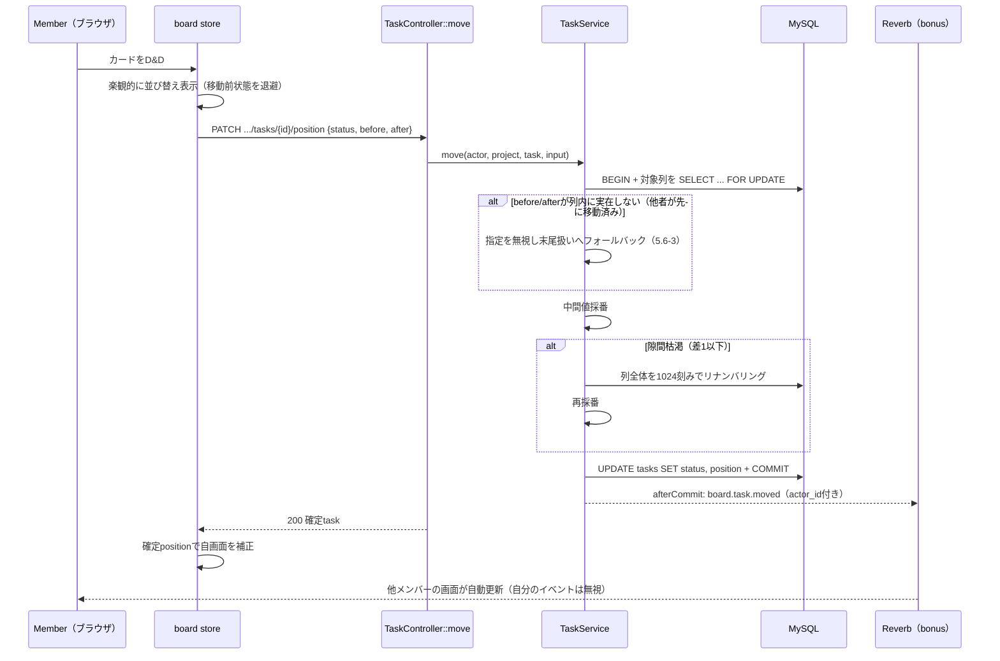
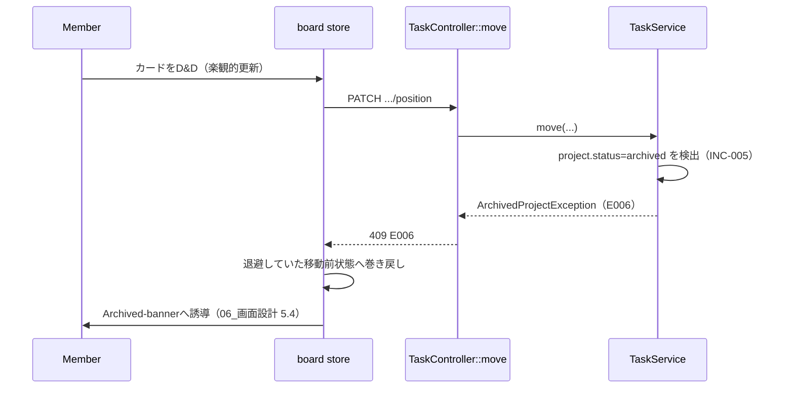
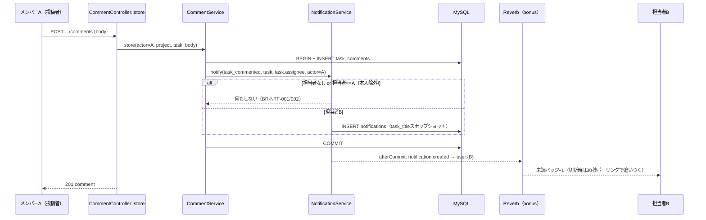

# 詳細設計書

Project Management System（プロジェクト管理システム）

---

# 文書管理情報

| 項目 | 内容 |
| --- | --- |
| システム名 | Project Management System |
| 文書名 | 詳細設計書 |
| 文書番号 | PMS-012 |
| 作成者 | Nguyen Minh Tri |
| 作成日 | 2026/07/18 |
| バージョン | 1.2 |
| ステータス | Draft |

---

# 改訂履歴

| Version | 日付 | 作成者 | 内容 |
| --- | --- | --- | --- |
| 0.0 | 2026/07/17 | Nguyen Minh Tri | スケルトン作成 |
| 1.0 | 2026/07/18 | Nguyen Minh Tri | 初版作成（Service疑似コード13本、認可実装の2段構造 — メンバーシップ=スコープ付きバインディングでE007 / ロール=PolicyでE002 — を確定） |
| 1.1 | 2026/07/21 | Nguyen Minh Tri | 全体整合性監査: 4章Controller一覧のAdmin\ProjectController行が「index, forceArchive | API-035 / 034」と自己矛盾（メソッド順とAPI-ID順が逆）していたため、15章トレーサビリティ表と一致する「API-034 / 035」に訂正。 |
| 1.2 | 2026/07/21 | Nguyen Minh Tri | guide/コード監査で発見: 7章のUploadFileRequestルール記載「mimes+mimetypes」が実装（guide 05章 extensions+mimes）と不一致だった。`mimetypes`はdocx/xlsx等Office系ファイルがzip系として誤検知されやすく実運用で不安定なため、記載を実装に合わせて`extensions+mimes`に訂正（理由を注記追加）。 |

---

# 目次

1. 本書の目的
2. 詳細設計方針
3. ディレクトリ構成
4. Controller詳細設計
5. Service詳細設計（主要処理ロジック）
6. Model詳細設計
7. FormRequest詳細設計（Validation）
8. Middleware・Policy詳細設計（認可の実装）
9. フロントエンド詳細設計
10. シーケンス図（主要フロー）
11. トランザクション設計
12. 例外処理詳細設計
13. バッチ・スケジューラ方針
14. ログ出力詳細設計
15. トレーサビリティ
16. まとめ

---

# 1. 本書の目的

本書は`11_基本設計書.md`の外部設計を、実装可能な単位（Controller/Service/Policy/Model/FormRequest/Exception + フロントエンド構成）まで分解する。特に5章（Service疑似コード）と8章（認可の実装構造）は、コーディング時に最も参照頻度の高いセクションである。

---

# 2. 詳細設計方針

| 方針ID | 方針 | 内容 |
| --- | --- | --- |
| DD-POL-001 | Fat Service, Thin Controller | 業務ロジックはServiceに集約し、Controllerは認可呼び出しと入出力整形のみ行う（Project 01/02と同一方針）。 |
| DD-POL-002 | 1業務=1トランザクション | 境界は`11_基本設計書.md` 14.2節の表を正とする。複数テーブル更新は必ず`DB::transaction()`。 |
| DD-POL-003 | 例外は業務ごとに1クラス | 業務エラーはカスタムExceptionとして定義し、`render()`で共通エンベロープ+HTTPステータスを返す（Project 02の`ApiException`基底パターンを踏襲）。 |
| DD-POL-004 | 認可の2段実装 | **メンバーシップ（INC-002）=スコープ付きルートバインディングでE007、ロール（INC-003/004）=PolicyでE002**。ServiceとController本文に権限分岐を書かない（8章）。 |
| DD-POL-005 | 通知は業務と同一トランザクション | 通知レコード作成は呼び出し元トランザクション内。broadcastのみコミット後（afterCommit — ロールバック時の幽霊通知防止）。 |
| DD-POL-006 | DB↔S3の順序 | `11_基本設計書.md` 14.2節の方針（DBが正・S3孤児許容）に従う。 |
| DD-POL-007 | FEはAPI応答が正 | 楽観的更新（UI-003）は必ず巻き戻し可能に実装し、API応答（特にAPI-019の確定position）で自画面を補正する。 |

---

# 3. ディレクトリ構成

```
Project_Management_System/
├── frontend/                          # Vue 3 SPA
│   └── src/
│       ├── api/                       # fetchベース共通クライアント + リソース別API関数
│       │   ├── client.ts              # エンベロープ解釈・E010→ログイン誘導の一元化
│       │   └── {auth,projects,members,tasks,comments,files,notifications}.ts
│       ├── stores/                    # Pinia
│       │   ├── auth.ts                # トークン・ユーザー情報・G-01/02の状態源
│       │   ├── board.ts               # カンバン状態（楽観的更新と巻き戻し）
│       │   └── notifications.ts       # 未読件数・一覧・ポーリング/Reverb切替
│       ├── composables/
│       │   ├── useRealtime.ts         # Echo購読・切断検知・ポーリング縮退（BR-NTF-006）
│       │   └── useApiError.ts         # E00x→画面表示（06_画面設計 7章の文言）
│       ├── router/
│       │   ├── index.ts               # 12ルート（05_画面遷移図 2章）
│       │   └── guards.ts              # G-01〜G-05（G-06/07はAPI応答起点）
│       ├── views/                     # SCR-001〜012に1:1対応
│       └── components/
│           ├── board/                 # KanbanColumn, TaskCard, TaskPanel（SCR-004/005）
│           ├── common/                # AppHeader, NotificationDropdown, 状態3態部品
│           └── admin/
├── backend/                           # Laravel 12 API
│   ├── app/
│   │   ├── Http/
│   │   │   ├── Controllers/
│   │   │   │   ├── Auth/AuthController.php
│   │   │   │   ├── ProjectController.php
│   │   │   │   ├── MemberController.php
│   │   │   │   ├── TaskController.php
│   │   │   │   ├── CommentController.php
│   │   │   │   ├── FileController.php
│   │   │   │   ├── NotificationController.php
│   │   │   │   └── Admin/{UserController, ProjectController}.php
│   │   │   ├── Requests/{Auth, Project, Member, Task, Comment, File}/...
│   │   │   └── Middleware/EnsureRole.php        # role:admin（Project 01から流用）
│   │   ├── Policies/
│   │   │   ├── ProjectPolicy.php                # view/update/archive/create/manageMembers
│   │   │   ├── TaskPolicy.php                   # create/update/move/delete
│   │   │   ├── CommentPolicy.php                # create/delete
│   │   │   ├── FilePolicy.php                   # upload/download/delete
│   │   │   └── NotificationPolicy.php           # read
│   │   ├── Services/
│   │   │   ├── AuthService.php
│   │   │   ├── ProjectService.php
│   │   │   ├── MemberService.php
│   │   │   ├── TaskService.php                  # store/update/move/destroy（5.4〜5.7）
│   │   │   ├── CommentService.php
│   │   │   ├── FileService.php                  # S3連携（5.9〜5.11）
│   │   │   └── NotificationService.php          # fan-out共通（5.12）
│   │   ├── Models/{User, Project, ProjectMember, Task, TaskComment, TaskFile, Notification}.php
│   │   ├── Exceptions/
│   │   │   ├── ApiException.php                 # 基底（code/httpStatus/render）
│   │   │   ├── ResourceNotFoundException.php    # E007
│   │   │   ├── LastOwnerProtectionException.php # E006（BR-PRJ-002）
│   │   │   ├── ArchivedProjectException.php     # E006（BR-PRJ-003）
│   │   │   └── DuplicateMemberException.php     # E011（BR-PRJ-004）
│   │   └── Console/Commands/SendDueSoonNotifications.php   # BR-NTF-003バッチ
│   ├── routes/{api.php, console.php, channels.php}          # channels.phpでWebSocket認可
│   └── tests/{Unit, Feature}/
├── docker/{nginx, php, vite, reverb}/
├── docker-compose.yml
└── docs/
```

**注**: `11_基本設計書.md` 13.2節の「MemberPolicy」は実装上ProjectPolicyのメソッド（`manageMembers` / `leave`）として吸収する — メンバー行の認可は常に親プロジェクトのロールで決まり、独立したPolicyクラスにする実益がないため（本書がPolicy設計の正となる。11章側は概念一覧として有効）。

---

# 4. Controller詳細設計

| Controller | 主なメソッド | 対応API |
| --- | --- | --- |
| Auth\AuthController | register, login, logout, me, updatePassword | API-001〜005 |
| ProjectController | index, store, show, update, updateStatus | API-006〜010 |
| MemberController | index, store, update, destroy | API-011〜014 |
| TaskController | index, store, show, update, move, destroy | API-015〜020 |
| CommentController | index, store, destroy | API-021〜023 |
| FileController | index, store, download, destroy | API-024〜027 |
| NotificationController | index, unreadCount, markRead, markAllRead | API-028〜031 |
| Admin\UserController | index, updateStatus | API-032 / 033 |
| Admin\ProjectController | index, forceArchive | API-034 / 035 |

Controllerの標準形（DD-POL-001/004）: `authorize()` → `Service呼び出し` → `エンベロープ整形`の3行構成を守り、業務分岐を持たない。

---

# 5. Service詳細設計（主要処理ロジック）

## 5.1 ProjectService::store（BR-PRJ-001）

```text
入力: user, {name, description}
1. トランザクション開始
2. projects を status=active で作成
3. project_members を (project_id, user_id=user.id, role=owner) で作成
4. コミット
戻り値: project（my_role=owner を含めて整形）
※Adminからの呼び出しはProjectPolicy::createが事前に拒否している（E002、BR-PRM-004）
```

## 5.2 MemberService::invite（BR-PRJ-004）

```text
入力: project, {email}
1. users を email で検索 → 存在しない/status=inactive なら E007
   （登録有無を丁寧に区別したメッセージは返さない — ユーザー探索防止）
2. project_members に既存行があるか確認 → あれば E011（DuplicateMemberException）
   ※UNIQUE(project_id, user_id) が最終防衛線。競合INSERTはUNIQUE違反をE011へ変換
3. project_members を role=member で作成（即時参加）
4. 操作ログ記録（INC-008）
戻り値: member（user情報を含めて整形）
```

## 5.3 MemberService::changeRole / removeOrLeave（BR-PRJ-002 / 005）

```text
changeRole 入力: project, targetUserId, {role}
1. 対象メンバー行を取得 → なければ E007
2. owner→member への変更で、対象がプロジェクト唯一のOwnerなら E006（LastOwnerProtectionException）
   ※Owner数のCOUNTは行ロック（SELECT ... FOR UPDATE）の上で行う —
     2人のOwnerが同時に互いを降格させて Owner 0人になる競合を防ぐ
3. role を更新、操作ログ記録

removeOrLeave 入力: actor, project, targetUserId
1. 対象メンバー行を取得 → なければ E007
2. 権限判定: actorがOwnerでない場合、target==actor（自主脱退）でなければ E002
   （このメソッドのみPolicy外の自己判定を含むため、判定をServiceに明記 — 02 v1.1）
3. 対象がOwnerで、プロジェクト唯一のOwnerなら E006（changeRoleと同じロック方式）
4. トランザクション開始
   a. project_members 行を削除
   b. tasks SET assignee_id=NULL WHERE project_id=... AND assignee_id=対象（BR-PRJ-005）
5. コミット、操作ログ記録
※過去のコメント・ファイルは削除しない（履歴保持、BR-PRJ-005）
```

## 5.4 TaskService::store（BR-TSK-003 / BR-NTF-001）

```text
入力: actor, project, {title, description, assignee_id?, due_date?, priority, status?}
1. assignee_id 指定時: 当該プロジェクトのメンバーであることを確認 → 違えば E003
2. トランザクション開始
3. 対象列（project × status、デフォルトtodo）の最大positionを取得し、+1024 で採番
   （09_テーブル定義 11章-1 隙間法。末尾追加なのでロック不要 — 同時作成でpositionが
    重複しても ORDER BY position, id で表示は決定的、実害なし）
4. tasks を作成（created_by=actor.id）
5. assignee_id があれば NotificationService::notify(task_assigned, task, assignee, actor)（5.12）
6. コミット
戻り値: task
```

## 5.5 TaskService::update（BR-PRM-005 / BR-NTF-001）

```text
入力: actor, project, task, 変更フィールド群
1. assignee_id 変更時: 新担当者のメンバーシップ確認（E003）
2. トランザクション開始
3. tasks を更新
4. assignee_id が「変更され」かつ「新担当者≠actor」なら notify(task_assigned, ...)
   ※status変更はここでも通知を発火しない（BR-NTF対象外）
5. コミット
戻り値: task
```

## 5.6 TaskService::move（本システムの実装核心、API-019）

```text
入力: actor, project, task, {status, before_task_id?, after_task_id?}
1. トランザクション開始
2. 対象列（project.id × 入力status）の全タスクを SELECT ... FOR UPDATE でロック
   （09_テーブル定義 11章-1: 列単位の直列化。BR-INV-007で習得した悲観的ロックの再適用）
3. before/after_task_id の実在をロック済み集合の中で確認する
   → 存在しない（他ユーザーが直前に移動・削除）場合は当該指定を無視し、末尾扱いへフォールバック
   （クライアントの古い画面状態を信用しない — API-019の契約）
4. 新positionを採番:
   a. before=null（列先頭）: 先頭タスクのposition - 1024
   b. after=null（列末尾） : 末尾タスクのposition + 1024（空列なら1024）
   c. 中間: floor((before.position + after.position) / 2)
5. 隙間枯渇判定: 採番値がbefore/afterと等しくなる（差1以下）場合、
   列全体を 1024, 2048, ... で振り直し（リナンバリング）、手順4を再実行
6. task.status / task.position を更新（列間移動時はstatusも変わる — FUNC-018/019同一実装）
7. コミット
8. afterCommit: （bonus）board.task.moved を project.{id}.board へ broadcast（actor_id付き）
戻り値: 確定した task（フロントはこの値で自画面を補正 — DD-POL-007）
```

## 5.7 TaskService::destroy（BR-TSK-007）

```text
入力: project, task
1. トランザクション開始
2. task_files の s3_key 一覧を退避
3. task_comments / task_files / tasks を削除
   （notifications.task_id はFKのSET NULLが自動処理 — REL-011）
4. コミット
5. コミット成功後、退避したS3オブジェクトを削除。失敗はエラーログのみ
   （DBが正・S3孤児許容 — 11_基本設計書 14.2節）
6. 操作ログ記録
```

## 5.8 CommentService::store（BR-NTF-002）

```text
入力: actor, project, task, {body}
1. トランザクション開始
2. task_comments を作成
3. NotificationService::notify(task_commented, task, task.assignee, actor)
   （担当者なし・本人投稿の除外判定はnotify側に集約 — 5.12）
4. コミット
戻り値: comment
```

## 5.9 FileService::upload（BR-FIL-001 / 004）

```text
入力: actor, project, task, file（FormRequest検証済み: 10MB以下・拡張子+MIME）
1. 件数チェック: 当該taskの task_files が20件以上 → E003
   ※チェックとINSERTの間の競合は許容する（稀に21件目が入っても業務被害なし。
     厳密化のコストが利益を上回る — 09_テーブル定義 TBL-POL-005と同じ判断基準）
2. s3_key = projects/{project.id}/tasks/{task.id}/{uuid}.{ext} を生成
3. S3へput（失敗時は500系エラー、DBには何も書かない）
4. task_files へINSERT（original_name, s3_key, size_bytes, mime_type, uploaded_by）
   4-a. INSERT失敗時: S3オブジェクトの削除を試行。失敗してもエラーログのみ（孤児許容）
戻り値: task_file
```

## 5.10 FileService::download（BR-FIL-002）

```text
入力: project, task, file
1. 認可はスコープ付きバインディング+FilePolicyが通過済み（8章）
2. 返却方式は `14_セキュリティ設計.md` で確定する2案のいずれか:
   案A: S3から読みLaravelがストリーム返却（実装単純・EC2帯域を消費）
   案B: 有効期限60秒のpresigned URLへ302リダイレクト（帯域をS3へオフロード）
   いずれもS3の恒久URLは応答に含めない
```

## 5.11 FileService::destroy（BR-FIL-003）

```text
入力: project, task, file
1. トランザクション開始 → task_files 行を削除 → コミット
2. コミット成功後にS3オブジェクトを削除（失敗はエラーログのみ）
```

## 5.12 NotificationService::notify（fan-out共通、INC-007）

```text
入力: type, task, recipient?, actor?
1. recipient が null（担当者なしタスク等）→ 何もしない（BR-NTF-002）
2. actor が null でなく recipient.id == actor.id → 何もしない（本人除外の原則、BR-NTF-001/002）
3. notifications を作成:
   user_id=recipient.id, type, task_id=task.id,
   task_title=task.title（この時点のスナップショット、TBL-007）, is_read=false
   ※呼び出し元のトランザクション内で実行（DD-POL-005）
4. afterCommit: （bonus）notification.created を user.{recipient.id} へ broadcast
   （payload: id, type, task_id, project_id=task.project_id, task_title, created_at —
    10_API設計 9.2節。トランザクション内でbroadcastするとロールバック時に
    「DBに存在しない幽霊通知」が画面に届くため、必ずafterCommitとする）
```

## 5.13 SendDueSoonNotifications（バッチ、BR-NTF-003）

```text
（Schedulerから毎時実行、13章）
1. 対象抽出: due_date BETWEEN 今日 AND 明日  -- DATE型のため「期限まで24時間以内」をこの範囲で近似
              AND status != 'done' AND assignee_id IS NOT NULL
   ※期限超過（due_date < 今日）は通知しない — 通知過多の防止（04_業務フロー 9章）
2. 各タスクについて:
   a. notifications に (task_id, type=task_due_soon) が既存 → スキップ（1タスク1回。
      INDEX(task_id, type)使用。バッチはwithoutOverlappingで単一実行のため
      アプリ層チェックで足りる — 09_テーブル定義 11章-2）
   b. 1タスク=1トランザクションで notify(task_due_soon, task, task.assignee, actor=null)
      （actor=nullはSystem実行を意味し、本人除外チェックをスキップ）
   c. 失敗はログに記録して次のタスクへ継続（1件の失敗を波及させない）
```

---

# 6. Model詳細設計

| Model | 主なリレーション | 主なスコープ・アクセサ |
| --- | --- | --- |
| User | belongsToMany(Project, project_members), hasMany(Notification) | scopeActive |
| Project | belongsToMany(User, project_members)->withPivot(role), hasMany(Task) | scopeActiveStatus（status=active）、owners()（pivot role=owner） |
| ProjectMember | belongsTo(Project), belongsTo(User) | -（pivotモデル。roleのenumキャスト） |
| Task | belongsTo(Project), belongsTo(User, assignee_id), belongsTo(User, created_by), hasMany(TaskComment), hasMany(TaskFile) | scopeInColumn(project, status)（position昇順 — 5.6のロック対象）、scopeDueSoon（5.13の抽出条件） |
| TaskComment | belongsTo(Task), belongsTo(User) | UPDATED_AT=null（不変、TBL-POL-001） |
| TaskFile | belongsTo(Task), belongsTo(User, uploaded_by) | UPDATED_AT=null |
| Notification | belongsTo(User), belongsTo(Task)（nullable） | scopeOwnedBy(user), scopeUnread。UPDATED_AT=null（read_atが状態変化を記録） |

キャスト方針: enum列はstringのまま（PHP enumキャストは実装時に判断）、`is_read`はboolean、日時はdatetime。金額列は存在しない（Project 02との差分）。

---

# 7. FormRequest詳細設計（Validation）

| FormRequest | 対象API | 主なルール |
| --- | --- | --- |
| RegisterRequest | API-001 | name required/max:100、email required/email/max:255/unique、password required/min:8/max:20/confirmed |
| LoginRequest | API-002 | email required/email、password required |
| StoreProjectRequest / UpdateProjectRequest | API-007 / 009 | name required/max:100、description nullable/max:2000 |
| UpdateProjectStatusRequest | API-010 | status required/in:active,archived |
| InviteMemberRequest | API-012 | email required/email（登録済み判定はService、5.2） |
| ChangeMemberRoleRequest | API-013 | role required/in:owner,member |
| StoreTaskRequest / UpdateTaskRequest | API-016 / 018 | title required/max:200、description nullable/max:5000、assignee_id nullable/integer（メンバーシップはService、5.4）、due_date nullable/date、priority in:low,middle,high、status in:todo,in_progress,done |
| MoveTaskRequest | API-019 | status required/in:todo,in_progress,done、before_task_id / after_task_id nullable/integer（実在確認はロック下でService、5.6-3） |
| StoreCommentRequest | API-022 | body required/max:2000 |
| UploadFileRequest | API-025 | file required/max:10240(KB)/extensions+mimes（BR-FIL-001の許可種別を拡張子・拡張子対応MIME両面で。`mimetypes`（実コンテンツのMIME検知）はdocx/xlsx等Office系がzip系として誤検知されやすいため採用しない） |

Project 01/02の方針を踏襲: 「形式チェック」はFormRequest、「DBの現在値に依存する判定」（メンバーシップ・件数上限・最後のOwner等）はServiceで行う。

---

# 8. Middleware・Policy詳細設計（認可の実装）

**DD-POL-004の実装構造 — E007とE002を「どの層が」出すか:**

| 層 | 判定 | 不成立時 | 実装 |
| --- | --- | --- | --- |
| Middleware `auth:sanctum` | 認証（INC-001） | E010 | 全認証必須ルート |
| Middleware `role:admin` | Admin確認（INC-004） | E002 | `/admin/*`（Project 01のEnsureRole流用） |
| **スコープ付きルートバインディング** | メンバーシップ（INC-002）+ 親子整合 | **E007** | `{project}`の解決を`$user->projects()->findOrFail($id)`で行い、非メンバーはModelNotFound→E007。`->scopedBindings()`で`{task}`等が`{project}`配下に実在することを強制（親子不一致もE007 — API-POL-004） |
| Policy | ロール（INC-003）・所有者判定 | E002 | 下表 |
| Service内判定 | アーカイブ（INC-005）・状態系 | E006 | 書込系Serviceの冒頭で`project.status`確認（ArchivedProjectException） |

この構造により、**「非メンバーはバインディングの段階で404となり、Policyまで到達しない」**ことが保証される — 存在秘匿（BR-PRM-006）を個々のPolicyの実装品質に依存させない。

## Policyメソッド一覧

| Policy | メソッド | 判定（true条件） |
| --- | --- | --- |
| ProjectPolicy | create | `user.role != admin`（BR-PRM-004、02 v1.1） |
| ProjectPolicy | update / archive | プロジェクトロール = owner |
| ProjectPolicy | manageMembers | owner（招待・ロール変更・除名） |
| ProjectPolicy | leave | 本人（自主脱退。最後のOwner判定はService、5.3） |
| TaskPolicy | create / update / move | メンバーであること（バインディング通過=メンバーのため実質常にtrue。将来の閲覧専用ロール追加に備えて形式を残す） |
| TaskPolicy | delete | owner |
| CommentPolicy | delete | 投稿者本人 or owner（BR-CMT-002） |
| FilePolicy | delete | uploaded_by本人 or owner（BR-FIL-003） |
| NotificationPolicy | read | `notification.user_id == user.id`（BR-NTF-004） |

## WebSocketチャンネル認可（channels.php、bonus）

| チャンネル | 認可 |
| --- | --- |
| `user.{userId}` | `auth()->id() === userId` |
| `project.{projectId}.board` | バインディングと同一のメンバーシップ判定を流用（「HTTPで見えないものはWebSocketでも見えない」 — 10_API設計 9.1節） |

---

# 9. フロントエンド詳細設計

## 9.1 ルーターガード（G-01〜05の実装位置）

| ガード | 実装 |
| --- | --- |
| G-01（要認証） | `router.beforeEach`: auth store未認証→`/login?redirect=元URL` |
| G-02（認証済みの逆流） | `/login` `/register`: 認証済みなら role別ホームへ |
| G-03〜04（メンバーシップ・Owner） | フロントでは判定しない — API応答（E007/E002）を`useApiError`が受けて画面誘導。UIの出し分け（設定タブ非表示等）は補助（UI-004） |
| G-05（Admin） | route metaで`requiresAdmin`、非Adminはホームへ |
| G-06〜07（アーカイブ・タスク不存在） | API応答起点（E006→バナー表示、E007→ボードへ戻す） |

## 9.2 stores設計

| store | 状態 | 要点 |
| --- | --- | --- |
| auth | token, user | localStorage保管の可否は`14_セキュリティ設計.md`の確定に従う |
| board | tasks[], 検索条件 | **楽観的更新**: D&D時に即時並び替え→API-019応答の確定positionで補正、失敗時は移動前スナップショットへ巻き戻し（DD-POL-007）。Reverbの`board.task.*`受信時、`actor_id==自分`のイベントは無視（二重適用防止 — 10_API設計 9.3節） |
| notifications | unreadCount, items | Reverb接続時はpush受信、切断・未対応時は30秒ポーリングへ自動縮退（BR-NTF-006） |

## 9.3 API Client

- 全応答をエンベロープ（success/error）で解釈し、`error.code`をそのまま`useApiError`へ渡す
- E010受信時はauth storeをクリアして`/login?redirect=...`へ（トークン8時間切れの標準経路）
- multipart（API-025）のみContent-Type自動設定を利用、他はJSON固定

---

# 10. シーケンス図（主要フロー）

## 10.1 カンバン移動（正常系 + 隙間枯渇 + 競合フォールバック）



## 10.2 カンバン移動（異常系: アーカイブ済み）



## 10.3 コメント投稿 → 通知fan-out（正常系 + 本人除外）



---

# 11. トランザクション設計

`11_基本設計書.md` 14.2節の境界表を正とし、本書でロック対象を具体化する:

| 処理 | ロック | 備考 |
| --- | --- | --- |
| TaskService::move | 対象列の全タスク行（FOR UPDATE） | 列単位の直列化（5.6）。リナンバリングも同一トランザクション |
| MemberService::changeRole / removeOrLeave | 対象プロジェクトのowner行（FOR UPDATE） | Owner数COUNTの競合防止（5.3） — 「相互降格でOwner 0人」の回避 |
| バッチ | なし（1タスク1トランザクション） | 重複チェックは単一実行前提（withoutOverlapping） |
| その他 | 行ロックなし | UNIQUE制約（project_members等）が最終防衛線 |

---

# 12. 例外処理詳細設計

| Exception | エラーコード | HTTPステータス | 発生元 |
| --- | --- | --- | --- |
| ResourceNotFoundException（ModelNotFound変換含む） | E007 | 404 | スコープ付きバインディング（8章）、Service各所（未登録メール招待等） |
| LastOwnerProtectionException | E006 | 409 | MemberService（5.3） |
| ArchivedProjectException | E006 | 409 | 書込系Service冒頭（INC-005） |
| DuplicateMemberException | E011 | 409 | MemberService::invite（5.2、UNIQUE違反変換含む） |
| AuthorizationException（Laravel標準→変換） | E002 | 403 | Policy拒否・role:admin |
| ValidationException（Laravel標準→変換） | E003 | 422 | FormRequest |
| AuthenticationException（Laravel標準→変換） | E010 | 401 | auth:sanctum |

フレームワーク標準例外（下3行）は`bootstrap/app.php`の`withExceptions`で共通エンベロープへ変換する（Project 02と同一パターン）。文脈メッセージ（最後のOwner保護等）は`06_画面設計.md` 7章 補足2に従いコード不変・文言のみ差し替え可。

---

# 13. バッチ・スケジューラ方針

| バッチ | 実行頻度 | 内容 |
| --- | --- | --- |
| SendDueSoonNotifications | 毎時（Laravel Scheduler + schedulerコンテナ、withoutOverlapping） | BR-NTF-003の期限接近通知（5.13）。Project 02のScheduler構成を流用 |

---

# 14. ログ出力詳細設計

| ログ | 内容 | 出力先 |
| --- | --- | --- |
| 操作ログ（監査、FUNC-033） | API-012〜014, 020, 033, 035の実行者・対象・日時 | アプリケーションログ（専用チャンネル`audit`） |
| バッチ実行ログ | 処理件数・スキップ件数・失敗タスクID | アプリケーションログ |
| S3孤児ログ | upload失敗時の削除試行失敗・delete失敗（11 14.2） | エラーログ（棚卸は`20_運用保守手順書.md`） |
| broadcastログ | 配信失敗（エラーとしない、記録のみ — BR-NTF-006） | アプリケーションログ |

---

# 15. トレーサビリティ

| Controller | 対応API | 関連FUNC | 関連REQ |
| --- | --- | --- | --- |
| Auth\AuthController | API-001〜005 | FUNC-001〜004 | REQ-001〜003 / 025 |
| ProjectController | API-006〜010 | FUNC-005〜008 | REQ-005〜007 |
| MemberController | API-011〜014 | FUNC-009〜012 | REQ-008 / 009 |
| TaskController | API-015〜020 | FUNC-013〜019 | REQ-010〜015 |
| CommentController | API-021〜023 | FUNC-020 / 021 | REQ-016 / 017 |
| FileController | API-024〜027 | FUNC-022〜024 | REQ-018〜020 |
| NotificationController | API-028〜031 | FUNC-025 / 026 | REQ-021 / 022 |
| Admin\UserController | API-032 / 033 | FUNC-030 | REQ-026 |
| Admin\ProjectController | API-034 / 035 | FUNC-031 | REQ-027 |
| NotificationService / バッチ | -（副作用 / Scheduler） | FUNC-027 / 028 | REQ-010 / 011 / 016 / 023 |
| broadcast（Reverb） | -（イベント） | FUNC-029 | REQ-024 |
| Policy / バインディング / EnsureRole | -（横断） | FUNC-032 | REQ-004 |
| auditチャンネル | -（横断） | FUNC-033 | REQ-028 |

---

# 16. まとめ

本書の中心は3点である。①**認可の2段実装**（8章） — メンバーシップをスコープ付きバインディングに任せることで、存在秘匿（E007）が個々のPolicyの書き方に依存しない構造にした。②**TaskService::move**（5.6） — 隙間法採番・列単位ロック・古いクライアント状態へのフォールバックという3つの防御を1つの疑似コードに統合した、本システムで最も密度の高い処理。③**NotificationService::notify**（5.12） — 本人除外・スナップショット・afterCommit broadcastを1箇所に集約し、通知3種すべてが同じ経路を通る。実装時は必ず本書の疑似コードとBR-ID（`02_要件定義書.md` 9章）を突き合わせながら進めること。

---
